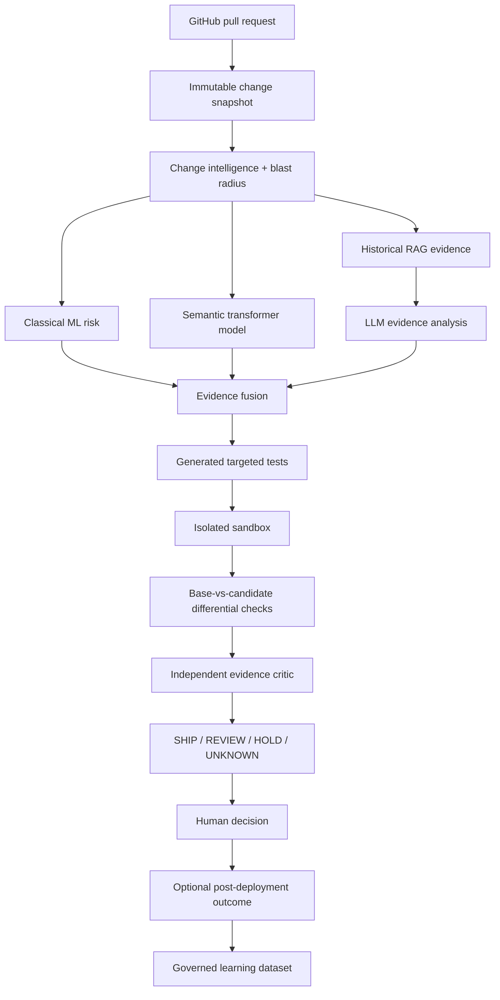
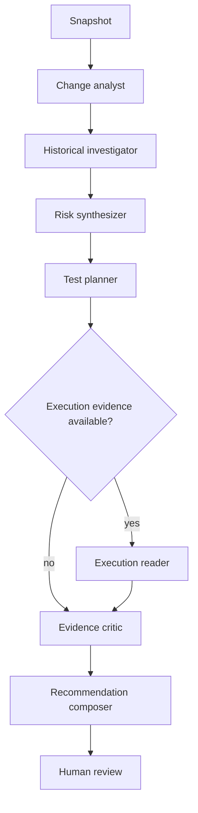

# ReleaseProof — Codex Master Implementation Specification

> **GENERATED FILE — DO NOT EDIT DIRECTLY.**
> Source-of-truth files are concatenated by `eng/sync_master_spec.py`.

This single file exists for agent workflows that can accept only one specification file.


---

# SOURCE FILE: `README.md`

# ReleaseProof — Execution-Grounded AI Change Verification

> **Working name only.** Perform trademark/domain clearance before commercial use.

ReleaseProof is a Python-first developer platform that estimates the risk of a software change and then tries to **prove or disprove that risk with evidence**. It combines repository history, dependency/blast-radius analysis, classical ML, transformer models, RAG, agentic investigation, generated tests, isolated execution, and base-vs-candidate differential verification before producing a human-readable **SHIP / REVIEW / HOLD / UNKNOWN** recommendation.

The product is intentionally not another “LLM reads a diff and writes comments” bot. Its core thesis is:

> **AI-assisted code needs execution-grounded verification, not only AI-generated opinions.**

## Goals

1. **Portfolio:** demonstrate real Python, ML, deep learning, LLM/RAG/agent engineering, MLOps, secure sandboxing, backend architecture, testing, observability, and production discipline.
2. **Business:** begin as a GitHub App for AI-heavy engineering teams, prove value with a narrow pilot, then consider hosted/self-hosted change assurance.
3. **Learning:** every ML/LLM milestone leaves reproducible evidence and an explanation the owner can defend in an interview.

## Target-state product flow

This diagram describes the gated end state through M17. The MVP stops after repository-scoped evidence and the dashboard; generated tests, sandbox execution, differential verification, the critic and governed outcome learning remain disabled until their owning milestones pass.



## Deliberate architecture

The first working system is a **Django modular monolith + Celery workers + PostgreSQL/pgvector + Redis**. ML logic lives in framework-light Python packages. FastAPI model serving is conditional on the predeclared RP-1402 measurement/decision gate in `docs/20_PERFORMANCE_CAPACITY_COST.md`; otherwise inference stays in workers. Docker Compose must work before Kubernetes is considered.

### Frontend
- HTML5 + CSS
- Django templates
- HTMX
- minimal vanilla JavaScript

### Backend/data
- Python
- Django + Django REST Framework
- Celery + Redis
- PostgreSQL + pgvector + PostgreSQL full-text search
- S3-compatible object storage; SeaweedFS locally

### AI/ML
- NumPy, Pandas, Jupyter
- scikit-learn
- XGBoost
- PyTorch
- Hugging Face Transformers / sentence-transformers
- only the LangChain modules required by an assigned provider/retrieval contract; no default meta-package
- LangGraph for stateful workflows
- OpenAI adapter + second/local provider path
- Ollama optional locally
- vLLM only after its M15 hardware/license/privacy benchmark gate
- MLflow for experiments/models/prompts/traces/evaluation

### Engineering
- pytest / pytest-django / property tests where useful
- Testcontainers
- Playwright
- Ruff + mypy/django-stubs
- OpenTelemetry + Prometheus/Grafana in later milestones
- GitHub Actions
- Docker Compose first; optional Kubernetes later

## Non-negotiable truthfulness

ReleaseProof must never claim measured accuracy, risk reduction, throughput, customer impact, incident prevention, or production readiness unless reproducible repository evidence supports the exact claim.

Synthetic demo data must be labeled **synthetic**. Public outcomes such as revert/hotfix/follow-up-fix labels are **proxies**, not proof that a PR caused a production incident. A model score is advisory evidence, never merge authorization.

## Implementation strategy

1. Repository assessment and version verification.
2. Foundation, deterministic fakes, local infrastructure.
3. Tenancy + secure GitHub App/webhook ingestion.
4. Immutable snapshots + change intelligence/blast radius.
5. Dataset/feature pipeline + deterministic heuristic baseline.
6. Logistic regression + XGBoost risk model.
7. Hybrid RAG over repository knowledge/history.
8. Strict-schema LLM evidence analysis.
9. Generated test proposals.
10. Hardened isolated execution.
11. Base-vs-candidate differential/mutation evidence.
12. PyTorch/Hugging Face semantic model.
13. LangGraph bounded investigation workflow.
14. MLflow/evaluation/feedback governance.
15. Security, observability, reliability, cost controls.
16. Production-shaped containers/CI/CD; optional model service/local inference.
17. Recruiter demo + narrow pilot.
18. Final architecture/evidence review.

## Start here

1. `CODEX_START_HERE.md`
2. `AGENTS.md`
3. `docs/00_DOCUMENT_MAP.md`
4. `CODEX_PROMPT_SEQUENCE.md`

Canonical issue contracts are in `docs/22_BACKLOG_AND_ACCEPTANCE.md`. Individual Codex prompts are in `codex-prompts/`. `CODEX_MASTER_IMPLEMENTATION_SPEC.md` is generated by `eng/sync_master_spec.py`; never edit it directly.

## M1 local development

The implemented foundation uses Python 3.13.15 and uv 0.12.6. Install uv from its official
distribution, then from the repository root run:

```text
uv python install 3.13.15
uv sync --frozen --group dev
uv run python -m eng.smoke_fakes
uv run python eng/validate.py
docker compose config --quiet
```

The fake smoke is deterministic and makes no network or paid-provider calls. The validation command
runs format checking, linting, strict typing, non-infrastructure tests, Django system checks,
migration-drift detection, and generated-document synchronization.

For the local data services, copy `.env.example` to the ignored `.env`, keep its credentials local,
and run:

```text
uv run --env-file .env python -m eng.configure_local
docker compose up -d --wait
uv run --env-file .env python -m eng.bootstrap_object_store
uv run --env-file .env python -m eng.smoke_object_store
```

If a default loopback port is already in use, override `POSTGRES_PORT`, `REDIS_PORT`, or `S3_PORT`
in `.env` and update the corresponding application URL. Do not stop an unrelated local service.

To run the SeaweedFS contract test, set `RUN_S3_INTEGRATION=1` for the command environment and run
`uv run --env-file .env pytest tests/integration/test_s3_contract.py`. `docker compose stop` or
`docker compose down` preserves named volumes. `docker compose down --volumes` is the explicit,
destructive local reset and permanently deletes local PostgreSQL, Redis, and SeaweedFS data.

The web process starts with `uv run python manage.py runserver`. Its liveness endpoint is
`GET /health/live`; `GET /health/ready` fails closed when authoritative PostgreSQL is unavailable.
Redis transport and optional providers do not replace PostgreSQL product state.

## M2 tenancy and GitHub ingestion

M2 implements `RP-0101..RP-0106`: organizations/memberships and role checks, same-origin session
authentication with CSRF and fail-closed login throttling, tenant-bound GitHub installation and
repository records, bounded HMAC-SHA256 webhook ingestion, immutable pull-request snapshots,
PostgreSQL-authoritative jobs/outbox recovery, and stale-safe advisory-report adapters.

Apply the forward migrations and run the deterministic path with:

```text
uv run python manage.py migrate
uv run pytest -m "not integration"
uv run python manage.py relay_outbox --organization <organization-public-uuid> --limit 100
```

Browser routes use Django sessions only. `POST /webhooks/github` is CSRF-exempt because it requires
the bounded raw request plus a valid `X-Hub-Signature-256`; browser mutations remain CSRF
protected. Direct repository access is resolved inside the active organization stored in the
authenticated session. Composite database constraints independently reject organization/parent
mismatches, and webhook receipts, pull-request snapshots and audit logs are database-append-only.

The deterministic fake GitHub snapshot/report adapters are the validated M2 local/demo path. A
live GitHub REST installation-token minter and live check publisher are intentionally unconfigured;
pull-request webhooks return a safe 503 until a live provider is explicitly implemented and
selected. No live repository is contacted and no check is posted by the M2 validation suite.

## M3 deterministic change intelligence

M3 implements `RP-0201..RP-0206` in the framework-light `packages/change_intel` package and
tenant-scoped Django persistence. It normalizes bounded changed-file facts, materializes exact
prediction-time feature schema `change-features-v1`, parses inert Python source with `ast`, computes
bounded reverse-import reachability, derives only history strictly older than the snapshot
prediction time, and persists human-readable deterministic factors.

The fixture source-tree provider is deterministic and network-free. The default worker has no live
repository-tree provider: it persists partial evidence with null graph features and explicit
missingness instead of guessing. Unsupported languages, parse failures, dynamic imports, truncated
coverage, absent history and absent opaque author coverage are visible. No M3 artifact contains a
composite score, threshold, risk band or SHIP/REVIEW/HOLD recommendation; RP-0306 owns those.

Run the focused evidence with:

```text
uv run pytest tests/unit/test_change_intel_pipeline.py
uv run pytest tests/integration/test_change_intelligence_persistence.py
uv run pytest tests/security/test_change_intelligence_tenancy.py
```

## M4 dataset and deterministic baseline

M4 implements `RP-0301..RP-0306` without mining a public repository or adding an ML dependency.
The admitted MIT fixture has a complete `source-admission-v1` record, 16 explicitly synthetic
snapshot/outcome rows, auditable proxy labels, a frozen temporal split and materialized
`change-features-v1` rows. Two unknown rows are excluded rather than silently labeled negative.

The transparent `deterministic-heuristic-v1` artifact produces a 0-100 risk score and
LOW/MEDIUM/HIGH or UNKNOWN band. It is not a probability. Threshold 30 is selected only from the
four-row validation split using the frozen recall-floor rule, then applied unchanged to the
four-row held-out synthetic test split. The committed raw artifact is implementation evidence,
not a customer-performance or incident-prediction claim.

Reproduce the dataset, leakage checks, threshold table and raw confusion artifact with:

```text
uv run python -m eng.evaluate_m4_baseline --check
uv run pytest tests/unit/test_dataset_baseline.py
uv run pytest tests/integration/test_deterministic_risk_persistence.py
```

## M5 classical risk candidates

M5 implements `RP-0401..RP-0406` with a train-only shared preprocessor, logistic regression,
XGBoost CPU candidate, validation-only hyperparameter/threshold selection, frozen calibration
rules, checksum-bound artifacts and tenant-scoped risk/model evidence pages. The unchanged M4
manifest and temporal split are used; no public or customer data is added.

The learned results are deliberately **not promoted**. Four validation and four held-out synthetic
rows are below the frozen 200-row/50-per-class calibration gate, so probability wording remains
disabled. `deterministic-heuristic-v1` stays active, and a missing/invalid learned artifact falls
back to deterministic evidence. See `docs/32_M5_CLASSICAL_MODEL_CARD.md` for the raw tiny-fixture
metrics and limitations.

```text
uv sync --frozen --group dev --group ml
uv run python -m eng.evaluate_m5_classical --check
uv run pytest tests/unit/test_classical_ml.py tests/web/test_risk_evidence.py
```

## M6 repository-scoped historical retrieval

M6 implements `RP-0501..RP-0506`: bounded approved evidence ingestion, Markdown/Python-aware
chunking, versioned PostgreSQL `simple` FTS, a 384-dimensional pgvector physical table/index,
side-by-side embedding-profile build and activation, deterministic RRF, optional bounded
cross-encoder reranking and a frozen synthetic relevance evaluation. Documents, chunks, lexical
rows, embedding rows and every query are organization and repository scoped.

The exact selected public artifacts are
`sentence-transformers/all-MiniLM-L6-v2@1110a243...` and
`cross-encoder/ms-marco-MiniLM-L6-v2@4bebbd56...`, both Apache-2.0 with recorded safetensors
checksums. Real weights are never fetched implicitly: adapters require an explicitly provisioned,
checksum-verified local cache. Tests and the committed evaluation use clearly identified
deterministic fakes. The real reranker remains disabled by default because the synthetic fake
benchmark does not prove incremental value.

```text
uv sync --frozen --group dev --group ml
uv run python -m eng.evaluate_m6_retrieval --check
uv run pytest tests/unit/test_retrieval_core.py tests/integration/test_retrieval_persistence.py tests/security/test_retrieval_tenancy.py
```

## M7 evidence-grounded LLM analysis

M7 implements `RP-0601..RP-0606`: provider-neutral typed contracts, a deterministic fake, a pinned
OpenAI Responses adapter, immutable tenant privacy policy, source-controlled prompt/schema hashes,
strict citation validation, safe append-only LLM evidence and a frozen synthetic evaluation. LLM
output is advisory and cannot replace deterministic risk/retrieval evidence or authorize tools,
file writes, generated-test acceptance or execution.

The optional `ai` group pins `openai==3.6.0`; the hosted adapter fixes
`gpt-5.4-mini-2026-03-17`, `store=false`, strict JSON Schema, no tools and bounded timeout/retry/
token/cost behavior. It is disabled unless an organization and immutable effective policy permit
the exact provider/model/content/region and reviewed training/retention/storage configuration. The
validated default is the network-free fake; M7 made no hosted API call and makes no hosted quality,
latency, cost or zero-retention claim.

```text
uv sync --frozen --group dev --group ml --group ai
uv run python -m eng.evaluate_m7_llm --check
uv run pytest tests/unit/test_llm_core.py tests/unit/test_openai_adapter.py tests/integration/test_llm_evidence_persistence.py
```

See `docs/36_M7_LLM_EVALUATION.md` for exact synthetic measurements and limitations, and
`docs/37_M7_OWNER_LEARNING_NOTE.md` for the owner-defensible explanation.

## M8 generated-test proposals

M8 implements `RP-0701..RP-0704` for one deliberately narrow Python fixture adapter. A strict
`generated-test-proposal-v1` contract binds target behavior, rationale, cited M7 evidence, one new
test-file patch, one allowlisted command, expected result, risk and exact generation identity.
Every persisted revision is immutable and tenant-bound; editing creates a new hash/revision and
supersedes the old one.

Reviewer mutations use session authentication, CSRF and server-derived organization scope. A
human may accept a statically valid proposal for export, reject it, edit it into a new draft, or
download its inert patch. Acceptance does not commit, enqueue, authorize or execute anything. M9
separately owns its threat review, immutable execution plan, execution approval and sandbox.

```text
uv run python -m eng.evaluate_m8_proposals --check
uv run pytest tests/unit/test_test_proposals.py tests/integration/test_generated_test_proposals.py tests/web/test_generated_test_proposal_workflow.py
```

The frozen 11-case CC0 suite has two valid controls and nine adversarial invalid controls. It
records valid acceptance 1.0, invalid rejection 1.0, false acceptance 0.0 and five-run stability
1.0. These synthetic results validate the contract/static-filter harness only; no generated test
was run and usefulness on real repositories is not measured. See docs/38 and docs/39.

## M9 fixture-only sandbox runner

M9 implements `RP-0801..RP-0805` under the accepted ADR-018 boundary. It supports only the exact
source-controlled fictional fixture on a dedicated rootless disposable Linux Docker host; external
repositories remain disabled. Immutable signed plans bind the snapshot, proposal/input, fixture,
image, argv, environment, network/mount/resource policy and plan hash. Reviewer execution approval
is a separate CSRF/role-gated append-only event, and strict bounded results are idempotently
persisted with explicit stale/timeout/kill/isolation/cleanup facts.

The deterministic local suite does not need Docker. The explicit `sandbox` marker builds and runs
known live sentinel probes on a disposable Linux Docker host; CI is the authoritative live evidence
when a developer daemon is unavailable. Passing those probes is not a claim that containers safely
isolate arbitrary hostile customer repositories. See docs/40, ADR-018 and docs/41.

```text
uv sync --frozen --group dev --group ml --group ai
uv run python -m eng.evaluate_m9_runner --check
uv run pytest tests/unit/test_execution_contracts.py tests/integration/test_execution_workflow.py
docker build -f runner/fixture_image/Dockerfile -t releaseproof-fixture-runner:m9 .
RUN_SANDBOX_INTEGRATION=1 uv run pytest -m sandbox tests/sandbox
```

GitHub Actions run `33639835178` for commit `ab59029` passed the canonical source/Django checks,
authoritative PostgreSQL contracts, pinned image build, live sandbox sentinels, bounded SeaweedFS
contract and teardown. This validates the known fixture path only; external/customer repository
execution remains disabled.

## M10 differential and mutation verification

M10 implements `RP-0901..RP-0905` without widening ADR-018. A signed
`releaseproof.differential-plan.v1` chains to the exact M9 execution plan and approval, then binds
the controlled base/candidate revision checksums, digest-pinned image, identical generated test,
workload, environment, resource policy, explicit nondeterminism masks and two-item mutation set.
The sandbox replays the same test and in-process HTTP-handler probe against both revisions, records
selected status/schema/body/state/events plus descriptive timings, and reports candidate timeout as
UNKNOWN and base failure as non-attributable.

`recommendation-fusion-v1` combines risk, retrieval, generated-test, execution, differential and
mutation facts into advisory-only SHIP/REVIEW/HOLD/UNKNOWN evidence. Missing or failed mandatory
components produce UNKNOWN, low/surviving mutation evidence produces REVIEW, and deterministic
HOLD facts take precedence over an LLM SHIP suggestion. Decisions are immutable and preserve exact
policy/input/result hashes; they cannot merge or deploy.

```text
uv run python -m eng.evaluate_m10_differential --check
uv run pytest tests/unit/test_differential_contracts.py tests/unit/test_recommendation_policy.py tests/integration/test_differential_workflow.py
docker build -f runner/fixture_image/Dockerfile -t releaseproof-fixture-runner:m9 .
RUN_SANDBOX_INTEGRATION=1 uv run pytest -m sandbox tests/sandbox
```

The committed CC0 evaluation covers identical, planted-regression, candidate-timeout and
base-failure cases plus all four recommendation outcomes. The mutation slice kills one of two
controlled mutants (50%); that is harness evidence, not repository-wide mutation coverage or a
customer-quality claim. See docs/43 and docs/44.

GitHub Actions run `33680837554` for implementation commit `14b133e` passed canonical validation,
Compose/startup, authoritative PostgreSQL constraints, the pinned runner-image build, live
regression/identical/timeout sandbox evidence, SeaweedFS and teardown. This remains evidence for
the controlled synthetic fixture only.

## M11 PyTorch/Hugging Face semantic model

M11 implements `RP-1001..RP-1006` as a provenance-controlled optional experiment. A separate
outcome-blind semantic dataset inherits the exact M4 temporal split and derives bounded text only
from changed-file path, status and patch. The exact Apache-2.0 MiniLM revision is provisioned
explicitly, checksum verified and loaded offline; model weights are not committed or fetched by
normal tests/runtime.

Validation first compares train-only TF-IDF logistic regression with frozen 384-dimensional
MiniLM embeddings. The selected representation feeds a deterministic CPU PyTorch multi-label
linear head using `BCEWithLogitsLoss`, AdamW, checkpoints and early stopping. On the four-row
synthetic test split it records micro-F1 0.5333333333 and macro-F1 0.35, but several categories have
no support and calibration is prohibited. The semantic/XGBoost ensemble adds no held-out F1 or
average-precision value, so the semantic model remains optional and active recommendations stay on
`deterministic-heuristic-v1`.

```text
uv sync --frozen --group dev --group ml --group semantic --group ai
uv run python -m eng.evaluate_m11_semantic --check
uv run pytest tests/unit/test_semantic_model.py
```

These are synthetic harness results, not customer performance or a probability claim. Full
lineage, errors, latency limitations, model card and learning note are in docs/45 and docs/46.


---

# SOURCE FILE: `AGENTS.md`

# AGENTS.md — Repository Instructions for Codex

## Mission

Build and maintain ReleaseProof according to this repository. ReleaseProof analyzes software changes, estimates risk, retrieves historical evidence, proposes targeted tests, executes untrusted candidate code only inside hardened sandboxes, compares base/candidate behavior, and returns advisory evidence to a human reviewer.

## Required reading

Before any change:
1. `README.md`
2. `docs/01_PRODUCT_REQUIREMENTS.md`
3. `docs/02_SYSTEM_ARCHITECTURE.md`
4. documents linked to the assigned issue
5. relevant ADRs in `docs/decisions/`
6. `docs/22_BACKLOG_AND_ACCEPTANCE.md`
7. `templates/definition-of-done.md`

For ML/LLM issues also read:
- `docs/07_DATASET_FEATURE_PIPELINE.md`
- `docs/08_CLASSICAL_ML_RISK_ENGINE.md`
- `docs/09_SEMANTIC_MODEL_PYTORCH_HF.md`
- `docs/10_RAG_RETRIEVAL_RERANKING.md`
- `docs/16_TESTING_QUALITY_EVALUATION.md`
- `docs/17_MLOPS_MODEL_GOVERNANCE.md`

`CODEX_MASTER_IMPLEMENTATION_SPEC.md` is generated. Never edit it directly. If requirements conflict, report the conflict instead of inventing a new direction.

## Architecture rules

- Start as a **Django modular monolith** with separate Celery workers.
- Keep domain/ML algorithms framework-light; core packages must not depend on Django requests/templates/Celery task objects.
- Add FastAPI model serving only when RP-1402 satisfies the predeclared measurement gate and decision vocabulary in `docs/20_PERFORMANCE_CAPACITY_COST.md`.
- PostgreSQL is authoritative.
- pgvector + PostgreSQL FTS are the first retrieval stores.
- Redis is broker/cache/coordination support, never authoritative product state.
- Use S3-compatible storage for large immutable artifacts; SeaweedFS locally per ADR-016.
- Complete Docker Compose before Kubernetes.
- Do not add Kafka, Airflow, Pinecone, Weaviate, Milvus, Spark, Ray, Kubernetes, or GPU serving merely for résumé keywords.
- Web UI: HTML/CSS + Django templates + HTMX + minimal JS.
- Browser mutations use session auth + CSRF; no long-lived secrets in localStorage.

## Python rules

- Use the verified baseline from `docs/26_TECHNOLOGY_BASELINE.md`.
- Thin views/controllers; business logic in application/domain services.
- Explicit types and strict boundary schemas.
- Validate and bound all external input.
- Explicit network/database/provider timeouts.
- Never swallow exceptions or retry permanent failures blindly.
- Never log GitHub tokens, OAuth tokens, cookies, Authorization headers, LLM keys, secrets, or arbitrary customer source content.
- No hard-coded tenant/repository IDs, credentials, pricing, or demo accounts in production code.
- Every dependency must solve a documented problem.

## GitHub rules

- GitHub App with least-privilege permissions.
- Verify webhook signatures before trusted parsing.
- Delivery/event handling is idempotent.
- Installation tokens are short-lived and never persisted in plaintext.
- Tenant/repository identity is server-derived.
- Persist only content allowed by retention policy.

## ML/data rules

- **No invented training data.** Synthetic data must be marked synthetic and separated from real evaluation claims.
- Preserve dataset provenance, extraction version, label rule, feature version, usage/license notes, observation window, and split assignment.
- Default headline evaluation is time-aware and repository-aware; random row splits are insufficient.
- Train/validation/test boundaries are immutable after experiment publication.
- Revert/hotfix/follow-up labels are proxies, not “incidents.”
- Start with a deterministic heuristic baseline before ML.
- Learned models must beat or complement baselines before promotion.
- If a displayed number is called a probability, calibration must be measured.
- Report prevalence, precision, recall, F1, PR-AUC, ROC-AUC as secondary context, threshold behavior, and calibration where applicable.
- Customer code is not used for shared/global training by default. Organization-local learning is explicit opt-in.
- Model artifacts are immutable/versioned and loaded by exact identifier/checksum.

## LLM/RAG rules

- LLM output is untrusted structured suggestion, never authority.
- Reject invalid provider output instead of silently coercing it.
- RAG evidence preserves source references.
- Hosted-provider transmission of customer code obeys organization policy.
- Deterministic fake provider is mandatory for tests/demo.
- Prompts, model identifiers, embedding versions, and graph schemas are versioned.
- Never let an LLM merge/deploy, access secrets, or widen sandbox permissions.
- Agent graphs have max steps, wall time, token/cost budgets, and tool allowlists.
- A critic using the same model does not count as independent validation by itself.

## Sandbox rules

- **Never execute untrusted repository code on the application host.**
- No host Docker socket, production/cloud credentials, repo write token, SSH agent, or unrestricted host mounts.
- Network denied by default.
- Non-root, resource/PID/time/output limits, ephemeral volumes, read-only filesystem where feasible.
- Treat sandbox output as untrusted.
- Any credible sandbox escape concern blocks the execution milestone.

## Testing rules

Every behavior change must add/update appropriate unit, integration, evaluation, and critical E2E tests and report exact commands/results.

Critical evidence includes:
- signed webhook -> immutable snapshot -> analysis;
- duplicate webhook harmless;
- cross-org IDOR denied;
- unavailable LLM does not erase deterministic evidence;
- invalid LLM schema rejected;
- every risk score names artifact/feature version;
- leakage checks fail closed;
- cross-tenant RAG query fails;
- generated tests remain proposals until M8 human acceptance; execution additionally requires the separate M9 execution approval bound to an immutable proposal and plan hash;
- candidate cannot read sentinel host/control secrets;
- base/candidate fixture comparison reproducible;
- failed sandbox/provider becomes REVIEW/UNKNOWN rather than false SHIP;
- model/prompt/retrieval regressions are detectable.

## Truthfulness rules

A target is not a measurement. A synthetic demo is not a customer outcome. A proxy label is not a production incident. If evidence is missing, write “not yet measured” or “not yet validated.”

## Learning protocol

For ML/AI milestones, completion reports include an **Owner Learning Note**:
1. concept implemented;
2. why it is used here;
3. algorithm/data assumptions;
4. key code paths;
5. exact experiment/test to rerun;
6. one likely interview question + concise answer.

Do not hide core ML implementation behind abstractions the owner cannot explain.

## Task execution protocol

For every assigned issue:
1. Restate IDs/components.
2. Read linked docs/ADRs.
3. State assumptions/conflicts.
4. Give a small plan.
5. Implement only assigned issues.
6. Add tests/evaluation evidence.
7. Run validation.
8. Update source docs, `PROJECT_STATUS.md`, `CHANGELOG.md` if behavior changes.
9. Run `python eng/sync_master_spec.py` after source-doc changes.
10. Report files changed, commands/results, evidence, remaining risks, and next recommended issue without implementing it.

An issue is done only when it satisfies `docs/22_BACKLOG_AND_ACCEPTANCE.md` and `templates/definition-of-done.md`.


---

# SOURCE FILE: `CODEX_START_HERE.md`

# Codex Start Here

You are implementing ReleaseProof. Treat repository documentation as source of truth.

> **Current package state:** M0 and M1 were completed on 2026-08-27. The assessment instructions below are retained for reproducibility and should be rerun only when `PROJECT_STATUS.md` marks M0 stale or the technology baseline needs reverification. The current next action is Prompt 2 (`RP-0101..RP-0106`).

## Reproducible M0 assessment — no code

### Read completely
- `AGENTS.md`
- `README.md`
- `docs/00_DOCUMENT_MAP.md`
- `docs/01_PRODUCT_REQUIREMENTS.md`
- `docs/02_SYSTEM_ARCHITECTURE.md`
- `docs/07_DATASET_FEATURE_PIPELINE.md`
- `docs/08_CLASSICAL_ML_RISK_ENGINE.md`
- `docs/13_SANDBOX_DIFFERENTIAL_EXECUTION.md`
- `docs/15_SECURITY_PRIVACY_TRUST.md`
- `docs/21_TIMELINE_MILESTONES.md`
- `docs/22_BACKLOG_AND_ACCEPTANCE.md`
- `docs/26_TECHNOLOGY_BASELINE.md`

Skim all ADRs and report contradictions.

### Verify versions

Using official project documentation/release pages, verify compatible stable versions for every technology selected in `docs/26_TECHNOLOGY_BASELINE.md`. Prefer a conservative Python version supported across Django/PyTorch/HF/scikit-learn deployment tooling rather than novelty.

### Return

1. Product understanding in <=15 bullets.
2. Proposed repository/module structure.
3. Exact versions to pin + official compatibility evidence.
4. Package-manager and validation commands.
5. Architecture dependency graph.
6. Data-model concerns.
7. Dataset provenance/leakage concerns.
8. ML baseline/evaluation plan.
9. RAG/LLM privacy/security concerns.
10. Sandbox threat-model concerns.
11. Requirement contradictions/ambiguities.
12. Milestone dependency graph.
13. Exact Prompt 1 scope.
14. Validation commands for lint/type/test/Django/migrations/containers.
15. What stays fake/deterministic until later milestones.

### Wait

Do **not** initialize frameworks, create migrations, download models, mine GitHub data, call paid LLM APIs, or write product code during this assessment.

## Standard issue prompt

> Implement issue(s) `[IDs]` from `docs/22_BACKLOG_AND_ACCEPTANCE.md`. Read `AGENTS.md`, definition of done, linked docs/ADRs first. Restate scope, implement only those issues, add tests/evaluation evidence, run validation, update docs/status/changelog if needed, regenerate the master spec, and report files changed, commands/results, evidence and remaining risks. Do not start the next issue.


---

# SOURCE FILE: `CODEX_PROMPT_SEQUENCE.md`

# ReleaseProof — Codex Prompt Sequence

Use **one prompt at a time**. Do not ask Codex to build the whole platform in one task. The canonical prompts live under `codex-prompts/`.

## Prompt order

0. `00_REPOSITORY_ASSESSMENT.md` — read, verify, report, wait; **no code**.
1. `01_FOUNDATION.md` — RP-0001..RP-0005.
2. `02_TENANCY_GITHUB_INGESTION.md` — RP-0101..RP-0106.
3. `03_CHANGE_INTELLIGENCE.md` — RP-0201..RP-0206.
4. `04_DATASET_BASELINE.md` — RP-0301..RP-0306.
5. `05_CLASSICAL_ML_RISK.md` — RP-0401..RP-0406.
6. `06_RAG_RETRIEVAL.md` — RP-0501..RP-0506.
7. `07_LLM_EVIDENCE.md` — RP-0601..RP-0606.
8. `08_GENERATED_TESTS.md` — RP-0701..RP-0704.
9. `09_SANDBOX_RUNNER.md` — RP-0801..RP-0805; threat review first.
10. `10_DIFFERENTIAL_VERIFICATION.md` — RP-0901..RP-0905.
11. `11_PYTORCH_SEMANTIC_MODEL.md` — RP-1001..RP-1006.
12. `12_LANGGRAPH_AGENTS.md` — RP-1101..RP-1106.
13. `13_MLFLOW_GOVERNANCE.md` — RP-1201..RP-1206.
14. `14_SECURITY_RELIABILITY_OBSERVABILITY.md` — RP-1301..RP-1306.
15. `15_CONTAINERS_CICD_MODEL_SERVING.md` — RP-1401..RP-1406; FastAPI/Ollama/vLLM conditional.
16. `16_DEMO_PILOT.md` — RP-1501..RP-1506.
17. `17_FINAL_ARCHITECTURE_REVIEW.md` — RP-1601..RP-1603; review only.

## Standard single-issue prompt

> Implement issue `[RP-XXXX]` from `docs/22_BACKLOG_AND_ACCEPTANCE.md`. Read `AGENTS.md`, `templates/definition-of-done.md`, the issue, directly relevant numbered docs and ADRs. Restate scope and trust boundaries; implement only that issue; add tests/evaluation; run exact validation; update docs/status/changelog when needed; regenerate and check `CODEX_MASTER_IMPLEMENTATION_SPEC.md`; report files changed, commands/results, evidence, remaining risk and the next suggested issue without starting it. For ML/AI work, include the Owner Learning Note.

## Defect-fix prompt

> Investigate defect `[description]`. Read the source-of-truth docs first. Reproduce with a failing automated test where practical, identify root cause, make the smallest safe correction, run targeted and relevant full regressions, update contracts/docs only when required, and report evidence plus remaining risk. Do not implement unrelated backlog work.

## ML-regression prompt

> Investigate ML regression `[description]`. Freeze the dataset/split/model/evaluation versions first. Check data/label leakage, schema drift, preprocessing parity, calibration, environment and random-seed variance before changing modeling. Compare against the prior baseline using the same held-out evaluation, publish raw before/after artifacts and limitations, and do not tune on the held-out test set.

## RAG / LLM / agent regression prompt

> Investigate `[retrieval/LLM/agent issue]` using the frozen evaluation fixtures and exact provider/model/prompt/embedding/reranker/graph versions. Separate retrieval failure, evidence-selection failure, schema failure, unsupported claim, tool failure and orchestration failure. Make the smallest justified change and rerun both quality and cost/latency evaluations. Do not rely only on model self-grading.

## Security-review prompt

> Review `[scope]` against `docs/15_SECURITY_PRIVACY_TRUST.md`, `docs/13_SANDBOX_DIFFERENTIAL_EXECUTION.md`, applicable ADRs and `AGENTS.md`. Do not patch automatically. Rank exploitable/unsafe conditions by severity with evidence, trust boundary, data exposure, minimal remediation and residual risk. Never print discovered secrets or private source.

## Architecture-review prompt

> Review implementation against `docs/02_SYSTEM_ARCHITECTURE.md`, the data/ML/RAG/runner contracts and all ADRs. Do not refactor automatically. Return violations ranked by severity with file/evidence references, dependency/complexity concerns and a staged correction plan.

## Hard gates

- No formal model work before immutable dataset/split evidence.
- No untrusted execution before runner threat review.
- No probability wording without held-out calibration evidence.
- No agentic complexity without comparison to the simpler pipeline.
- No FastAPI/Ollama/vLLM/Kubernetes solely for keywords.
- No public performance/accuracy/customer-impact claim without reproducible evidence.


---

# SOURCE FILE: `IMPLEMENTATION_CHECKLIST.md`

# ReleaseProof Implementation Checklist

## Foundation
- [x] Prompt 0/version verification done; no code during assessment.
- [x] Python/Django foundation builds/tests locally.
- [x] PostgreSQL/pgvector, Redis, SeaweedFS S3 endpoint reproducible.
- [x] CI blocks lint/type/test/migration/doc-sync errors.
- [x] Deterministic fake GitHub/LLM + fictional fixture exist.

## Product core
- [ ] Tenant/RBAC/CSRF/IDOR protection.
- [ ] Signed idempotent GitHub ingestion.
- [ ] Immutable PR snapshots.
- [x] Reproducible change features/blast radius.
- [x] Deterministic risk baseline precedes learned models.

## ML/RAG
- [x] Dataset manifests/provenance/labels.
- [x] Time/repository leakage controls.
- [x] Logistic + XGBoost evaluated and versioned; synthetic candidates remain unpromoted.
- [ ] Hybrid RAG with tenant isolation/citations.
- [ ] PyTorch/HF semantic model + model card.
- [ ] MLflow lineage/evaluation.

## LLM/agents
- [ ] Strict provider abstraction + fake.
- [ ] Grounded structured outputs.
- [ ] LangGraph bounded/advisory.
- [ ] Critic cannot widen privileges.
- [ ] Token/cost/time budgets.

## Execution
- [ ] Generated tests are proposals.
- [ ] No untrusted host execution.
- [ ] Sentinel/network/resource isolation tests.
- [ ] Base/candidate fixture comparison.
- [ ] Mutation/differential evidence integrated safely.

## Engineering/business
- [ ] OTEL/log redaction/failure drills.
- [ ] Compose before optional Kubernetes.
- [ ] Supply-chain release gates.
- [ ] One-command fictional demo + real screenshots/video.
- [ ] README/resume claims match evidence.
- [ ] Narrow pilot package before broad SaaS scope.


---

# SOURCE FILE: `PROJECT_STATUS.md`

# Project Status

**Current state: M11 semantic-model experiment implemented on 2026-09-03; remote CI validation is pending.**

The repository now derives an outcome-blind semantic dataset from the frozen M4 fixture, compares
TF-IDF and pinned real MiniLM representations, trains a deterministic CPU PyTorch multi-label head
and records held-out/error/robustness/latency/calibration and incremental-value evidence. The four-row,
one-repository synthetic holdout cannot support promotion: the semantic/XGBoost ensemble adds zero
F1/AP, probability wording is disabled and `deterministic-heuristic-v1` remains active.

## Next action

After M11's pushed commit passes CI, begin M12 (`RP-1101..RP-1106`) bounded LangGraph investigation.
Do not promote the semantic candidate, enable arbitrary repository execution or begin M13.

## M11 evidence

- `releaseproof-m11-synthetic-semantic-v1` preserves exact M4 source manifest, admission,
  leakage-report and temporal-split hashes. It admits only bounded changed-file path/status/patch
  text; outcome and proxy fields are blinded. The 16 annotations are explicitly synthetic,
  outcome-blind CC0 metadata over the existing MIT fictional fixture.
- CPU PyTorch 2.13.0, Transformers 5.15.1 and sentence-transformers 6.0.0 are exact optional pins.
  The Apache-2.0 MiniLM revision `1110a243...` is explicitly provisioned to an ignored directory,
  safetensors-checksum verified and loaded local-files-only with remote code disabled.
- On four validation rows, frozen MiniLM logistic reaches micro-F1 0.5333333333/macro-F1 0.35,
  versus TF-IDF logistic 0.4705882353/0.2666666667. Only the representation is selected; six
  training rows are insufficient to fine-tune the encoder.
- The deterministic 3,080-parameter PyTorch head uses `BCEWithLogitsLoss`, AdamW, seed 1729,
  float64 CPU batches, safe JSON checkpoints, validation-selected epoch/threshold and early
  stopping. Mixed precision is disabled because it is not verified for this profile.
- The untouched four-row synthetic test result is micro-F1 0.5333333333, macro-F1 0.35, exact
  match 0.0 and hamming loss 0.21875. All raw failures and per-class/per-repository support are
  retained; collapsed-whitespace predictions agree exactly. Several categories have no support.
- Calibration is not attempted because the 200-row gate fails; scores are not probabilities. The
  semantic/XGBoost ensemble adds 0.00 F1 and 0.00 AP over XGBoost and fails row/class/repository
  gates. The candidate remains unserved and unintegrated, with the deterministic heuristic active.
- The pinned real encoder's local warm 16-row CPU batch measured median 48.50185 ms across ten
  repetitions. This excludes cold load, database, queue and service overhead and is not an SLO.
- Canonical local validation passed **158 tests**, with one PostgreSQL physical-index assertion
  skipped and three live infrastructure/sandbox tests deselected. Ruff, strict mypy over 196
  source files, Django, migration drift, generated docs/inventory and M4-M11 evaluators passed.
  Remote CI is still pending; exact artifacts, limitations and rerun instructions are in docs/45/46.

## M10 evidence

- `releaseproof.differential-plan.v1` binds the exact M9 plan/approval/proposal/input, controlled
  base and candidate revision checksums, image digest, shared resources/environment/workload,
  mask policy and bounded mutation set. Unknown revision/mask/mutation identities fail closed.
- The image-bundled synthetic fixture provides an identical candidate, a planted tax regression,
  a probe timeout, a removed-validation mutant and a forced-tax mutant. Base and candidate receive
  the same approved generated-test input and run in the same disposable container policy.
- `releaseproof.differential-result.v1` records test/probe outcomes, bounded output, selected HTTP
  status/schema/body, state/events, descriptive timing, explicit differences, mutation outcomes,
  limitations, isolation checks and exact plan/result hashes. Masked request/update identifiers do
  not create differences; latency does not trigger a regression decision.
- Immutable `DifferentialPlan`, `DifferentialRun` and `RecommendationDecision` rows have composite
  tenant relationships, append-only database triggers, idempotent writes and exact lineage back to
  the M9 approval and pull-request snapshot.
- The frozen CC0 evaluator passes identical/no-invention, planted-regression, timeout/UNKNOWN and
  base-failure/non-attribution cases. The bounded mutation result is 1 killed and 1 survived (50%);
  it is explicitly not exhaustive or a production-defect claim.
- `recommendation-fusion-v1` evaluates SHIP, REVIEW, HOLD and UNKNOWN branches. Mandatory missing/
  failed evidence is UNKNOWN; deterministic HOLD outranks an LLM SHIP suggestion; every decision
  is advisory-only with `auto_merge=false`.
- Canonical local validation passed **153 tests** with one PostgreSQL physical-index assertion
  skipped and three live infrastructure/sandbox tests deselected. Ruff, strict mypy over 190 source
  files, Django, migration drift, generated docs/inventory and M4-M10 evaluators passed. The
  exact implementation commit `14b133e` passed GitHub Actions run `33680837554`: canonical checks,
  Compose/startup, authoritative PostgreSQL constraints, pinned image build, live M9/M10 sandbox
  sentinels, SeaweedFS and teardown all succeeded. Exact evidence is in docs/43/44.

## M9 evidence

- Docs/40 ranks kernel/runtime escape, secret/socket/mount/network exfiltration, forged policy,
  tenant/stale binding, resource denial, image substitution, hostile output and cleanup threats.
  ADR-018 accepts dedicated rootless Docker only for the frozen fictional fixture and explicitly
  disables arbitrary external repositories.
- `releaseproof.execution-plan.v1` binds the exact snapshot/check-out, proposal/input, frozen
  fixture tree (`70b1ebeb...b4673`), labeled image digest, argv, four constant non-secret env values,
  network `none`, empty mounts, CPU/memory/PID/tmpfs/time/output ceilings and artifact vocabulary.
  Duplicate/extra/tampered fields and signatures fail closed.
- Candidate containers are numeric non-root, read-only, capability-free, no-new-privileges,
  networkless and mountless, with 0.5 CPU, 256 MiB memory, 64 PIDs, bounded tmpfs/log/output and
  inner/outer timeout+kill. The application/Celery boundary neither imports nor invokes runner code.
- Immutable `ExecutionPlan`, `ExecutionApproval` and `ExecutionRun` rows use composite tenant
  constraints/triggers. Reviewer approval separately repeats exact snapshot/proposal/plan hashes;
  result ingest authenticates exact plan/image/attempt, reuses identical duplicates, rejects
  conflicts and records late evidence as stale.
- The frozen CC0 contract/policy artifact passes all ten declared controls and has file SHA-256
  `c1130790da1fc70aa423a5204c6ca5c70b16bcf2b32dcfa5e171d05181d5c759`. It is non-live synthetic
  evidence; the sandbox-marked CI suite
  separately checks host/secret/socket/network/metadata/resource/timeout/output/cleanup behavior.
- The local deterministic suite passed **143 tests**, with one PostgreSQL physical-index assertion
  skipped and live S3/sandbox tests deselected. Ruff, strict mypy (183 source files), Django and M9
  focused checks passed. GitHub Actions run `33639835178` on final M9 commit `ab59029` passed the
  canonical, authoritative PostgreSQL, Compose, pinned-image, live Docker sentinel, SeaweedFS and
  teardown gates.
- M9 adds no Python dependency, mines no data, calls no hosted/paid provider and executes no
  customer repository. Exact threat, evaluation and learning evidence is in docs/40, docs/41 and
  docs/42.

## M8 evidence

- `generated-test-proposal-v1` strictly binds target behavior, rationale, cited evidence, one file
  path/add-only patch, proposed command, expected result, risk, controlled adapter and exact M7
  provider/model/adapter/prompt/source identity. Duplicate/extra/malformed input is rejected.
- `python-fixture-v1` constructs proposals for one `tests/generated/test_*.py` file. Static
  validation checks canonical text, path/patch/command allowlists, Python AST syntax, typed test
  shape and dangerous capabilities without importing or executing code.
- Immutable tenant/source-bound proposal revisions and append-only lifecycle events implement only
  `draft`, `accepted_for_export`, `rejected` and `superseded`. Editing creates a new hash/revision;
  database constraints/triggers reject cross-tenant binding, raw mutation, invalid chains and
  acceptance when the persisted static report is invalid.
- Authenticated API/HTML detail and Reviewer mutations enforce server-derived active-organization
  scope, role checks and CSRF. Export returns the accepted patch with no-store/hash/correlation
  headers. Acceptance/export creates neither `AnalysisJob` nor `OutboxEvent` and cannot represent
  execution approval.
- The 11-case CC0 synthetic harness has two valid controls and nine adversarial invalid controls.
  It records valid acceptance 1.0, invalid rejection 1.0, false acceptance 0.0, expected-check
  matching 1.0 and five-repeat stability 1.0. These are controlled contract measurements, not
  generated-test usefulness, sandbox safety or customer outcomes.
- Evaluation root hash is
  `d4c2c21778b297642a391f2d1ae6d9faa1a1e4fa53ce8d9c149dcda68f131361`. Local static-suite
  latency recorded median 8.3893 ms/p95 13.3381 ms; it excludes database, provider, queue, patch,
  test-runner, container and network time.
- The canonical local suite passed **123 tests**, with one PostgreSQL physical-index assertion
  skipped and the live S3 contract deselected. Ruff, strict mypy and Django/migration checks passed;
  CI supplies authoritative PostgreSQL/S3 and container evidence for the pushed revision.
- M8 added no dependency, called no hosted provider, downloaded no model, applied no patch and
  executed no generated/untrusted code. Exact evaluation and learning evidence are in docs/38 and
  docs/39.

## M7 evidence

- `analysis-suggestion-v1` separates cited grounded risks, visibly uncertain hypotheses, requested
  tests, missing information and explicit insufficient-evidence behavior. Strict parsing rejects
  malformed/extra/duplicate fields, invalid vocabularies and citations outside the server-built
  context.
- The source-controlled prompt and schema hashes are
  `de5399fe7640da726411cfcd0dadad0e5e58b6423202590458e35a95a82a0374` and
  `9fcf0e4be678643081726e579e2ed6df5ac17a45c5598c0c6c23ea0151a5f296`.
- Immutable organization/repository `HostedLLMPolicy` rows cover local/hosted routes, provider/
  model/content/region allowlists, size/token/cost budgets, redaction, reviewed training/retention/
  storage facts, approver role and timeout/retry bounds. Missing or incompatible facts deny hosted
  transmission; composite database constraints reject cross-tenant policy scope.
- The OpenAI adapter pins `openai==3.6.0` and `gpt-5.4-mini-2026-03-17`, uses Responses strict JSON
  Schema with `store=false`, no tools, explicit maximum output and a bounded retry policy. Pricing
  and contractual facts are externally versioned; response-storage disabled is not called zero
  retention.
- Tenant-scoped analysis persists only safe status/decision hashes, strict output, citations,
  exact prompt/schema/provider/model/adapter/SDK identities, usage and elapsed time. It excludes
  source/prompt text, raw responses, hidden reasoning, credentials and arbitrary exception text.
  Duplicate requests reuse the same evidence item; denial/failure does not erase prior evidence.
- The six-case CC0 synthetic harness records schema validity 1.0, negative-control rejection 1.0,
  citation support 1.0 over five claims, unsupported-claim rate 0.0, exact suggested-check match
  1.0, prompt-injection resilience 1.0 and five-repeat stability 1.0. These are deterministic fake
  contract measurements, not hosted-model or customer-quality results.
- Evaluation root hash is
  `5e4f7abc185842fc914b58872ca42971bef4641d6cc81d04ab7dce6564c3eca4`. Local in-process
  fake-suite latency recorded median 1.8031 ms/p95 3.2425 ms and excludes database, queue, network
  and provider time. Hosted latency/cost are not measured.
- The canonical local suite passed **101 tests**, with one PostgreSQL physical-index assertion
  skipped and the live S3 contract deselected. Ruff, strict mypy, Django/migration, M4/M5/M6/M7,
  master-spec and inventory validation passed; CI supplies the authoritative PostgreSQL/S3 run.
- No model weights, public/customer source or paid/hosted provider were contacted, and no untrusted
  repository code was executed. Exact evaluation and learning evidence are in docs/36 and docs/37.

## M6 evidence

- `KnowledgeDocument`, `KnowledgeChunk`, versioned lexical profiles/rows and 384-dimensional
  embedding profiles/rows are organization/repository bound. Composite PostgreSQL foreign keys and
  SQLite test triggers reject mismatched repository/document/chunk/profile relationships; source
  and index rows are append-only.
- `source-aware-chunker-v1` uses Markdown headings, inert Python AST boundaries and bounded
  fallback chunks. `postgres-simple-code-v1` uses PostgreSQL `simple` plus
  `code-aware-normalizer-v1`; the forward migration creates GIN and cosine HNSW physical indexes.
- The selected embedding is `sentence-transformers/all-MiniLM-L6-v2` revision `1110a243...`, 384
  dimensions, and the reranker is `cross-encoder/ms-marco-MiniLM-L6-v2` revision `4bebbd56...`.
  Apache-2.0 license metadata and exact safetensors checksums are recorded. Real adapters are
  offline-only and fail closed on a missing/mismatched local artifact.
- `rrf-v1-k60` preserves lexical/vector scores and ranks. Missing semantic evidence falls back to
  lexical retrieval; reranker failure preserves hybrid ordering. No repository text controls a
  provider, tool, authorization or network decision.
- The frozen CC0 synthetic fixture has eight chunks and five graded queries. At K=3, lexical,
  deterministic fake vector, hybrid and deterministic fake-reranked variants all measure Recall
  0.90, MRR 1.00 and nDCG 0.950262129022. Equality does not prove semantic/reranker value, so the
  real reranker is disabled by default.
- The raw artifact root hash is
  `f7e9009bdc7547b3fb677013b0f7752d5a28ea1071f92a17754d36af3d107b70`. Recorded local in-memory
  full-ablation latency is median 6.930450 ms/p95 7.680900 ms; it excludes PostgreSQL and real-model
  time. Representative database index size/latency remain not yet measured.
- The canonical local suite passed **86 tests** with one PostgreSQL physical-index assertion
  skipped and the live S3 contract deselected. Ruff and strict mypy passed for 156 source files;
  Django/migration/M4/M5/M6/doc/inventory checks passed. M6 coverage includes ingestion,
  provenance, side-by-side activation, component scoring, fallback, exact artifacts, metrics,
  database immutability and cross-tenant denial. CI supplies the authoritative PostgreSQL/S3 run.
- No model weight, public/customer source or paid/hosted provider was downloaded or contacted, and
  no untrusted repository code was executed.

## M5 evidence

- The separate `ml` group locks NumPy 2.5.2, pandas 3.0.5, scikit-learn 1.9.0 and
  `xgboost-cpu` 3.4.1 on CPython 3.13.15. Official release/compatibility evidence is recorded in
  docs/26; the exact transitive environment is in `uv.lock`.
- `classical-preprocessor-v1` fits only on six training rows, binds exact `change-features-v1`,
  records imputation/missingness/scaling and has hash
  `41f9072f1e5d34aa1e934788fe1026b096222482534acca308ce7dc6b7ddcd33`.
- Logistic and XGBoost configurations plus score thresholds use train/validation only. The final
  test read occurs after target, costs, thresholds, calibration candidates, Brier/reliability/ECE
  rules, sample minimums and tolerances are declared.
- Both calibration candidates are not attempted because four validation rows fail the frozen
  200-row/50-per-class gate. Calibrated probability is null and probability display is prohibited.
- On four synthetic held-out rows, logistic has TP=1, FP=1, TN=1, FN=1, F1=0.50, AP=0.50 and
  ROC-AUC=0.25. XGBoost has TP=1, FP=2, TN=0, FN=1, F1=0.40, AP=0.41666667 and ROC-AUC=0.25.
  These unstable fictional measurements validate only the harness.
- The 56,530-byte artifact `models/public/m5_classical_ml_v1.json` names training commit
  `e63fcff3b2afd18775cd3a1cb01bb4688db316a3` and root hash
  `cb552fd83b257d67248d804c931cf604942d76bac245069b64f58048bfa9a8d6`.
  Same-environment rebuild is byte-identical; cross-platform numeric comparison is bounded at
  `1e-8` after excluding native bytes/platform identity.
- Neither candidate beats/complements the heuristic defensibly. `deterministic-heuristic-v1`
  remains active and is the explicit rollback. Missing/invalid learned artifacts report baseline
  fallback instead of erasing deterministic evidence.
- Authenticated model/risk API and HTML views expose exact versions, score components, limitations
  and no probability. Tests cover cross-tenant snapshot denial, checksum/schema/input failures and
  fallback behavior.
- The canonical local suite passed **72 tests** with one live S3 test deselected; Ruff and strict
  mypy passed for 141 source files, and Django/migration/M4/M5/doc/inventory checks passed.
- No public repository/customer data was acquired, no pretrained model was downloaded, no paid or
  hosted provider was called, and no untrusted repository code was executed.

## M4 evidence

- `source-admission-v1` records the synthetic repository numeric identity, fixture URL, MIT
  license-evidence hash/version, terms review, allowed local acquisition/fields/artifacts,
  retention/redistribution/attribution rules, `as_of`, 30-day observation window, reviewer and
  record limits. No public repository or customer data was accessed.
- `proxy-label-rule-v1` keeps revert/hotfix/follow-up/required-check signals as proxies. Complete
  no-proxy windows become proxy negatives; ambiguous/incomplete observations stay unknown.
- `releaseproof-m4-synthetic-v1` contains 16 deliberately synthetic rows: 6 train, 4 validation,
  4 held-out test and 2 excluded unknowns. Seven included rows are positive proxies and seven are
  negative proxies; this designed 50% prevalence is not a real population estimate.
- `temporal-split-v1` and `leakage-report-v1` freeze assignments and pass checks for prediction-time
  features, observation completeness, exact schema, author/outcome exclusion and no cross-split
  head SHA, diff hash or normalized near-duplicate. One fixture repository means repository
  holdout is not measured and is an explicit limitation.
- Manifest hash `eab561cbce6cc9986e5b8d9a248b268e3709407dff7f23b111c36c932dd86456`
  names extraction code commit `3448b1f879682d2b12a212d4c82d8fee87e33a12`; split hash is
  `81d51ed7011c86744f2cf4bff15cb98bb1aa440b1c81ece921ed9b4a21f0c11b`.
- `deterministic-heuristic-v1` uses threshold 30 selected from validation only. The four-row
  synthetic held-out confusion is TP=2, FP=2, TN=0, FN=0: precision 0.50, recall 1.00,
  F1 0.66666667, average precision 0.41666667 and ROC-AUC 0.125. The sample is too small and
  fictional for product/incident claims; calibration is not applicable because this is a score.
- `RiskScore` persists exact feature/artifact/policy attribution, contributions, score/band or
  UNKNOWN and a null probability. Composite tenant/snapshot/feature constraints and append-only
  triggers passed on SQLite; CI repeats them against PostgreSQL.
- The canonical local suite passed **62 tests** with one live S3 test deselected; Ruff and strict
  mypy passed for 136 source files, and Django/migration/artifact reproducibility checks passed.

## M3 evidence

- Diff, feature, graph, history and risk-factor contracts are versioned and checksummed; inputs,
  file sizes, graph depth/edges and output counts are bounded with explicit truncation or missing
  reasons.
- The static analyzer uses Python AST without importing or executing repository code. Dynamic
  imports, unsupported languages, parse errors and unavailable/partial source trees remain visible
  findings rather than silently complete evidence.
- Historical features enforce `observed_at < prediction_time`; absent history and incomplete graph
  facts remain null with reasons rather than becoming misleading zeroes. Author familiarity is an
  opaque aggregate, not a display identity.
- Append-only `ChangeFeatureSet` and `EvidenceItem` rows are organization-, snapshot- and
  feature-bound, with application validation plus PostgreSQL and SQLite tenant/immutability
  controls.
- Golden-fixture, unit, persistence, duplicate-delivery and cross-tenant tests passed in the local
  deterministic suite: **55 tests passed**, with the separate live S3 contract deselected.
- Ruff and strict mypy passed for 123 source files. Django checks and migration-drift checks passed.
- The local Docker Desktop daemon was unavailable for a fresh authoritative-database run. CI now
  starts the pinned services and runs the complete deterministic suite against PostgreSQL before
  the S3 contract; the GitHub Actions result is the remote database evidence for this revision.
- No model was downloaded or trained, no public/customer data was mined, no hosted provider was
  called, and no untrusted fixture source was executed.

## M2 evidence

- Organizations, memberships/roles, GitHub installations/repositories, webhook receipts,
  immutable snapshots, authoritative jobs/outbox rows and append-only audit records have forward
  migrations.
- Composite organization/parent constraints and immutable-record triggers passed on SQLite and
  PostgreSQL 18.6. The full deterministic suite passed **44 tests** on each backend; the separate
  live S3 test was intentionally deselected in these M2 runs.
- Tests cover session/CSRF behavior, login throttling and cache failure, role/IDOR denial, HTTP,
  Celery, admin and management-command scope, signed/tampered/duplicate webhooks, bounded input,
  lifecycle events, immutable checksummed snapshots, broker recovery, bounded retries, duplicate
  task delivery and stale-safe fake advisory publication.
- Strict mypy passed for 107 source files; Ruff, Django checks and migration-drift checks passed.
- GitHub CLI authentication and remote `main` access were repaired, and the configured pre-commit
  and pre-push hooks are installed locally.
- No live GitHub API was called, no installation access token was persisted, and no real check was
  posted. The live snapshot/token/check adapters remain not yet implemented or validated.

## M1 evidence

- `uv sync --frozen --group dev` resolved the committed lock with CPython 3.13.15.
- Ruff format/lint passed; strict mypy passed for 64 source files.
- The deterministic suite passed 25 tests with the one infrastructure test deselected.
- The live SeaweedFS suite passed 1 contract test after authenticated, idempotent bucket bootstrap.
- Django system checks and migration-drift checks passed; only Django's built-in migrations were
  applied to the disposable local PostgreSQL database.
- Compose reported PostgreSQL/pgvector, Redis, and SeaweedFS healthy. Runtime probes reported
  PostgreSQL 18.6, pgvector 0.8.6, and SeaweedFS 4.44; Redis returned authenticated `PONG`.
- `/health/live` and `/health/ready` returned their deterministic healthy payloads with real
  PostgreSQL; the automated failure-path test returns 503 without database details.
- The exact HTMX 2.0.10 checksum test passed, and the network-free fake smoke was repeatable.

The generated inventory now normalizes UTF-8 line endings before hashing, allowing the same
committed manifest to be checked from Windows and Linux GitHub-hosted runners.
Local S3 credential files remain owner-only; CI relaxes permissions only on its ephemeral file
generated from public `.env.example` values so the pinned non-root SeaweedFS image can read it.

The local Docker host was Engine 24.0.6 / Compose 2.23.0 rather than the documented
29.7.2 / 5.4.0 baseline. The digest-pinned services passed on this older host, but that does not
substitute for a later run on the documented host baseline. The GitHub-hosted workflow is defined,
and its remote M2 result is tracked in GitHub Actions.

| Milestone | Status |
|---|---|
| M0 assessment | Complete — 2026-08-27 assessment plus contradiction/ambiguity correction |
| M1 foundation | Complete — RP-0001..RP-0005 |
| M2 tenancy/GitHub | Complete — RP-0101..RP-0106 |
| M3 change intelligence | Complete - RP-0201..RP-0206 |
| M4 dataset/baseline | Complete - RP-0301..RP-0306 |
| M5 classical ML | Complete - RP-0401..RP-0406; candidates not promoted |
| M6 RAG | Complete - RP-0501..RP-0506; real reranker disabled pending representative evidence |
| M7 LLM evidence | Complete - RP-0601..RP-0606; deterministic fake remains default |
| M8 generated tests | Complete - RP-0701..RP-0704; export only, no execution approval |
| M9 sandbox | Complete - RP-0801..RP-0805; fixture-only boundary, live CI validated |
| M10 differential | Complete - RP-0901..RP-0905; fixture-only boundary, live CI validated |
| M11 PyTorch/HF | Complete locally - RP-1001..RP-1006; candidate not promoted; CI pending |
| M12 LangGraph | Not started |
| M13 MLflow/governance | Not started |
| M14 security/ops | Not started |
| M15 containers/CI/model serving | Not started |
| M16 demo/pilot | Not started |
| M17 final review | Not started |


---

# SOURCE FILE: `CHANGELOG.md`

# Changelog

## Unreleased
### Added
- Initial implementation-ready ReleaseProof specification package.
- Product, architecture, database, APIs, GitHub, change intelligence, dataset, ML, semantic-model, RAG, LLM, agent, sandbox, UX, security, testing, MLOps, observability, DevOps, performance, commercialization, runbook, interview, learning and pilot specifications.
- Codex repository instructions, prompts, backlog, ADRs and definition-of-done templates.
- ADR-016 selecting maintained SeaweedFS 4.44 for the bounded local S3 contract.
- ADR-017 defining tenant isolation through server-derived scope, application services and database constraints before optional RLS.
- M1 repository tooling with a Python 3.13.15/uv lock, Ruff, mypy, pytest, pre-commit, and pinned CI actions.
- Pinned PostgreSQL/pgvector, Redis, and SeaweedFS Compose services with persistent local volumes and health checks.
- The canonical ten-app Django modular-monolith skeleton with liveness/readiness endpoints and Celery configuration.
- Provider-neutral GitHub, advisory-LLM, and bounded object-storage seams with deterministic fakes.
- A boto3 S3 adapter, SeaweedFS contract test, idempotent bucket bootstrap, and licensed synthetic fixture repository.
- Vendored HTMX 2.0.10 with a verified SHA-256 checksum.
- Deterministic generation of the Git-ignored SeaweedFS credential config from an explicit local environment file.
- M2 organizations, memberships/roles, tenant-scoped services, session organization context and
  Owner/Admin repository lifecycle authorization.
- CSRF-protected session login/logout with hashed-key throttling and fail-closed cache outage
  behavior; no browser access-token storage.
- Tenant-bound GitHub installations/repositories with least-privilege permission validation,
  credential references and a redacted bounded in-memory installation-token cache contract.
- Signed, size/schema/action-bounded GitHub webhook ingestion with immutable delivery receipts,
  normalized checksummed PR snapshots and installation/repository lifecycle handling.
- PostgreSQL-authoritative ingestion jobs, identifier-only transactional outbox rows, bounded relay
  retries, recovery tooling and idempotent Celery worker behavior.
- Database composite tenant foreign keys and append-only triggers for PostgreSQL and the SQLite
  test backend, plus safe DRF error envelopes and scoped admin/management boundaries.
- Stale-safe advisory report contract and deterministic GitHub/task publisher fakes that make no
  remote or paid-provider calls.
- M3 versioned diff normalization, exact prediction-time feature schema, bounded static Python
  import graph, deterministic blast radius, strictly pre-change history and cited risk factors.
- Append-only tenant-bound feature/evidence persistence, durable-job integration and a richer MIT
  synthetic golden fixture with explicit dynamic/unsupported-language behavior.
- M4 source-admission, proxy-label, frozen temporal-split, leakage-check and feature-materialization
  contracts with a 16-row synthetic MIT fixture and byte-reproducible raw evaluation artifact.
- The first transparent deterministic heuristic score/band and validation-selected threshold
  policy, persisted as append-only tenant/snapshot/feature-bound risk evidence with no probability.
- M5 train-only tabular preprocessing, logistic-regression and XGBoost CPU candidate training,
  validation-only configuration/threshold selection and one frozen held-out synthetic evaluation.
- A checksum-bound `classical-risk-artifact-v1` with exact runtime/data/feature/preprocessor/model
  lineage, raw predictions/metrics, calibration abstention, promotion/rollback decision and model
  card.
- Authenticated tenant-scoped current-model and snapshot-risk API/HTML reads with evidence-backed
  components, explicit non-probability wording and safe deterministic fallback when learned
  artifacts are missing or invalid.
- M6 approved evidence ingestion with Markdown-heading, inert Python-AST and bounded fallback
  chunking; every document/chunk retains tenant, repository, source/version/hash and retention
  provenance.
- Versioned PostgreSQL `simple` FTS rows, a 384-dimensional pgvector table, forward GIN/HNSW
  indexes and transactionally activated side-by-side lexical/embedding profiles.
- Deterministic `rrf-v1-k60` hybrid fusion with component ranks/scores plus bounded optional
  cross-encoder reranking and explicit provider/model mismatch fallback.
- Offline checksum-verified sentence-transformers embedding/reranker adapters and separately named
  deterministic fakes; exact Hugging Face revisions, licenses, dimensions and safetensors hashes.
- A frozen CC0 synthetic retrieval relevance set, raw per-query Recall@K/MRR/nDCG ablations,
  bounded latency evidence, failure modes, activation decision and M6 Owner Learning Note.
- M7 typed advisory-LLM requests/responses/errors, deterministic fake, strict cited suggestion
  schema and versioned source-controlled prompt/schema content hashes.
- Immutable organization/repository hosted-LLM policy with fail-closed provider/model/content/
  region/training/retention/storage routing, bounded redaction and database tenant/immutability
  enforcement.
- A pinned OpenAI Responses adapter with strict JSON Schema, disabled response storage, no tools,
  explicit output/cost/timeout/retry bounds and safe external pricing/contract configuration.
- Tenant-scoped idempotent append-only LLM evidence that preserves deterministic evidence and never
  persists prompt/source text, raw provider output, hidden reasoning, secrets or arbitrary errors.
- A frozen six-case CC0 synthetic grounding suite, raw evaluation artifact and M7 Owner Learning
  Note covering schema/citation/unsupported-claim/stability/injection/cost/latency evidence.
- M8 strict generated-test proposal contracts and a deterministic controlled-Python-fixture
  adapter that builds inert add-only patches and performs parse/format/type-shape/safety checks.
- Tenant-bound immutable proposal revisions, append-only draft/accept/reject/supersede events,
  composite database constraints/triggers, safe audits and idempotent lifecycle services.
- Reviewer/CSRF-protected API and server-rendered review/edit/export flows that explicitly separate
  export acceptance from M9 execution approval and never create execution jobs.
- A frozen 11-case CC0 adversarial proposal suite, raw evaluation artifact and M8 Owner Learning
  Note covering schema/static checks, stability, non-execution and limitations.
- An accepted RP-0801 threat review and ADR-018 selecting dedicated rootless Docker for only the
  exact fictional fixture while keeping arbitrary external repository execution disabled.
- Strict HMAC-authenticated M9 execution input/plan/result contracts with immutable hashes, pinned
  fixture/image/argv/environment/network/mount/resource/artifact policies and bounded output.
- Tenant-bound immutable execution plans, separate Reviewer/CSRF execution approvals and append-only
  idempotent result evidence with stale/timeout/kill/isolation/cleanup facts and database triggers.
- A separate Docker CLI runner/image using non-root/read-only/no-capability/no-new-privileges/
  no-network/no-host-mount controls, cgroup/tmpfs/time/output limits and mandatory cleanup.
- Frozen synthetic M9 policy evidence plus an explicit live CI sandbox suite for credential/host/
  socket/network/metadata/resource/timeout/output/signature/cleanup sentinels and an Owner Learning
  Note.
- M10 strict differential plan/result contracts chained to the separate M9 approval, with exact
  controlled base/candidate/bundle identities, one parity workload, explicit nondeterminism masks,
  comparable test/HTTP/state/event evidence and fail-closed timeout/base-failure semantics.
- A two-mutant synthetic fixture slice with explicit kill/survive/inconclusive accounting and
  limitations, executed only inside the unchanged ADR-018 sandbox boundary.
- Immutable tenant-bound differential plans/runs and `recommendation-fusion-v1` decisions with
  composite database integrity, idempotency, exact evidence/policy hashes and raw-mutation denial.
- A deterministic advisory fusion policy across risk, retrieval, generated tests, execution,
  differential and mutation evidence; missing mandatory facts produce UNKNOWN and no LLM
  suggestion can override deterministic HOLD.
- A frozen four-case differential/four-case policy evaluation, live M10 sandbox test path and M10
  Owner Learning Note; no new dependency, model, provider call or external execution scope.
- An M11 outcome-blind semantic dataset derived from only bounded pre-outcome M4 path/status/patch
  fields while preserving exact source, admission, leakage and frozen-split lineage.
- Explicit checksum-verified offline MiniLM provisioning, frozen real embeddings, TF-IDF/pretrained
  representation comparison and a deterministic CPU PyTorch multi-label training pipeline.
- Held-out per-class/per-repository errors, robustness, latency, calibration abstention, safe JSON
  model lineage, an incremental-value gate, semantic model card and Owner Learning Note.

### Changed
- Recorded the verified Python 3.13.15/uv/Django/data-service/tooling pins and milestone-gated later dependency snapshots.
- Canonicalized the ten RP-0003 Django module names and policy ownership.
- Made PostgreSQL jobs plus a transactional outbox authoritative across Redis/Celery transport loss.
- Separated generated-test acceptance/export from M9 execution authorization.
- Assigned raw deterministic risk factors to M3 and the first composite evaluated heuristic to M4.
- Added public-dataset source admission, frozen calibration-decision, FTS/embedding index, hosted-provider retention, runner-backend and conditional model-serving gates.
- Replaced vague M13/M14 dependencies with explicit milestone prerequisites.
- Added Boto3 1.43.81 to the Prompt 1 runtime baseline for the ADR-016 S3 adapter.
- Made SeaweedFS readiness wait for a registered writable volume before authenticated S3 bootstrap.
- Made the generated file inventory normalize UTF-8 line endings before hashing so Windows and
  Linux checkouts validate the same committed source bytes.
- Kept generated local S3 credentials owner-only while making only CI's ephemeral, public-example
  credential file readable by the pinned SeaweedFS container's non-root user.
- Upgraded pull-request snapshots to `github-pr-snapshot-v2` for optional bounded commit count and
  opaque author familiarity input without exposing identity as a predictor.
- Added an authoritative PostgreSQL test pass to CI after Compose readiness so database-specific
  tenant and immutability controls cannot be inferred only from SQLite tests; the step uses an
  explicit public test-only webhook signing value while `.env.example` remains secret-free.
- Resolved the fixture runner's allowlisted `python` command through the image's current
  interpreter so its deliberately minimal, secret-free child environment does not require `PATH`;
  invalid runner output reports a bounded category, with a sanitized/length-bounded daemon detail
  allowed only for the explicit controlled-fixture ephemeral-CI profile.
- Disabled compression for the M9 Docker `local` log driver because the bounded one-file rotation
  policy is incompatible with that driver's default compression setting.
- Made the synthetic output-limit sentinel fail after emission so pytest replays its captured bytes
  and the live runner proves truncation on a correctly classified failed candidate execution.
- Added the frozen M4 artifact rebuild to the canonical validator and kept NumPy, pandas,
  scikit-learn and XGBoost deferred until a learned-model milestone needs them.
- Reverified and locked NumPy 2.5.2, pandas 3.0.5, scikit-learn 1.9.0 and CPU-only XGBoost 3.4.1
  in the M5 `ml` group; CI and the canonical validator now reproduce the M5 model artifact.
- Kept `deterministic-heuristic-v1` active because the learned candidates use tiny one-repository
  synthetic data, fail the frozen calibration sample gate and do not add defensible product value.
- Added pgvector Python 0.5.0 to the runtime and sentence-transformers 6.0.0 to an optional semantic
  group without permitting implicit model downloads or changing the later M11 training decision.
- Kept the real M6 cross-encoder disabled because the synthetic fake-provider ablation showed no
  aggregate retrieval improvement and cannot establish representative value/latency.
- Reverified and locked `openai==3.6.0` in the optional `ai` group with immutable model snapshot
  `gpt-5.4-mini-2026-03-17`; omitted LangChain because the bounded adapter needs no additional
  framework, and kept hosted routing disabled without an explicit compatible tenant policy.
- Kept the dependency lock unchanged in M8: standard-library static parsing plus existing
  Django/DRF controls are sufficient, while execution tooling remains deferred to M9 threat review.
- Kept the dependency lock unchanged in M9: the separate runner uses the standard library, Docker
  CLI and the already pinned fixture pytest version. The runner is not placed beside application
  services in Compose and the application host receives no Docker socket.
- Locked CPU PyTorch 2.13.0 and Transformers 5.15.1 with sentence-transformers 6.0.0 in the optional
  semantic group after official compatibility verification on CPython 3.13.15.
- Kept the M11 semantic model optional and `deterministic-heuristic-v1` active because the four-row,
  one-repository synthetic holdout cannot support calibration/statistical lift and the semantic
  ensemble added no F1 or average-precision value over XGBoost.
- Excluded ignored private model caches and raw private-dataset paths from the generated source-file
  inventory so explicit local model provisioning remains checkout-independent and private by design.

### Evidence status
- M1 implementation evidence is recorded in `PROJECT_STATUS.md`; no product performance, ML quality,
  customer outcome, production-readiness, or sandbox-security claim exists yet.
- M2 evidence is recorded in `PROJECT_STATUS.md`: 44 deterministic tests passed on both SQLite and
  PostgreSQL. Live GitHub token minting/API/check posting remains unvalidated and is not claimed.
- M3 evidence is recorded in `PROJECT_STATUS.md`: 55 local deterministic tests cover the versioned
  change-intelligence contracts and CI provides the authoritative PostgreSQL/S3 gate. No composite
  baseline, learned-model result, customer outcome, or sandbox claim is made.
- M4 evidence is recorded in `PROJECT_STATUS.md`; its metrics come only from a tiny balanced
  synthetic fixture and are not product-performance, probability, incident or customer claims.
- M5 evidence is recorded in `PROJECT_STATUS.md` and docs/32; learned-model figures remain tiny
  synthetic harness measurements, probability is disabled and neither candidate is promoted.
- M6 evidence is recorded in `PROJECT_STATUS.md` and docs/34; retrieval figures are synthetic
  harness measurements, real weights were not executed, and no customer/public quality claim is
  made.
- M7 evidence is recorded in `PROJECT_STATUS.md` and docs/36; its perfect frozen-fixture figures
  validate only the deterministic fake/schema harness. No hosted provider/customer source was
  contacted and no hosted quality, real latency, billed cost or zero-retention claim is made.
- M8 evidence is recorded in `PROJECT_STATUS.md` and docs/38; its perfect frozen-fixture figures
  validate only the controlled schema/static-filter harness. No proposal was executed, committed or
  approved for M9 execution, and real-repository usefulness/sandbox safety are not claimed.
- M9 evidence is recorded in `PROJECT_STATUS.md` and docs/40-42. Deterministic policy and known live
  fixture sentinels do not prove absence of all container escapes; arbitrary external repository
  execution and general production readiness remain explicitly unvalidated.
- M11 evidence is recorded in `PROJECT_STATUS.md` and docs/45-46. Its metrics are tiny synthetic
  harness measurements; no customer data, shared training, serving integration, probability or
  production-quality claim is made.


---

# SOURCE FILE: `PACKAGE_MANIFEST.md`

# Package Manifest

ReleaseProof uses source-of-truth numbered docs, explicit ADRs, issue-level acceptance criteria,
a generated single-file master specification, and one Codex milestone at a time.

## Root

- `README.md`
- `AGENTS.md`
- `CODEX_START_HERE.md`
- `CODEX_PROMPT_SEQUENCE.md`
- `CODEX_MASTER_IMPLEMENTATION_SPEC.md`
- `IMPLEMENTATION_CHECKLIST.md`
- `PROJECT_STATUS.md`
- `CHANGELOG.md`
- `pyproject.toml`, `uv.lock`, `.python-version`
- `compose.yaml`, `.env.example`

## Implemented M1 folders

- `apps/web/` — Django project plus the canonical ten modular apps.
- `packages/` — framework-light domain and future algorithm boundaries.
- `adapters/` — deterministic provider fakes and the bounded S3 implementation.
- `workers/` — Celery worker package; domain task behavior remains milestone-owned.
- `tests/` — unit/web tests, the SeaweedFS contract test, and licensed synthetic fixture.
- `deploy/` — PostgreSQL extension bootstrap and local-only SeaweedFS S3 configuration.
- `eng/` — local config, validation, fake/object-store smoke, bootstrap, and spec synchronization.
- `docs/` — numbered source-of-truth specifications.
- `docs/decisions/` — ADRs.
- `codex-prompts/` — one prompt per milestone.
- `templates/` — DoD, dataset/model/experiment/security/pilot templates.
- `notebooks/`, `datasets/` — guarded placeholders for their owning milestones.
- `models/public/` — small checksum-bound synthetic model artifacts safe for source control;
  private or large artifacts remain excluded/content-addressed.

## Repository shape

```text
apps/
  web/                 # Django control plane with the ten RP-0003 apps
packages/
  domain/
  github_contracts/
  change_intel/
  dataset_core/
  ml_core/
  retrieval_core/
  ai_core/
  agent_core/
  execution_contracts/
  observability/
workers/
adapters/              # provider implementations and deterministic fakes
notebooks/
datasets/
tests/
deploy/
docs/
codex-prompts/
templates/
```

M1 creates declared package boundaries but leaves milestone-owned algorithms empty. FastAPI model
serving and the runner trust boundary remain absent until their explicit gates. The canonical
Django apps are `identity`, `organizations`, `repositories`, `changes`, `evidence`, `risk`,
`retrieval`, `analysis`, `verification`, and `audit`. Policy records remain owned by organizations
and repositories until a later assigned issue justifies a separate module.


---

# SOURCE FILE: `docs/00_DOCUMENT_MAP.md`

# 00 — Document Map

| Document | Purpose |
|---|---|
| `01_PRODUCT_REQUIREMENTS.md` | users, jobs, MVP, invariants, success evidence |
| `02_SYSTEM_ARCHITECTURE.md` | module/deployable/trust boundaries |
| `03_DOMAIN_AND_DATABASE.md` | tenancy, snapshots, evidence, model/data persistence |
| `04_API_AND_CONTRACTS.md` | browser/API/model/runner contracts |
| `05_GITHUB_INTEGRATION.md` | GitHub App, webhooks, source/status behavior |
| `06_CHANGE_INTELLIGENCE_BLAST_RADIUS.md` | deterministic diff/graph/features |
| `07_DATASET_FEATURE_PIPELINE.md` | labels, provenance, leakage and train/serve features |
| `08_CLASSICAL_ML_RISK_ENGINE.md` | heuristic, sklearn, XGBoost, calibration |
| `09_SEMANTIC_MODEL_PYTORCH_HF.md` | deep-learning semantic classifier |
| `10_RAG_RETRIEVAL_RERANKING.md` | pgvector/FTS hybrid retrieval and evaluation |
| `11_LLM_PROVIDER_AND_ANALYSIS.md` | providers, strict outputs, privacy, prompt injection |
| `12_LANGGRAPH_AGENT_ORCHESTRATION.md` | bounded agent state/tools/critic |
| `13_SANDBOX_DIFFERENTIAL_EXECUTION.md` | generated tests, isolation, differential/mutation |
| `14_FRONTEND_UX.md` | HTML/CSS/Django/HTMX product UI |
| `15_SECURITY_PRIVACY_TRUST.md` | auth, source privacy, tenant/AI/sandbox threats |
| `16_TESTING_QUALITY_EVALUATION.md` | test pyramid + ML/RAG/LLM/sandbox eval |
| `17_MLOPS_MODEL_GOVERNANCE.md` | MLflow, lineage, promotion, feedback/drift |
| `18_OBSERVABILITY_OPERATIONS.md` | logs, metrics, traces, controls |
| `19_DEVOPS_CICD_SUPPLY_CHAIN.md` | Docker/CI/releases/optional Kubernetes |
| `20_PERFORMANCE_CAPACITY_COST.md` | measurement and budget methodology |
| `21_TIMELINE_MILESTONES.md` | ordered dependencies |
| `22_BACKLOG_AND_ACCEPTANCE.md` | issue IDs and acceptance |
| `23_DEMO_PORTFOLIO.md` | recruiter demo and claim evidence |
| `24_COMMERCIALIZATION.md` | ICP, pilot, pricing hypotheses |
| `25_FAILURE_MODES_RUNBOOKS.md` | operational recovery |
| `26_TECHNOLOGY_BASELINE.md` | dated pinning/verification policy |
| `27_INTERVIEW_TALK_TRACK.md` | architecture/ML explanations |
| `28_NON_GOALS_FUTURE.md` | deliberate exclusions |
| `29_PILOT_PACKAGE.md` | pilot onboarding/measurement |
| `30_LEARNING_CHECKPOINTS.md` | owner learning plan |
| `31_FINAL_ARCHITECTURE_REVIEW.md` | final claim/security/architecture audit |
| `32_M5_CLASSICAL_MODEL_CARD.md` | exact M5 lineage, measurements, calibration and promotion decision |
| `33_M5_OWNER_LEARNING_NOTE.md` | owner-defensible M5 concepts, assumptions and rerun path |
| `34_M6_RETRIEVAL_EVALUATION.md` | exact retrieval configuration, frozen measurements and activation decision |
| `35_M6_OWNER_LEARNING_NOTE.md` | owner-defensible M6 concepts, assumptions and rerun path |
| `36_M7_LLM_EVALUATION.md` | strict-schema grounding evaluation, configuration, measurements and limitations |
| `37_M7_OWNER_LEARNING_NOTE.md` | owner-defensible M7 contracts, privacy routing and rerun path |
| `38_M8_GENERATED_TEST_EVALUATION.md` | immutable proposal/static-validation evaluation and limitations |
| `39_M8_OWNER_LEARNING_NOTE.md` | owner-defensible M8 proposal, review and non-execution boundary |
| `40_M9_RUNNER_THREAT_REVIEW.md` | ranked runner threats, host assumptions, controls and RP-0801 signoff |
| `41_M9_RUNNER_EVALUATION.md` | deterministic policy evidence, live sentinel scope and limitations |
| `42_M9_OWNER_LEARNING_NOTE.md` | owner-defensible M9 trust boundary, contracts and rerun path |
| `43_M10_DIFFERENTIAL_EVALUATION.md` | differential/mutation/fusion fixture results and limitations |
| `44_M10_OWNER_LEARNING_NOTE.md` | owner-defensible M10 parity, comparison, mutation and policy explanation |
| `45_M11_SEMANTIC_MODEL_CARD.md` | exact semantic dataset/model lineage, measurements and non-promotion decision |
| `46_M11_OWNER_LEARNING_NOTE.md` | owner-defensible M11 tensors, training, evaluation and rerun path |

ADRs under `docs/decisions/` explain choices that must not be casually reversed.


---

# SOURCE FILE: `docs/01_PRODUCT_REQUIREMENTS.md`

# 01 — Product Requirements

## Product statement

ReleaseProof helps engineering teams judge whether a software change is safe enough to merge or release by combining deterministic change analysis, historical evidence, learned risk models, and controlled execution. It returns **SHIP / REVIEW / HOLD / UNKNOWN** with cited evidence; humans retain merge/deploy authority.

## Primary users
- Developer: fast, prioritized evidence.
- Reviewer/Tech Lead: risk areas, missing checks, reproducible findings.
- Engineering Manager: team-level change quality without individual surveillance scoring.
- Platform/SRE/Security: policy, audit, privacy, execution controls.

## Jobs to be done
- Identify what deserves review attention.
- Explain why a change is risky.
- Find similar historical changes/runbooks/incidents.
- Propose missing tests.
- Execute allowed checks safely.
- Compare base vs candidate behavior.
- Separate ML/LLM hypotheses from deterministic/execution facts.
- Provide concise GitHub output and deeper dashboard evidence.
- Learn from outcomes without silently pooling private customer code.

## Invariants
- Advisory only; no autonomous merge/deploy in MVP.
- UNKNOWN is valid when evidence is missing.
- Every score names producer/model/feature version.
- Every LLM claim cites allowed evidence or is labeled hypothesis.
- Organization/repository scope is server-derived.
- Untrusted code never executes on the app host.
- Hosted LLM source transmission is policy-controlled.
- Shared/global training on customer code is off by default.
- Execution failure is not interpreted as pass.
- Synthetic data and proxy labels are explicit.

## MVP
1. One configured GitHub App installation/repository path per MVP deployment and demo. The schema, authorization and query rules remain multi-organization from M2; "one path" limits integration breadth, not tenant-isolation requirements.
2. Signed PR webhook ingestion.
3. Immutable base/head change snapshot.
4. Deterministic features + Python import/blast-radius analysis.
5. Transparent rule-based risk baseline.
6. Repository-scoped historical retrieval.
7. Optional strict-schema hosted LLM analysis plus deterministic fake.
8. GitHub check/status + evidence dashboard.
9. **No arbitrary code execution yet.**

Before RP-0905, each release recommendation uses the latest approved deterministic recommendation-policy version and only the evidence components available at that milestone. Later ML, RAG and LLM outputs cannot silently change that policy. RP-0905 introduces the separately evaluated fusion policy that includes execution and mutation evidence.

## Post-MVP gates
- Classical ML only after provenance/split/leakage controls.
- Test generation only for an explicit fixture adapter first.
- Sandbox only after threat-model approval and isolation tests.
- Differential execution only for configured supported projects.
- PyTorch/HF model only after classical baseline.
- LangGraph only after single-pass LLM path has evaluation.
- FastAPI/vLLM/Kubernetes only after their owning issue's predeclared measurement, hardware, license, privacy and operational-cost gate; explicit deferral is a valid outcome.

## Non-goals
Autonomous merges/deploys; IDE autocomplete; generic code generation; full SAST/DAST replacement; secrets management; incident management; universal build systems; employee ranking; foundation-model pretraining; guaranteed bug prevention.

## Success evidence

Portfolio evidence: deterministic snapshot/features, tenant isolation, measured model metrics on documented proxy labels, retrieval benchmark, sandbox isolation proof, planted regression differential result, bounded agent evaluation, reproducible demo.

Commercial success requires external pilot evidence: useful findings, acceptable false-positive burden, installation retention, cost, and willingness to pay. Technical benchmarks do not prove business value.


---

# SOURCE FILE: `docs/02_SYSTEM_ARCHITECTURE.md`

# 02 — System Architecture

## Principle

Separate authoritative product state, analysis algorithms, untrusted execution, and optional model serving. Start modular because the difficult parts are data/ML/security—not service count.

## Planes

### Control plane — Django
Organizations/memberships, repositories/installations, snapshots, analysis/evidence lifecycle, organization/repository policy records, audit, web UI/DRF, GitHub adapters.

### Analysis plane — Python packages + Celery
Feature extraction, dependency graph, risk scoring, retrieval/reranking, LLM analysis, LangGraph workflows, evaluation jobs.

### Execution plane — isolated runner (M9+)
Consumes immutable execution plans, creates disposable sandboxes, runs allowlisted commands, returns bounded structured results. It cannot alter product state except through authenticated result submission.

### Model plane — deferred FastAPI
Only when RP-1402 returns `EXTRACT_FASTAPI` under the predeclared measurement gate in docs/20. Otherwise inference remains in workers. No tenancy/business policy belongs in a model service.

## Target modules

```text
apps/web/
  identity organizations repositories changes evidence risk retrieval analysis verification audit
packages/
  domain github_contracts change_intel dataset_core ml_core retrieval_core ai_core
  agent_core execution_contracts observability
workers/
adapters/              # provider implementations and deterministic fakes
apps/model_service/    # deferred
runner/                # M9 separate trust boundary
```

These ten Django app names are canonical for RP-0003. Policy records are owned by `organizations` and `repositories`; policy evaluation belongs in the relevant application service. A standalone `policies` app requires a later assigned issue and documented need.

## Dependency rule

Views/DRF -> application services -> framework-light domain/algorithm ports. Django ORM/GitHub/Redis/S3 are adapters. Core algorithms do not import Django request/template/Celery task objects.

## Storage
- PostgreSQL: authoritative state, evidence metadata, deterministic features, pgvector embeddings, FTS.
- Redis: Celery broker/cache/short coordination; disposable.
- S3-compatible object storage: large immutable diffs/logs/dataset/model artifacts; SeaweedFS is the pinned local Compose implementation under ADR-016.
- MLflow: experiment/model/prompt/evaluation lineage after M13.

## Consistency
- Durable webhook dedupe record before expensive async work.
- A PostgreSQL job record and transactional outbox entry are committed with the triggering state change. A relay publishes outbox entries to Celery/Redis; idempotent workers and a recovery scan handle duplicate delivery or broker loss. Redis never owns job truth.
- Snapshot immutable by repo/PR/base/head/schema.
- Head movement creates a new run; never mutates old evidence.
- Risk/evidence records are versioned/append oriented.
- Execution bound to exact SHAs, artifacts, image digests and plan hash.

## Failure philosophy
Verifier failure reduces confidence and is visible:
- LLM down -> deterministic/ML evidence remains.
- retrieval down -> no historical claims fabricated.
- model unavailable -> explicit baseline fallback or UNKNOWN.
- runner timeout -> timeout/UNKNOWN, never pass.

## Scaling path
1. Django + worker + Postgres/Redis/SeaweedFS Compose.
2. Independent web/worker replicas.
3. separate runner pool.
4. model-service process/GPU pool only if RP-1402 returns `EXTRACT_FASTAPI`.
5. optional Kubernetes when resource scheduling/replica evidence exists.

Kafka is deliberately absent. Introducing it requires a new issue and ADR with a reproducible benchmark showing that the PostgreSQL outbox plus Celery transport cannot meet a stated ordering, replay or throughput requirement.


---

# SOURCE FILE: `docs/03_DOMAIN_AND_DATABASE.md`

# 03 — Domain and Database

## Tenancy
All customer records belong to `Organization`. Repository identity is tied to GitHub numeric IDs/installations, not user-entered names. M2 tenant isolation is enforced by server-derived organization context, organization-scoped application services/querysets, object-level authorization and composite database constraints. Raw unscoped ORM access is prohibited outside audited repository/adaptor code.

PostgreSQL row-level security is not an assumed MVP control: pooled web/Celery connections require a proven transaction-scoped tenant-context design before RLS can be trusted. ADR-017 requires the application and constraint controls to stand alone; a later RLS defense-in-depth change needs its own ADR and cross-context tests.

## Key entities

### Organization / Membership
Organization stores lifecycle, hosted-LLM policy, org-learning policy, retention and budgets. Membership role: Owner/Admin/Reviewer/Member/ReadOnly.

### GitHubInstallation
Organization, GitHub installation/account IDs, permissions snapshot, lifecycle. **Never persist short-lived installation access tokens.**

### Repository
Organization, GitHub repository ID, display owner/name, default branch, language metadata, analysis/index/execution policy.

### PullRequestSnapshot
Immutable repository/PR/base SHA/head SHA/event identity/title/body metadata, changed files, diff artifact/hash, schema version.

### ChangeFeatureSet
Snapshot, feature-schema version, deterministic values, extractor version, graph artifact/hash. Must be recomputable.

### AnalysisRun
Snapshot, requested components/policy snapshot, lifecycle, timestamps, correlation ID, recommendation + recommendation-policy version.

### AsyncJob / OutboxEvent
Authoritative job/idempotency key, owning organization/run, requested task type/version, bounded attempt state, availability time and terminal outcome; transactional outbox topic/payload version/published state. The outbox contains identifiers, not raw source. Redis/Celery result state is never authoritative.

### EvidenceItem
Append-only: kind (`deterministic`, `ml`, `retrieval`, `llm`, `test`, `execution`, `security`, `unknown`), severity/confidence vocabulary, title, structured payload, source refs, producer/version.

### RiskScore
Analysis, model/baseline artifact, feature version, raw score, calibrated probability nullable, band, threshold policy, explanation.

### KnowledgeDocument / KnowledgeChunk / KnowledgeEmbedding
Document/chunk: org/repo, source type/id/version/hash, content metadata, versioned normalized text, `simple`-configuration FTS vector, ACL/scope. Embedding: chunk, exact embedding-version/model/revision/dimension, vector and lifecycle. Each dimension/model version uses a compatible physical vector index and is built beside, not over, the active version.

### DatasetManifest
Version/hash, provenance, extraction/label rules, feature version, split rule, counts/class balance/unknowns, usage/license notes, synthetic flag.

### ModelArtifact
MLflow/model identifier, algorithm, dataset manifest, feature version, metrics summary, lifecycle (`candidate/approved/retired`), checksum.

### PromptVersion / EvaluationSuite
Immutable/versioned prompts and frozen evaluation cases.

### GeneratedTestProposal
Analysis, immutable revision/hash, adapter, file/content artifact, rationale/evidence refs and M8
lifecycle (`draft`, `accepted_for_export`, `rejected`, `superseded`). Editing creates a new draft
revision. M8 acceptance permits export only. M9 adds separate immutable `ExecutionPlan`,
`ExecutionApproval` and `ExecutionRun` records bound to the current snapshot, proposal hash,
execution-plan hash and approving Reviewer/Admin; `execution_approved` and `executed` are not M8
proposal states.

### ExecutionPlan / ExecutionApproval / ExecutionRun / Observation
The M9 plan stores exact fixture/check-out/proposal/input/image identifiers, argv, constant
environment, empty mounts, network `none`, quotas, artifacts and plan hash. Approval separately
repeats the exact snapshot/proposal/plan hashes. Runs are append-only and idempotent; they retain
runner/image/plan identity, outcome, timing, bounded output hashes/excerpts, isolation checks,
timeout/kill, cleanup and stale-at-recording state.

### DifferentialPlan / DifferentialRun / RecommendationDecision
The M10 plan is immutable and points to one exact M9 plan and its separate human approval. It binds
controlled base/candidate revision checksums, the same image/environment/resource/workload policy,
the nondeterminism-mask version and bounded mutation set. The result stores comparable test/probe/
HTTP/state/event facts, bounded output, mutation outcomes and limitations. A recommendation row
binds the snapshot, differential run, exact fusion-policy version, input hash and decision hash;
historical decisions are never rewritten when a later policy is introduced.

### DeploymentOutcome
Optional feedback taxonomy (`no_issue`, `revert`, `hotfix`, `incident`, `manual_label`, `unknown`), source/confidence/observation window and org-training eligibility.

### AuditLog
Append-only actor/org/action/resource/correlation and safe metadata. Never raw source/secrets.

## Persistence rules
- Opaque public IDs.
- Unique webhook delivery IDs.
- Unique immutable snapshot identity.
- Optimistic versioning on mutable policy.
- Vector/FTS queries always include org/repo scope.
- Tenant-owned parent/child relationships use organization-consistent composite foreign keys such as `(organization_id, parent_id)` backed by a matching unique key. Any schema-level exception requires a documented migration rationale plus fail-closed service and cross-tenant tests; services always verify scope before lookup or mutation.
- Embedding model/dimension changes create new index version.
- Historical evidence never silently rewritten when model/prompt changes.

### M2 implemented enforcement

- Browser scope comes from an authenticated active membership stored in the server-side session;
  verified GitHub installation IDs derive webhook scope. Payload organization IDs are ignored.
- Scoped querysets/application services cover HTTP, Celery, admin and management-command entry
  points. Non-superuser admin querysets are membership scoped; the outbox command requires one
  explicit organization public UUID.
- Database composite foreign keys enforce organization consistency for repository/installation,
  receipt/installation, snapshot/repository, snapshot/receipt, job/snapshot and outbox/job pairs.
  PostgreSQL constraints and SQLite test triggers both reject mismatches immediately.
- Webhook receipts, pull-request snapshots and audit records reject update/delete in application
  paths and through database triggers. Mutable job/outbox lifecycle state remains bounded and
  separately versioned.
- Installation records persist an approved credential reference only. Installation access tokens
  have a redacted, bounded process-memory cache contract and no model/cache/task serialization.

### M3 implemented change evidence

- `PullRequestSnapshot` schema `github-pr-snapshot-v2` may retain a bounded opaque provider author
  key and commit count. The author key is used only to derive aggregate repository familiarity; it
  is never emitted as a feature or evidence value.
- `ChangeFeatureSet` is append-only and uniquely identifies snapshot + feature-schema + extractor
  version. It persists normalized diff, feature values/missingness/provenance, inline bounded graph,
  blast-radius and pre-change history artifacts plus their stable SHA-256 hashes.
- `EvidenceItem` persists ordered, append-only deterministic risk factors with rule/schema/producer
  versions and bounded source references. M3 records no score, threshold, band or recommendation.
- Organization/snapshot/feature-set relationships have composite database foreign keys. A separate
  `(feature_set_id, snapshot_id)` constraint prevents evidence from citing a different same-tenant
  snapshot. SQLite test triggers mirror the PostgreSQL constraints and append-only triggers.

### M4 implemented dataset and baseline evidence

- The canonical synthetic dataset is a source-controlled manifest/artifact rather than tenant
  product state. It records the admitted source, license/terms evidence, immutable source and split
  hashes, extraction-code commit, label/feature/split versions, exclusions, counts, leakage report
  and limitations.
- `RiskScore` is append-only and tenant-bound to the exact snapshot and `ChangeFeatureSet`. It names
  the baseline artifact/hash, feature schema, threshold policy, raw score/band, rule contributions,
  missing requirements and result hash. Deterministic rows require `calibrated_probability=NULL`.
- Composite database constraints independently enforce organization/snapshot/feature-set identity,
  including a same-snapshot constraint. PostgreSQL and SQLite both reject raw updates/deletes.

### M5 implemented learned-model evidence

- The small committed `classical-risk-artifact-v1` JSON binds the unchanged synthetic dataset and
  split hashes, training-code commit, exact runtime, train-only preprocessing, logistic/XGBoost
  parameters, raw test predictions/metrics, calibration failure, rollback and root/model checksums.
  It is source-controlled fixture evidence rather than a tenant/customer database record.
- `RiskScore` continues to persist only the active deterministic artifact because neither learned
  candidate passed promotion. Public risk reads resolve the snapshot inside the active organization
  and then select the exact active artifact/hash; no user-supplied organization ID controls scope.
- A future approved learned artifact may reuse the append-only `RiskScore` contract only after its
  probability/score validation and lifecycle rules are implemented by an assigned promotion issue.

## Retention
Separate policies for metadata, raw diff/source index, execution logs, LLM traces, datasets and training eligibility. Org deletion removes active access promptly and schedules documented tenant-scoped deletion. Private-data-derived artifacts follow the same policy.

### M6 implemented retrieval evidence

- `KnowledgeDocument` and `KnowledgeChunk` are append-only organization/repository-bound records.
  They retain approved source type/identity/version/URI, content and chunk hashes, line/heading
  provenance, exact chunk/normalizer versions and an organization-policy-derived retention date.
- `LexicalIndexProfile` and `KnowledgeLexicalIndex` build versioned PostgreSQL `simple` FTS rows
  beside existing profiles. The active-profile switch changes only profile lifecycle metadata; it
  never rewrites source chunks or historical lexical rows.
- `EmbeddingIndexProfile` records exact model ID, revision, safetensors checksum, license,
  dimension, adapter, chunk version and physical table/index. `KnowledgeEmbedding384` is the M6
  dimension-compatible pgvector table with a cosine HNSW index. A different dimension requires a
  new physical table/migration rather than guessing or coercing values.
- PostgreSQL composite foreign keys and equivalent SQLite test triggers independently enforce
  organization/repository/document/chunk/profile consistency. Document, chunk, lexical and vector
  rows reject application and raw-SQL update/delete before the governed M14 retention path.
- Retrieval selects only unexpired rows from one active lexical and embedding profile inside the
  server-provided organization/repository scope. Reranker/provider failure leaves attributable
  lexical/hybrid evidence instead of fabricating a historical claim.

### M7 implemented LLM policy and evidence

- `HostedLLMPolicy` is an immutable, versioned organization default or repository override. It
  records route, provider/model/content allowlists, byte/token/cost limits, redaction version,
  training-use and terms-review facts, retention duration, approved regions, provider storage
  behavior, approver role and timeout/retry bounds. The newest repository override wins, then the
  newest organization default; absence or incompatible facts fail closed.
- Composite `(organization_id, repository_id)` enforcement prevents a policy from naming another
  tenant's repository. PostgreSQL and SQLite triggers reject raw updates/deletes, while a new
  version is required for every policy change.
- Each attempted analysis appends or reuses one tenant/snapshot/feature-bound `EvidenceItem` of
  kind `llm`. Successful rows contain only the strict suggestion, cited evidence IDs, safe policy
  decision/hash, exact prompt/schema/model/adapter/SDK identities, usage and elapsed time. Denied or
  failed rows contain a stable status/reason and preserve pre-existing deterministic evidence.
- Prompt input, retrieved source, provider raw output, credentials, arbitrary provider errors and
  hidden reasoning are not persisted in the LLM evidence payload. Idempotency binds the immutable
  context, policy, provider and versioned request configuration.

### M8 implemented generated-test proposals

- `GeneratedTestProposal` stores one immutable `generated-test-proposal-v1` revision with its exact
  content hash, controlled adapter/version, source M7 LLM evidence, citations, inert patch,
  proposed command, generation identity and static-validation report.
- `ProposalLifecycleEvent` is append-only. The initial event creates `draft`; Reviewer actions may
  add `accepted_for_export` or `rejected`, while a content edit creates a new draft and appends
  `superseded` to the prior revision. Duplicate transitions are idempotent.
- Composite organization/source, organization/parent and organization/proposal constraints reject
  cross-tenant binding. PostgreSQL constraints/triggers and SQLite test triggers also reject raw
  proposal/event update/delete, invalid lifecycle chains and acceptance of a statically invalid
  proposal.
- Export returns only the already accepted bounded patch and appends a safe audit record. No M8
  model or service references an execution plan, execution approval, runner job or repository
  write, and no analysis job/outbox event is created by review/export.

## M9 execution evidence implementation

- Plan, approval and result rows are tenant-bound with composite database foreign keys/test
  triggers and immutable at both application and database layers.
- Plan creation is idempotent by organization/hash and neither approves nor enqueues execution.
  Reviewer approval is separately CSRF/role gated and fails when the head/proposal is stale.
- Result ingestion requires a valid signature and exact plan/image/attempt binding. Duplicate
  identical requests reuse evidence; conflicting duplicates fail closed. A late result is retained
  with `stale_at_recording=true`, never promoted as current.
- Audits store only opaque IDs, hashes, outcome, attempt and staleness—not patches, source, secrets
  or output excerpts.

## M10 differential and recommendation evidence implementation

- `DifferentialPlan` is one-to-one with the source execution plan and repeats its exact approval,
  tenant, snapshot, proposal/input hash and image bindings through the strict payload.
- `DifferentialRun` is append-only/idempotent by tenant key and plan attempt. It records the strict
  result hash, outcome, killed/eligible mutation counts and whether the source plan was stale when
  evidence arrived.
- `RecommendationDecision` is append-only per differential run and policy version. Its payload is
  reconstructed and re-evaluated during validation; advisory-only and `auto_merge=false` are
  invariants, not UI conventions.
- Composite foreign keys/triggers reject cross-tenant plan, approval, run and snapshot rebinding.
  Database triggers reject raw update/delete of all three M10 record types.


---

# SOURCE FILE: `docs/04_API_AND_CONTRACTS.md`

# 04 — API and Contracts

## Browser/API model
Primary UI is same-origin Django + HTMX. DRF supplies structured APIs and integrations. Internal model/runner contracts are separately versioned.

## Safe error envelope
```json
{"error":{"code":"stable_code","message":"safe message","correlation_id":"opaque","details":{}}}
```
Never return stack traces, secrets, raw provider payloads, or arbitrary source.

## Representative routes
- `GET /health/live`, `/health/ready`
- `GET /app/repositories/`
- `GET /app/repositories/{id}/pulls/{number}/`
- `GET /api/v1/me`
- `GET /api/v1/analyses/{id}`
- `GET /api/v1/analyses/{id}/evidence`
- `POST /api/v1/repositories/{id}/reanalyze`
- `POST /api/v1/analyses/{id}/generated-tests/{proposal}/accept|reject`
- `POST /api/v1/execution-plans/{id}/approve` (M9+, separate execution authorization)
- `GET /api/v1/models/current`
- `GET /api/v1/evaluations/latest`
Mutations require session + CSRF + role checks.

Implemented M2 routes are `GET /api/v1/me`, `GET /api/v1/repositories/{public_id}`,
`POST /api/v1/repositories/{public_id}/lifecycle`,
`POST /app/organizations/{public_id}/select/`, session login/logout, and
`POST /webhooks/github`. Repository lifecycle enable/disable requires Owner/Admin membership and
is tenant scoped before the direct object lookup. DRF failures use the safe error envelope with a
server-generated correlation ID.

## GitHub webhook
`POST /webhooks/github`: bounded raw body -> signature verify -> event/action allowlist -> delivery dedupe -> server-resolved installation/org -> atomically commit durable receipt/job/outbox -> relay to Celery. A broker outage leaves committed work pending for recovery rather than returning a false accepted-without-work state.

M2 bounds webhook bodies to 1 MiB, JSON depth to 20, JSON nodes to 10,000, changed files to 1,000,
each patch to 64 KiB, combined patches to 1 MiB and check metadata to 250 entries. Accepted work
returns 202; an identical delivery retry returns 200 without duplicate durable rows; reuse of a
delivery ID with different signed content returns 409. Invalid signature/media/event/input and an
unavailable snapshot provider return stable safe errors without provider payloads or source.

## Analysis contracts
`AnalysisRequestV1`: snapshot, requested components, policy snapshot/version, reason.
`AnalysisResultV1`: run/snapshot/base/head, component outcomes, recommendation, evidence IDs, producer/schema versions.

M3 persists, but does not yet expose as a public scoring API, the following deterministic contracts:
- normalized diff `change-diff-v1`;
- feature schema `change-features-v1` + extractor `releaseproof-change-intel-v1`;
- Python import graph `python-import-graph-v1`;
- pre-change statistics `repository-history-v1`;
- risk factors `deterministic-risk-factor-v1`.

Missing inputs are nullable with explicit reasons. Exact-schema mismatch is rejected. Risk factors
contain values, reasons and source references only; score/threshold/recommendation fields are not
part of the M3 contract.

M4 adds internal persisted contract `deterministic-risk-score-v1` with artifact
`deterministic-heuristic-v1` and threshold policy `deterministic-threshold-v1`. It records a bounded
integer score, LOW/MEDIUM/HIGH or UNKNOWN band, triggered rule contributions and exact artifact,
feature and policy hashes/versions. `calibrated_probability` is always null. M5 still owns the
public risk-scoring API/UI and learned-model contracts.

M5 implements authenticated, active-organization-scoped reads:
- `GET /api/v1/models/current` and `/app/models/current/` expose the exact active artifact,
  non-promoted learned candidates, calibration state, dataset/evaluation lineage and limitations;
- `GET /api/v1/risk/snapshots/{snapshot_public_id}` and
  `/app/risk/snapshots/{snapshot_public_id}/` expose the active persisted score and evidence-backed
  contributions after tenant-scoped snapshot resolution.

The first public `RiskModelResponseV1` representation is `risk-model-response-v1`. It uses
`raw_score`/band vocabulary, sets calibrated probability to null and explicitly disables
probability display. An unavailable or checksum-invalid learned artifact leaves the deterministic
baseline active with an explicit fallback reason.

## Risk model contract
`RiskModelRequestV1`: exact feature-schema version + normalized feature payload.
`RiskModelResponseV1`: exact model artifact/checksum, raw score, calibrated probability nullable, band, explanation, latency metadata.
Feature mismatch is rejected.

## M10 differential and recommendation contracts

`releaseproof.differential-plan.v1` references one exact approved M9 plan and binds both controlled
revision checksums, the candidate variant, proposal/input hash, image, resource/host/environment/
network/mount policy, `releaseproof.fixture-workload.v1`, `releaseproof.fixture-mask.v1` and
`releaseproof.fixture-mutations.v1`. Unknown fields, revisions, masks, mutations or hashes reject
the plan.

`releaseproof.differential-result.v1` records comparable base/candidate test and probe outcomes,
exit facts, bounded output hashes/excerpts, selected HTTP status/schema/body, selected state/events,
descriptive timings, explicit difference codes, mutation kill/survive/inconclusive results,
isolation/cleanup facts and limitations. A timeout is UNKNOWN; a base failure is non-attributable.

`recommendation-fusion-v1` consumes explicit status/fact/evidence references for model risk,
retrieval, generated tests, execution, differential and mutation evidence. It produces immutable
advisory SHIP/REVIEW/HOLD/UNKNOWN plus reason codes and exact input/decision hashes. Its precedence
is deterministic HOLD, mandatory-evidence UNKNOWN, review conditions, then SHIP. LLM suggestions
are recorded input but cannot override any deterministic HOLD. No contract authorizes merge/deploy.

## Retrieval contract
Server-resolved org/repo scope, query, filters, max candidates. Results include document/chunk source/version, lexical/vector/fusion/rerank scores and safe excerpt.

## LLM schema
Strict versioned object: concise summary, risk hypotheses, allowed evidence IDs, suggested checks/tests, missing information, uncertainty. Unknown evidence ID => invalid output.

M7 implements internal `analysis-suggestion-v1` and `change-analysis-prompt-v1`. Grounded risks
carry severity, confidence category and at least one allowed evidence ID. Hypotheses remain visibly
uncertain and may be uncited; requested tests carry a description, rationale and allowed citations.
A sufficient summary requires citations. `insufficient_evidence=true` forbids grounded risks and
requires explicit missing information/uncertainty. Unknown keys, duplicate JSON keys, invalid enum
values, non-finite numbers, over-bound text/collections and unknown citations reject the complete
provider output rather than being coerced.

The provider contract returns the exact provider/model/adapter/SDK identities, strict suggestion,
token usage, cost in integer micro-USD and elapsed time. Requests bind prompt/schema hashes,
hostile evidence as serialized data, conservative byte/token/output/cost budgets, separate
connect/read timeouts, bounded attempts/backoff and cancellation. This is an internal M7 service;
no public browser/API mutation is introduced.

## Generated-test proposal contract and routes

M8 implements strict internal `generated-test-proposal-v1`. Unknown/duplicate fields, malformed
metadata, unbounded text/collections or invalid enum values reject the whole proposal. The
controlled `python-fixture-v1` adapter permits one add-only `tests/generated/test_*.py` patch and
the exact proposed command `python -m pytest -q <declared-path>`. Static validation parses Python
AST and checks canonical text, typed test shape and a narrow capability allowlist without importing
or executing the proposal.

Authenticated active-organization reads are available at
`GET /api/v1/test-proposals/{public_id}` and `/app/test-proposals/{public_id}/`. Reviewer-or-higher,
session/CSRF-protected mutations are:

- `POST /api/v1/test-proposals/{public_id}/accept|reject|edit|export`;
- `POST /app/test-proposals/{public_id}/accept|reject|edit|export/`.

Responses expose immutable revision/hash, snapshot SHA, evidence and generation identity,
validation results and `accepted_for_export_is_execution_approval=false`. Export is a no-store
`text/x-diff` attachment with proposal-hash/correlation headers. It never applies the patch or
starts a job. M9 uses different execution-plan and approval records.

## Runner contract
Runner accepts only immutable/HMAC-authenticated internal `releaseproof.execution-plan.v1`: exact
fictional fixture/check-out/proposal/input hashes, a `releaseproof/fixture-runner@sha256` image,
allowlisted argv, constant non-secret environment, bounded resources, network `none`, empty mounts
and one expected result artifact. Duplicate/extra fields, mutable tags, host paths and free-form
Docker options are rejected.

Runner returns strict `releaseproof.execution-result.v1`: plan/image/runner/attempt identity,
outcome/exit/timing, bounded stdout/stderr excerpts with full hashes/sizes, isolation facts,
timeout/killed/cleanup state and bounded artifact vocabulary. The control plane authenticates and
validates it before append-only persistence.

Implemented authenticated M9 routes are `GET /api/v1/execution-plans/{public_id}` and Reviewer
`POST /api/v1/execution-plans/{public_id}/approve`, plus equivalent HTML detail/approval routes.
They are tenant scoped and session mutations require CSRF. Plan creation/result ingestion remain
trusted application-service boundaries; no public endpoint accepts Docker options or runner output.

## Idempotency/staleness
GitHub delivery + snapshot identity dedupe. Manual reanalysis may use idempotency key. Old-head analysis cannot publish current-head conclusion.

Proposal acceptance and execution approval are distinct. Accepting/editing/exporting a generated test never enqueues execution. Editing or head movement invalidates prior execution approval; an approved execution request names the exact proposal revision, snapshot and execution-plan hash.


---

# SOURCE FILE: `docs/05_GITHUB_INTEGRATION.md`

# 05 — GitHub Integration

## Model
Use a GitHub App for repository permissions/webhooks. Human web identity is independent. No personal token is the core repository authorization mechanism.

## Permission intent
Prompt 0/M2 verifies current official permission names. Initial intent:
- metadata: read
- pull requests: read
- contents: read only if analysis requires it
- checks/status: write only for ReleaseProof output
- issues/actions/workflows: deferred unless a specific feature needs them
- never code/admin write for MVP

## Initial events
`pull_request` opened/synchronize/reopened plus installation lifecycle and repository added/removed events. CI/workflow evidence is later.

## Secure ingestion
1. Bound raw body.
2. Verify HMAC signature.
3. Validate event/action.
4. Dedupe GitHub delivery ID.
5. Resolve installation -> org server-side.
6. Obtain short-lived installation token.
7. Fetch exact base/head metadata/diff as inert data.
8. Atomically create immutable snapshot, authoritative analysis job and transactional outbox entry.
9. Relay the outbox entry to Celery/Redis; recovery republishes pending work with the same idempotency key.

## Source handling
Do not clone and execute repository code on web/worker hosts. Static analysis treats content as inert bytes/text. Execution content enters the runner only after M9 policy/security gates.

## GitHub output
One concise check/status, not comment spam. Include recommendation, component availability, model/baseline identifier and dashboard link. Stale run cannot overwrite the latest head conclusion.

## Demo
Provide signed fixture webhook payloads and a deterministic fake GitHub adapter. Recruiter demo requires no live GitHub installation.

## M2 implementation boundary

M2 accepts `pull_request` opened/synchronize/reopened, known-installation lifecycle, and repository
added/removed events. Every accepted event atomically creates an immutable receipt, authoritative
bounded job and identifier-only outbox row; pull-request events additionally create or reuse the
immutable normalized snapshot. The scoped `relay_outbox` management command and publisher port
provide relay/recovery, while workers treat repeat task delivery as harmless.

The provider-neutral snapshot call receives the verified installation ID but never a serialized
access token. `InstallationTokenCache` is bounded process memory, redacts representations, evicts
by LRU/expiry and accepts only an injected minter using the persisted credential reference. No live
token minter is selected in M2. The fake advisory publisher proves one neutral, versioned report and
stale-head rejection without posting to GitHub; live check/status posting remains a later explicit
adapter implementation, not an implied validation result.

M3 extends provider snapshot schema `github-pr-snapshot-v2` with optional bounded commit count and
an optional opaque author key. Providers must not send a display name/email as that key. The raw key
never enters feature/evidence payloads; only an aggregate familiarity value can be produced when
strictly pre-change matching history exists. The deterministic source-tree provider accepts an exact
repository identity/base SHA and returns bounded inert text. No live contents/tree adapter is
selected yet, so normal workers report graph evidence as unavailable rather than cloning or guessing.


---

# SOURCE FILE: `docs/06_CHANGE_INTELLIGENCE_BLAST_RADIUS.md`

# 06 — Change Intelligence and Blast Radius

## Goal
Create deterministic explainable facts before ML/LLM. These facts become features, retrieval filters and evidence.

## Inputs
Exact base/head SHAs, normalized file patches, selected inert source/tree data, repository language/framework policy, optional prior graph.

## Feature schema v1
Examples:
- lines added/deleted, files changed, language/file-type distribution
- tests changed
- migration/schema change
- dependency manifest/lockfile change
- auth/security-sensitive path flags
- deployment/CI/config changes
- API surface heuristic
- rename/delete/binary/generated/vendored handling
- recent file churn
- touched-area proxy-failure history
- change concentration/entropy
- commit count
- blast-radius counts/depth
Unknown != zero. Names/semantics are versioned.

## Python graph v1
Static `ast` import/module graph plus generic directory heuristics. A later assigned language-adapter issue may add Tree-sitter only with licensed fixtures and a measured coverage/correctness benefit over the existing parser. Never import/execute customer modules to discover dependencies.

Blast radius:
- changed nodes
- reverse dependents to bounded depth
- edge-type/distance weights
- configured critical-path tags
- impacted tests where mappings exist

Do not claim a dynamic call graph.

## Evidence
Every deterministic flag includes rule ID, value, reason, bounded source references and producer version.

## Reproducibility
Same snapshot + extractor + policy => same feature/graph hash. Golden fixture tests enforce it.

## Implemented v1 contracts

- Diff `change-diff-v1`: at most 1,000 unique repository-relative paths, 64 KiB UTF-8 per patch and
  1 MiB combined patch text. Paths/newlines/order are normalized; truncation and missing patches are
  explicit. Classification covers common source/config/dependency/test/migration/docs/binary,
  generated and vendored facts plus bounded sensitive-area tags.
- Feature `change-features-v1`: exact names, scalar types, nullable/default semantics and per-feature
  provenance are source controlled. Unknown history/graph/commit inputs are null with a reason, not
  measured zero. Author identity, labels and post-outcome facts are excluded.
- Graph `python-import-graph-v1`: parses at most 5,000 inert files, 256 KiB per file, 5 MiB total and
  25,000 internal edges. It never imports source. External, dynamic, parse-error, oversized and
  unsupported-language findings are explicit. This is a static import graph, not a call graph.
- Blast radius walks reverse imports to depth 5 and at most 1,000 affected nodes, preserving one
  deterministic evidence path per node. Partial/missing/truncated changed-path coverage makes blast
  features null rather than undercounted.
- History `repository-history-v1` includes at most 10,000 repository snapshots in the 90-day window
  whose recorded observation time is strictly earlier than prediction time. It reports file/module
  touches, line churn, check-failure proxies, aggregate opaque-author familiarity, coverage and
  truncation. A failure proxy is not called an incident.
- Evidence `deterministic-risk-factor-v1` renders every feature, normalized file fact, graph path and
  missing-data state with a rule ID, reason, bounded source references and producer version. It has
  no composite score, threshold policy, band or recommendation.


---

# SOURCE FILE: `docs/07_DATASET_FEATURE_PIPELINE.md`

# 07 — Dataset and Feature Pipeline

## Core credibility problem
Fitting XGBoost is easy; trustworthy labels are not. Reverts, hotfixes and follow-up fixes are noisy **proxies**, not proof that a PR caused a production incident.

## Data phases

### A — Synthetic fixture
Only for UI/demo/tests. `synthetic=true`. Never mixed invisibly into real performance claims.

### B — Curated public-repository proxy dataset
Explicit allowlist of public repositories; use approved APIs/rate limits and record source/license/usage notes. Potential positive proxies are separately labeled:
- explicit revert
- linked rapid follow-up fix under a documented rule
- repository-maintainer hotfix/revert labels where reliable
Unknown remains unknown when observation/history is incomplete.

### Public-source admission gate
No public repository is extracted until an approval record captures repository numeric identity and canonical URL, SPDX/license evidence and version, hosting/API terms URL and review date, permitted acquisition method, allowed fields/artifacts, redistribution/retention limits, attribution requirements, analysis `as_of` cutoff, required outcome-observation window, and reviewer. Missing or incompatible license/terms evidence excludes the source. Robots.txt, rate limits and provider deletion events are respected; public visibility alone is not permission to build or redistribute a dataset.

### C — Organization-local outcomes
Explicit opt-in only. May include rollback/hotfix/incident/manual reviewer labels. Isolated by organization unless future explicit agreement says otherwise.

## Manifest
Every dataset version records:
- manifest/hash
- extraction code commit
- source repos + observation windows
- per-source approval record + license/terms evidence hash
- label-rule version
- exclusions
- counts/class balance/unknowns
- feature schema
- split rule
- usage/license notes
- synthetic flag
- known label weaknesses

## Leakage controls
Headline evaluation uses temporal and/or repository holdout; both preferred when data permits.
Automated checks:
- no same head SHA across splits
- no duplicate diff hash across splits
- no outcome-derived predictor
- only information available at prediction time
- no default author identity/employee scoring feature
- fixed published train/val/test assignments
- observation window complete before split assignment; incomplete rows remain unknown rather than negative

## Train/serve consistency
Raw immutable snapshot -> deterministic feature extractor -> normalized feature table. Training and inference import the same feature definitions/version.

M3 implements `change-features-v1` as the shared prediction-time definition source. Each persisted
row records extractor/schema versions, per-feature provenance, missingness and a content hash.
Repository history is filtered strictly before the snapshot prediction timestamp; future rows are
excluded in the pure extractor and cannot enter the tenant-scoped persistence query. Author keys,
check outcomes and later labels are not predictors: only pre-change aggregate familiarity and
explicit historical check-failure proxy counts are materialized. M4 still owns dataset labels,
split assignment, materialization and evaluated baseline artifacts.

## Data quality report
Missingness, class balance, duplicates, split counts, feature distributions, label ambiguity, drift vs previous compatible dataset, leakage checks.

Large/raw/private data stays out of Git; manifests/small safe fixtures live in Git and large artifacts are content-addressed in object storage.

## Implemented M4 contracts and evidence

- Admission `source-admission-v1` captures numeric repository identity, canonical source, SPDX and
  license-evidence hash/version, terms URL/review date, acquisition method, allowed fields and
  artifacts, redistribution/retention/attribution limits, `as_of`, observation window, reviewer,
  record/rate bounds and synthetic/approval status. The extractor has no HTTP client; public input
  without a complete approved API admission fails closed.
- Label rule `proxy-label-rule-v1` separately represents explicit revert, hotfix, rapid follow-up,
  required-check failure, no-proxy-observed and ambiguous outcomes. Positives are not called
  incidents. A negative requires an observation exactly closing the complete window; ambiguous,
  missing, late or incomplete evidence stays unknown and is excluded.
- Split rule `temporal-split-v1` uses frozen half-open timestamps. The one-repository fixture cannot
  support a repository holdout, which is recorded as a limitation. M5 must not reinterpret or
  mutate the committed assignments.
- Leakage report `leakage-report-v1` fails on cross-split head SHA, exact diff or normalized
  near-duplicate fingerprints; incompatible feature schema; label/outcome/identity predictors;
  unknown included rows; invalid temporal assignment; or unavailable observation time.
- Materialization `feature-materialization-v1` invokes the same `change-features-v1` extractor used
  by product analysis and records feature values, missingness, provenance and hashes per immutable
  snapshot. Outcome fields are joined only after prediction-time feature extraction.
- Dataset `releaseproof-m4-synthetic-v1` contains 16 synthetic rows: 6 train, 4 validation, 4 test
  and 2 excluded unknowns; the 14 included rows have seven positive and seven negative proxies.
  These balanced fixture counts are designed test data, not an estimate of real prevalence.
- `tests/golden/m4_synthetic_baseline_v1.json` is the raw reproducible manifest, feature-row,
  split/leakage and baseline-evaluation artifact. Its manifest names extraction code commit
  `3448b1f879682d2b12a212d4c82d8fee87e33a12`; the repository validator rebuilds it byte-for-byte.

## M5 reuse

M5 does not mutate the manifest, rows, labels or split assignments. Train-only preprocessing fits
explicit nullable-feature imputation, missingness indicators and scaling on the six training rows;
validation selects configurations/thresholds, and the four test rows are read only after the
experiment declaration is frozen. The resulting artifact names the exact M4 manifest/split hashes.

## M11 semantic dataset

`releaseproof-m11-synthetic-semantic-v1` is a separate derivative of the admitted M4 fixture. It
inherits the exact M4 source manifest, admission, leakage-report and frozen split hashes. Its only
text inputs are normalized changed-file path, status and patch; outcome, proxy-label and
post-deployment fields are explicitly blinded before annotation and extraction. Text is bounded to
4,096 UTF-8 bytes, tokenization to 256 tokens, and exact duplicate text may not cross splits.

The eight-category multi-label annotation set is explicitly outcome-blind synthetic CC0 metadata;
the underlying fictional source remains MIT-licensed. All 16 source rows align exactly: 6 train,
4 validation, 4 test and 2 excluded. The 14 included rows come from one repository, three
categories have no training support and several have no held-out support. The committed manifest
therefore validates provenance/leakage mechanics only, not real label quality, prevalence or
repository generalization. M11 joins proxy outcomes only in a separate post-prediction incremental
risk experiment and does not promote the semantic output.


---

# SOURCE FILE: `docs/08_CLASSICAL_ML_RISK_ENGINE.md`

# 08 — Classical ML Risk Engine

## Progression
1. **Heuristic baseline:** transparent rule score; never call it probability.
2. **Logistic regression:** simple learnable baseline.
3. **XGBoost candidate:** only promoted when comparison justifies it.

## Target
Predict a documented proxy outcome for a configured observation window—not “an incident” unless ground truth truly is an incident label.

## Metrics
Always report class prevalence. Use precision/recall/F1 and PR-AUC as primary imbalance-aware evidence, ROC-AUC as context, confusion matrix, threshold table, and Brier/reliability if probability is displayed.

## Calibration
If UI says “78%,” calibration must be measured and tied to exact artifact. Otherwise show risk score/band.

Before inspecting the final test set, the experiment declaration names the target population, calibration method candidates, Brier baseline, reliability/ECE calculation and bin/minimum-sample rules, plus numeric acceptance tolerances selected from the validation set and operational cost assumptions. The untouched test set evaluates that frozen rule. Failure of any declared tolerance disables probability wording for that artifact; there is no universal post-hoc threshold chosen after seeing test results.

## Thresholds
Select on validation data according to explicit operational tradeoff (e.g. high positive recall without excessive HOLD/REVIEW). Never tune on final test.

## Explanations
Model-native importance may be shown carefully. SHAP is optional only if value/latency/dependency cost is justified. Explanations are association, not causation.

## Inference
Exact feature-schema compatibility. Missing/incompatible required input => explicit fallback/UNKNOWN, never arbitrary silent fill.

## Promotion gate
Dataset manifest valid; leakage checks pass; metrics artifact exists; baseline comparison documented; reproducibility rerun works; security/privacy acceptable; exact checksum/version registered.

## Implemented M4 heuristic baseline

`deterministic-heuristic-v1` is a transparent additive 0-100 score over exact
`change-features-v1` inputs. Source-controlled rules cover change size/file count, migrations,
dependencies, deterministic sensitive paths, missing test changes, large deletion, available
static blast radius and available prior check-failure proxies. Every contribution names points,
reason and source features; incompatible schema is rejected and missing required core values yield
UNKNOWN.

Candidate thresholds 20/30/40/50 and a 0.75 validation recall floor are frozen. Threshold 30 was
selected from the synthetic validation split by maximum precision, then F1, then the higher
threshold; the held-out synthetic test set was evaluated afterward without retuning. On only four
test rows the raw confusion is TP=2, FP=2, TN=0, FN=0 (precision 0.50, recall 1.00, F1 0.66666667,
average precision 0.41666667 and ROC-AUC 0.125). These unstable fictional-fixture measurements
validate the harness and expose false positives; they do not establish model/customer performance.
Calibration is explicitly not applicable because the output is not a probability.

## Implemented M5 classical candidates

`classical-preprocessor-v1` validates exact `change-features-v1` input, fits only on training rows,
records nullable-feature median/zero imputation, adds missingness indicators and freezes z-score
parameters. Required missing input returns UNKNOWN; schema or artifact incompatibility is rejected.

`logistic-risk-v1` and `xgboost-risk-v1` use the immutable M4 temporal split. Candidate
hyperparameters and model-score thresholds 0.3/0.5/0.7 use train/validation only under a frozen
five-unit false-negative/two-unit false-positive cost rule and 0.75 recall floor. The final four
test rows are evaluated once after selection/calibration rules are declared. Exact raw results,
parameters, coefficients/gain associations, native XGBoost JSON, runtime versions, checksums and
rollback metadata are in `models/public/m5_classical_ml_v1.json`.

The calibration declaration freezes sigmoid/Platt and isotonic candidates, a training-prevalence
Brier baseline, 10 equal-width bins with 20 rows per bin, minimum 200 validation rows/50 per class,
ECE at most 0.05, bin gap at most 0.10 and Brier improvement at least 0.01. Four validation rows fail
the sample gate, so calibration is not attempted and probability wording is prohibited.

On the four synthetic held-out rows, logistic records TP=1, FP=1, TN=1, FN=1, F1=0.50,
AP=0.50 and ROC-AUC=0.25. XGBoost records TP=1, FP=2, TN=0, FN=1, F1=0.40,
AP=0.41666667 and ROC-AUC=0.25. These unstable fixture figures do not establish product value.
Neither model defensibly improves the heuristic, so both remain candidates and
`deterministic-heuristic-v1` remains active. The full model card is docs/32.

## M11 semantic incremental-value result

M11 leaves the M4 heuristic and M5 candidates immutable. Its predeclared optional ensemble takes
the maximum of the frozen XGBoost score and the maximum of six risk-related semantic category
scores, then compares the result only on the unchanged test split. On four synthetic rows the
ensemble adds 0.00 F1 and 0.00 average precision over XGBoost. It also fails minimum gates of 200
held-out rows, 50 rows per class and three repositories. Consequently the semantic candidate is not
added to risk evidence or `recommendation-fusion-v1`; `deterministic-heuristic-v1` remains active.


---

# SOURCE FILE: `docs/09_SEMANTIC_MODEL_PYTORCH_HF.md`

# 09 — Semantic Model with PyTorch + Hugging Face

## Purpose
Demonstrate real deep learning by classifying semantic change categories that numeric features do not capture well.

## Primary task
Bounded multi-label classification of changed code/PR context into categories such as:
- auth/security
- database/schema
- concurrency/async
- API compatibility
- dependency/configuration
- performance-sensitive
- test/docs-only
- unknown/other

## Inputs
Bounded PR title/body, file paths, normalized/truncated diff chunks, deterministic tags. Secret scanning/redaction occurs before any hosted path. Context size is explicit.

## Training
Start from a small licensed pretrained code/text transformer. Do not train a foundation model. Owner must understand tokenizer, tensors/batches, loss, optimizer, backprop, checkpointing, overfitting and inference. PEFT/LoRA is optional only after a proper baseline.

Record seeds and nondeterminism limits; validation selects checkpoints/early stopping.

## Evaluation
Micro/macro F1, per-class precision/recall/F1/support, error examples, calibration if downstream score uses it, and leakage-resistant split when feasible.

## Model card
Intended/prohibited use, base model/license, dataset/provenance, training config, metrics, failure modes, privacy, hardware/latency, artifact checksum.

## Integration
Measure incremental value over deterministic/classical model before promotion.

## Serving
Load in a worker first. Add FastAPI only if RP-1402 returns `EXTRACT_FASTAPI` under the predeclared criteria and budgets in docs/20.

## Implemented M11 experiment

M11 implements `RP-1001..RP-1006` as a framework-light, optional experiment. The separate semantic
dataset inherits M4's frozen temporal split and admits only changed-file path, status and bounded
patch text. Synthetic multi-label annotations are outcome-blind and separately licensed. Exact
lineage, counts and leakage limitations are committed with the dataset.

The selection experiment compares train-only word unigram/bigram TF-IDF logistic regression with
the exact Apache-2.0 MiniLM representation. The frozen pretrained representation wins the
validation comparison, but the encoder is not fine-tuned because only six training rows exist. A
384-by-8 PyTorch linear head uses `BCEWithLogitsLoss`, AdamW, deterministic float64 CPU tensors,
seed 1729, bounded batches, validation checkpoints and patience-based early stopping. Mixed
precision is disabled because it is not verified for this deterministic CPU profile.

The untouched four-row synthetic test result is micro-F1 0.5333333333 and macro-F1 0.35. The full
artifact also records per-class/per-repository errors, raw predictions, whitespace robustness,
uncalibrated score diagnostics and measured local batch latency. Calibration is not attempted and
probability wording is prohibited. The semantic/XGBoost ensemble adds no F1 or average-precision
value over XGBoost and fails sample/repository gates, so the semantic model remains an optional
`candidate_not_promoted`; no Django model, serving endpoint or active recommendation change is
introduced. See docs/45 and docs/46.


---

# SOURCE FILE: `docs/10_RAG_RETRIEVAL_RERANKING.md`

# 10 — RAG, Retrieval and Reranking

## Objective
Retrieve organization/repository-specific evidence: architecture docs, ADRs, runbooks, prior PR summaries, tests and selected issue/postmortem records.

## Ingestion
Fetch allowed inert content -> normalize -> source-aware chunk -> PostgreSQL FTS -> exact-version embedding -> pgvector. Every chunk has org/repo/source/version/hash/retention metadata.

Chunking:
- Markdown heading-aware
- Python code AST function/class where possible
- PR summary/changed evidence separately
- bounded fallbacks for unsupported source

## Hybrid retrieval
- lexical/FTS candidates; v1 uses PostgreSQL's `simple` text-search configuration plus versioned code-aware identifier/path normalization so stemming does not destroy source identifiers
- pgvector semantic candidates
- documented fusion such as RRF
- optional bounded cross-encoder reranker using sentence-transformers/HF

Every vector/FTS query is tenant/repository scoped.

## Evaluation
Frozen query/relevance corpus. Measure Recall@K, MRR, nDCG where graded relevance exists, latency and index size. Compare lexical-only, vector-only, hybrid and reranked variants. If reranker adds no measured value, keep it disabled.

## Grounding
LLM receives only allowed retrieved evidence and must cite source/evidence IDs. Unsupported claims become hypotheses/uncertainty.

## Versioning
FTS configuration/normalizer, embedding model/revision/dimension, chunk strategy, fusion and reranker are versioned. RP-0503 selects the first exact embedding artifact and dimension; no dimension is guessed during the foundation. Each incompatible dimension gets a separate physical vector index. New lexical/embedding versions build beside the active index and switch only after isolation, compatibility and retrieval evaluation pass.

## Why pgvector first
Transactions + relational scope filters + operational simplicity. Dedicated vector DB only after measured scale/latency need.

## Implemented M6 contracts and evidence

- Ingestion accepts only explicitly approved bounded inert content. `source-aware-chunker-v1`
  splits Markdown by headings, Python with `ast` function/class boundaries and unsupported input
  with a bounded fallback; it never imports or executes repository code.
- Lexical profile `postgres-simple-code-v1` uses PostgreSQL configuration `simple` and
  `code-aware-normalizer-v1`, retaining complete lower-cased identifiers/path tokens plus
  camelCase/snake/path components. A GIN index is created by a forward PostgreSQL migration.
- The first semantic physical contract is `retrieval_knowledgeembedding384` with cosine HNSW index
  `retrieval_embedding384_cosine_hnsw_v1`. The selected embedding is
  `sentence-transformers/all-MiniLM-L6-v2` revision
  `1110a243fdf4706b3f48f1d95db1a4f5529b4d41`, 384 dimensions, Apache-2.0, safetensors SHA-256
  `53aa51172d142c89d9012cce15ae4d6cc0ca6895895114379cacb4fab128d9db`.
- Hybrid profile `rrf-v1-k60` combines bounded lexical and vector rankings and exposes original
  component scores/ranks. Semantic absence or incompatibility degrades explicitly to lexical
  evidence.
- The optional reranker is `cross-encoder/ms-marco-MiniLM-L6-v2` revision
  `4bebbd56fc380a66525f95b03d4ec1a4b41a4f1e`, Apache-2.0, safetensors SHA-256
  `821d1aa69520101d6e0737f78a042ae25b19e5cb9160701909d10434f4aeb0ae`. It receives at most 50
  candidates and falls back to RRF on provider failure.
- Neither real artifact is downloaded implicitly. The local adapter requires an explicitly
  provisioned checksum-verified safetensors cache and disables remote code. Offline tests/demo use
  a separately named deterministic fake.
- `m6-relevance-fixture-v1` has eight synthetic chunks and five synthetic graded queries. At K=3,
  lexical, fake-vector, hybrid and fake-reranked variants all record Recall 0.90, MRR 1.00 and nDCG
  0.950262129022. The equality provides no evidence that semantic or reranked retrieval is better,
  so the real reranker remains disabled by default. Full raw rankings and local timing evidence are
  in `artifacts/evaluation/m6_retrieval_eval_v1.json` and docs/34.


---

# SOURCE FILE: `docs/11_LLM_PROVIDER_AND_ANALYSIS.md`

# 11 — LLM Provider and Evidence Analysis

## Purpose
LLMs synthesize hypotheses and proposed checks from deterministic, ML and retrieved evidence. They never override deterministic policy or failing execution evidence.

## Provider contract
`AnalysisLLMProvider.analyze_change(request) -> AnalysisSuggestionV1`

Required adapters:
- deterministic fake from M1;
- OpenAI hosted adapter in M7;
- second hosted or local adapter only through an assigned issue that reuses the contract and passes the privacy/schema/evaluation suite;
- optional Ollama/local OpenAI-compatible path;
- vLLM only when M15 evidence warrants local generative serving.

## Strict schema
Result contains:
- concise summary;
- risk hypotheses with severity/confidence;
- allowed evidence references;
- suggested tests/checks;
- missing information;
- uncertainty.
Invalid JSON/schema/evidence references are rejected, not massaged into trusted output.

## Prompt/model versioning
Every evidence item records prompt semantic version + content hash + provider/model ID + adapter version.

## Privacy routing
Organization policies:
1. `local_only` — no source to hosted providers.
2. `hosted_redacted` — bounded/redacted content.
3. `hosted_allowed` — configured hosted provider may receive allowed content.
Default is conservative.

The versioned policy snapshot also records provider and model allowlists, allowed content classes, maximum transmitted bytes/tokens, redaction version, provider training/use statement review date, provider retention mode/duration, region/residency constraints where applicable, whether provider-side response storage is disabled, and the approving organization role. Unknown or incompatible provider retention/training terms force `local_only`; `store=false` or redaction alone is never represented as zero retention or permission.

## Reliability/cost
Explicit connect/read timeouts, bounded transient retry, request/run token and cost caps, cancellation, backoff/circuit behavior, fake default for test/demo.

## Prompt injection
Repository content is hostile data. It may contain instructions but cannot alter system policy, tenant scope, tool allowlists, runner permissions, secrets, or budgets. Server-side authorization remains authoritative.

## Evaluation
Frozen cases measure:
- schema validity;
- evidence citation correctness;
- unsupported-claim rate;
- suggested-check usefulness under a fixed rubric;
- prompt-injection resilience;
- missing/conflicting evidence handling;
- latency/tokens/cost.
LLM-as-judge can supplement but not replace deterministic assertions/human-reviewed gold cases.

## M7 implementation decision

M7 implements `RP-0601..RP-0606` without LangChain or an agent framework. The framework-light
contract, policy, prompt/schema loader and evaluator live under `packages/ai_core`; adapters remain
under `adapters/llm`; Django resolves tenant policy/context and appends safe evidence. The default
test/demo provider is `deterministic-evidence-synthesizer-v1` and performs no network access.

The hosted adapter pins `openai==3.6.0` and the immutable model snapshot
`gpt-5.4-mini-2026-03-17`. It uses the Responses API with strict JSON Schema, `store=false`, no
tools, disabled truncation, an explicit maximum output, default service tier, separate SDK
connect/read timeouts and SDK retries disabled in favor of the request's bounded retry policy.
Pricing is injected as versioned reviewed configuration; no mutable or invented production price
is hard-coded. Provider configuration must state training-use review, retention mode/duration and
region. `store=false` is recorded only as response-storage disabled and is never called zero
retention.

Hosted routing additionally requires the organization's kill switch, an immutable effective
policy, exact provider/model/content/region compatibility, current reviewed terms and size/token/
cost limits. `local_only` never calls a hosted provider. `hosted_redacted` applies the versioned
deterministic defense-in-depth redactor before size/token checks. Any denial or provider/schema
failure yields missing LLM evidence with a stable status; deterministic and retrieval evidence
remain intact.

The frozen M7 evaluation is documented in `36_M7_LLM_EVALUATION.md`. It validates the deterministic
contract harness only. Hosted-model usefulness, provider latency/cost, contractual retention and
regional behavior are not yet measured because no hosted provider was called.


---

# SOURCE FILE: `docs/12_LANGGRAPH_AGENT_ORCHESTRATION.md`

# 12 — LangGraph Agent Orchestration

## Why deferred
Single-pass structured LLM analysis is built/evaluated first. LangGraph is introduced only after evidence/tool contracts are stable.

## Graph


Nodes are bounded state transitions, not autonomous authorities.

## State
Snapshot/run IDs, deterministic evidence IDs, model score IDs, retrieved chunk IDs, proposed tests, execution result IDs, budget counters, errors/unknowns and final recommendation draft. No secrets/huge raw source blobs.

## Tools
Read-oriented by default:
- get change summary;
- scoped retrieval;
- get risk score/evidence;
- propose test;
- request execution only via policy gate.

No merge/deploy/repo write/arbitrary filesystem/cloud-secret tools.

## Bounds
Max steps, loop detection, wall time, per-node timeout, token/cost cap, candidate limits, cancellation. Persisted checkpoints obey retention/privacy.

## Critic
Checks that claims cite allowed evidence or are hypotheses; execution failures are not ignored; missing evidence lowers confidence; recommendation obeys deterministic policy. Optional second model/provider may critique semantics, but deterministic consistency checks always run.

## Human visibility
Expose structured node events/evidence summaries, not hidden chain-of-thought. Human retains merge/deploy authority.


---

# SOURCE FILE: `docs/13_SANDBOX_DIFFERENTIAL_EXECUTION.md`

# 13 — Generated Tests, Sandbox and Differential Execution

## Security premise
Repository code is hostile. Never execute it on Django/Celery/control hosts.

## Generated test lifecycle
Evidence -> LLM/adapter creates immutable draft revision -> static path/size/capability validation -> human accepts for export or rejects -> M9+ separately authorizes execution of an exact revision -> immutable execution plan -> disposable sandbox -> result evidence. Proposal acceptance never enqueues execution and a proposal is never automatically committed to a customer repository.

Editing creates a new draft/hash and supersedes the prior revision. Execution authorization requires repository execution to be enabled and a Reviewer/Admin to approve the exact snapshot, proposal hash, command allowlist, runner image digest, resource/network policy and plan hash. Head movement, proposal edit or plan change invalidates authorization. Every transition is append-only audited; unattended policy approval is outside the initial runner scope.

## First supported adapter
A fictional Python Django/FastAPI fixture repository with deliberately planted auth, transaction and latency regressions. This proves the pipeline without claiming universal build-system support.

External repo execution later requires explicit configuration: image/toolchain, install/build/test commands, service dependencies, network policy, resource/time/output budgets.

### M8 implemented boundary

`python-fixture-v1` constructs a strict proposal for one new Python file directly under
`tests/generated/`. It accepts only a canonical add-only patch and the exact focused pytest command.
Validation uses inert text checks and `ast.parse`; it rejects traversal, source modification,
syntax/shape failures, unknown imports, dunder access and file/process/network-like capabilities.
This allowlist is defense in depth, not an isolation boundary.

Draft, review, edit and export paths never invoke a shell, subprocess, Python import, patch tool,
Celery task, runner or repository writer. Acceptance means only `accepted_for_export`. The command
is displayed as untrusted proposed text and is not executed. The committed M8 adversarial fixture
and evaluator likewise perform static validation only.

### M9 implemented boundary

RP-0801 is signed off in docs/40 and ADR-018. M9 supports only the exact source-controlled
fictional fixture on a dedicated rootless disposable Linux runner; external/customer repositories
remain disabled. Strict signed plans bind every input and policy. Reviewer execution approval is
separate from M8 export acceptance and becomes stale after head/proposal changes. The candidate
uses a digest-pinned image, non-root/read-only/no-capability/no-network/no-mount controls and bounded
CPU/memory/PIDs/tmpfs/time/output. Results are strict, bounded, append-only and idempotent.

The sandbox-marked CI suite runs known probes on an ephemeral rootful CI host to validate observed
flags, secrets/network/host denial, resource enforcement, timeout/kill/output and cleanup. It does
not qualify that host or Docker generally for arbitrary hostile code.

## Isolation requirements
- separate runner trust boundary for real untrusted execution;
- non-root;
- no privileged mode;
- no host Docker socket;
- no production/cloud/GitHub/LLM credentials;
- no SSH agent;
- network `none` by default;
- ephemeral work volumes;
- read-only root FS where feasible;
- CPU/memory/PID/wall-time/output limits;
- pinned image digest;
- no host network/mounts.

Containers reduce risk but are not described as VM-equivalent isolation. Consider gVisor/Firecracker/Kata later after threat/ops review.

RP-0801 must produce an accepted ADR selecting the actual local isolation backend and its host assumptions before runner code begins. If the threat review cannot justify that backend for hostile external repositories, M9 remains restricted to the fictional fixture or stops; ordinary shared-host Docker is not silently claimed as a universal security boundary.

## Sentinel tests
Control environment exposes fake sentinel secrets that candidate must be unable to read via env, mounts, metadata endpoints, socket, or network.

## Differential verification
Run same bounded workload against exact base and candidate with same toolchain/policy. Compare:
- test outcomes;
- selected HTTP status/schema/semantics;
- bounded DB state summaries;
- selected events;
- exceptions;
- repeated latency/resource observations only with measurement caveats.
A difference is evidence, not automatically a defect.

### M10 implemented boundary

M10 remains inside ADR-018: only the source-controlled synthetic bundle can run. The signed plan is
chained to an exact separately approved M9 plan and selects a finite image-bundled base/candidate
revision. Base and candidate receive the same generated test, handler-probe workload, Python image,
environment, network/mount policy and resource ceilings. The initial HTTP observation calls a
fixture handler contract in-process and opens no socket.

Comparison uses selected test outcome, HTTP status/schema/body, state and events. Paths
`http.headers.x-request-id` and `state.updated_at` are explicitly excluded by
`releaseproof.fixture-mask.v1`; latency is stored as descriptive evidence and is not a gate. A
candidate timeout is UNKNOWN, while a base failure is reported as non-attributable.

## Mutation testing
Controlled mutations only on fixture/explicitly configured paths initially. Mutation survival means test weakness may exist; it is not proof of a production bug.

`releaseproof.fixture-mutations.v1` contains exactly two image-bundled source overlays. The focused
generated test kills the forced-tax mutant and does not kill the removed-negative-guard mutant.
The resulting 1/2 score validates kill/survive accounting only; it is not exhaustive coverage.

## Recommendation fusion

`recommendation-fusion-v1` requires explicit model-risk, retrieval, generated-test, execution,
differential and mutation component status. A deterministic regression/failure HOLD wins over all
other inputs including an LLM SHIP suggestion. Missing/failed mandatory evidence yields UNKNOWN;
review-worthy available evidence yields REVIEW. SHIP remains advisory and never merges/deploys.

## Failure semantics
Runner unavailable/timeout/install failure => UNKNOWN/REVIEW evidence, never pass. If base also fails, candidate cannot be blamed solely by that check.


---

# SOURCE FILE: `docs/14_FRONTEND_UX.md`

# 14 — Frontend and UX

## Stack
Semantic HTML5 + locally owned CSS + Django templates + HTMX + minimal vanilla JavaScript. Polished but intentionally not another SPA.

## Evidence-first questions
Every PR screen answers:
1. What changed?
2. What is the risk score/band and what artifact produced it?
3. Which evidence is deterministic, ML, retrieval, LLM or execution?
4. What is unavailable/unknown?
5. What should the human inspect next?

## Screens
### Repository dashboard
Installation/index status, recent PRs, current recommendation, analysis completeness, active model/evaluation versions.

### PR evidence
PR/base/head/stale state; recommendation; change/blast radius; model details; historical evidence; LLM hypotheses clearly labeled; generated tests; execution differentials; unknown/security states; analysis timeline.

### Model/evaluation
Active approved model, dataset manifest, split, metrics, threshold/calibration, comparison to prior artifact. Explicit “not measured” where missing.

### Policy/admin
GitHub installation, hosted LLM policy, retention, org-local learning opt-in, execution policy, quotas/budgets.

## Implemented M5 evidence views

The current-model page names the active artifact, candidate lifecycle/calibration states, evaluation
artifact and limitations. The snapshot-risk page names the exact active score artifact and renders
its deterministic rule contributions. Both are authenticated, active-organization scoped and say
that the score is not a calibrated probability; no color-only status or JavaScript is required.

## Implemented M8 proposal review

The server-rendered proposal page shows organization, immutable revision/hash, snapshot head,
target behavior, rationale, risk, expected result, evidence references, proposed patch/command and
every static-check outcome. It prominently states that acceptance permits export only. Reviewers
can accept/reject with CSRF-protected forms, edit into a new immutable draft, or export only an
accepted valid patch. Members may read tenant-visible evidence but cannot mutate it. No JavaScript
or client-stored credential is required.

## HTMX
Use for partial status refresh, evidence filtering, proposal approval, policy forms and evaluation detail. Server remains authoritative.

## Accessibility
Keyboard/focus/semantic landmarks, status not color-only, contrast, reduced motion, readable code/tables, mobile layout, no focus-stealing live regions.

## Demo seed
Fictional low-risk docs PR, risky auth PR, planted regression caught by execution, and LLM-unavailable graceful-degradation scenario.


---

# SOURCE FILE: `docs/15_SECURITY_PRIVACY_TRUST.md`

# 15 — Security, Privacy and Trust

## Trust boundaries
Browser -> Django; GitHub -> webhook/worker; repo content -> static analysis/RAG; repo content -> hosted LLM only under policy; control plane -> runner; runner -> hostile candidate; worker -> models/providers; tenant A -> shared infra -> tenant B.

## Web security
Secure HttpOnly SameSite session cookies outside dev, CSRF on mutations, role authorization, server-scoped object lookup, strong secret storage, bounded inputs, rate limits.

Tenant isolation does not rely on user-supplied organization/repository IDs or Redis. M2 requires server-derived scope, scoped services/querysets, organization-consistent constraints and cross-context tests for web, Celery, admin and management commands. RLS is optional later defense-in-depth under ADR-017, not a substitute for these controls.

## GitHub
Signature verification, short-lived in-memory installation tokens, least privilege and delivery dedupe. No contents/admin/workflow write permission for the core product; checks/status write is separately requested only when the configured GitHub output adapter requires it.

## Source privacy
Separate metadata/diff/index/execution/LLM-trace/training retention classes. Hosted LLM off unless policy allows. Secret detection/redaction is defense-in-depth, not blanket permission to send source. No shared training on private customer code by default.

## Prompt injection
Repo text is hostile content. It cannot change tenant/tool/sandbox/secret/budget policy. Authorization is server-enforced.

## Sandbox threats
Container escape, fork/resource bombs, mining, network/DNS exfiltration, socket/mount access,
package install scripts, archive traversal/decompression bombs, artifact poisoning and persistence.
M9 addresses only the frozen fictional fixture under ADR-018; arbitrary external repository
execution stays disabled.

Human acceptance of a generated test authorizes review/export only. Execution requires the separate M9 authorization bound to immutable snapshot/proposal/plan hashes and is invalidated by any change.

## Supply chain
Lock deps, vulnerability/secret scans, pinned CI actions in hardened workflows, image scanning, SBOM/provenance later, model artifact checksum verification.

## AI trust
Evidence types are explicit. Confidence is not certainty. Disagreement is shown. Recommendation policy is deterministic/versioned. Do not expose hidden chain-of-thought; store concise structured rationale/evidence references.

## Required tests
IDOR, CSRF/session, webhook tamper, duplicate delivery, prompt injection, cross-tenant retrieval, model mismatch, runner sentinel secret, blocked exfiltration, archive traversal, log redaction.

## M2 security evidence

M2 tests session-only login/logout and CSRF rejection, fail-closed throttle-store outages, role
denial, cross-organization direct-ID denial, non-superuser admin scope and explicit management/
Celery tenant context. Signed fixture webhooks prove tamper rejection, size/event allowlists,
delivery dedupe/conflict, inactive-installation denial and identifier-only task payloads. Both
SQLite and PostgreSQL runs prove cross-organization repository/installation rejection; immutable
record triggers reject raw SQL mutation. This is tenant-boundary evidence, not a claim that the
later live GitHub adapter, full production deployment or hostile-code sandbox is validated.

## M3 static-analysis boundary

Repository source is accepted only as bounded inert UTF-8 text at an exact base SHA. Python source
is parsed with `ast` and is never imported or executed; dynamic imports are findings, not tool calls.
The default worker has no live source-tree provider and safely persists missing graph coverage.
Feature/evidence rows are organization scoped, have composite parent constraints and are append-only
in application and database controls. Optional opaque author keys never leave the history
aggregation path or become identity/employee-scoring features.

## M5 model-artifact boundary

The public synthetic artifact is bounded before JSON parsing and validates root, preprocessing,
individual model and native XGBoost checksums before inference. Exact feature-schema compatibility
is required. Invalid/unavailable learned artifacts cannot replace or erase deterministic evidence;
the current-model read reports explicit baseline fallback. Artifact contents include no customer
source, credentials or provider payloads. Snapshot-risk reads resolve tenant scope server-side and
cross-organization IDs return the safe not-found envelope.

## M6 retrieval boundary

Repository documents are stored and chunked only as bounded inert text. Approval, source identity,
version, checksum, organization/repository scope and retention metadata are mandatory; repository
content cannot select a provider, change tool policy or widen authorization. Every lexical/vector
query applies scope and expiry filters before ranking. Composite database constraints and
cross-tenant tests prevent a chunk/profile/embedding from being rebound to another tenant.

Public model identity, revision, license and safetensors checksum are fixed in source. Real adapters
read only an explicitly provisioned local directory, verify weights before import, disable remote
code and never download on a web/worker request. Provider/model mismatch or outage is visible and
falls back to scoped deterministic evidence. Raw queries/source are not logged or persisted as
retrieval traces in M6; the response retains only a query SHA-256 and cited source/chunk IDs.

## M7 hosted-LLM boundary

The organization-level hosted-LLM kill switch and immutable effective policy are evaluated before
any hosted adapter call. Missing policy, stale terms review, unknown training/retention facts,
unapproved provider/model/content class/region, an unavailable required response-storage control,
oversized context or a cost/token violation denies transmission. Repository overrides must belong to the same organization
and are protected by composite database constraints.

Repository text is encoded inside a versioned data envelope and cannot select providers, change
policy, enable tools, widen budgets or alter authorization. The OpenAI adapter exposes no tools and
does not execute model output. Redaction is bounded and versioned but is not proof that source is
safe to transmit. Persisted evidence excludes prompt/context, provider raw responses, secret values,
hidden reasoning and arbitrary error text; application logging must maintain the same exclusion.
The deterministic fake remains the only enabled-by-default M7 path.

## M8 generated-test boundary

Provider output crosses a strict bounded schema before persistence. Generation metadata must match
the exact completed tenant-scoped M7 evidence, and proposal citations must be a subset of that
evidence's source references. Every lookup begins from the authenticated active organization;
Reviewer role and CSRF protect accept/reject/edit/export. Composite foreign keys and immutable
database triggers prevent cross-tenant rebinding and raw mutation.

The controlled adapter rejects traversal, arbitrary target files, source-file modification,
unexpected commands/imports, dunder introspection and obvious file/process/network capabilities.
Static AST filtering cannot make hostile code safe, so M8 deliberately has no execution path,
repository credential, patch application, runner call or execution approval. Audit metadata keeps
hash/version/lifecycle facts and excludes patch/source content. M9 completed its independent
threat review and isolation signoff before the separate fixture-only execution path became
available.

## M9 sandbox boundary

The signed RP-0801 review is docs/40 and the accepted backend is ADR-018. Durable execution requires
a dedicated rootless Linux Docker host with cgroups v2, default seccomp and enforcing LSM. Plans
cannot request network, mounts, ambient env, alternate image namespace/argv or larger-than-v1
resources. Candidate containers receive no socket/host path/SSH agent/credential, run as numeric
non-root with a read-only root, no capabilities and no-new-privileges, and are force-removed after
each attempt. Live sentinels cover parent secrets, socket/mount, metadata/network, cgroup/tmpfs,
timeout/kill/output and cleanup. These controls reduce risk for the source-controlled fixture and
are not a universal container-isolation claim.

## M10 differential/recommendation controls

M10 adds no execution backend, network path or provider. Signed contracts accept only a finite
checksum-bound synthetic base/candidate/mutation bundle inside the M9 image and preserve the same
no-network/no-mount/non-root/resource controls. Result parsers bound output and reject unknown
schema fields. Explicit masks apply only to two declared nondeterministic display fields and cannot
hide test outcome, HTTP status/schema/body, selected state or selected events.

Differential plans chain to the separate M9 approval and become stale with that source plan.
Composite database constraints prevent tenant/approval/snapshot rebinding. Recommendation inputs
must cite same-tenant persisted evidence; deterministic HOLD has highest precedence, incomplete
mandatory evidence becomes UNKNOWN, and `auto_merge=false` is validated and persisted.

## M11 semantic-model controls

The M11 committed dataset contains only the existing fictional MIT fixture plus outcome-blind CC0
annotations. Customer code is not used for shared training. Semantic extraction uses an exact
pre-outcome allowlist and byte/token bounds; outcome and proxy fields cannot enter the input. Model
weights are provisioned explicitly by immutable Hugging Face revision into a Git-ignored directory,
verified by safetensors SHA-256, loaded local-files-only with remote code disabled and never fetched
by a web/worker request.

Committed embeddings, model state and evaluation have checksum/lineage validation. The model uses
safe JSON state rather than pickle, cannot execute source or model-supplied code, has no provider,
network, secret, merge/deploy or sandbox authority, and is not exposed through an API. Invalid or
missing artifacts fail closed without erasing deterministic evidence. Future customer-local
training still requires explicit organization opt-in, tenant-isolated storage/retention and the
M13/M14 governance controls.


---

# SOURCE FILE: `docs/16_TESTING_QUALITY_EVALUATION.md`

# 16 — Testing, Quality and Evaluation

## Test pyramid
### Unit
Domain invariants, feature extraction, graph algorithms, schemas, thresholds, retrieval fusion, LLM validation, recommendation policy, execution-plan hashing.

### Integration
Real Postgres/pgvector, Redis, the pinned SeaweedFS S3 endpoint and controlled HTTP adapters/Testcontainers where useful. The object-store contract suite covers bucket readiness plus bounded put/head/get/delete, checksum, missing-object and unavailable-provider behavior; it must also pass against the deterministic fake.

### Contract
GitHub fixtures, provider schemas, model service, runner plan/results.

### Browser E2E
Playwright for demo/login/repository/PR evidence/policy/proposal/degradation flows.

## ML evaluation
Pinned manifest + split + feature version. CI uses smoke inference on pinned artifacts; expensive training/eval runs separately. Check train/serve consistency, leakage, prevalence, baseline comparison, threshold metrics, calibration and artifact checksum.

## RAG evaluation
Frozen relevance set; Recall@K/MRR/nDCG where applicable, latency, cross-tenant isolation; compare lexical/vector/hybrid/reranked.

## LLM/agent evaluation
Schema validity, evidence citations, unsupported claims, prompt injection, missing/conflicting components, budgets, max-step enforcement. Deterministic/human gold checks required even when an LLM judge is used.

## Sandbox E2E
Base-pass/candidate-fail planted regression, identical-change no invented regression, timeout, blocked network, unavailable sentinel secret, output limit, mismatched SHA/plan rejection.

## Performance
Correctness first. Raw artifacts + environment. Targets never become claims without executed evidence.

Coverage percentage is secondary to explicit tests of critical tenancy/security/model/sandbox branches.

## M3 deterministic evidence

The synthetic MIT fixture has a frozen graph/feature golden contract. Tests cover path/newline/order
normalization, language/file-type flags, dynamic/external/unsupported import findings, reverse paths,
impacted tests, bounded depth, future-history exclusion, unknown-vs-zero behavior and absence of any
M3 score/recommendation. Django integration tests cover durable-job idempotency, full/partial source
coverage and exact artifact versions. Security tests cover service-level cross-tenant denial,
database composite constraints and append-only application/raw-SQL behavior.

## M4 dataset and baseline evidence

The synthetic dataset tests cover exact admission parsing, rejected/unapproved public acquisition,
license-evidence verification, observation-window label rules, unknown exclusion, deterministic
materialization, immutable split/manifest hashes, cross-split SHA/diff/near-duplicate rejection and
outcome-derived predictor rejection. The evaluation artifact includes every synthetic row/score,
validation/test threshold tables, prevalence, confusion counts, precision, recall, F1, average
precision and ROC-AUC plus explicit small-sample/proxy/synthetic limitations.

Django integration/security tests prove idempotent baseline persistence, exact artifact/feature/
policy attribution, null probability, application scope, composite tenant/snapshot constraints and
append-only raw-SQL behavior. CI rebuilds the artifact and repeats the suite on PostgreSQL.

## M5 classical-model evidence

Tests cover train-only preprocessing, explicit missingness, logistic/XGBoost tuning, frozen
threshold/calibration rules, one held-out result set, exact artifact checksums, safe candidate
inference, schema/required-input rejection, same-environment repeatability, learned-artifact outage
fallback, probability prohibition and cross-tenant risk HTTP denial. CI installs the separate `ml`
group and rebuilds the committed M5 artifact; native/platform numeric variation is limited by its
recorded `1e-8` absolute tolerance while the committed model checksums remain exact.

## M6 retrieval evidence

Unit tests cover approved/bounded source contracts, Markdown/Python AST chunking, code-aware
normalization, RRF ranks/scores, bounded reranking, exact model identities, offline cache failure
and Recall@K/MRR/nDCG calculations. Django integration/security tests cover idempotent ingestion,
retention/source provenance, active lexical selection, side-by-side vector build/switch without row
overwrite, source filters, semantic/reranker fallback, service-level cross-tenant rejection,
composite database constraints and append-only raw SQL behavior. PostgreSQL CI additionally checks
the GIN and dimension-compatible HNSW indexes and executes the same scoped retrieval path.

The committed eight-chunk/five-query fixture is explicitly synthetic and CC0-1.0. Its four
ablations have equal K=3 aggregate metrics, so it validates the harness but does not establish
semantic/reranker superiority. The recorded local in-memory latency excludes database and real
transformer time; representative PostgreSQL index size/latency remain not yet measured.

## M7 LLM evidence

Unit tests cover typed requests/responses/errors, deterministic fake stability, strict JSON and
duplicate/extra-field rejection, citation scope, insufficient evidence, cancellation, budget
preflight, prompt-injection serialization, fail-closed privacy routes, deterministic redaction and
the OpenAI Responses request shape/retry bound. Django integration tests cover effective
organization/repository policy, cross-tenant denial, idempotent append-only safe evidence,
provider failure and preservation of deterministic evidence.

The committed six-case CC0 synthetic fixture includes four valid cases and two invalid negative
controls. Its deterministic results are schema validity 1.0, negative-control rejection 1.0,
citation support 1.0 over five claims, unsupported-claim rate 0.0, exact suggested-check match 1.0,
prompt-injection resilience 1.0 and five-run output stability 1.0. These measurements validate
only the fake-provider/schema/evaluator harness. Local in-process latency excludes database, queue,
network and provider time; hosted quality, latency and billed cost are not measured. Exact evidence
and limitations are in `36_M7_LLM_EVALUATION.md`.

## M8 generated-test proposal evidence

Unit tests cover strict schema parsing/hashing, deterministic adapter construction, canonical
new-file patches, path/command allowlists, syntax, typed test shape and dangerous capability
rejection. Django integration tests cover tenant/source/generation binding, idempotent creation,
immutable revisions, append-only lifecycles, invalid-accept denial, bounded export, safe audits,
database cross-tenant/raw-mutation controls and absence of job/outbox execution side effects. Web
tests cover tenant-scoped API/HTML reads, Reviewer authorization, CSRF, edit/reject and exact export.

The committed 11-case CC0 synthetic fixture contains two valid controls and nine adversarial
invalid controls. It measures valid acceptance 1.0, invalid rejection 1.0, false acceptance 0.0,
expected-check matching 1.0 and five-run stability 1.0. Local latency covers only static in-process
validation. No proposal was executed and these measurements do not establish generated-test
usefulness, sandbox safety or customer outcomes. Exact evidence is in
`38_M8_GENERATED_TEST_EVALUATION.md`.

## M9 runner evidence

The frozen CC0 M9 artifact deterministically checks the fictional fixture tree hash, plan/result
schema/hash/signature boundary and exact Docker image/argv/environment/network/mount/resource flags
without executing code. A separately enabled `sandbox` suite builds the pinned image on a
disposable Linux CI host and proves non-root/capability/no-new-privileges/read-only controls,
credential/host/socket/network/metadata denial, cgroup/tmpfs quotas, timeout/kill, bounded output,
signature rejection and cleanup. Passing is evidence only for those known probes and fixture; it
does not establish absence of every escape or support arbitrary external repositories. Exact scope
and rerun commands are in docs/41.

## M10 differential, mutation and fusion evidence

Unit tests cover strict plan/result parsing, exact base/candidate/bundle identity, parity controls,
explicit nondeterminism masks, identical/no-invention, planted differences, timeout UNKNOWN,
base-failure non-attribution, mutation accounting and every recommendation branch. Django tests
cover the exact M9-approval chain, result signatures/bindings, idempotency, evidence lineage,
LLM-inability to override deterministic HOLD, cross-tenant database rejection and raw immutability.

The committed CC0 fixture has four differential cases and four recommendation-policy cases; all
pass deterministically. Its two controlled mutations yield one killed and one survived (50%). The
score is deliberately reported with its tiny synthetic/non-exhaustive limitation. The sandbox
suite separately executes regression, identical and timeout variants in the digest-selected image
and repeats M9 isolation checks on disposable Linux CI. Exact evidence is in docs/43.

## M11 semantic-model evidence

Unit tests cover outcome-blind annotation/source lineage, inherited frozen splits, text bounds,
embedding/model checksums, missing/tampered offline model caches, deterministic PyTorch training,
non-probability output and non-promotion. The network-free evaluator rebuilds the semantic dataset,
head and evaluation from committed real MiniLM embeddings within a `1e-8` numeric tolerance while
keeping artifact checksums exact.

The held-out four-row synthetic result is micro-F1 0.5333333333, macro-F1 0.35 and exact match 0.0;
all failures and per-class/per-repository support are retained. Collapsed-whitespace predictions
agree exactly, while calibration is not attempted. The ensemble adds zero F1/AP over XGBoost and
fails the frozen sample/repository gates. These values validate the training/evaluation harness and
justify non-promotion; they do not measure customer quality or generalization. Exact evidence is in
docs/45.


---

# SOURCE FILE: `docs/17_MLOPS_MODEL_GOVERNANCE.md`

# 17 — MLOps and Model Governance

## MLflow
Use for experiment parameters/metrics/artifacts, model lifecycle, prompt/trace/evaluation capabilities supported by the pinned version, and comparison dashboards.

## Lineage
Every promoted model links:
`code commit -> dataset manifest -> feature version -> training config -> evaluation -> artifact checksum -> promotion decision`.

## Lifecycle
Candidate -> approved -> retired. No mutable “latest” in inference. Promotion/rollback is explicit/human-controlled.

## Versioned AI configuration
Prompts, embedding model, chunking, fusion, reranker, agent graph and recommendation policy all have versions and evaluation gates.

## Feedback
Deployment outcomes enter org-local learning only if opt-in, observation window complete, label provenance known, and training policy allows it. Unknown/ambiguous stays unknown.

## Drift/data quality
Monitor only when sample size supports interpretation. Organization-local learned models require minimum data; otherwise use global/public baseline + local deterministic/RAG history.

## Reproducibility
Seeds where possible, lock/environment/hardware metadata, immutable splits, raw evaluation outputs, package code shared by notebooks and production.

M4's first governed lineage is source admission/hash -> extraction code commit -> immutable snapshot
hash -> `change-features-v1` row/hash -> frozen split/hash -> `deterministic-heuristic-v1` artifact
and threshold policy -> raw evaluation/hash. It is committed as a synthetic fixture artifact; M13
will register later formal experiments in MLflow without replacing this source lineage.

M5 extends that chain with training-code commit -> exact pinned CPU runtime -> train-only
preprocessor/hash -> validation-selected logistic/XGBoost configurations and threshold policy ->
one held-out raw evaluation -> model/root checksums -> explicit `candidate_not_promoted` decision ->
deterministic rollback artifact. No mutable `latest` identifier or automatic promotion is used.
M13 will import/register this lineage in MLflow rather than changing the historical evidence.

M6 adds source/version/hash/retention -> chunk/normalizer version -> lexical profile or exact
embedding artifact/revision/checksum/dimension -> physical index -> fusion/reranker version ->
frozen relevance fixture/hash -> raw rankings/metrics/latency limitations -> activation decision.
Profiles build beside active rows and switch transactionally only after completeness and scope
checks. The real reranker is not active because only a deterministic synthetic fake was evaluated;
M13 can register this evidence without changing that historical decision.

M7 adds immutable privacy policy ID/version/hash -> prompt/schema semantic versions and content
hashes -> provider/model/adapter/SDK identity -> cited source evidence IDs -> strict structured
suggestion -> usage/cost/latency -> frozen fixture/evaluation root hash. Hosted pricing and provider
terms are external reviewed inputs rather than mutable constants. The deterministic fake remains
the default because the frozen synthetic suite does not measure hosted-model quality; later MLflow
registration must preserve that decision and the original raw artifact.

M8 adds completed M7 evidence identity -> strict generated-test schema/adapter versions -> cited
source IDs -> immutable proposal content hash/revision -> static-validator version/result ->
append-only human lifecycle/audit events -> bounded export. The frozen synthetic fixture and raw
evaluation checksum are preserved beside that chain. Acceptance is not model promotion or
execution authorization; future M9 evidence must name the exact exported proposal and a separate
execution-plan hash without rewriting M8 history.

M9/M10 extend that chain with exact execution plan + separate human approval + signed bounded run
result + differential plan + controlled base/candidate revisions + workload/mask/mutation versions
+ signed result + immutable `recommendation-fusion-v1` input/decision hashes. A later recommendation
policy must create a new decision version; it cannot rewrite historical M10 decisions. The fixture
evaluation and live CI evidence remain distinct, and neither promotes arbitrary repository
execution.

M11 adds exact M4 source/admission/split/leakage hashes -> outcome-blind semantic annotation and
text versions -> pinned encoder revision/license/safetensors checksum -> frozen embedding checksum
-> training-code commit and deterministic PyTorch config/checkpoints -> held-out raw predictions,
errors, robustness, latency and calibration abstention -> model-state/artifact checksums ->
incremental-value gates -> `candidate_not_promoted`. The normal reproduction path uses committed
embeddings without network access; explicit weight provisioning is separate. M13 may register this
lineage but cannot convert the historical non-promotion into approval or a mutable `latest` alias.


---

# SOURCE FILE: `docs/18_OBSERVABILITY_OPERATIONS.md`

# 18 — Observability and Operations

## Correlation
Propagate server-generated correlation/trace IDs from webhook -> snapshot -> Celery -> retrieval/model/LLM -> execution plan -> runner result.

## Logs
Safe structured fields: time/severity/service/correlation/trace/opaque org-analysis IDs/component/outcome/latency. Never log secrets, source/diffs, auth headers/cookies, prompt bodies/customer docs by default.

## Metrics
Webhook accept/reject/dedupe, analysis queue/completion/failure/stale, component latency/error, retrieval/rerank latency, model inference, LLM requests/tokens/cost estimate/failure, sandbox queue/run/timeout/kill, recommendation distribution, queue depth. Avoid high-cardinality file paths/source in labels.

## Tracing
OpenTelemetry internally. Hosted/provider/MLflow trace content follows privacy policy.

## Health
`/health/live`: process.
`/health/ready`: essential dependencies for that role. Optional LLM outage must not necessarily make web unready if graceful degradation is supported.

## Controls
Global/org analysis pause, hosted LLM kill switch, sandbox kill switch, model rollback, stale-run cancellation, retention jobs.

## Alerts
Actionable symptoms only: webhook rejection surge, queue age, error ratio, model load failure, runner isolation failure, persistent provider outage, DB saturation.


---

# SOURCE FILE: `docs/19_DEVOPS_CICD_SUPPLY_CHAIN.md`

# 19 — DevOps, CI/CD and Supply Chain

## Local-first
Fresh clone must reach deterministic demo via documented commands and Docker Compose before Kubernetes.

## CI
Formatting/lint, static typing, unit tests, Django checks/migration drift, Postgres/pgvector integration, secret/dependency scan, template/static checks, contract/evaluation smoke, image build when present, master-spec sync. Expensive training/GPU/sandbox load runs scheduled/manual.

The implemented workflow runs the deterministic suite first on the fast SQLite test backend, then
starts digest-pinned Compose services and reruns it against authoritative PostgreSQL before the live
SeaweedFS contract. This PostgreSQL pass is required for tenant composite-key and append-only-trigger
evidence; SQLite triggers remain a fast mirror, not a substitute. That step supplies an explicit
public test-only webhook signing value because `.env.example` correctly leaves the production
secret blank.

M9 additionally builds the fixture runner from an immutable Python base-image digest and runs the
explicit sandbox marker on the disposable GitHub Linux host. This ephemeral rootful probe is CI
evidence only; ADR-018 requires rootless Docker on a dedicated disposable host for the durable
fixture runner. The runner is not added to the application Compose stack and no application
container receives its Docker socket.

From M4, the same validator also rebuilds the committed synthetic dataset/baseline evidence from
its recorded extraction-code commit and fails when the manifest, feature rows, split assignments,
leakage report, raw predictions, thresholds or metrics drift.

## Planned images
web, worker, migration job, optional model-service, separate runner. Non-root/multi-stage/minimal where feasible; releases use immutable digests.

## Compose
Postgres+pgvector, Redis, SeaweedFS, web, worker; MLflow M13; OTEL/Prometheus/Grafana M14. The M9
runner remains a separate trust boundary, not a sibling container with access to the Compose host
socket. SeaweedFS runs single-node for local development only, with an exact image tag and OCI
manifest digest, static local-only credentials, a persistent data volume and an authenticated S3
readiness/contract probe.

## Migrations
Migration-first deploy; expand/contract for risky schema changes. Application rollback never blindly reverses destructive migrations.

## Release
Later: semver/tag, immutable image/model IDs, SBOM/provenance, vulnerability gate, staging smoke, protected promotion and compatibility record.

## Kubernetes
Optional and justified only by runner/model/GPU/resource/replica needs. Select one deployment packaging approach by ADR; do not build multiple orchestrator stacks for keywords.


---

# SOURCE FILE: `docs/20_PERFORMANCE_CAPACITY_COST.md`

# 20 — Performance, Capacity and Cost

## Principle
Targets are hypotheses until measured; every published number includes environment and raw artifact.

Track separately: webhook durable acceptance, deterministic extraction, retrieval, classical inference, semantic inference, hosted LLM, full agent, sandbox queue/run, dashboard latency.

## Initial design targets — not claims
Webhook acceptance should stay quick; deterministic fixture extraction seconds not minutes; classical inference comfortably sub-second; local retrieval interactive; sandbox asynchronous.

## Budgets
Per-org hosted LLM calls/tokens/cost, embeddings, sandbox CPU-minutes/concurrency, optional GPU quota, artifact retention.

## Method
Fixed fixtures, warm/cold distinction, repetitions, percentile only when sample supports it, controlled hardware for meaningful claims, raw JSON/CSV, regression threshold based on baseline variance.

## Conditional model-serving decision gate

Before profiling, RP-1402 records the representative workload/environment and numeric budget for worker resident memory, cold start, steady-state latency/throughput and queue delay. FastAPI extraction is permitted only when evidence shows at least one of: duplicated worker model memory violates the recorded budget; startup or inference violates its recorded budget and an independent process addresses it; GPU scheduling/batching requires a distinct runtime; incompatible model/application dependencies cannot coexist in the locked worker environment; or independently scaling inference has a measured capacity/cost benefit. The decision record compares the in-worker baseline, includes operational/security cost and selects one outcome: `KEEP_IN_WORKER`, `EXTRACT_FASTAPI`, or `DEFER_INSUFFICIENT_EVIDENCE`.

Ollama/vLLM use the same predeclared-budget method and additionally require compatible hardware and model-license/privacy review. Measurements are evidence for the recorded environment, not universal capacity claims.


---

# SOURCE FILE: `docs/21_TIMELINE_MILESTONES.md`

# 21 — Timeline and Milestones

No calendar promises; advance only when acceptance evidence exists.

| Milestone | Scope | Depends on |
|---|---|---|
| M0 | assessment/version verification | spec |
| M1 | Django/Python foundation + local infra/fakes | M0 |
| M2 | tenancy/auth/GitHub ingestion | M1 |
| M3 | snapshots/change intelligence/blast radius | M2 |
| M4 | datasets/features/heuristic | M3 |
| M5 | logistic + XGBoost | M4 |
| M6 | pgvector/FTS RAG + rerank eval | M3/M4 |
| M7 | strict provider/LLM evidence | M6 |
| M8 | generated tests on fixture | M7 |
| M9 | hardened runner | M8 + accepted RP-0801 isolation ADR |
| M10 | differential/mutation | M9 |
| M11 | PyTorch/HF semantic model | M4/M5 |
| M12 | LangGraph + critic | M7/M10/M11 |
| M13 | MLflow/eval/feedback governance | M12 |
| M14 | consolidated security/observability/reliability/cost hardening | M13 |
| M15 | containers/CI/CD/conditional model serving | M14 |
| M16 | demo/pilot | M15 |
| M17 | final review | M16 |

## Stop conditions
Missing prior evidence, unresolved security boundary, weak/unclear labels/splits, dependency added only for keywords, claims outrunning evidence, or unresolved specification contradiction.

Security, privacy, tenancy, provenance and failure tests are incremental gates in every milestone; M14 consolidates and drills them rather than postponing security work until M14.


---

# SOURCE FILE: `docs/22_BACKLOG_AND_ACCEPTANCE.md`

# 22 — Backlog and Acceptance

This is the canonical implementation backlog. **Codex must implement only assigned issue IDs.**
An issue is complete only when its acceptance statement below, linked numbered docs, ADRs, and
`templates/definition-of-done.md` are satisfied. Any measured metric must be backed by a reproducible
artifact; a placeholder target is not an achieved result.

## Global acceptance rules

- Tenant isolation, provenance, idempotency, bounded inputs, auditability, and safe failure behavior are cross-cutting requirements.
- `UNKNOWN` / insufficient evidence is valid and preferable to fabricated certainty.
- AI output is advisory. ReleaseProof never merges or deploys a customer's code in the planned release.
- Untrusted repository code may not execute on the web/API/Celery host.
- Dataset labels, training/test boundaries, model versions, prompts, embedding/reranker versions and evaluation fixtures are versioned.
- Source/docs/status/changelog and the generated master spec stay synchronized.
- Every ML/LLM/RAG/agent milestone produces the Owner Learning Note required by `AGENTS.md`.


## M1 — Foundation

### RP-0001 — Repository and Python tooling foundation

**Acceptance:** Pin a compatible Python baseline after Prompt 0 verification; configure package management, linting, typing, tests, pre-commit, editor settings, and deterministic local commands.

### RP-0002 — Local infrastructure baseline

**Acceptance:** Define Docker Compose services for PostgreSQL/pgvector, Redis, and SeaweedFS 4.44 exposing the bounded S3 contract from ADR-016, with exact image tags and OCI manifest digests, health/readiness checks, persistent volumes, safe local credentials, an idempotent bucket bootstrap, and documented non-destructive stop versus explicit destructive reset semantics.

### RP-0003 — Modular Django package boundaries

**Acceptance:** Create the Django project and explicit modules for identity, organizations, repositories, changes, evidence, risk, retrieval, analysis, verification, and audit without premature microservices.

### RP-0004 — Deterministic provider fakes and fixture repository

**Acceptance:** Provide fake GitHub/LLM/object-storage adapters and a small licensed fixture repository so core tests and the demo do not require paid providers or arbitrary remote code.

### RP-0005 — CI and documentation synchronization

**Acceptance:** Add baseline CI for format/lint/type/test/doc-sync and create the generated-master-spec check.


## M2 — Tenancy, Identity, and GitHub Ingestion

### RP-0101 — Organizations and memberships

**Acceptance:** Persist organizations, memberships, roles, repository bindings and lifecycle states; implement ADR-017 scoped services/querysets, object authorization, organization-consistent unique/composite foreign-key constraints and cross-context tenant-isolation tests.

### RP-0102 — Browser session authentication and CSRF

**Acceptance:** Implement secure Django session authentication, CSRF-protected mutations, role checks, login throttling, and no browser token storage.

### RP-0103 — GitHub App installation model

**Acceptance:** Represent GitHub installations/repositories with least-privilege permissions, revocation and tenant binding; store only the GitHub App private-key/secret-manager reference required to mint installation tokens. Keep short-lived installation tokens in bounded process memory and never persist them in database, cache, logs or task payloads.

### RP-0104 — Signed GitHub webhook ingestion

**Acceptance:** Verify webhook signatures, enforce size/content limits and deduplicate delivery IDs; atomically persist immutable event metadata, authoritative job and transactional outbox entry, then relay to Celery. Prove broker/relay recovery and harmless duplicate task delivery.

### RP-0105 — Immutable pull-request change snapshot

**Acceptance:** Fetch and persist normalized PR metadata, refs, changed files, commit SHAs, CI/check metadata, bounded patches, and a snapshot checksum.

### RP-0106 — GitHub check/status adapter and demo fake

**Acceptance:** Publish an advisory check/report through an adapter; local/demo mode must prove behavior without posting to a real repository.


## M3 — Deterministic Change Intelligence

### RP-0201 — Diff normalization and language detection

**Acceptance:** Normalize changed-file facts, additions/deletions/renames, language/type classification, and bounded diff text with stable schema versioning.

### RP-0202 — Feature schema v1

**Acceptance:** Define deterministic feature names/types/defaults, feature-schema version, provenance, and no label-derived or post-outcome inputs.

### RP-0203 — Python import/dependency graph v1

**Acceptance:** Parse supported Python fixture repositories into a bounded dependency graph with explicit unsupported/dynamic-import behavior.

### RP-0204 — Blast-radius engine v1

**Acceptance:** Compute direct/transitive affected modules, sensitive-area tags, graph depth, and evidence paths deterministically.

### RP-0205 — Historical repository statistics

**Acceptance:** Derive pre-change churn, ownership familiarity, prior failure proxies, file/module change frequency, and temporal windows without future leakage.

### RP-0206 — Human-readable evidence rendering

**Acceptance:** Expose versioned feature values, graph paths, source facts and missing-data indicators as deterministic risk factors. Do not create a composite risk score, threshold recommendation or evaluated heuristic baseline here; RP-0306 owns that artifact.


## M4 — Dataset and Deterministic Baseline

### RP-0301 — Dataset manifest and provenance schema

**Acceptance:** Define dataset source/license, repository/commit boundaries, extraction version, label rule, split assignment, exclusion reasons, checksums, lineage and the per-source approval record required by docs/07, including license/terms evidence, approved acquisition method, `as_of` cutoff and completed observation window.

### RP-0302 — Public/fixture extraction pipeline

**Acceptance:** Build reproducible extraction only from fixture sources or public repositories with an approved source-admission record; enforce the recorded API/rate/retention/redistribution limits and never fabricate customer-like outcomes or silently scrape unsupported data.

### RP-0303 — Proxy-label rules

**Acceptance:** Specify auditable proxy labels such as revert/hotfix/failed-check outcomes, known limitations, uncertainty, and exclusions; do not call proxies production incidents.

### RP-0304 — Leakage-resistant train/validation/test split

**Acceptance:** Use repository-grouped and/or temporal splits so related changes and future facts cannot leak across evaluation boundaries.

### RP-0305 — Feature materialization pipeline

**Acceptance:** Materialize versioned feature rows, target labels, missingness, hashes, and dataset statistics from immutable snapshots.

### RP-0306 — Heuristic baseline and evaluation harness

**Acceptance:** Establish the first composite deterministic rules baseline and versioned threshold policy before training ML; evaluate it on the frozen split and publish raw confusion/threshold artifacts and limitations. It is a score/band, not a probability, so calibration is explicitly not applicable at this milestone.


## M5 — Classical ML Risk Engine

### RP-0401 — Logistic-regression baseline

**Acceptance:** Train, tune only on train/validation, evaluate once on held-out test, persist preprocessing/model metadata, and establish interpretable coefficients.

### RP-0402 — XGBoost risk model

**Acceptance:** Train an XGBoost classifier using the same immutable split and feature schema; compare against logistic and heuristic baselines.

### RP-0403 — Calibration, uncertainty, and thresholds

**Acceptance:** Before final-test inspection, freeze the target population, calibration candidates, Brier baseline, reliability/ECE/binning rules, minimum sample rules and numeric acceptance tolerances selected from validation data and explicit cost assumptions. Evaluate once on held-out test; if the frozen calibration rule fails, prohibit probability wording and retain score/band plus abstention/UNKNOWN behavior.

### RP-0404 — Model-artifact contract

**Acceptance:** Version model artifact, feature schema, dataset manifest, metrics, hash, runtime compatibility, and rollback metadata.

### RP-0405 — Risk-scoring API and UI

**Acceptance:** Serve deterministic model selection and evidence-backed score components without presenting an uncalibrated score as a probability.

### RP-0406 — Reproducibility proof

**Acceptance:** Re-run training/evaluation from the frozen manifest and document expected deterministic/non-deterministic variance.


## M6 — RAG and Historical Evidence

### RP-0501 — Evidence-document ingestion

**Acceptance:** Ingest bounded approved PR summaries, ADRs, incidents/postmortems, runbooks, and docs with source identity, tenant scope, retention, and chunk provenance.

### RP-0502 — PostgreSQL full-text retrieval

**Acceptance:** Implement lexical retrieval using the versioned PostgreSQL `simple` configuration and code-aware normalizer from docs/10, with filters, stable scoring metadata, tenant isolation and a migration/rebuild path for later FTS versions.

### RP-0503 — pgvector semantic retrieval

**Acceptance:** Select and record an exact embedding artifact/revision/dimension, generate through a versioned adapter, store vectors in a dimension-compatible versioned physical index, perform filtered semantic retrieval and prove side-by-side rebuild/switch behavior without overwriting the active index.

### RP-0504 — Hybrid fusion

**Acceptance:** Combine lexical/vector ranks with a documented deterministic fusion method and expose component scores.

### RP-0505 — Cross-encoder reranking

**Acceptance:** Rerank a bounded candidate set with a pinned Hugging Face/sentence-transformer model and safe fallback if unavailable.

### RP-0506 — Retrieval evaluation

**Acceptance:** Create labeled query/evidence fixtures and report Recall@K, MRR/nDCG where meaningful, latency, failure modes, and ablations.


## M7 — Evidence-Grounded LLM Analysis

### RP-0601 — LLM provider abstraction and fake

**Acceptance:** Define typed provider request/response/error contracts, deterministic fake provider, budgets, timeouts, retry policy, and no hidden provider coupling.

### RP-0602 — OpenAI adapter

**Acceptance:** Reverify and pin the exact OpenAI SDK at implementation time; use the official recommended API pattern with explicit model/config selection, provider-side storage setting, structured output validation, redaction/routing rules, bounded context/time/cost and recorded adapter/SDK versions. Do not claim zero retention unless the tenant/provider contract actually supplies it.

### RP-0603 — Privacy-aware routing policy

**Acceptance:** Implement the versioned policy fields in docs/11 for disable/hosted/local routing, allowed content classes, size, provider/model, training/retention review, region and storage mode; prevent transmission on missing/incompatible policy and record the policy/provider/model decision without logging code.

### RP-0604 — Versioned prompts and schemas

**Acceptance:** Store prompt/template/schema versions in source control and persist only safe structured outputs and evidence references.

### RP-0605 — Grounded change analysis

**Acceptance:** Produce risks, hypotheses, requested tests, cited evidence IDs, confidence category, and explicit insufficient-evidence behavior.

### RP-0606 — LLM evaluation suite

**Acceptance:** Measure schema validity, citation support, unsupported-claim rate, stability/cost/latency on frozen fixtures; do not use model self-grading alone.


## M8 — AI-Generated Test Proposals

### RP-0701 — Fixture test-framework adapter

**Acceptance:** Support generation/validation for the controlled Python fixture repository first; do not claim arbitrary-language universal support.

### RP-0702 — Structured test-proposal schema

**Acceptance:** Require target behavior, rationale, evidence, file path, patch, commands, expected result, risk, and generation metadata.

### RP-0703 — Human approval/rejection workflow

**Acceptance:** Implement immutable proposal revisions and `draft`, `accepted_for_export`, `rejected` and `superseded` transitions. Editing creates a new draft/hash. Acceptance permits export only, never commit or execution; M9 separately owns `execution_approved` and `executed` transitions.

### RP-0704 — Static proposal validation

**Acceptance:** Parse/format/type/safety-check generated test changes before any execution and clearly surface invalid proposals.


## M9 — Isolated Sandbox Runner

### RP-0801 — Runner threat review and trust-boundary signoff

**Acceptance:** Before runner code, document attack paths, kernel/container escape assumptions, secrets/network/filesystem policy, quotas and cleanup, then add an accepted ADR selecting the actual isolation backend and host assumptions. Stop on unresolved Critical/High blockers; if external hostile-code isolation is not justified, restrict M9 to the fictional fixture or defer it explicitly.

### RP-0802 — Versioned execution-plan contract

**Acceptance:** Define allowed image, checkout SHA, commands, environment, resources, timeout, network policy, mounts, expected artifacts, and immutable plan hash.

### RP-0803 — Isolated fixture execution

**Acceptance:** Run only the controlled fixture repository in disposable containers with non-root user, read-only base where possible, no host Docker socket, no secrets, bounded resources/time.

### RP-0804 — Sandbox sentinel tests

**Acceptance:** Prove blocked host access, blocked credential leakage, bounded network policy, timeout/kill, disk/memory/CPU limits, and cleanup.

### RP-0805 — Execution result contract and idempotency

**Acceptance:** Persist safe stdout/stderr excerpts/artifacts, exit facts, timing, image/plan hashes, retries, and duplicate-request behavior.


## M10 — Differential and Mutation Verification

### RP-0901 — Base/candidate environment parity

**Acceptance:** Build base and candidate from controlled immutable SHAs under the same versioned environment/workload contract.

### RP-0902 — Deterministic workload comparison

**Acceptance:** Replay the same approved requests/tests against both versions and record comparable success/failure/latency evidence.

### RP-0903 — HTTP/state differential engine

**Acceptance:** Compare status/schema/selected state/events and explicitly mask known nondeterministic fields.

### RP-0904 — Mutation-testing slice

**Acceptance:** Introduce a bounded mutation set in fixture code and measure whether existing/generated tests kill mutations; report mutation score limitations.

### RP-0905 — Recommendation evidence integration

**Acceptance:** Introduce a new deterministic, versioned and evaluated recommendation-fusion policy combining model risk, retrieval, generated tests, execution, differential and mutation facts without auto-merging. Preserve earlier policy versions on historical runs; missing/failed mandatory components follow explicit REVIEW/UNKNOWN rules and no LLM/critic can override deterministic HOLD evidence.


## M11 — PyTorch / Hugging Face Semantic Model

### RP-1001 — Semantic training dataset

**Acceptance:** Create a separate versioned text/code-change dataset derived only from allowed pre-outcome data and the frozen split.

### RP-1002 — Model/tokenization selection experiment

**Acceptance:** Benchmark a small appropriate pretrained code/text encoder against simpler embedding baselines before selecting a fine-tuning path.

### RP-1003 — PyTorch training pipeline

**Acceptance:** Implement deterministic seeds where possible, checkpoints, mixed precision only when verified, early stopping, resource metadata, and reproducible config.

### RP-1004 — Held-out evaluation and error analysis

**Acceptance:** Report class/per-repository errors, confidence/calibration, robustness, latency and failure examples on untouched test data.

### RP-1005 — Model card and artifact lineage

**Acceptance:** Document intended use, non-use, data, metrics, bias/limitations, environment, hashes, license, and rollback.

### RP-1006 — Incremental-value ensemble experiment

**Acceptance:** Integrate semantic output only if it adds statistically/practically meaningful held-out value beyond deterministic/XGBoost signals; otherwise keep it optional.


## M12 — Bounded LangGraph Investigation

### RP-1101 — Versioned graph state and node contracts

**Acceptance:** Define typed graph state, immutable evidence refs, node inputs/outputs, termination reasons, and persisted safe summaries.

### RP-1102 — Read-only investigation tools

**Acceptance:** Expose bounded retrieval, feature, graph, test-result and execution-evidence tools; no merge/deploy/write-to-repo authority.

### RP-1103 — Budgets, loops, and cancellation

**Acceptance:** Enforce node/LLM/tool budgets, wall-clock limits, loop detection, cancellation and explicit partial-result behavior.

### RP-1104 — Independent evidence critic

**Acceptance:** Validate claims with deterministic schema, citation-existence, source-entailment and policy checks that do not depend on the generating model. A separate provider/model may add a bounded critic signal but does not count as independent validation by itself and cannot manufacture missing evidence.

### RP-1105 — Human-visible investigation trace

**Acceptance:** Render concise node/result/evidence summaries without storing or exposing hidden chain-of-thought.

### RP-1106 — Agent evaluation

**Acceptance:** Measure task success, groundedness, tool errors, budget usage, latency/cost and compare against the simpler non-agent pipeline.


## M13 — MLflow and Model Governance

### RP-1201 — MLflow tracking deployment

**Acceptance:** Run a pinned local MLflow service with Postgres/object artifact storage or a documented minimal compatible configuration.

### RP-1202 — Dataset/model lineage

**Acceptance:** Log manifest hash, feature schema, code SHA, config, artifacts, metrics and environment for every formal experiment.

### RP-1203 — Prompt/RAG/agent evaluation registry

**Acceptance:** Record versioned evaluation datasets and aggregate results for retrieval, LLM and agent changes without leaking customer code.

### RP-1204 — Model promotion and rollback

**Acceptance:** Define candidate/staging/active lifecycle, approval evidence, compatibility checks, immutable artifacts and rollback.

### RP-1205 — Deployment-outcome feedback

**Acceptance:** Ingest explicitly defined post-deployment outcome signals after a delay/window without overwriting the original prediction evidence.

### RP-1206 — Data quality and drift monitoring

**Acceptance:** Monitor schema/missingness/distribution/performance shifts and require human review before automated retraining/promotion.


## M14 — Security, Reliability, and Observability

### RP-1301 — Security hardening review

**Acceptance:** Threat-model GitHub, tenant isolation, prompt injection, RAG poisoning, model artifacts, SSRF, uploads, runner and admin boundaries; fix ranked critical/high findings.

### RP-1302 — Independent quotas and abuse controls

**Acceptance:** Rate/size/budget limit webhooks, analysis, retrieval, embeddings, LLM, runner and uploads by tenant/user with safe defaults.

### RP-1303 — OpenTelemetry and redacted structured logging

**Acceptance:** Propagate correlation/trace IDs across web/Celery/model/runner paths; prohibit raw source/prompts/secrets and unbounded metric labels.

### RP-1304 — Failure drills

**Acceptance:** Exercise Postgres/Redis/provider/ML model/retrieval/worker/runner failure and prove safe degradation/UNKNOWN rather than false confidence.

### RP-1305 — Retention and deletion

**Acceptance:** Implement tenant-controlled retention/deletion for source snapshots, embeddings, artifacts and analysis with audit and dry-run where destructive.

### RP-1306 — Performance and cost evidence

**Acceptance:** Measure representative latency, queue behavior, model/RAG/LLM/runner cost and publish raw methodology/limitations; no extrapolated capacity claims.


## M15 — Production Packaging and Conditional Model Serving

### RP-1401 — Production images and Docker Compose

**Acceptance:** Create multi-stage non-root images, migration job, health checks, dependency gates and one-command production-shaped local demo.

### RP-1402 — Conditional FastAPI model service

**Acceptance:** Apply the predeclared workload/budget and decision record in docs/20. Extract model inference behind a pinned, authenticated internal FastAPI contract only when at least one recorded memory, startup/latency, GPU scheduling, dependency-isolation or measured scaling criterion is met and the operational/security cost is accepted; otherwise record `KEEP_IN_WORKER` or `DEFER_INSUFFICIENT_EVIDENCE` without scaffolding a service.

### RP-1403 — Optional Ollama local-provider adapter

**Acceptance:** Add a disabled-by-default local LLM adapter only after hosted/fake contracts and privacy tests are stable.

### RP-1404 — Optional vLLM serving

**Acceptance:** Predeclare the docs/20 workload and numeric latency/throughput/memory/cost budgets plus hardware, model-license and privacy requirements. Enable pinned vLLM only when it passes those requirements and materially improves a failing simpler-serving baseline; otherwise record `KEEP_SIMPLE_SERVING` or `DEFER_INSUFFICIENT_EVIDENCE` without scaffolding it.

### RP-1405 — CI/CD and supply-chain gates

**Acceptance:** Add dependency/secret/image scanning, SBOM/provenance where supported, immutable image digests, model/dataset manifest checks and protected promotions.

### RP-1406 — Staging promotion and rollback

**Acceptance:** Promote the same application/model artifacts, run migrations/evals/smoke tests first, and provide compatibility-gated rollback without unsafe DB reversal.


## M16 — Demo and Narrow Pilot

### RP-1501 — One-command fictional demo

**Acceptance:** Seed a licensed fictional repository/history/evidence set and reproduce low/medium/high-risk PR analyses with no paid services required.

### RP-1502 — Recruiter walkthrough

**Acceptance:** Create a concise narrative from PR ingestion through deterministic risk, RAG, AI, sandbox/differential evidence and recommendation.

### RP-1503 — Screenshots and recorded demo

**Acceptance:** Capture reproducible UI evidence from the real stack and label simulated data clearly.

### RP-1504 — Verified portfolio/resume evidence

**Acceptance:** Publish only statements directly proven by code/tests/raw artifacts; explicitly list unproven capacity/customer/revenue claims.

### RP-1505 — Pilot onboarding package

**Acceptance:** Define target engineering team, GitHub permissions, data/privacy choices, exclusions, stop conditions, support and uninstall/data-deletion steps.

### RP-1506 — Pilot measurement plan

**Acceptance:** Measure review time, surfaced actionable risks, false positives, generated-test acceptance, analysis latency/cost and user feedback without claiming causal incident reduction.


## M17 — Final Reviews

### RP-1601 — Final architecture review

**Acceptance:** Review implementation against source docs/ADRs, rank drift, and decide READY_FOR_DEMO / READY_FOR_NARROW_PILOT / NOT_READY.

### RP-1602 — Final security/privacy review

**Acceptance:** Re-run threat model and privacy/data-flow evidence, runner sentinels, dependency scans and least-privilege checks.

### RP-1603 — Final ML/AI/claims audit

**Acceptance:** Audit data provenance/leakage, held-out metrics, calibration, model cards, RAG/LLM/agent evals and every public README/resume claim.


---

# SOURCE FILE: `docs/23_DEMO_PORTFOLIO.md`

# 23 — Demo and Portfolio Evidence

## Recruiter walkthrough
Use a fictional `AcmeAuth` repository:
1. show immutable base/head and blast radius;
2. show deterministic + approved ML score with versions;
3. retrieve prior fictional auth regression/runbook;
4. show generated concurrency test;
5. approve isolated execution;
6. show base passes/candidate fails;
7. show final REVIEW/HOLD;
8. intentionally disable LLM to prove graceful degradation;
9. optionally show fake/provider summary;
10. open model/evaluation evidence page.

## Evidence artifacts
Screenshots/video from running system, model metrics, retrieval benchmark, sandbox isolation result, differential result, commands/environment and implementation SHA.

## Resume gate
Only use “trained/measured/implemented/reduced” and numbers when artifacts support them.

Future truthful-template bullets:
- Built a Python/Django change-verification platform combining deterministic blast-radius analysis, XGBoost risk scoring, hybrid pgvector retrieval and isolated base-vs-candidate execution.
- Trained/evaluated `[model]` on documented proxy labels with `[holdout design]`, reporting `[metrics]` and limitations.
- Implemented isolated differential verification that reproduced `[fixture regression]` while sentinel-secret/network tests remained blocked.
- Built a PyTorch/HF semantic classifier and measured its incremental value over the classical baseline.

Do not publish placeholders.


---

# SOURCE FILE: `docs/24_COMMERCIALIZATION.md`

# 24 — Commercialization

## Initial ICP
GitHub-centric AI-heavy teams roughly 5–50 engineers, already using coding agents and feeling review/verification pressure. Start with non-critical repos; avoid regulated/critical-infrastructure claims before maturity.

## Wedge
**“Independently verify risky PRs with historical and execution evidence before merge.”**
Do not promise bug prevention.

## Pilot hypothesis
1–3 repositories, advisory-only, hosted LLM optional/off by default, no autonomous merge/deploy, execution only after explicit configuration/security gate, weekly feedback.

## Measure
Evidence usefulness, false-positive/HOLD burden, useful generated tests, descriptive caught-regression cases, latency/cost, installation retention, requested integrations and willingness to pay.

## Packaging hypotheses — not prices
Free/dev; Pro private repo ML/RAG; Team execution/org history/policies; Enterprise local/self-host/SSO/audit/retention. Validate demand before billing complexity.

## Differentiation
Immutable evidence lineage + deterministic/learned risk + repo-specific RAG + generated tests + isolated base/candidate execution + privacy/local path + explicit UNKNOWN/disagreement. The long-term moat hypothesis is organization-specific outcome/evidence history, not a generic prompt.


---

# SOURCE FILE: `docs/25_FAILURE_MODES_RUNBOOKS.md`

# 25 — Failure Modes and Runbooks

- **Webhook bad signature:** reject, no trusted parse.
- **Duplicate delivery:** idempotent success, no duplicate snapshot/run.
- **GitHub API/rate limit:** retain durable receipt, bounded backoff, visible pending/failure.
- **Postgres down:** readiness fails; never claim webhook accepted without durable commit.
- **Redis down:** authoritative evidence remains in Postgres; async work pauses/retries safely.
- **Outbox relay/Redis loss:** committed PostgreSQL job/outbox rows remain pending; the recovery scan republishes with the same idempotency key and duplicate task delivery is harmless.
- **Object store down/corrupt response:** retain authoritative metadata and expected checksum in PostgreSQL, reject mismatched content, mark the component unavailable and never fabricate artifact-backed evidence.
- **LLM down/invalid:** preserve deterministic/ML/RAG, record failure, REVIEW/UNKNOWN possible.
- **Model artifact missing/mismatch:** reject score; explicit baseline fallback/UNKNOWN.
- **RAG stale/unavailable:** no fabricated history; rebuild versioned index.
- **Runner down:** execution UNKNOWN, never pass.
- **Runner isolation failure:** disable runner globally and block external execution until security review.
- **Candidate timeout/kill:** explicit result; compare base under same limits where useful.
- **MLflow down:** pinned approved inference may continue if designed; promotion/training metadata pauses.
- **Budget exceeded:** stop further LLM/agent calls and preserve gathered evidence.
- **Retention delete:** dry-run first, tenant-scoped, idempotent, backup/recovery considerations documented.


---

# SOURCE FILE: `docs/26_TECHNOLOGY_BASELINE.md`

# 26 — Technology Baseline — foundation verified 2026-08-27; M5 verified 2026-08-30; M6 verified 2026-08-31; M7/M8 verified 2026-09-01; M11 verified 2026-09-03

This is the dated Prompt 0 decision. Prompt 1 uses the exact foundation pins below. Later ML/AI/serving packages are compatibility snapshots, not permission to install them early; their exact pins are reverified and locked only when the owning milestone begins.

## Runtime decision

Use CPython **3.13.15**. It is the conservative intersection of Django 6.1 (Python 3.12–3.14), Celery 5.6 (through Python 3.13), the selected ML stack and the optional vLLM path (Python 3.10–3.13). Python 3.14 is deliberately not selected for the foundation.

Evidence: [Python 3.13.15](https://www.python.org/downloads/release/python-31315/), [Django 6.1 compatibility](https://docs.djangoproject.com/en/6.1/faq/install/), [Celery 5.6 compatibility](https://docs.celeryq.dev/en/main/history/whatsnew-5.6.html), [vLLM requirements](https://docs.vllm.ai/en/latest/getting_started/quickstart/).

## Prompt 1 pins

| Technology | Exact pin | Rationale / official evidence |
|---|---:|---|
| CPython | `3.13.15` | Conservative full-stack intersection; see runtime decision. |
| uv | `0.12.6` | One lock/install workflow. [Changelog](https://github.com/astral-sh/uv/blob/main/CHANGELOG.md?plain=1) |
| Django | `6.1` | Current supported stable, compatible with Python 3.13 and PostgreSQL 18. [Release notes](https://docs.djangoproject.com/en/6.1/releases/6.1/) |
| Django REST Framework | `3.18.0` | Adds Django 6.1 support. [Release notes](https://www.django-rest-framework.org/community/release-notes/) |
| psycopg | `3.3.4` | PostgreSQL driver required by Django. [Release history](https://pypi.org/project/psycopg/) |
| Celery | `5.6.3` | Current stable 5.6 patch, compatible with Python 3.13. [Changelog](https://docs.celeryq.dev/en/stable/changelog.html) |
| Boto3 | `1.43.81` | AWS-maintained Python SDK used only in the S3 adapter for ADR-016's bounded object-store contract; supports Python 3.13. [PyPI release](https://pypi.org/project/boto3/1.43.81/) |
| HTMX | `2.0.10` | Vendor the exact minified asset and checksum; do not require Node or a CDN. [Changelog](https://github.com/bigskysoftware/htmx/blob/master/CHANGELOG.md) |
| PostgreSQL | `18.6` | Current patched PostgreSQL 18 line. [Documentation](https://www.postgresql.org/docs/18/) |
| pgvector | `0.8.6` | Compatible with PostgreSQL 18. Use `pgvector/pgvector:0.8.6-pg18-trixie` plus resolved manifest digest. [Changelog](https://github.com/pgvector/pgvector/blob/master/CHANGELOG.md?plain=1) |
| Redis | `8.10.1` | Current security-fixed 8.10 patch. Use an exact image tag plus digest. [Release notes](https://redis.io/docs/latest/operate/oss_and_stack/stack-with-enterprise/release-notes/redisce/redisos-8.10-release-notes/) |
| SeaweedFS | `4.44` | Maintained Apache-2.0 S3-compatible local store selected by ADR-016. Use `chrislusf/seaweedfs:4.44` plus resolved manifest digest. [Release](https://github.com/seaweedfs/seaweedfs/releases/tag/4.44) |
| Docker Engine | `29.7.2` | Verified host/container baseline. [Release notes](https://docs.docker.com/engine/release-notes/29/) |
| Docker Compose | `5.4.0` | Verified Compose plugin baseline. [Releases](https://github.com/docker/compose/releases/tag/v5.4.0) |

MinIO is explicitly excluded: its open-source repository was archived on 2026-04-25 and is not a supported security baseline. Do not silently reintroduce it. SeaweedFS compatibility is limited to the ReleaseProof contract tests in ADR-016; no complete-S3-equivalence claim is made.

## Prompt 1 development/test pins

| Technology | Exact pin | Activation |
|---|---:|---|
| pytest | `9.1.1` | M1 |
| pytest-django | `4.14.0` | M1 |
| Ruff | `0.16.4` | M1 |
| mypy | `2.3.0` | M1 |
| django-stubs | `6.1.0` | M1 |
| pre-commit | `4.6.2` | M1 |
| Testcontainers Python | `4.15.0` | M1 where it adds isolation beyond Compose tests |
| Playwright Python | `1.62.0` | Package may be locked in M1; browser download and E2E activation start in M2 |
| pytest-playwright | `0.9.0` | M2 |

Evidence: [pytest](https://docs.pytest.org/en/stable/changelog.html), [pytest-django](https://pytest-django.readthedocs.io/en/stable/), [Ruff](https://github.com/astral-sh/ruff/releases), [mypy](https://mypy-lang.org/news.html), [django-stubs](https://pypi.org/project/django-stubs/), [pre-commit](https://pypi.org/project/pre-commit/), [Playwright](https://playwright.dev/python/docs/release-notes), [Testcontainers](https://github.com/testcontainers/testcontainers-python/releases).

Python `unittest`, HTML5, CSS, minimal browser JavaScript, PostgreSQL JSONB and PostgreSQL FTS do not have independent package pins. The first FTS configuration is specified in docs/10. No Node package manager is introduced.

## Later milestone compatibility snapshot

Do not add these to the Prompt 1 lock solely because they appear here.

| Technology | Verified snapshot | Owning gate |
|---|---:|---|
| NumPy | `2.5.2` | Locked by M5; see the verified M5 table below |
| pandas | `3.0.5` | Locked by M5; see the verified M5 table below |
| scikit-learn | `1.9.0` | Locked by M5; see the verified M5 table below |
| XGBoost | `3.4.1` | Locked by M5 as the CPU distribution; see below |
| PyTorch | `2.13.0`, CPU build first | M11 reverify against hardware/runtime |
| Transformers | `5.15.1` | M11 reverify with PyTorch |
| sentence-transformers | `6.0.0` | M6/M11 reverify |
| LangChain core | `1.6.0` | M7 only if the adapter needs it |
| LangChain OpenAI | `1.6.0` | M7 only if it reduces contract code |
| LangGraph | `1.2.11` | M12 |
| MLflow | `3.15.1` | M13 |
| OpenTelemetry API/SDK | `1.44.0` | M14 |
| OpenTelemetry instrumentation | `0.65b0` | M14; beta versioning is explicit |
| FastAPI | `0.141.1` | M15 only if RP-1402 returns `EXTRACT_FASTAPI` |
| Ollama | `0.32.11` | Optional M15 adapter |
| vLLM | `0.26.0` | Optional M15 Linux/GPU path |

Official compatibility/release evidence: [NumPy](https://numpy.org/news/), [pandas](https://pandas.pydata.org/docs/whatsnew/), [scikit-learn](https://scikit-learn.org/stable/whats_new.html), [XGBoost](https://xgboost.readthedocs.io/en/stable/changes/index.html), [PyTorch](https://github.com/pytorch/pytorch/blob/main/RELEASE.md), [Transformers](https://huggingface.co/docs/transformers/installation), [sentence-transformers](https://sbert.net/docs/installation.html), [LangChain](https://docs.langchain.com/oss/python/versioning), [MLflow](https://mlflow.org/releases/), [OpenTelemetry](https://github.com/open-telemetry/opentelemetry-python/releases), [FastAPI](https://fastapi.tiangolo.com/deployment/versions/), [Ollama](https://github.com/ollama/ollama/releases), [vLLM](https://github.com/vllm-project/vllm/releases).

The OpenAI Python SDK was milestone-resolved by RP-0602 and is recorded in the verified M7 table
below. The earlier compatibility snapshot intentionally had no speculative SDK pin.

## M5 classical-ML pins — verified and locked 2026-08-30

These four direct packages live in the separate `ml` dependency group. CPython remains 3.13.15;
the exact lock resolved SciPy 1.18.1, joblib 1.5.3, narwhals 2.25.0 and threadpoolctl 3.6.0 as
transitive requirements. pandas is used for the explicit ordered tabular preprocessing boundary,
NumPy for numeric matrices/artifacts, scikit-learn for logistic regression/metrics and XGBoost for
the tree candidate. No notebook, SHAP, GPU or model-serving dependency is added.

| Package | Exact pin | Official compatibility/release evidence |
|---|---:|---|
| NumPy | `2.5.2` | The official [2.5.2 release notes](https://numpy.org/devdocs/release/2.5.2-notes.html) identify it as the 2026-08-09 patch and support Python 3.12–3.15, including the selected 3.13. |
| pandas | `3.0.5` | The official [3.0.5 release notes](https://pandas.pydata.org/docs/whatsnew/v3.0.5.html) identify the 2026-07-22 patch; the pandas [3.0.5 release](https://github.com/pandas-dev/pandas/releases/tag/v3.0.5) supports Python 3.11+, and its [install guide](https://pandas.pydata.org/docs/getting_started/install.html) requires NumPy at least 1.26.0. |
| scikit-learn | `1.9.0` | The official [1.9.0 release notes](https://scikit-learn.org/stable/whats_new/v1.9.html) identify the June 2026 stable release; its [tagged project metadata](https://github.com/scikit-learn/scikit-learn/blob/1.9.0/pyproject.toml) requires Python 3.11+ and includes Python 3.13, while the official [install guide](https://scikit-learn.org/stable/install.html) lists its NumPy/SciPy/joblib/narwhals/threadpoolctl requirements. |
| XGBoost CPU | `xgboost-cpu==3.4.1` | The official [3.4.1 notes](https://xgboost.readthedocs.io/en/stable/changes/v3.4.0.html) identify the 2026-08-14 patch; 3.3 raised the [minimum Python version to 3.12](https://xgboost.readthedocs.io/en/stable/changes/v3.3.0.html), and the [install guide](https://xgboost.readthedocs.io/en/stable/install.html#minimal-installation-cpu-only) documents the smaller CPU-only distribution. Python 3.13 is inside that supported range. |

`uv sync --frozen --group dev --group ml` installed these exact pins together on CPython 3.13.15,
and M5 training/inference/serialization tests passed. That repository result is compatibility
evidence for this locked ReleaseProof environment, not a universal platform claim.

## M6 retrieval pins — verified and locked 2026-08-31

| Package/artifact | Exact pin | Official evidence / use |
|---|---:|---|
| pgvector Python | `0.5.0` | The official [pgvector-python project](https://github.com/pgvector/pgvector-python) documents Django `VectorField`, distance expressions and HNSW indexes; its project metadata requires Python 3.10+. This is the Django adapter for the already pinned pgvector PostgreSQL extension. |
| sentence-transformers | `6.0.0` | The official [PyPI release](https://pypi.org/project/sentence-transformers/6.0.0/) is stable, supports Python 3.13 and documents both `SentenceTransformer` and `CrossEncoder`. It is isolated in the optional `semantic` group; normal CI/test paths do not download model weights. |
| embedding weights | `sentence-transformers/all-MiniLM-L6-v2@1110a243fdf4706b3f48f1d95db1a4f5529b4d41` | The official [model card](https://huggingface.co/sentence-transformers/all-MiniLM-L6-v2) records Apache-2.0 and 384 dimensions. The exact safetensors SHA-256 is `53aa51172d142c89d9012cce15ae4d6cc0ca6895895114379cacb4fab128d9db`. |
| reranker weights | `cross-encoder/ms-marco-MiniLM-L6-v2@4bebbd56fc380a66525f95b03d4ec1a4b41a4f1e` | The official [model revision](https://huggingface.co/cross-encoder/ms-marco-MiniLM-L6-v2/tree/4bebbd56fc380a66525f95b03d4ec1a4b41a4f1e) records Apache-2.0 and the CrossEncoder path. Safetensors SHA-256 is `821d1aa69520101d6e0737f78a042ae25b19e5cb9160701909d10434f4aeb0ae`. |

The lock resolves sentence-transformers dependencies for the optional group, but M6 does not treat
transitive PyTorch/Transformers versions as an M11 training/serving decision. Real weights are not
fetched implicitly. Production adapters require a pre-provisioned local directory with the exact
safetensors checksum and `trust_remote_code=False`; the default test/demo path uses named
deterministic fakes. This validates dependency resolution and contract wiring, not real-model
quality or representative latency.

## M7 hosted-LLM pins — verified and locked 2026-09-01

| Package/configuration | Exact pin | Official evidence / use |
|---|---:|---|
| OpenAI Python SDK | `openai==3.6.0` | The exact [PyPI release](https://pypi.org/project/openai/3.6.0/) supports Python 3.8+ and was resolved with CPython 3.13.15. The official [SDK documentation](https://developers.openai.com/api/docs/libraries) identifies the `openai` package and Responses API client. |
| OpenAI model snapshot | `gpt-5.4-mini-2026-03-17` | The official [GPT-5.4 mini model page](https://developers.openai.com/api/docs/models/gpt-5.4-mini) names this immutable snapshot and documents Responses plus structured-output support. |
| API pattern | Responses API with strict JSON Schema | The official [create response reference](https://developers.openai.com/api/reference/resources/responses/methods/create) documents `store`, strict JSON-schema text output, `max_output_tokens`, tools and usage metadata used by the adapter. |

The SDK lives in the optional `ai` group; LangChain/LangChain OpenAI were not added because the
small provider adapter does not need their abstraction/runtime surface. The adapter fixes the model
snapshot, disables provider-side response storage, exposes no tools, rejects invalid output and
uses explicitly reviewed external pricing/retention/training/region configuration. No API call was
made during M7 verification, so hosted quality, latency, billed cost, retention and regional
behavior remain not yet validated.

## M8 dependency decision — verified 2026-09-01

M8 adds no dependency. Python `dataclasses`, `json`, `hashlib`, `pathlib` and inert `ast.parse`
provide the strict contract/static adapter; existing Django/DRF/session/CSRF/database facilities
provide persistence and review. No formatter, type checker, test runner, patch utility, shell,
container runtime or provider is invoked on generated content in M8. Their appearance as proposed
commands is data only. This preserves the verified M7 lock unchanged and leaves runner/backend
selection to the RP-0801 threat review.

## M9 dependency/image decision — verified 2026-09-02

M9 adds no Python package. Plan/result hashing/signing, bounded process control and the Docker CLI
adapter use the standard library; the fixture image reuses `pytest==9.1.1`. ADR-018 requires the
verified Docker Engine 29.7.2 line on a dedicated rootless Linux host, but hosted CI may use its
ephemeral engine only for the explicit known-fixture probes.

The fixture Dockerfile pins the official multi-platform
`python:3.13.15-slim-bookworm@sha256:ed86c82274b3c69b52fb5820f358f0bd7df0b603332063cb5c6e32bd220c3e6e`
index resolved from Docker Hub on 2026-09-02. The built runner itself is selected by exact local
image ID and must carry labels matching runner version `releaseproof-fixture-runner-v1` and frozen
fixture-tree hash `70b1ebeb3d2257fa88667f06d8df3690de118dd277ec993f805d1851c17b4673`.
Mutable tags are not accepted in an execution plan.

## M10 dependency/image decision — verified 2026-09-02

M10 adds no package. Strict contracts, comparison, mutation accounting, policy fusion and fixture
process control use the Python standard library plus existing Django persistence and pytest in the
runner image. The M9 image gains a second exact label for
`releaseproof-differential-runner-v1` and frozen executable-bundle SHA-256
`8e3554c97d41207213554f092e2bcb439560164ae0fcb744c5b56e6adf81f87e`; M9's original fixture hash
and runner identity remain unchanged. No mutation framework, HTTP client/server, LLM SDK call or
additional container/runtime dependency is needed for this bounded slice.

## M11 semantic-model pins — verified and locked 2026-09-03

M11 keeps CPython 3.13.15 and installs these packages only through the optional `semantic` group.
The uv source binds Torch to the official CPU wheel index, avoiding accidental CUDA runtime
packages. The exact lock resolved successfully with the existing M5 and M7 groups and the M11
training, serialization and offline reproduction tests passed on CPython 3.13.15.

| Package/artifact | Exact pin | Official compatibility/release evidence |
|---|---:|---|
| PyTorch CPU | `torch==2.13.0` (`2.13.0+cpu` wheel) | The official [2.13 release](https://pytorch.org/blog/pytorch-2-13-release-blog/) and [PyPI files](https://pypi.org/project/torch/2.13.0/) provide stable CPython 3.13 wheels. The newer 2.14 line was not selected immediately after release. |
| Transformers | `transformers==5.15.1` | The official [5.15.1 package](https://pypi.org/project/transformers/5.15.1/) requires Python 3.10+, and its [installation guide](https://huggingface.co/docs/transformers/v5.15.1/en/installation) documents testing with Python 3.10+ and PyTorch 2.5+. |
| sentence-transformers | `sentence-transformers==6.0.0` | The official [v6 project metadata](https://github.com/huggingface/sentence-transformers/blob/v6.0.0/pyproject.toml) requires Python 3.10+, PyTorch 2.2+ and Transformers 5.x, so the selected versions are inside its declared ranges. |
| encoder weights | `sentence-transformers/all-MiniLM-L6-v2@1110a243fdf4706b3f48f1d95db1a4f5529b4d41` | The official [immutable revision](https://huggingface.co/sentence-transformers/all-MiniLM-L6-v2/tree/1110a243fdf4706b3f48f1d95db1a4f5529b4d41) records the Apache-2.0 files; ReleaseProof verifies safetensors SHA-256 `53aa51172d142c89d9012cce15ae4d6cc0ca6895895114379cacb4fab128d9db`. |

PyTorch 2.14.0 and Transformers 5.16.1 were already newer at verification time, but their recency
did not justify changing the conservative Python/Django/ML deployment intersection during M11.
Weights are downloaded only by the explicit provisioning command, never by dependency sync, tests,
web requests or workers. The encoder is frozen and CPU-only; no GPU serving or FastAPI deployment
decision is made.

## Dependency and image management

- Use only uv for the Python environment; commit `pyproject.toml`, `.python-version` and `uv.lock`.
- Set `.python-version` to `3.13.15` and configure uv's required version as `0.12.6`.
- Direct runtime/development requirements use exact pins; `uv.lock` records the complete transitive resolution.
- Separate later `ml`, `semantic`, `ai`, `e2e` and `observability` groups and create them only in the owning milestone.
- Release and Compose images use exact tags plus OCI manifest digests. Resolve digests on the actual target architecture during M1; do not invent them in documentation.
- Model artifacts use exact registry identifiers/checksums; prompts, FTS, features and schemas use semantic version plus content hash.
- Upgrade intentionally with unit/integration/security tests and relevant frozen ML/RAG/LLM evaluation; never float production dependencies.

## License and deployment notes

- SeaweedFS is Apache-2.0; MinIO OSS is excluded because it is archived/unmaintained, not merely because of license preference.
- Redis distribution/deployment licensing must be reviewed for the chosen deployment form before commercial distribution.
- Public repository data and model artifacts retain their own license/usage metadata; a permissive library license does not grant rights to model data or customer code.
- Optional model/provider packages are not product requirements until their milestone accepts their license, privacy, hardware and operational cost.


---

# SOURCE FILE: `docs/27_INTERVIEW_TALK_TRACK.md`

# 27 — Interview Talk Track

## 30 seconds
“ReleaseProof is a Python-first change-verification platform. It creates an immutable PR snapshot, computes deterministic blast-radius features, scores a versioned ML risk model, retrieves repository-specific history, proposes targeted tests, and—when allowed—runs base/candidate versions in isolated sandboxes. The final recommendation separates deterministic, ML, retrieval, LLM and execution evidence.”

## Key answers
**Why Django, not only FastAPI?** Django owns product/auth/admin/session/ORM/template concerns; FastAPI is deferred to model-serving isolation, avoiding premature microservices.

**Why HTML/HTMX?** The project needs AI/ML depth more than another SPA; server rendering keeps focus on models/data/security.

**Why classical ML first?** It validates signal/labels and provides explainable/calibratable baseline before deep learning.

**Why PR-AUC?** Positive risk proxies are imbalanced; PR-AUC and threshold precision/recall better describe useful positive detection than ROC-AUC alone.

**Leakage defense?** Temporal/repository splits, diff/commit dedupe, prediction-time-only features, no outcome-derived fields.

**Why pgvector?** Tenant filtering + vectors + relational state in one DB; a dedicated vector service requires a new ADR and benchmark showing the PostgreSQL design misses a predeclared retrieval latency, scale or operational-cost budget and the candidate improves it.

**Why LangGraph?** Explicit bounded state/tool orchestration after single-pass analysis is stable; it does not grant autonomy.

**Biggest security risk?** Arbitrary code execution; runner is a separate trust boundary with no secrets/network by default and explicit limits.

**Hardest ML problem?** Labels. Reverts/hotfixes are proxies; preserve provenance/unknowns and avoid incident claims.

**Scale path?** Separate runner/model pools and perhaps Kubernetes/vector infra only when measured resource/latency requirements justify them.

## Know these topics
Precision/recall/F1/PR-AUC, calibration/Brier, logistic vs XGBoost, transformers/multi-label loss, embeddings/cosine similarity, hybrid retrieval/reranking, RAG eval, prompt injection, Celery idempotency, Postgres transactions, sandbox threat model, MLflow lineage/promotion, OTEL traces.


---

# SOURCE FILE: `docs/28_NON_GOALS_FUTURE.md`

# 28 — Non-Goals and Future

## Not now
Autonomous merge/deploy, IDE autocomplete, generic coding agent, universal language/build support, SAST replacement, employee ranking, shared training on private code, foundation-model pretraining, Kafka/Airflow/vector-DB sprawl, Kubernetes before need, formal-verification or zero-bug claims.

## Future after pilot evidence
GitLab/Bitbucket, CI evidence ingestion, Java/TypeScript/Go adapters, stronger microVM runner, self-hosted enterprise, org-local fine-tuning, deployment/incident integrations, policy-as-code, safe MCP tools, IDE evidence viewer, dedicated vector service, Kubernetes runner/GPU pools, billing.

Every addition needs user evidence + ADR.


---

# SOURCE FILE: `docs/29_PILOT_PACKAGE.md`

# 29 — Pilot Package

## Entry criteria
Reproducible M16 demo, least-privilege GitHub permissions documented, tenant tests pass, hosted-LLM policy configurable, execution off unless M9 evidence + explicit repo config, deletion/retention process, support/runbooks, truthful claims.

## Target
GitHub startup/team, 5–50 engineers, heavy AI coding use, one non-critical repo, willing to label evidence useful/not useful, no compliance needs ReleaseProof cannot meet.

## Onboarding
- [ ] explain GitHub permissions
- [ ] choose repos
- [ ] choose metadata/diff/index retention
- [ ] choose local/hosted-redacted/hosted-allowed LLM
- [ ] confirm shared training off
- [ ] decide org-local feedback opt-in
- [ ] execution disabled or explicitly configured
- [ ] budgets/quotas
- [ ] offboarding/deletion
- [ ] success metrics

## Weekly review
Usefulness, false positives/negatives, historical relevance, test usefulness, privacy/performance concerns, ignored outputs.

Continue only if teams repeatedly find differentiated evidence valuable at acceptable noise/cost.


---

# SOURCE FILE: `docs/30_LEARNING_CHECKPOINTS.md`

# 30 — Owner Learning Checkpoints

The project is not interview-ready unless the owner can explain it without Codex.

- **M3:** AST parsing, graphs, reverse reachability, deterministic feature schemas, static-analysis limits.
- **M4/M5:** data split, preprocessing, logistic regression, XGBoost, class imbalance, precision/recall/F1/PR-AUC, calibration, thresholds, leakage.
- **M6:** embeddings, pgvector, lexical search, fusion, cross-encoder reranking, Recall@K/MRR.
- **M7:** structured LLM outputs, context/token bounds, retry/cost, prompt injection, grounding.
- **M9/M10:** container trust, resource/network limits, differential and mutation testing; manually reproduce planted regression.
- **M11:** tensors/batches/tokenizer/attention high level, multi-label loss, optimizer/backprop, train/val/test, overfit/checkpoints/inference.
- **M12:** draw LangGraph state machine and explain each tool/bound.
- **M13:** trace one prediction from code -> dataset -> experiment -> artifact -> score; demonstrate model rollback.

Every AI/ML Codex completion report includes an Owner Learning Note.

M5's completed explanation and rerun checkpoint is `docs/33_M5_OWNER_LEARNING_NOTE.md`.
M11's completed explanation and rerun checkpoint is `docs/46_M11_OWNER_LEARNING_NOTE.md`.


---

# SOURCE FILE: `docs/31_FINAL_ARCHITECTURE_REVIEW.md`

# 31 — Final Architecture Review

Run after M16 only.

Return:
1. actual architecture diagram;
2. deviations from architecture/ADRs ranked Critical/High/Medium/Low;
3. dependency creep;
4. tenant/security/privacy findings;
5. sandbox findings/residual isolation assumptions;
6. data provenance/leakage/label-quality findings;
7. model/calibration/threshold findings;
8. RAG/LLM/agent evaluation findings;
9. ops/runbook gaps;
10. performance/cost evidence vs targets;
11. README/resume claim audit;
12. pilot-readiness decision;
13. staged correction queue, without auto-refactoring.

Allowed decision vocabulary: `READY_FOR_DEMO`, `READY_FOR_NARROW_PILOT`, `NOT_READY`.
Never say `PRODUCTION_READY` without a defined production environment, security/ops ownership, backups/recovery and deployment evidence.


---

# SOURCE FILE: `docs/32_M5_CLASSICAL_MODEL_CARD.md`

# 32 — M5 Classical Risk Model Card

## Artifact identity

- Card version: `classical-model-card-v1`
- Experiment artifact: `models/public/m5_classical_ml_v1.json`
- Canonical root payload SHA-256 contract:
  `cb552fd83b257d67248d804c931cf604942d76bac245069b64f58048bfa9a8d6`
- Committed file SHA-256:
  `e0c58feb3f824a8d7fa7786d1ba19da8de5c0ee45b00f0401265ab9294aaa044`
- Training code commit: `e63fcff3b2afd18775cd3a1cb01bb4688db316a3`
- Dataset manifest: `releaseproof-m4-synthetic-v1`, hash
  `eab561cbce6cc9986e5b8d9a248b268e3709407dff7f23b111c36c932dd86456`
- Frozen split hash: `81d51ed7011c86744f2cf4bff15cb98bb1aa440b1c81ece921ed9b4a21f0c11b`
- Feature schema: `change-features-v1`
- Preprocessor hash: `41f9072f1e5d34aa1e934788fe1026b096222482534acca308ce7dc6b7ddcd33`

The JSON artifact is small, synthetic, source-controlled evidence. The XGBoost native JSON bytes
have their own checksum inside the artifact. The root, preprocessing and model checksums are
validated before candidate inference. Large or private future artifacts belong in content-addressed
object storage rather than Git.

## Intended and prohibited use

The experiment predicts the documented `proxy_positive` label within the admitted 30-day fixture
observation window. It validates preprocessing, training, comparison, artifact loading and
evaluation behavior. It must not be described as incident prediction, customer performance,
production calibration, release safety, or measured business value. Neither learned candidate is
approved for active product scoring.

ReleaseProof keeps `deterministic-heuristic-v1` active. Learned outputs are advisory candidates and
cannot merge, deploy, change the recommendation policy, or authorize code execution.

## Data and preprocessing

The unchanged M4 fixture has 16 explicitly synthetic rows: 6 train, 4 validation, 4 held-out test
and 2 excluded unknown labels. Seven included rows are proxy-positive and seven are proxy-negative.
The one-repository dataset has a temporal split but no repository holdout.

The shared preprocessor fits on the six training rows only. It validates the exact 25-feature input
schema, uses recorded training medians for nullable features (or a recorded zero when training has
no observation), adds nullable-feature missingness indicators and applies frozen training z-score
parameters. Required missing input produces UNKNOWN; incompatible schemas or invalid checksums are
rejected.

## Training and selection

All candidates use seed 1729. Logistic regression compares `C` 0.1/1/10 and optional balanced class
weights with the liblinear solver. XGBoost compares depths 1/2 and 8/16 estimators using CPU `hist`,
one thread, learning rate 0.1 and otherwise frozen parameters. Only train/validation data select
hyperparameters and one of model-score thresholds 0.3/0.5/0.7. The cost rule assigns five units to
a false negative, two to a false positive and first requires validation recall of at least 0.75.

Selected artifacts:

| Candidate | Selected configuration | Threshold | Artifact hash |
|---|---|---:|---|
| Logistic | `C=10`, no class weighting, liblinear | 0.7 | `67ab25274ea4fc70e7154f521060b98abe0c8d3ccccb4250fe1348ba8603c947` |
| XGBoost | depth 2, 16 estimators, CPU hist, one thread | 0.7 | `1eb6f54d30d97baee0b8d57cd2f7b9b4b690ffce34d01db8169e20181cec2f78` |

Logistic coefficients are stored in exact ordered standardized-feature order. XGBoost gain
importance is stored where a split used a feature. These are associations, not causal explanations.

## Held-out synthetic measurements

The final four test rows were inspected after the experiment, calibration and threshold rules were
declared. These tiny fictional-fixture results are raw harness evidence only.

| Artifact | TP | FP | TN | FN | Precision | Recall | F1 | PR-AUC/AP | ROC-AUC |
|---|---:|---:|---:|---:|---:|---:|---:|---:|---:|
| Deterministic heuristic | 2 | 2 | 0 | 0 | 0.50 | 1.00 | 0.66666667 | 0.41666667 | 0.125 |
| Logistic candidate | 1 | 1 | 1 | 1 | 0.50 | 0.50 | 0.50 | 0.50 | 0.25 |
| XGBoost candidate | 1 | 2 | 0 | 1 | 0.33333333 | 0.50 | 0.40 | 0.41666667 | 0.25 |

Logistic has higher ranking metrics than the heuristic on these four rows but lower recall/F1 at the
validation-selected threshold. XGBoost does not add defensible value. No statistical or product
conclusion is possible at this sample size.

## Calibration and uncertainty

Before final-test inspection, the experiment froze sigmoid/Platt and isotonic candidates, a
training-prevalence constant Brier baseline, 10 equal-width reliability bins, 20 rows per bin,
minimum 200 validation rows and 50 rows per class, maximum ECE 0.05, maximum bin gap 0.10 and
minimum Brier improvement 0.01. The four validation rows fail the minimum-sample gate, so
calibration is not attempted. Candidate numbers remain model scores/bands; calibrated probability
is null and probability wording is prohibited.

## Promotion, rollback and privacy

Both learned models remain `candidate_not_promoted`. The deterministic heuristic is the active and
rollback artifact because the evidence is synthetic, lacks a repository holdout, fails calibration
sample requirements and does not establish product value. Any later promotion requires a new
immutable dataset/artifact, leakage review, held-out comparison and human approval.

No public repository was mined, no customer/private code was used, no model was downloaded and no
hosted or paid provider was called. The fixture remains MIT-licensed under its recorded source
admission.

## Reproduction

Run:

```text
uv sync --frozen --group dev --group ml
uv run python -m eng.evaluate_m5_classical --check
uv run pytest tests/unit/test_classical_ml.py tests/web/test_risk_evidence.py
```

The committed run was byte-repeatable on its recorded Windows x86-64 CPU environment. The check
allows at most `1e-8` absolute numeric variation after excluding native XGBoost bytes and recorded
platform identity; model/runtime checksums remain exact for the committed artifact. GPU training is
not used.


---

# SOURCE FILE: `docs/33_M5_OWNER_LEARNING_NOTE.md`

# 33 — M5 Owner Learning Note

## 1. Concept implemented

M5 implements a leakage-controlled tabular ML experiment: train-only preprocessing, logistic
regression, an XGBoost candidate, validation-only hyperparameter/threshold selection, one final
held-out evaluation, calibration abstention, immutable model lineage and checksum-verified
inference.

## 2. Why it is used here

The heuristic is transparent but cannot learn weights or interactions from data. Logistic
regression is the interpretable learned baseline: each standardized coefficient has a direction
and magnitude. XGBoost tests whether nonlinear feature interactions add value. ReleaseProof keeps
the simpler heuristic active unless learned evidence adds defensible held-out value.

## 3. Algorithm and data assumptions

- Rows are independent enough after temporal/repository/duplicate leakage controls; the one-repo
  fixture cannot validate the repository-independence assumption.
- Proxy labels approximate follow-up risk but are not incidents or causal truth.
- Logistic regression models a linear log-odds relationship after scaling; regularization controls
  coefficient magnitude.
- XGBoost builds sequential shallow trees to correct prior residual errors and can model nonlinear
  interactions, but tiny data makes it easy to overfit.
- Class prevalence, feature missingness and observation windows in deployment must resemble the
  evaluated target population before metrics or calibration transfer.
- An uncalibrated sigmoid/tree score is useful for ranking or bands but is not automatically a
  probability.

## 4. Key code paths

- `packages/ml_core/classical.py`: preprocessor, tuning, frozen evaluation, artifact validation and
  candidate inference.
- `eng/evaluate_m5_classical.py`: rebuild and exact/tolerance reproducibility gate.
- `models/public/m5_classical_ml_v1.json`: immutable raw experiment/model artifact.
- `apps/web/risk/artifacts.py`: bounded checksum-validated loading with deterministic fallback.
- `apps/web/risk/api.py` and `views.py`: tenant-scoped model/risk evidence presentation.

## 5. Exact experiment/test to rerun

```text
uv run python -m eng.evaluate_m4_baseline --check
uv run python -m eng.evaluate_m5_classical --check
uv run pytest tests/unit/test_classical_ml.py tests/web/test_risk_evidence.py
```

Inspect `test_metrics`, `raw_test_predictions`, `calibration`, `tuning`, `active_selection` and all
hash bindings in the JSON artifact. Do not tune after examining held-out results.

## 6. Likely interview question and answer

**Question:** Why did you not promote XGBoost—or call its output a probability?

**Answer:** XGBoost did not add defensible held-out value over the heuristic on the frozen synthetic
fixture, and four validation/test rows cannot support the predeclared calibration gate. I therefore
kept it as a checksum-versioned candidate, exposed only a model score/band, retained explicit
UNKNOWN behavior and left the transparent deterministic heuristic active. Promotion needs larger,
provenance-controlled, repository-aware real proxy data and successful held-out calibration.


---

# SOURCE FILE: `docs/34_M6_RETRIEVAL_EVALUATION.md`

# 34 — M6 Retrieval Evaluation

## Scope and artifact identity

- Issues: `RP-0501..RP-0506`
- Evaluation schema: `m6-retrieval-eval-v1`
- Frozen fixture: `tests/fixtures/retrieval/m6_relevance_v1.json`
- Fixture SHA-256: `c6ec6c4473b264a027ca7ab9482a31ed0b2d9ea1f0d76a3247d76fc694ac9976`
- Raw artifact: `artifacts/evaluation/m6_retrieval_eval_v1.json`
- Artifact root SHA-256 contract:
  `f7e9009bdc7547b3fb677013b0f7752d5a28ea1071f92a17754d36af3d107b70`

The fixture contains eight CC0-1.0 synthetic evidence chunks and five synthetic graded queries.
It is designed to validate ingestion/ranking/evaluation mechanics. It is not customer or public
repository data and cannot support a product-quality claim.

## Exact retrieval configuration

- FTS: PostgreSQL `simple`, profile `postgres-simple-code-v1`
- Normalizer: `code-aware-normalizer-v1`
- Fusion: reciprocal-rank fusion `rrf-v1-k60`
- Evaluation embedding: `deterministic-hash-embedding-v1`, 384 dimensions, synthetic fake
- Selected real embedding: `sentence-transformers/all-MiniLM-L6-v2`, revision
  `1110a243fdf4706b3f48f1d95db1a4f5529b4d41`, 384 dimensions, Apache-2.0
- Selected real reranker: `cross-encoder/ms-marco-MiniLM-L6-v2`, revision
  `4bebbd56fc380a66525f95b03d4ec1a4b41a4f1e`, Apache-2.0

## Frozen synthetic measurements at K=3

| Variant | Recall@3 | MRR@3 | nDCG@3 |
|---|---:|---:|---:|
| Lexical | 0.90 | 1.00 | 0.950262129022 |
| Deterministic fake vector | 0.90 | 1.00 | 0.950262129022 |
| Hybrid RRF | 0.90 | 1.00 | 0.950262129022 |
| Deterministic fake reranked | 0.90 | 1.00 | 0.950262129022 |

The raw artifact contains every query ranking and relevance-derived metric. Equal aggregate results
mean this fixture provides no evidence that semantic search or reranking is superior to lexical
retrieval. The real reranker therefore stays disabled by default.

## Latency and size evidence

On the recorded Windows/Python 3.13.15 environment, 100 in-memory executions of the complete
five-query/four-variant synthetic suite recorded median 6.930450 ms, p95 7.680900 ms and minimum
6.620100 ms. This explicitly excludes PostgreSQL/network time and real transformer inference.
The fixture contains 1,123 text bytes and 3,072 fake-vector floats. Representative PostgreSQL
on-disk index size, end-to-end latency and real-model latency are **not yet measured**.

## Failure and privacy behavior

- Missing lexical/embedding profiles return explicit unavailable status.
- Missing/mismatched embedding provider keeps scoped lexical evidence.
- Reranker failure preserves deterministic hybrid ordering.
- Expired documents are filtered before ranking.
- Cross-tenant/repository service requests and database relationships fail closed.
- Repository text remains untrusted inert data; no query/source content is logged.
- Real adapters require checksum-verified local safetensors and never fetch weights implicitly.

## Reproduction

```text
uv run python -m eng.evaluate_m6_retrieval --check
uv run pytest tests/unit/test_retrieval_core.py tests/integration/test_retrieval_persistence.py tests/security/test_retrieval_tenancy.py
```

`--check` verifies the frozen configuration, rankings, metrics and artifact root hash, then reports
a fresh local timing sample without pretending timing is byte-deterministic.


---

# SOURCE FILE: `docs/35_M6_OWNER_LEARNING_NOTE.md`

# 35 — M6 Owner Learning Note

## 1. Concept implemented

M6 implements repository-scoped retrieval-augmented evidence: approved source ingestion,
source-aware chunking, PostgreSQL lexical search, pgvector semantic candidates, reciprocal-rank
fusion, optional cross-encoder reranking, side-by-side index activation and frozen retrieval
evaluation.

## 2. Why it is used here

Risk scores explain current change properties but do not surface prior architectural decisions,
runbooks or similar historical evidence. Lexical search is strong for exact code identifiers;
embeddings can retrieve related wording; RRF combines ranks without pretending incomparable raw
scores share a calibrated scale. A cross-encoder can inspect query/document pairs more deeply, but
its latency and value must be measured before activation.

## 3. Algorithm and data assumptions

- Approved source content and relevance judgments are trustworthy metadata even though document
  text itself remains hostile/untrusted content.
- PostgreSQL `simple` tokenization plus code-aware identifier/path expansion preserves exact source
  names better than language stemming for the first corpus.
- Cosine similarity is meaningful only for vectors from the exact same model/revision/dimension.
- RRF uses ranks rather than raw lexical/vector scores and therefore avoids unsafe score scaling;
  K=60 is a fixed versioned hyperparameter, not a learned probability.
- Synthetic fake embeddings validate contracts and degradation behavior, not real semantic quality.
- Retrieval quality from eight fictional chunks cannot generalize to customer repositories.

## 4. Key code paths

- `packages/retrieval_core/`: validation, normalization, chunking, RRF, reranking and metrics.
- `apps/web/retrieval/models.py`: scoped immutable evidence and versioned index profiles.
- `apps/web/retrieval/services.py`: ingestion, build/switch, scoped FTS/vector retrieval and fallback.
- `adapters/retrieval/`: deterministic fakes and offline checksum-verified sentence-transformers.
- `eng/evaluate_m6_retrieval.py`: frozen ablations, metrics, latency evidence and artifact check.
- `artifacts/evaluation/m6_retrieval_eval_v1.json`: raw rankings and limitations.

## 5. Exact experiment/test to rerun

```text
uv run python -m eng.evaluate_m6_retrieval --check
uv run pytest tests/unit/test_retrieval_core.py tests/integration/test_retrieval_persistence.py tests/security/test_retrieval_tenancy.py
```

Inspect per-query rankings and confirm every source reference retains type, source ID/version and
chunk ID. Then inspect active/candidate profile rows to verify switching did not delete old vectors.

## 6. Likely interview question and answer

**Question:** Why combine PostgreSQL FTS and vectors with RRF instead of using vector similarity
alone?

**Answer:** Code retrieval needs exact identifiers and paths, where lexical search is often best,
while embeddings may help with paraphrases. Their raw scores are not directly comparable, so I use
a deterministic versioned reciprocal-rank fusion over tenant-filtered candidate lists and preserve
both component ranks/scores. The frozen synthetic fixture showed no aggregate improvement from the
fake semantic/reranked variants, so I did not claim superiority or enable the real reranker without
representative evidence.


---

# SOURCE FILE: `docs/36_M7_LLM_EVALUATION.md`

# 36 — M7 LLM Evaluation

## Decision

M7 validates the evidence-grounded LLM contract, privacy gate, strict parser, safe persistence and
deterministic provider path. The deterministic fake remains the default. No hosted provider was
called, so this report does not promote or claim the usefulness, latency, cost, retention or
regional behavior of the OpenAI configuration.

## Frozen configuration

| Item | Exact identity |
|---|---|
| Evaluation schema | `m7-llm-eval-v1` |
| Fixture | `tests/fixtures/llm/m7_grounding_v1.json` |
| Fixture license | `CC0-1.0`; explicitly synthetic |
| Fixture SHA-256 | `e7a3a35c38e5fae9fc9f7c76be4136a8fcaa6eb76ef45f265cdc2a96682a213a` |
| Prompt | `change-analysis-prompt-v1` |
| Prompt SHA-256 | `de5399fe7640da726411cfcd0dadad0e5e58b6423202590458e35a95a82a0374` |
| Output schema | `analysis-suggestion-v1` |
| Schema SHA-256 | `9fcf0e4be678643081726e579e2ed6df5ac17a45c5598c0c6c23ea0151a5f296` |
| Evaluated provider | `deterministic_fake` |
| Evaluated model | `deterministic-evidence-synthesizer-v1` |
| Artifact | `artifacts/evaluation/m7_llm_eval_v1.json` |
| Artifact root SHA-256 | `5e4f7abc185842fc914b58872ca42971bef4641d6cc81d04ab7dce6564c3eca4` |

The six cases contain four valid structured suggestions and two negative controls: an unknown
citation and an authority-like extra field. Valid cases exercise grounded migration evidence,
empty insufficient evidence, hostile prompt-injection text and conflicting evidence. Suggested
check usefulness uses exact source-controlled gold values rather than model self-grading.

## Measurements

| Metric | Result | Denominator/meaning |
|---|---:|---|
| Schema validity | `1.0` | 4/4 valid cases accepted |
| Negative-control rejection | `1.0` | 2/2 invalid cases rejected |
| Citation support | `1.0` | 5/5 evidence-bearing claims use allowed IDs |
| Unsupported-claim rate | `0.0` | 0/5 evidence-bearing claims unsupported |
| Suggested-check exact match | `1.0` | 3/3 cases with a gold requested check |
| Prompt-injection resilience | `1.0` | 1/1 hostile-text case stays within its fixed suggestion |
| Stability | `1.0` | every valid result identical over five repeats |
| Fake input usage | `3401` | conservative byte-count proxy, not provider-token billing |
| Fake output usage | `2481` | conservative byte-count proxy, not provider-token billing |
| Cost | `0` micro-USD | deterministic fake only |

One hundred local full-fixture repetitions on CPython 3.13.15/Windows recorded median `1.8031 ms`,
p95 `3.2425 ms` and minimum `1.4835 ms`. These timings cover only in-process fake-provider parsing
and evaluation. They exclude Django persistence, PostgreSQL, queues, provider/network latency and
real model inference and must not be used as a product latency claim.

## Failure and security evidence

- Strict parsing rejects duplicate/unknown keys, malformed types, invalid enums, over-bound values,
  non-finite values and evidence IDs outside the request context.
- Provider timeout/retry, cancellation and token/cost bounds are explicit. The OpenAI SDK's built-in
  retries are disabled so one bounded policy controls retry behavior.
- Hosted routing denies missing/incompatible policy and does not call the provider. Local-only
  routing cannot use a hosted provider. Redaction is versioned defense-in-depth, not permission.
- Tenant scope is resolved server-side. Composite constraints reject policy/repository mismatch;
  cross-tenant context IDs are denied before provider use.
- Successful and failed evidence rows exclude source/prompt text, raw provider responses, hidden
  reasoning, credentials and arbitrary exception strings. Existing deterministic evidence remains.

## Reproduce

```text
uv sync --frozen --group dev --group ml --group ai
uv run python -m eng.evaluate_m7_llm --check
uv run pytest tests/unit/test_llm_core.py tests/unit/test_openai_adapter.py
uv run pytest tests/integration/test_llm_evidence_persistence.py
```

## Limitations and next gate

All evidence and outputs are synthetic. No customer/public source was transmitted; no model weights
were downloaded; no paid API was called. Before hosted activation, an organization must approve
current contractual training/retention/region/storage facts and versioned pricing, and a separately
authorized evaluation must measure usefulness, failure behavior, real latency and billed cost on
appropriately licensed data. M8 may consume only these strict suggestions to create reviewable test
proposals; M7 itself does not write files or execute tests.


---

# SOURCE FILE: `docs/37_M7_OWNER_LEARNING_NOTE.md`

# 37 — M7 Owner Learning Note

## 1. Concept implemented

M7 implements evidence-grounded advisory LLM analysis: a provider-neutral typed contract, strict
versioned JSON Schema, deterministic fake, one pinned OpenAI Responses adapter, immutable privacy
routing, safe append-only evidence and a frozen deterministic evaluation.

## 2. Why ReleaseProof uses it

Deterministic features, risk scores and retrieved history are useful but fragmented. The LLM layer
may synthesize those facts into reviewer-friendly risks, uncertain hypotheses and proposed checks.
It remains advisory: it cannot change tenant scope, deterministic recommendation, tool policy,
sandbox permissions or evidence already recorded.

## 3. Algorithm and data assumptions

- Every evidence-bearing claim must cite an ID in the server-built request context.
- A strict schema catches structural and citation errors; it does not prove a claim is semantically
  true, so unsupported-claim evaluation and human review still matter.
- Repository content is hostile data, never trusted instructions. Privacy policy is evaluated
  outside the model before transmission.
- Redaction can miss secrets and is only defense-in-depth. Hosted routing additionally requires
  explicit contractual training, retention, region and storage facts.
- The frozen fixture is synthetic. Perfect fake-provider metrics validate code paths, not hosted
  model quality or customer outcomes.

## 4. Key code paths

- `packages/ai_core/contracts.py`: request/response/error and suggestion types.
- `packages/ai_core/schema.py`: strict parser and evidence-reference validation.
- `packages/ai_core/prompting.py`, `prompts/`, `schemas/`: versioned content and hashes.
- `packages/ai_core/policy.py`: fail-closed route decision and redaction.
- `adapters/llm/fake.py`: deterministic, network-free provider.
- `adapters/llm/openai_responses.py`: exact hosted request, budgets, timeouts and retry behavior.
- `apps/web/organizations/models.py`: immutable hosted policy.
- `apps/web/analysis/llm_evidence.py`: tenant-scoped context, routing and safe evidence append.
- `eng/evaluate_m7_llm.py`: frozen deterministic evaluation and artifact verification.

## 5. Exact experiment and tests to rerun

```text
uv run python -m eng.evaluate_m7_llm --check
uv run pytest tests/unit/test_llm_core.py tests/unit/test_openai_adapter.py tests/unit/test_provider_fakes.py
uv run pytest tests/integration/test_llm_evidence_persistence.py
uv run python eng/validate.py
```

The evaluation artifact must keep root hash
`5e4f7abc185842fc914b58872ca42971bef4641d6cc81d04ab7dce6564c3eca4` unless the reviewed fixture,
prompt, schema or evaluator intentionally changes and the report is regenerated.

## 6. Likely interview question

**Question:** Why is strict structured output plus citations still not enough to trust an LLM?

**Answer:** Schema validation proves shape, allowed vocabulary and citation membership, not that the
cited evidence entails the statement. ReleaseProof therefore keeps deterministic evidence
authoritative, measures citation support and unsupported claims on frozen cases, shows uncertainty,
rejects invalid outputs and requires a human reviewer. Privacy and tenant policy are enforced before
the model call and never delegated to the model.


---

# SOURCE FILE: `docs/38_M8_GENERATED_TEST_EVALUATION.md`

# 38 — M8 Generated-Test Proposal Evaluation

## Decision

M8 accepts the `generated-test-proposal-v1`, `python-fixture-v1` and
`python-fixture-static-v1` contracts for immutable human review and bounded patch export. It does
not accept generated-test execution. RP-0801 threat review, an isolation ADR, an immutable
execution plan and separate execution approval remain mandatory M9 gates.

## Frozen input and provenance

`tests/fixtures/proposals/m8_static_validation_v1.json` is an explicitly synthetic CC0-1.0 suite.
Its SHA-256 is `896c62dce50f34a4f7dfcb60144669487505b243bbf57cc4b643c5b4f7d00793`.
It contains two valid controls and nine invalid adversarial controls: traversal, source
modification, forbidden process import, secret-file read, top-level side effect, invalid syntax,
command injection, dunder introspection and an unknown strict-schema field. It contains no customer
or mined public-repository data.

## Exact configuration

- proposal schema: `generated-test-proposal-v1`;
- adapter: `python-fixture` / `python-fixture-v1`;
- validator: `python-fixture-static-v1`;
- stability repetitions: 5;
- execution, patch application, repository writes and provider calls: disabled.

The adapter permits one new file directly under `tests/generated/`, named `test_*.py`, and the
exact proposed command `python -m pytest -q <file>`. It checks canonical text, new-file patch shape,
Python AST syntax, typed zero-argument test functions, import roots and a narrow capability
allowlist. The evaluator never invokes the proposed command.

## Measurements

The frozen artifact records:

| Measurement | Result |
|---|---:|
| Valid-control acceptance | 1.0 (2/2) |
| Invalid-control rejection | 1.0 (9/9) |
| Invalid false acceptance | 0.0 (0/9) |
| Expected static-check match | 1.0 (11/11) |
| Five-run stability | 1.0 |

The local CPython 3.13.15 Windows run measured the complete static suite 100 times: median
8.3893 ms, p95 13.3381 ms and minimum 7.5647 ms. This excludes database, queue, provider, patch,
test-runner, container and network time. It is not a production latency claim.

The raw artifact is `artifacts/evaluation/m8_test_proposal_eval_v1.json`; its root SHA-256 is
`d4c2c21778b297642a391f2d1ae6d9faa1a1e4fa53ce8d9c149dcda68f131361`.

## Rerun

```text
uv run python -m eng.evaluate_m8_proposals --check
uv run pytest tests/unit/test_test_proposals.py tests/integration/test_generated_test_proposals.py tests/web/test_generated_test_proposal_workflow.py
```

`--check` recomputes stable quality/configuration and separately reports current-machine latency.
Use `--write` only when deliberately revising the frozen fixture/evaluator and review the new raw
cases and root hash.

## Limitations

- All cases and gold judgments are synthetic.
- Exact static rejection does not prove that accepted code is safe or useful.
- AST allowlisting is defense in depth, not a sandbox boundary.
- No generated test, command, patch, repository write, hosted provider or model was executed.
- Human acceptance quality, real-repository portability and regression-killing value are not yet
  measured.
- Sandbox escape resistance, resource isolation and sentinel confidentiality remain unvalidated.


---

# SOURCE FILE: `docs/39_M8_OWNER_LEARNING_NOTE.md`

# 39 — M8 Owner Learning Note

## 1. Concept implemented

M8 implements generated tests as immutable, evidence-linked proposals rather than executable
instructions. A controlled adapter constructs a strict proposal for one new Python fixture test,
and static validation returns attributable checks. Human lifecycle events record draft,
accepted-for-export, rejected and superseded state without mutating proposal content.

## 2. Why ReleaseProof uses it

LLM-generated code is untrusted, but a reviewer still needs a reproducible artifact to inspect.
Hashing a strict proposal and separating content revision, review/export acceptance and later
execution authorization prevents an ambiguous “approved” flag from silently becoming permission
to run or commit different code.

## 3. Algorithm and data assumptions

The first adapter assumes a deliberately narrow synthetic Python fixture: one add-only
`tests/generated/test_*.py` patch, one exact pytest command, import roots `fixture_app`/`pytest`,
typed zero-argument test functions and no obvious file/process/network/dunder capabilities. The
source LLM evidence is already immutable, tenant-scoped and completed; citations must be a subset
of its references. Static success is not a safety or usefulness proof. The evaluation data is CC0,
synthetic and cannot support customer-quality claims.

## 4. Key code paths

- `packages/ai_core/proposals.py`: strict schema, generation metadata and stable proposal hash;
- `adapters/test_generation/python_fixture.py`: controlled proposal builder and inert static checks;
- `apps/web/verification/models.py`: immutable revisions and append-only lifecycle events;
- `apps/web/verification/services.py`: source binding, review transitions, edits and bounded export;
- `apps/web/verification/api.py`, `views.py` and template: tenant/role/CSRF human workflow;
- `eng/evaluate_m8_proposals.py`: frozen adversarial evaluation without code execution.

## 5. Exact experiment/test to rerun

```text
uv run python -m eng.evaluate_m8_proposals --check
uv run pytest tests/unit/test_test_proposals.py tests/integration/test_generated_test_proposals.py tests/web/test_generated_test_proposal_workflow.py
```

Inspect `artifacts/evaluation/m8_test_proposal_eval_v1.json` for every observed static-check code,
proposal/content hash and the explicit `execution_enabled=false` decision.

## 6. Likely interview question

**Why does accepting a generated test not authorize execution?**

Because content review and hostile-code execution have different risks and evidence. M8 acceptance
is bound to an immutable proposal hash and permits only export. M9 must separately bind the exact
snapshot, proposal and execution-plan hashes to a human approval after isolation threat review;
any content/plan change invalidates that authorization.


---

# SOURCE FILE: `docs/40_M9_RUNNER_THREAT_REVIEW.md`

# 40 — M9 Runner Threat Review and Signoff

## Scope and signoff

This review gates RP-0801. The accepted scope is one exact tree hash of the in-repository fictional
fixture plus one M8-valid add-only test. The durable backend and host assumptions are fixed by
ADR-018. External/customer repositories, arbitrary commands, dependency installation and service
containers are denied. Within that restricted scope there is no unmitigated Critical/High finding;
the High shared-kernel risk for arbitrary hostile repositories is excluded and remains a hard stop.

## Trust boundaries

1. The Django control plane creates and persists immutable plans, approvals and safe results. It
   never has a Docker socket and never executes repository code.
2. An authenticated plan/input crosses to a dedicated, disposable Linux runner host. Transport and
   key distribution are deployment responsibilities; signing keys are referenced at runtime and
   never persisted in product rows or logs.
3. The runner validates exact schema/hash/signature, host profile, fixture/input/image identity and
   Docker policy before creating a candidate container.
4. Container output is untrusted. Only a strict bounded result is accepted and persisted.

## Ranked attack paths and disposition

| Severity | Attack path | Required control/evidence | Disposition |
|---|---|---|---|
| Critical | control-plane host executes candidate or exposes Docker socket | architectural import test; runner is a separate package/deployable; no control-plane runner call | mitigated |
| Critical | cloud/GitHub/LLM/customer credential reaches candidate | constant env allowlist, no mounts/socket/SSH agent, live parent-secret sentinel | mitigated |
| High | container/kernel/runtime escape | dedicated rootless disposable host, default seccomp, enforcing LSM, no capabilities/privilege; source-controlled fixture scope | mitigated for M9 scope; external code disabled |
| High | forged/tampered plan widens image/command/network/mounts/resources | strict duplicate/extra-field rejection, immutable hash and HMAC, fixed image namespace/argv/network/mount/env policies | mitigated |
| High | cross-tenant approval/result binding | server-derived organization scope, exact snapshot/proposal/plan hashes, composite database FKs/triggers, IDOR tests | mitigated |
| High | stale head/proposal executes under old approval | current-head/lifecycle check; changes make plan non-executable; late result is retained as stale evidence | mitigated |
| High | network exfiltration/metadata access | Docker network `none`; loopback-only/metadata sentinel; no install phase at runtime | mitigated |
| High | denial through CPU/memory/PID/disk/time/output exhaustion | cgroup limits, bounded tmpfs, inner/outer timeout+kill, bounded Docker logs and result excerpts | mitigated |
| Medium | image/tag substitution | `repository@sha256` contract and local exact image-ID inspection; no mutable runtime tag | mitigated |
| Medium | malicious output/schema/log injection | bounded UTF-8 replacement, full byte hash/size, strict JSON result parser, no raw output in audits | mitigated |
| Medium | abandoned containers after failure/retry | random names, ownership label, `rm --force` in `finally`, cleanup fact and live enumeration | mitigated |
| Medium | duplicate delivery creates conflicting evidence | organization idempotency key plus plan/attempt uniqueness; mismatched duplicate rejects | mitigated |

## Kernel and host assumptions

- Linux only; rootless Docker is mandatory for the durable profile.
- cgroups v2 must enforce memory, CPU and PID limits.
- Docker's built-in seccomp profile and an enforcing AppArmor/SELinux policy must remain enabled.
- The runner host contains no production/cloud credentials, customer data, repository write token,
  SSH agent or unrelated workloads and can be destroyed after credible compromise.
- Docker Engine/runtime/kernel/security updates are an operator precondition. Containers are not
  described as VM-equivalent isolation.

## Secrets, network, filesystem, quotas and cleanup

The only environment is four fixed non-secret Python/locale settings. Network and host binds are
empty. The root filesystem and fixture image are read-only; `/workspace` and `/tmp` are size-bounded
tmpfs mounts. Numeric UID/GID 65532, all capabilities dropped, `no-new-privileges`, no privilege,
no host namespace and no Docker socket are required. The v1 ceilings are 0.5 CPU, 256 MiB memory,
64 PIDs, 64 MiB workspace, 16 MiB `/tmp`, 60 seconds maximum wall time, 64 KiB per persisted output
excerpt and one bounded Docker log file. The host force-removes the container in `finally`; cleanup
failure cannot be represented as successful cleanup.

## Residual risk and stop conditions

Supply-chain compromise of the pinned image/build inputs, a kernel/runtime escape, or incorrect
runner-host provisioning remains possible. Any missing rootless/seccomp/LSM/cgroup fact on the
durable host, fixture hash mismatch, signature failure, policy mismatch, sentinel failure or
credible escape report stops execution and produces no positive evidence. External hostile-code
execution remains disabled until a later accepted isolation ADR.

## Approval record

ADR-018 is accepted for this scope on 2026-09-02. This signoff approves implementation and
evaluation of RP-0802..RP-0805 only; it is not a production-readiness or arbitrary-code claim.


---

# SOURCE FILE: `docs/41_M9_RUNNER_EVALUATION.md`

# 41 — M9 Runner Evaluation

## Evidence layers

The committed CC0 synthetic artifact verifies the frozen fixture tree, strict hashes/signatures,
image/argv/environment policy and every generated Docker hardening/resource argument without
starting a container. `python -m eng.evaluate_m9_runner --check` must reproduce it exactly.

The separate `sandbox` pytest marker is the live evidence layer. On a disposable Linux CI worker it
builds the digest-pinned fictional-fixture image and proves non-root identity, zero effective
capabilities, no-new-privileges, read-only root, absent host mount/socket/parent secret, loopback-only
network, blocked metadata, exact cgroup CPU/memory/PID ceilings, bounded tmpfs, timeout/kill,
bounded output and post-run container cleanup. A tampered signature is rejected before create.

The live CI profile is intentionally rootful because the hosted worker is ephemeral. Passing it
does not qualify that host for product traffic; the durable profile separately fails closed unless
Docker reports rootless mode.

## Live CI evidence

GitHub Actions run `33639835178` for final M9 commit `ab59029` passed on 2026-09-02. It completed the
canonical source/Django/evaluation validator, Compose configuration and startup, authoritative
PostgreSQL contracts, pinned runner-image build, live sandbox sentinels, the bounded SeaweedFS
object contract and infrastructure teardown. This is the authoritative live M9 evidence because
the local Windows Docker daemon was unavailable.

## Decision and limitations

The fixture contract/policy may be enabled only after exact human execution approval. Arbitrary
external repositories remain disabled. All examples are synthetic; no customer code, dependency
download at runtime, hosted model or paid API is involved. No benchmark or sentinel proves absence
of every container/kernel escape. Runner throughput, queue transport and representative cost are
not yet measured.

## Rerun

```text
uv run python -m eng.evaluate_m9_runner --check
docker build -f runner/fixture_image/Dockerfile -t releaseproof-fixture-runner:m9 .
RUN_SANDBOX_INTEGRATION=1 uv run pytest -m sandbox tests/sandbox
```


---

# SOURCE FILE: `docs/42_M9_OWNER_LEARNING_NOTE.md`

# 42 — M9 Owner Learning Note

## 1. Concept implemented

M9 implements capability-constrained execution as a separate trust boundary: immutable signed
plans, exact human approval, a disposable fixture container, strict result evidence and append-only
idempotent persistence.

## 2. Why ReleaseProof uses it

Static checks cannot make generated code trustworthy. Separating content acceptance from exact
execution authorization and isolating the runner prevents a reviewer action or stale hash from
silently granting broader code, image, network, mount or resource permissions.

## 3. Algorithm/data assumptions

The only repository is a known synthetic fixture with a frozen tree hash. The generated change is
one M8-validated file and exact pytest argv. HMAC authenticates boundary messages but assumes safe
runtime key distribution. Docker shares a kernel, so rootless/dedicated-host controls reduce risk
without proving VM-equivalent hostile-code isolation.

## 4. Key code paths

- `packages/execution_contracts/`: strict plan/result/input schemas, hashes and signatures;
- `apps/web/verification/execution_services.py`: current-head plan, approval and result rules;
- `runner/docker_cli.py`: host validation, Docker hardening, timeout and cleanup;
- `runner/fixture_image/entrypoint.py`: safe patch materialization, probes and bounded test capture;
- `tests/sandbox/test_fixture_runner.py`: live isolation/resource/cleanup sentinels;
- `eng/evaluate_m9_runner.py`: frozen non-live policy regression evidence.

## 5. Exact experiment/test to rerun

Run the commands in docs/41. Also run the unit/integration/web tests for execution contracts,
workflow and CSRF/tenancy before interpreting live sandbox output.

## 6. Likely interview question

**Why is Docker not enough to claim arbitrary hostile-code isolation?**

Containers share the host kernel; a runtime or kernel escape can cross the boundary. ReleaseProof
therefore narrows M9 to a frozen fictional fixture on a dedicated rootless disposable host, layers
seccomp/LSM/capability/network/resource controls, and keeps external repositories disabled until a
stronger backend receives its own threat review and accepted ADR.


---

# SOURCE FILE: `docs/43_M10_DIFFERENTIAL_EVALUATION.md`

# 43 — M10 Differential, Mutation and Fusion Evaluation

## Scope and configuration

This evidence covers `RP-0901..RP-0905` for the source-controlled fictional fixture only. It does
not enable or evaluate arbitrary external/customer repository execution. The executable base and
finite overlays are frozen by bundle SHA-256
`8e3554c97d41207213554f092e2bcb439560164ae0fcb744c5b56e6adf81f87e` and copied into the existing
digest-selected M9 image. Plan, result, workload, mask, mutation and recommendation versions are:

- `releaseproof.differential-plan.v1`;
- `releaseproof.differential-result.v1`;
- `releaseproof.fixture-workload.v1`;
- `releaseproof.fixture-mask.v1`;
- `releaseproof.fixture-mutations.v1`;
- `recommendation-fusion-v1`.

Base/candidate parity means the exact same image, Python environment, resource/network/mount
policy, generated test and handler-probe commands. The base/candidate revision checksums and M9
plan/approval/proposal/input hashes are part of the signed plan.

## Frozen deterministic results

The CC0-1.0 fixture in `tests/fixtures/execution/m10_differential_cases_v1.json` is synthetic and
authored in-repository. Its four differential cases all pass:

| Case | Expected/actual outcome | Selected differences |
|---|---|---|
| identical | `no_difference` | none |
| planted tax regression | `difference` | `tests.outcome`, `http.body` |
| candidate probe timeout | `unknown` | none attributed |
| base failure | `base_failed` | none attributed to candidate |

Both explicit mask controls pass: `http.headers.x-request-id` and `state.updated_at` do not create
a difference. Status, schema, body, selected non-masked state and selected events remain comparable.
Latency is retained as descriptive evidence and is not a threshold in this version.

The bounded mutation slice has two controlled source overlays. The generated test kills the
forced-tax mutation and the removed-negative-guard mutation survives: 1 killed / 2 eligible = 50%.
This validates mutation accounting. Two hand-authored operators are not representative mutation
coverage, and survival suggests a possible test gap rather than proving a production defect.

All four frozen fusion cases pass:

| Case | Expected/actual recommendation |
|---|---|
| all mandatory evidence clear | `SHIP` |
| mandatory execution evidence missing | `UNKNOWN` |
| deterministic differential HOLD + LLM SHIP | `HOLD` |
| mutation score below 50% | `REVIEW` |

Every output has `advisory_only=true` and `auto_merge=false`.

## Evidence boundary

`artifacts/evaluation/m10_differential_eval_v1.json` is a deterministic contract/policy artifact;
it does not execute a container. The sandbox-marked test separately builds the pinned fixture image
on disposable Linux CI and executes identical, planted-regression and timeout variants while
rechecking the M9 isolation flags and cleanup.

GitHub Actions run `33680837554` for implementation commit
`14b133e116169dde11493bd46860d591f5098c0b` passed on 2026-09-02. Canonical checks, Compose/startup,
authoritative PostgreSQL constraints, the image build, live sandbox suite, SeaweedFS contract and
teardown all succeeded. The hosted CI profile is fixture evidence, not qualification for arbitrary
repository execution or the dedicated rootless production host profile.

The HTTP observation invokes a synthetic handler contract in-process and opens no socket. It proves
selected comparison semantics, not Django/FastAPI server compatibility. No model was trained or
downloaded, no customer/public data was acquired, and no hosted/paid provider was called.

## Reproduce

```text
uv run python -m eng.evaluate_m10_differential --check
uv run pytest tests/unit/test_differential_contracts.py tests/unit/test_recommendation_policy.py tests/integration/test_differential_workflow.py
docker build -f runner/fixture_image/Dockerfile -t releaseproof-fixture-runner:m9 .
RUN_SANDBOX_INTEGRATION=1 uv run pytest -m sandbox tests/sandbox
```


---

# SOURCE FILE: `docs/44_M10_OWNER_LEARNING_NOTE.md`

# 44 — M10 Owner Learning Note

## 1. Concept implemented

M10 implements controlled base-versus-candidate differential replay, selected semantic comparison,
a bounded mutation-testing slice and deterministic recommendation fusion. Every executable input is
checksum/version bound, and every persisted plan/result/decision is immutable and tenant scoped.

## 2. Why it is used here

A risk score says where to investigate; differential replay asks whether the candidate demonstrably
behaves differently under the same workload. Mutation testing checks whether the selected tests can
detect small planted faults. Fusion makes the final advisory outcome predictable when those facts
agree, disagree or are missing.

## 3. Algorithm and data assumptions

The first adapter assumes one synthetic Python fixture and a finite image-bundled revision/mutation
set. The comparator considers test outcome, selected HTTP status/schema/body, state and events.
Exactly two known nondeterministic paths are masked. Timing is descriptive only. The mutation score
is killed divided by non-inconclusive mutants; two mutants are far too small for a quality claim.

Fusion precedence is deterministic HOLD, then UNKNOWN for any unavailable mandatory component,
then REVIEW conditions, then advisory SHIP. An LLM suggestion is an input for transparency but is
never decisive. A same-model critic would not change this ordering.

## 4. Key code paths

- `packages/execution_contracts/differential.py`: strict contracts, hashes and comparison.
- `runner/fixture_image/differential_entrypoint.py`: in-sandbox parity replay and mutations.
- `runner/docker_cli.py`: signed host boundary, image labels, limits and cleanup.
- `packages/recommendation_core/policy.py`: deterministic fusion and immutable decision contract.
- `apps/web/verification/differential_services.py`: tenant/evidence lineage and persistence.
- `apps/web/verification/migrations/0007_differential_integrity.py`: composite and append-only DB controls.

## 5. Exact experiment/test to rerun

```text
uv run python -m eng.evaluate_m10_differential --check
uv run pytest tests/unit/test_differential_contracts.py tests/unit/test_recommendation_policy.py tests/integration/test_differential_workflow.py
RUN_SANDBOX_INTEGRATION=1 uv run pytest -m sandbox tests/sandbox
```

The sandbox command requires the documented image build and a disposable Linux Docker host. The
normal evaluator is network-free and does not execute fixture code.

## 6. Likely interview question

**Why is a candidate difference or surviving mutation not automatically a HOLD?**

A difference may be intended, and a survived mutant only indicates that this workload did not
distinguish it. ReleaseProof preserves attributable facts and applies an explicit versioned policy:
known deterministic regression evidence can HOLD, incomplete evidence becomes UNKNOWN, and weak but
non-definitive coverage becomes REVIEW. A human still decides whether to merge or deploy.


---

# SOURCE FILE: `docs/45_M11_SEMANTIC_MODEL_CARD.md`

# 45 — M11 Semantic Model Card

## Artifact identity

- Card version: `semantic-model-card-v1`
- Dataset: `datasets/public/m11_semantic_dataset_v1.json`, file SHA-256
  `c56e3ee5b97fdcec858cbe13103af8032736f58a3d83915f0b8f098d61621782`
- Frozen embeddings: `artifacts/evaluation/m11_minilm_embeddings_v1.json`, file SHA-256
  `ed149aa1b34c0be265d2fce90e21712ec1b20ab7bd791a4423a231bfe4ef92f7`
- PyTorch head: `models/public/m11_semantic_head_v1.json`, file SHA-256
  `8be3cfb757454a072a6827323f342bc43be672c3f95781e0e72049a8568a7d0c`
- Evaluation: `artifacts/evaluation/m11_semantic_eval_v1.json`, file SHA-256
  `fca8f5426a2c50bc6624482b71f3c331158fd6fa4f7468d2840adb3a4f019693`
- Dataset manifest SHA-256:
  `eddf5fc7000fc3c459094b48a1b01acd0c10ab9bc0db3fc01616f2df50bf4645`
- Model artifact SHA-256:
  `217ae49a7c42046db89428564b17730b730d6a694a4778f6d0d3a8755fac89cd`
- Model-state SHA-256:
  `6e0c7a7a944c401e6d8bc63c805c3d3f10961e51e563430308cc76b58eea33fd`
- Training code commit: `c05854dd3d26ee2e2aa2ad2fce336263fc2c742c`

The committed artifacts are small synthetic evidence. The pretrained weights are not committed;
they must be provisioned explicitly by exact revision and checksum into the ignored private model
directory. Load and inference are local-files-only with remote code disabled.

## Intended and prohibited use

The experiment classifies bounded change text into eight multi-label semantic categories. It
validates a provenance-controlled semantic dataset, tokenization/representation comparison,
deterministic PyTorch training, held-out evaluation, robustness checks and artifact lineage.

It must not be used or described as a production risk probability, incident predictor, merge or
deployment authority, customer-quality measurement, general code-understanding benchmark or
representative latency result. It is not wired into active risk scoring or recommendation fusion.

## Data, labels and privacy

The separate dataset derives from the admitted MIT-licensed M4 fictional fixture and inherits the
unchanged M4 temporal split and checksums: 6 train, 4 validation, 4 held-out test and 2 excluded
rows. There is only one repository. Category annotations are explicitly synthetic, outcome-blind,
CC0-1.0 metadata and cover all 16 source rows.

Only normalized changed-file path, status and patch are admitted to semantic text. Outcome,
proxy-label, observation-window result and deployment fields are blinded. Text is UTF-8 bounded to
4,096 bytes, exact text cannot cross split boundaries, and tokenizer input is capped at 256 tokens.
The fixture has no customer/private code and cannot establish annotation quality, repository
generalization or real prevalence. `api_compatibility`, `concurrency_async` and `unknown_other`
have no positive training examples; several test classes have no positive support.

## Encoder and selection

The encoder is Apache-2.0
`sentence-transformers/all-MiniLM-L6-v2@1110a243fdf4706b3f48f1d95db1a4f5529b4d41`,
384 dimensions. Its `model.safetensors` SHA-256 is
`53aa51172d142c89d9012cce15ae4d6cc0ca6895895114379cacb4fab128d9db`.
The runtime is CPython 3.13.15, CPU PyTorch 2.13.0, Transformers 5.15.1 and
sentence-transformers 6.0.0.

A train-only word unigram/bigram TF-IDF logistic baseline and a frozen MiniLM-embedding logistic
baseline were compared on validation only. At the selected 0.3 threshold, TF-IDF produced micro-F1
0.4705882353 and macro-F1 0.2666666667; frozen MiniLM produced micro-F1 0.5333333333 and macro-F1
0.35. The pretrained representation was therefore selected, but the encoder was not fine-tuned:
six training rows cannot support that complexity.

## PyTorch training

The multi-label head is one 384-by-8 linear layer with 3,080 trainable parameters. It uses
`BCEWithLogitsLoss`, AdamW, seed 1729, float64 CPU tensors, batch size 2, learning rate 0.05,
weight decay 0.01, deterministic algorithms, a 200-epoch ceiling and patience-20 early stopping.
Mixed precision is disabled because it was not verified for this deterministic CPU profile.
Checkpoints retain safe JSON tensor state rather than pickle; validation selected epoch 6 and
threshold 0.3, and training stopped early.

## Held-out synthetic measurements

The untouched four-row test split produced exact-match 0.0, hamming loss 0.21875, micro-F1
0.5333333333, macro-F1 0.35, micro average precision 0.767816092 and micro ROC-AUC 0.8185185185.
These ranking figures are unstable at four rows and undefined classes are excluded only from their
named macro summaries.

| Category | Support | Precision | Recall | F1 |
|---|---:|---:|---:|---:|
| API compatibility | 1 | 0.0 | 0.0 | 0.0 |
| Auth/security | 2 | 0.6666666667 | 1.0 | 0.8 |
| Concurrency/async | 0 | 0.0 | 0.0 | 0.0 |
| Database/schema | 0 | 0.0 | 0.0 | 0.0 |
| Dependency/configuration | 1 | 1.0 | 1.0 | 1.0 |
| Performance-sensitive | 1 | 1.0 | 1.0 | 1.0 |
| Test/docs-only | 0 | 0.0 | 0.0 | 0.0 |
| Unknown/other | 0 | 0.0 | 0.0 | 0.0 |

All four held-out rows have at least one classification error. The model misses the only API
compatibility label and over-predicts test/docs-only on every test row. Per-repository reporting is
present, but it is the same four-row result because the dataset contains one repository. Collapsing
whitespace preserved 100% prediction-cell and exact-row prediction agreement.

## Calibration, incremental value and promotion

The frozen calibration gate requires at least 200 held-out rows. Calibration is therefore not
attempted, calibrated probability is null, and all outputs are explicitly uncalibrated model
scores. A diagnostic Brier value is not promoted as calibration evidence.

The predeclared ensemble takes the maximum of the frozen XGBoost score and the maximum score among
six risk-related semantic categories. On the same four test rows it adds 0.00 F1 and 0.00 average
precision over the best existing candidate. It also fails the minimum 200 rows, 50 rows per class
and three repositories gates. The semantic model remains `candidate_not_promoted`, active
recommendations remain unchanged, and `deterministic-heuristic-v1` remains the rollback/active
artifact. Promotion requires a new immutable, licensed, multi-repository dataset and human review.

## Environment, latency and failure behavior

The recorded Windows x86-64 CPU run encoded a 16-row batch ten times after model load: median
48.50185 ms, minimum 46.8459 ms and observed p95 52.3711 ms. This excludes cold load, database,
queue and application overhead and is not a service SLO.

Missing/incomplete/tampered model caches, embeddings, model state or lineage fail closed. The
normal validator rebuilds from committed embeddings without a network or model download. No hosted
or paid provider was called, and the model cannot merge, deploy, execute code or widen a sandbox.

## Reproduction

```text
uv sync --frozen --group dev --group ml --group semantic --group ai
uv run python -m eng.evaluate_m11_semantic --check
uv run pytest tests/unit/test_semantic_model.py
```

To reproduce the original real-encoder artifact intentionally, first run
`uv run python -m eng.provision_m11_encoder`, review the verified local manifest, then run the
evaluator with `--write`, the explicit ignored model directory and an exact training-code commit.
That provisioning step downloads the named public weights; it is never part of tests or implicit
runtime behavior.


---

# SOURCE FILE: `docs/46_M11_OWNER_LEARNING_NOTE.md`

# 46 — M11 Owner Learning Note

## 1. Concept implemented

M11 implements an outcome-blind multi-label semantic dataset, two representation baselines, an
offline checksum-verified Hugging Face encoder, a deterministic PyTorch linear classification
head, early stopping/checkpoints, held-out error/robustness/calibration analysis and an
incremental-value experiment against existing risk signals.

## 2. Why it is used here

Tabular features capture size, paths and graph/history facts but can miss meaning inside a patch.
A semantic encoder maps bounded path/status/diff text into a dense vector where related changes can
be closer even without exact token overlap. A small trainable head then maps that representation to
ReleaseProof categories. It is only useful if the added signal beats simpler baselines and improves
the existing system on defensible held-out evidence.

## 3. Algorithm and data assumptions

- A tokenizer converts text to integer token IDs; MiniLM applies learned attention layers and
  pooling to produce one normalized 384-value vector per change.
- A batch is a group of vectors processed together. The linear layer produces eight logits. The
  sigmoid maps each logit to a score, but each category is independent and multiple labels may be
  active.
- `BCEWithLogitsLoss` combines a numerically stable sigmoid and binary cross-entropy for every
  row/category cell. Backpropagation computes parameter gradients; AdamW updates weights and bias.
- Only training rows update parameters. Validation selects threshold/checkpoint and triggers early
  stopping. Test rows are inspected once for final evidence.
- The fixture's synthetic labels, one repository, six training rows and unsupported categories
  violate assumptions needed for product generalization and calibration. Scores are not
  probabilities.
- Freezing the encoder limits trainable capacity and reproducibility risk. It does not make a tiny
  dataset representative or remove biases inherited from pretrained data.

## 4. Key code paths

- `packages/dataset_core/semantic.py`: admitted fields, annotation validation, text derivation,
  frozen split/lineage and leakage checks.
- `adapters/semantic/huggingface.py`: checksum-verified local-only encoder/tokenizer boundary.
- `packages/ml_core/semantic.py`: baselines, PyTorch training, metrics, calibration abstention,
  artifact validation, optional inference and ensemble gate.
- `eng/provision_m11_encoder.py`: explicit exact-revision download and local manifest.
- `eng/evaluate_m11_semantic.py`: frozen artifact generation and network-free reproduction check.
- `datasets/public/m11_semantic_dataset_v1.json`, `models/public/m11_semantic_head_v1.json` and
  `artifacts/evaluation/m11_semantic_eval_v1.json`: immutable data/model/evaluation evidence.

## 5. Exact experiment/test to rerun

```text
uv sync --frozen --group dev --group ml --group semantic --group ai
uv run python -m eng.evaluate_m4_baseline --check
uv run python -m eng.evaluate_m5_classical --check
uv run python -m eng.evaluate_m11_semantic --check
uv run pytest tests/unit/test_semantic_model.py
```

Inspect `benchmark`, `training`, `held_out`, `error_analysis`, `calibration_and_confidence`,
`robustness`, `incremental_value`, `promotion` and all SHA-256 lineage fields. Do not tune after
examining the held-out result.

## 6. Likely interview question and answer

**Question:** Why use a pretrained transformer but train only a linear PyTorch head, and why was it
not promoted?

**Answer:** The pretrained encoder supplies useful semantic structure that beat a train-only TF-IDF
baseline on validation, while freezing it avoids pretending six training rows can support
fine-tuning. The head still demonstrates tensors, batches, multi-label loss, backpropagation,
checkpoints and inference. It was not promoted because the four-row, one-repository synthetic test
set cannot support calibration or statistical lift, several classes have no support, and the
semantic/XGBoost ensemble added zero F1 and average precision over XGBoost.


---

# SOURCE FILE: `docs/decisions/ADR-001_MODULAR_MONOLITH_FIRST.md`

# ADR-001 — Modular Monolith First
**Status:** Accepted

ReleaseProof begins as one Django application with explicit module boundaries plus Celery workers. Do not split business modules into network services solely to resemble a distributed system. A service may be extracted only when a measured scaling, security, dependency-isolation, or deployment requirement makes the boundary useful. The sandbox runner is a separate trust boundary and is not evidence that every module should be a microservice.


---

# SOURCE FILE: `docs/decisions/ADR-002_POSTGRES_PGVECTOR_FIRST.md`

# ADR-002 — PostgreSQL + pgvector First
**Status:** Accepted

PostgreSQL is the system of record and first retrieval store. PostgreSQL full-text search provides lexical retrieval and pgvector provides semantic retrieval. Do not introduce Pinecone, Weaviate, Milvus, Elasticsearch, or another vector/search platform until the existing design has a measured limitation and a benchmark demonstrates a benefit.


---

# SOURCE FILE: `docs/decisions/ADR-003_DJANGO_TEMPLATES_HTMX.md`

# ADR-003 — Django Templates + HTMX
**Status:** Accepted

The primary UI uses server-rendered Django templates, semantic HTML, CSS, HTMX, and minimal vanilla JavaScript. This intentionally keeps the project Python/AI-focused and avoids duplicating the portfolio's existing Angular/React work. A SPA framework requires a concrete interaction/performance need.


---

# SOURCE FILE: `docs/decisions/ADR-004_CELERY_REDIS_ASYNC.md`

# ADR-004 — Celery + Redis Transport with PostgreSQL-Durable Jobs
**Status:** Accepted

Long-running ingestion, feature extraction, embedding, LLM, verification, and evaluation work is queued. HTTP requests do not synchronously wait on expensive AI or sandbox jobs.

PostgreSQL owns the job lifecycle and a transactional outbox entry committed with the state change that requests work. An outbox relay publishes to Celery through Redis. A recovery scan republishes pending/stale outbox rows after relay or broker failure. Workers use the PostgreSQL job/idempotency key, tolerate duplicate delivery, and record bounded attempts and terminal outcomes. Redis/Celery transport loss cannot erase an accepted webhook, requested analysis, or authoritative result; Celery result storage is not product state.


---

# SOURCE FILE: `docs/decisions/ADR-005_AI_IS_ADVISORY.md`

# ADR-005 — AI Is Advisory
**Status:** Accepted

ReleaseProof produces evidence and SHIP/REVIEW/HOLD/UNKNOWN recommendations but does not autonomously merge or deploy customer code. Generated tests are immutable drafts until a human accepts a revision for export. Acceptance does not authorize execution: M9 requires a separate audited Reviewer/Admin approval bound to the exact snapshot, proposal and execution-plan hashes. Human operators retain release authority. This is both a safety boundary and a product-trust decision.


---

# SOURCE FILE: `docs/decisions/ADR-006_EXECUTION_GROUNDED_DIFFERENTIATION.md`

# ADR-006 — Execution-Grounded Verification
**Status:** Accepted

The product differentiator is not an LLM diff review. The roadmap prioritizes deterministic change intelligence, historical evidence, generated tests, isolated execution, base-vs-candidate comparison, mutation testing, and post-deployment learning. LLM claims must be tied to evidence IDs whenever the contract calls for grounding.


---

# SOURCE FILE: `docs/decisions/ADR-007_PROVIDER_ABSTRACTION.md`

# ADR-007 — Provider Abstraction
**Status:** Accepted

LLMs, embeddings, rerankers, object storage, GitHub, and model serving sit behind explicit contracts with deterministic fakes. Provider-specific SDK types do not leak into core domain contracts. At least one complete path must run locally without a paid provider.


---

# SOURCE FILE: `docs/decisions/ADR-008_COMPOSE_BEFORE_KUBERNETES.md`

# ADR-008 — Docker Compose Before Kubernetes
**Status:** Accepted

ReleaseProof must build, migrate, test, and run production-shaped locally with Docker Compose before Kubernetes work is considered. Kubernetes is deferred until deployment/scaling requirements justify operational cost. Do not add it as a resume keyword.


---

# SOURCE FILE: `docs/decisions/ADR-009_NO_SHARED_TRAINING_PRIVATE_CODE.md`

# ADR-009 — No Shared Training on Private Customer Code by Default
**Status:** Accepted

Private customer source, prompts, retrieved text, generated patches, and outcomes are not pooled into a global training corpus by default. Any future cross-tenant learning requires an explicit product/privacy design, legal review, tenant opt-in, deletion semantics, and provenance. Tenant data is not silently reused for model improvement.


---

# SOURCE FILE: `docs/decisions/ADR-010_LEAKAGE_RESISTANT_SPLITS.md`

# ADR-010 — Leakage-Resistant Evaluation Splits
**Status:** Accepted

Formal ML evaluation uses repository-grouped and/or temporal boundaries appropriate to the research question. Feature computation uses only information available at prediction time. Duplicate/near-duplicate changes and future outcomes cannot cross train/test boundaries. Split manifests are immutable and reviewed before results are publicized.


---

# SOURCE FILE: `docs/decisions/ADR-011_NO_PROBABILITY_WITHOUT_CALIBRATION.md`

# ADR-011 — No Probability Claim Without Calibration
**Status:** Accepted

A model score is not labeled 'probability of failure' unless calibration quality is measured and acceptable on held-out data for the stated population. Otherwise the UI calls it a risk score or band. Confidence/uncertainty and UNKNOWN are explicit.


---

# SOURCE FILE: `docs/decisions/ADR-012_RUNNER_SEPARATE_TRUST_BOUNDARY.md`

# ADR-012 — Runner Is a Separate Trust Boundary
**Status:** Accepted

Untrusted repository code never runs inside the Django/Celery/control-plane host. The runner accepts a narrow versioned execution plan and returns a narrow result. No Docker socket, cloud credentials, customer secrets, unrestricted network, or host mounts are exposed. The runner milestone begins with a threat review and sentinel tests.


---

# SOURCE FILE: `docs/decisions/ADR-013_HYBRID_RETRIEVAL.md`

# ADR-013 — Hybrid Retrieval
**Status:** Accepted

Historical/context retrieval combines lexical and semantic candidates, followed by optional bounded cross-encoder reranking. Every result retains source/chunk/version provenance. RAG quality is evaluated on frozen fixtures; vector similarity alone is not treated as sufficient evidence.


---

# SOURCE FILE: `docs/decisions/ADR-014_UNKNOWN_IS_VALID.md`

# ADR-014 — UNKNOWN Is a Valid Recommendation
**Status:** Accepted

Missing CI, unsupported language graphs, insufficient history, provider failure, invalid model artifact, sandbox failure, or contradictory evidence may produce UNKNOWN. The platform must not convert operational uncertainty into a confident SHIP recommendation.


---

# SOURCE FILE: `docs/decisions/ADR-015_VERSION_AI_ML_CONTRACTS.md`

# ADR-015 — Version AI/ML Contracts
**Status:** Accepted

Feature schemas, datasets/splits, models, FTS configuration/normalizers, embeddings/dimensions, rerankers, prompt templates, structured schemas, graph definitions, evaluation sets, execution plans, policy thresholds, and recommendation rules are versioned and attributable. Changing semantics requires side-by-side evaluation and compatibility review rather than silent replacement.


---

# SOURCE FILE: `docs/decisions/ADR-016_SEAWEEDFS_LOCAL_OBJECT_STORAGE.md`

# ADR-016 — SeaweedFS for Local S3-Compatible Object Storage
**Status:** Accepted

## Context

The original specification named MinIO for local development. MinIO's open-source repository was archived on 2026-04-25 and its final community line is not a maintained security baseline. Keeping it would contradict the requirements for supported dependencies and a production-shaped local stack.

## Decision

Use SeaweedFS 4.44, Apache-2.0, as the local Docker Compose S3-compatible service. Run its documented single-node `weed server -s3` mode only for development, tests and the fictional demo. Pin both the exact tag and resolved OCI manifest digest. Production remains an S3-compatible provider selected by deployment policy; application code depends only on the object-storage port.

ReleaseProof intentionally supports a bounded S3 subset: create/verify configured bucket during bootstrap, put, head, get and delete immutable objects; explicit content length/type; SHA-256 metadata verification; path-style addressing; bounded timeouts; and explicit not-found/unavailable/checksum-mismatch errors. Provider-specific administration, filesystem mounts, public buckets, object-lock claims, replication claims and SeaweedFS APIs are outside the application contract unless a later issue adds and tests them.

Local credentials are non-production, non-empty and supplied through environment/config files excluded from Git. The S3 endpoint is not publicly exposed by default. PostgreSQL retains authoritative artifact metadata and expected checksums; SeaweedFS stores bytes, not product truth.

## Evidence and consequences

- SeaweedFS publishes an actively maintained S3 API and a single-node `weed server -s3` mode: https://github.com/seaweedfs/seaweedfs
- The pinned release is 4.44, published 2026-08-22: https://github.com/seaweedfs/seaweedfs/releases/tag/4.44
- The project is Apache-2.0; production operators still perform dependency, image and license review.
- S3 compatibility is proven by ReleaseProof's own provider contract tests. The project does not claim complete Amazon S3 equivalence.


---

# SOURCE FILE: `docs/decisions/ADR-017_TENANT_ISOLATION_ENFORCEMENT.md`

# ADR-017 — Tenant Isolation Is Enforced in Services and Constraints First
**Status:** Accepted

ReleaseProof derives organization and repository scope from the authenticated session or verified GitHub installation, never from an untrusted object identifier alone. M2 requires organization-scoped application services/querysets, object-level authorization, organization-consistent unique keys and composite foreign keys such as `(organization_id, parent_id)`, and cross-tenant tests across HTTP, Celery, admin and management-command entry points. A schema-level exception requires a documented migration rationale plus fail-closed service and security tests. Raw unscoped ORM access is restricted to audited adapters and maintenance code with explicit scope.

PostgreSQL row-level security is not required for the MVP and must not be claimed as an existing boundary. Django web requests, Celery tasks, connection pooling, migrations and privileged maintenance each need a proven transaction-scoped tenant-context strategy before RLS provides dependable defense-in-depth. A future RLS change requires an ADR, fail-closed connection-context tests and evidence that owner/superuser/bypass behavior cannot defeat the intended policy. Application authorization and database constraints remain required even if RLS is later added.


---

# SOURCE FILE: `docs/decisions/ADR-018_FIXTURE_ONLY_ROOTLESS_DOCKER_RUNNER.md`

# ADR-018 — Fixture-only rootless Docker runner

- **Status:** Accepted
- **Date:** 2026-09-02
- **Deciders:** ReleaseProof owner/security review
- **Issues:** RP-0801..RP-0805

## Context

M9 needs execution evidence, but a container shares a kernel with its host and is not a VM-equivalent
boundary. The Django/Celery/control hosts must never execute repository code or receive a Docker
socket. Ordinary shared-host Docker is therefore not approved for arbitrary hostile customer code.

## Decision

The M9 product runner supports only the exact, source-controlled fictional Python fixture and a
statically accepted M8 add-only test. Its durable host is a single-purpose, disposable Linux host
running Docker Engine in rootless mode with cgroups v2, the built-in seccomp profile, and an
enforcing host LSM. The runner host is outside the application/Celery trust boundary.

Every plan pins the fixture tree, checkout, proposal/input, runner image digest, argv, constant
environment, no-network/no-mount policy, resources, artifacts and plan hash. Control-plane and
runner messages are HMAC-authenticated. The candidate container is non-root, read-only, capability
free, `no-new-privileges`, network `none`, and limited by CPU, memory, PIDs, tmpfs, wall time and
output. It receives no host path, Docker socket, SSH agent, cloud/GitHub/LLM/customer secret, or
ambient host environment. Cleanup is mandatory and its result is evidence.

GitHub Actions may run the same source-controlled sentinel probes on its disposable rootful Linux
worker only under the explicit `ephemeral-ci-fixture-v1` profile. That proves command-line controls
and observed fixture behavior; it does not approve rootful CI as the durable product backend.

Arbitrary external repository execution remains disabled. Enabling it requires a new threat review
and ADR selecting a stronger boundary such as a microVM/user-space-kernel backend, plus escape
testing and operations evidence. A plan/profile flag cannot widen the M9 scope.

## Consequences

- M9 provides honest execution evidence for a narrow fictional fixture without making a universal
  sandbox claim.
- A dedicated runner operator must verify rootless Docker, seccomp, LSM and host disposal before
  accepting work.
- Application services persist plans/approvals/results but never import or invoke runner code.
- Kernel/runtime compromise of a general hostile workload remains High; disabling that workload
  makes it outside the accepted M9 boundary rather than silently accepting the risk.


---

# SOURCE FILE: `templates/dataset-card-template.md`

# Dataset Card — <name/version>

## Purpose
## Allowed prediction-time inputs
## Sources and licenses
## Per-source approval records / terms review dates
## Acquisition method / rate / retention / redistribution limits
## Collection/extraction procedure
## Label / proxy-label definition
## Exclusions
## Unit of observation
## Time range and repositories
## Analysis as-of cutoff / completed outcome-observation window
## Split policy
## Leakage checks
## Class balance / missingness
## Preprocessing and feature schema
## Known bias and representativeness limits
## Privacy / customer-data status
## Checksums and lineage
## Reproduction command
## Intended use
## Prohibited interpretations


---

# SOURCE FILE: `templates/definition-of-done.md`

# Definition of Done

An issue is done only when all applicable items are true:

- Assigned acceptance criteria are satisfied without unrelated scope.
- External inputs are validated; tenant and authorization boundaries are tested.
- Unit tests cover deterministic domain behavior; integration/E2E tests cover changed boundaries.
- Failure, retry, timeout, idempotency and cancellation behavior are explicit where relevant.
- No secret, raw source, arbitrary prompt/context, token, credential or sensitive fixture is logged.
- Migrations are forward-safe and documented; destructive behavior has explicit safeguards.
- AI/ML outputs record exact version/provenance required by the source docs.
- Formal model/RAG/LLM/agent claims include frozen evaluation inputs and raw reproducible artifacts.
- No metric, customer, revenue, scale, accuracy, latency or security claim is invented.
- Format/lint/type/test/build/evaluation commands applicable to the issue pass.
- README/source docs/ADRs/API docs/status/changelog are updated when contracts or evidence change.
- `python eng/sync_master_spec.py` is run after source documentation changes.
- `python eng/sync_master_spec.py --check` passes.
- Codex reports changed files, exact commands/results, evidence, remaining risks and the next suggested issue without implementing it.
- For ML/AI milestones, the Owner Learning Note is produced.


---

# SOURCE FILE: `templates/experiment-report-template.md`

# Experiment Report — <ID>

## Question / hypothesis
## Pre-registered success criterion
## Frozen data/split/evaluation fixture
## Baselines
## Independent variable
## Controlled variables
## Environment and hardware
## Exact commands
## Raw artifacts
## Results
## Statistical/practical uncertainty
## Error analysis
## Cost / latency if relevant
## What this result does NOT prove
## Decision


---

# SOURCE FILE: `templates/model-card-template.md`

# Model Card — <model/version>

## Intended decision support
## Non-goals
## Architecture / base model / license
## Training dataset and manifest hash
## Feature/tokenizer/schema versions
## Training configuration and code SHA
## Validation selection procedure
## Held-out test results
## Calibration / uncertainty
## Error analysis
## Per-repository or relevant subgroup analysis
## Robustness / missing-data behavior
## Latency/resource evidence
## Security/privacy considerations
## Limitations and failure modes
## Promotion / rollback compatibility
## Artifact hashes
## Reproduction command


---

# SOURCE FILE: `templates/pilot-checklist.md`

# Narrow Pilot Checklist

- [ ] Pilot repository/team and owner are identified.
- [ ] GitHub permissions are least privilege and documented.
- [ ] Data routing choice (hosted AI disabled/enabled/local) is explicit.
- [ ] Retention/deletion policy is explicit.
- [ ] Supported languages/build/test commands are agreed.
- [ ] Runner exclusions and network/secret rules are explained.
- [ ] AI recommendations are advisory and cannot merge/deploy.
- [ ] Success metrics and baseline window are defined.
- [ ] False-positive feedback path exists.
- [ ] Stop conditions are agreed.
- [ ] Support/contact expectations are documented.
- [ ] Uninstall and data deletion are tested.
- [ ] No claim of incident reduction/revenue/customer impact is made without evidence.


---

# SOURCE FILE: `templates/security-review-template.md`

# Security Review — <scope>

## Trust boundaries
## Assets
## Threat actors / untrusted inputs
## Data flows
## Authentication / authorization
## Tenant isolation
## Application/constraint controls and optional-RLS assumptions
## Secret handling
## Prompt injection / RAG poisoning
## SSRF / egress
## Upload / archive handling
## Model/artifact supply chain
## Runner isolation
## Selected isolation backend ADR / host assumptions
## Proposal acceptance vs execution-approval boundary
## Abuse / quotas
## Logging / retention
## Findings ranked Critical/High/Medium/Low
## Evidence / reproduction
## Required remediation
## Residual risk and signoff


---

# SOURCE FILE: `codex-prompts/00_REPOSITORY_ASSESSMENT.md`

# Prompt 0 — Repository Assessment / No Code

Do not create application code, migrations, containers, dependencies, or generated framework files.

Read `AGENTS.md`, `README.md`, `docs/00_DOCUMENT_MAP.md`, `docs/01_PRODUCT_REQUIREMENTS.md`,
`docs/02_SYSTEM_ARCHITECTURE.md`, `docs/07_DATASET_FEATURE_PIPELINE.md`,
`docs/08_CLASSICAL_ML_RISK_ENGINE.md`,
`docs/13_SANDBOX_DIFFERENTIAL_EXECUTION.md`, `docs/15_SECURITY_PRIVACY_TRUST.md`,
`docs/21_TIMELINE_MILESTONES.md`, `docs/22_BACKLOG_AND_ACCEPTANCE.md`,
`docs/26_TECHNOLOGY_BASELINE.md`, and every ADR.

Return:
1. product understanding (max 15 bullets);
2. architecture/trust-boundary graph;
3. proposed initial repository/package structure;
4. exact compatible technology versions, verified against official release/compatibility sources;
5. package/dependency rationale and licenses that need attention;
6. local commands/toolchain;
7. database/extensions/container compatibility;
8. dataset/label/leakage risks;
9. GitHub permission/webhook risks;
10. LLM/RAG/prompt-injection/privacy risks;
11. sandbox threat-boundary risks;
12. contradictions/ambiguities;
13. milestone dependency graph;
14. exact M1 scope;
15. validation commands.

Explicitly call out which planned technologies remain **deferred** and why. Wait for approval after the report.


---

# SOURCE FILE: `codex-prompts/01_FOUNDATION.md`

# Prompt 1 — Foundation

**Assigned issues:** `RP-0001..RP-0005`

Build only the verified foundation: Python/Django tooling, production-shaped local data services, modular boundaries,
deterministic provider fakes/fixture repository, CI and documentation synchronization. Do not implement GitHub webhooks,
ML models, embeddings, LLM calls, agents, runner execution, FastAPI, Ollama, vLLM or Kubernetes.

Prove a clean checkout can install, format/lint/type/test, start required local infrastructure and run a deterministic
health/fake-provider smoke test.

Use the exact Prompt 1 pins in `docs/26_TECHNOLOGY_BASELINE.md`, the canonical ten Django app names in `docs/02_SYSTEM_ARCHITECTURE.md`, and SeaweedFS 4.44 under ADR-016. Pin container tags and resolved OCI manifest digests. Prove the bounded object-store contract against the fake and SeaweedFS; do not introduce MinIO or provider-specific types into core packages.

## Required execution protocol

1. Read `AGENTS.md`, `templates/definition-of-done.md`, `docs/22_BACKLOG_AND_ACCEPTANCE.md`,
   the directly relevant numbered docs and ADRs before changing code.
2. Restate the assigned issue IDs, affected modules/trust boundaries, assumptions and conflicts.
3. Give a small implementation/evaluation plan.
4. Implement **only** the assigned scope.
5. Add/update unit, integration, E2E, security, data, ML or evaluation tests appropriate to the scope.
6. Run exact applicable validation commands and report outcomes; do not report unexecuted targets as results.
7. Update source docs, `PROJECT_STATUS.md` and `CHANGELOG.md` when behavior/evidence changes.
8. Run `python eng/sync_master_spec.py` after source documentation changes and verify `--check`.
9. Report files changed, commands/results, raw evidence/artifacts, remaining risks and the next recommended issue **without implementing it**.
10. For ML/LLM/RAG/agent milestones, include the Owner Learning Note required by `AGENTS.md`.

Never fabricate measurements, customer results, labels, benchmark results, compatibility, security evidence or completion.


---

# SOURCE FILE: `codex-prompts/02_TENANCY_GITHUB_INGESTION.md`

# Prompt 2 — Tenancy, Identity, GitHub Ingestion

**Assigned issues:** `RP-0101..RP-0106`

Implement organizations/memberships, secure browser sessions/CSRF, GitHub App installation/repository bindings,
signed/deduplicated webhook ingestion, immutable PR snapshots, and advisory check/report adapter behavior.

Use deterministic fakes for tests/demo. Enforce tenant scope on every direct-ID access. Never persist GitHub installation
tokens in plaintext. Do not begin feature extraction or ML.

## Required execution protocol

1. Read `AGENTS.md`, `templates/definition-of-done.md`, `docs/22_BACKLOG_AND_ACCEPTANCE.md`,
   the directly relevant numbered docs and ADRs before changing code.
2. Restate the assigned issue IDs, affected modules/trust boundaries, assumptions and conflicts.
3. Give a small implementation/evaluation plan.
4. Implement **only** the assigned scope.
5. Add/update unit, integration, E2E, security, data, ML or evaluation tests appropriate to the scope.
6. Run exact applicable validation commands and report outcomes; do not report unexecuted targets as results.
7. Update source docs, `PROJECT_STATUS.md` and `CHANGELOG.md` when behavior/evidence changes.
8. Run `python eng/sync_master_spec.py` after source documentation changes and verify `--check`.
9. Report files changed, commands/results, raw evidence/artifacts, remaining risks and the next recommended issue **without implementing it**.
10. For ML/LLM/RAG/agent milestones, include the Owner Learning Note required by `AGENTS.md`.

Never fabricate measurements, customer results, labels, benchmark results, compatibility, security evidence or completion.


---

# SOURCE FILE: `codex-prompts/03_CHANGE_INTELLIGENCE.md`

# Prompt 3 — Deterministic Change Intelligence

**Assigned issues:** `RP-0201..RP-0206`

Implement versioned diff normalization, prediction-time feature schema, a bounded Python dependency graph,
deterministic blast radius, pre-change historical statistics, and human-readable evidence.

Keep this milestone deterministic and model-free. Unsupported dynamic imports/languages must be explicit rather than
silently guessed. Add golden fixtures for graph and feature behavior.

Render deterministic risk factors only. Do not create the composite heuristic score, thresholds or recommendation baseline owned by RP-0306.

## Required execution protocol

1. Read `AGENTS.md`, `templates/definition-of-done.md`, `docs/22_BACKLOG_AND_ACCEPTANCE.md`,
   the directly relevant numbered docs and ADRs before changing code.
2. Restate the assigned issue IDs, affected modules/trust boundaries, assumptions and conflicts.
3. Give a small implementation/evaluation plan.
4. Implement **only** the assigned scope.
5. Add/update unit, integration, E2E, security, data, ML or evaluation tests appropriate to the scope.
6. Run exact applicable validation commands and report outcomes; do not report unexecuted targets as results.
7. Update source docs, `PROJECT_STATUS.md` and `CHANGELOG.md` when behavior/evidence changes.
8. Run `python eng/sync_master_spec.py` after source documentation changes and verify `--check`.
9. Report files changed, commands/results, raw evidence/artifacts, remaining risks and the next recommended issue **without implementing it**.
10. For ML/LLM/RAG/agent milestones, include the Owner Learning Note required by `AGENTS.md`.

Never fabricate measurements, customer results, labels, benchmark results, compatibility, security evidence or completion.


---

# SOURCE FILE: `codex-prompts/04_DATASET_BASELINE.md`

# Prompt 4 — Dataset, Provenance, and Heuristic Baseline

**Assigned issues:** `RP-0301..RP-0306`

Build the formal dataset manifest, approved extraction pipeline, honest proxy labels, leakage-resistant split,
feature materialization and deterministic heuristic baseline/evaluation harness.

Freeze and hash splits before model training. Run duplicate/near-duplicate and future-information leakage checks.
Document why proxy labels are imperfect. Do not report a held-out ML accuracy before an ML model exists.

Do not mine a public repository without the source-admission record in `docs/07_DATASET_FEATURE_PIPELINE.md`. RP-0306 is the first composite heuristic baseline; publish score/band threshold evidence, not probability/calibration claims.

## Required execution protocol

1. Read `AGENTS.md`, `templates/definition-of-done.md`, `docs/22_BACKLOG_AND_ACCEPTANCE.md`,
   the directly relevant numbered docs and ADRs before changing code.
2. Restate the assigned issue IDs, affected modules/trust boundaries, assumptions and conflicts.
3. Give a small implementation/evaluation plan.
4. Implement **only** the assigned scope.
5. Add/update unit, integration, E2E, security, data, ML or evaluation tests appropriate to the scope.
6. Run exact applicable validation commands and report outcomes; do not report unexecuted targets as results.
7. Update source docs, `PROJECT_STATUS.md` and `CHANGELOG.md` when behavior/evidence changes.
8. Run `python eng/sync_master_spec.py` after source documentation changes and verify `--check`.
9. Report files changed, commands/results, raw evidence/artifacts, remaining risks and the next recommended issue **without implementing it**.
10. For ML/LLM/RAG/agent milestones, include the Owner Learning Note required by `AGENTS.md`.

Never fabricate measurements, customer results, labels, benchmark results, compatibility, security evidence or completion.


---

# SOURCE FILE: `codex-prompts/05_CLASSICAL_ML_RISK.md`

# Prompt 5 — Classical ML Risk Engine

**Assigned issues:** `RP-0401..RP-0406`

Train/evaluate logistic regression and XGBoost on the frozen manifest/split; implement calibration/abstention,
model artifact/version contracts, serving/evidence integration and reproduction.

Hyperparameters may use train/validation only. The held-out test set is not an iterative tuning loop. Compare to the
heuristic baseline and retain the simpler model if the complex model does not add defensible value. Produce a model card,
experiment report and Owner Learning Note.

## Required execution protocol

1. Read `AGENTS.md`, `templates/definition-of-done.md`, `docs/22_BACKLOG_AND_ACCEPTANCE.md`,
   the directly relevant numbered docs and ADRs before changing code.
2. Restate the assigned issue IDs, affected modules/trust boundaries, assumptions and conflicts.
3. Give a small implementation/evaluation plan.
4. Implement **only** the assigned scope.
5. Add/update unit, integration, E2E, security, data, ML or evaluation tests appropriate to the scope.
6. Run exact applicable validation commands and report outcomes; do not report unexecuted targets as results.
7. Update source docs, `PROJECT_STATUS.md` and `CHANGELOG.md` when behavior/evidence changes.
8. Run `python eng/sync_master_spec.py` after source documentation changes and verify `--check`.
9. Report files changed, commands/results, raw evidence/artifacts, remaining risks and the next recommended issue **without implementing it**.
10. For ML/LLM/RAG/agent milestones, include the Owner Learning Note required by `AGENTS.md`.

Never fabricate measurements, customer results, labels, benchmark results, compatibility, security evidence or completion.


---

# SOURCE FILE: `codex-prompts/06_RAG_RETRIEVAL.md`

# Prompt 6 — RAG, Hybrid Retrieval, Reranking

**Assigned issues:** `RP-0501..RP-0506`

Implement approved evidence ingestion, PostgreSQL full-text retrieval, pgvector semantic retrieval, documented hybrid
fusion, bounded cross-encoder reranking, and frozen retrieval evaluation.

Every returned chunk retains tenant/source/version provenance. Treat repository text as untrusted content, not instructions.
Measure retrieval quality/latency with ablations; do not declare semantic search superior without evidence.

## Required execution protocol

1. Read `AGENTS.md`, `templates/definition-of-done.md`, `docs/22_BACKLOG_AND_ACCEPTANCE.md`,
   the directly relevant numbered docs and ADRs before changing code.
2. Restate the assigned issue IDs, affected modules/trust boundaries, assumptions and conflicts.
3. Give a small implementation/evaluation plan.
4. Implement **only** the assigned scope.
5. Add/update unit, integration, E2E, security, data, ML or evaluation tests appropriate to the scope.
6. Run exact applicable validation commands and report outcomes; do not report unexecuted targets as results.
7. Update source docs, `PROJECT_STATUS.md` and `CHANGELOG.md` when behavior/evidence changes.
8. Run `python eng/sync_master_spec.py` after source documentation changes and verify `--check`.
9. Report files changed, commands/results, raw evidence/artifacts, remaining risks and the next recommended issue **without implementing it**.
10. For ML/LLM/RAG/agent milestones, include the Owner Learning Note required by `AGENTS.md`.

Never fabricate measurements, customer results, labels, benchmark results, compatibility, security evidence or completion.


---

# SOURCE FILE: `codex-prompts/07_LLM_EVIDENCE.md`

# Prompt 7 — Evidence-Grounded LLM Analysis

**Assigned issues:** `RP-0601..RP-0606`

Implement typed LLM provider contracts/fake, one hosted adapter, privacy-aware routing, versioned prompts/schemas,
grounded analysis and frozen evaluation.

Require strict structured validation and cited evidence IDs for evidence-bearing claims. Do not store hidden chain-of-thought.
Provider failure or unsupported evidence yields safe partial/UNKNOWN behavior. Hosted source transmission must obey tenant
policy. Produce an evaluation report and Owner Learning Note.

## Required execution protocol

1. Read `AGENTS.md`, `templates/definition-of-done.md`, `docs/22_BACKLOG_AND_ACCEPTANCE.md`,
   the directly relevant numbered docs and ADRs before changing code.
2. Restate the assigned issue IDs, affected modules/trust boundaries, assumptions and conflicts.
3. Give a small implementation/evaluation plan.
4. Implement **only** the assigned scope.
5. Add/update unit, integration, E2E, security, data, ML or evaluation tests appropriate to the scope.
6. Run exact applicable validation commands and report outcomes; do not report unexecuted targets as results.
7. Update source docs, `PROJECT_STATUS.md` and `CHANGELOG.md` when behavior/evidence changes.
8. Run `python eng/sync_master_spec.py` after source documentation changes and verify `--check`.
9. Report files changed, commands/results, raw evidence/artifacts, remaining risks and the next recommended issue **without implementing it**.
10. For ML/LLM/RAG/agent milestones, include the Owner Learning Note required by `AGENTS.md`.

Never fabricate measurements, customer results, labels, benchmark results, compatibility, security evidence or completion.


---

# SOURCE FILE: `codex-prompts/08_GENERATED_TESTS.md`

# Prompt 8 — Generated Test Proposals

**Assigned issues:** `RP-0701..RP-0704`

Implement generated-test proposals only for the controlled Python fixture/test adapter first. Store proposals as drafts,
validate them statically, render rationale/evidence and require human accept/reject/edit/export.

Implement immutable draft revisions and accept-for-export/reject/edit/export only. Editing supersedes the prior hash. Do not commit changes to external repositories, create execution approval, or execute untrusted proposals yet. Include adversarial fixtures for malicious/invalid output and an Owner Learning Note.

## Required execution protocol

1. Read `AGENTS.md`, `templates/definition-of-done.md`, `docs/22_BACKLOG_AND_ACCEPTANCE.md`,
   the directly relevant numbered docs and ADRs before changing code.
2. Restate the assigned issue IDs, affected modules/trust boundaries, assumptions and conflicts.
3. Give a small implementation/evaluation plan.
4. Implement **only** the assigned scope.
5. Add/update unit, integration, E2E, security, data, ML or evaluation tests appropriate to the scope.
6. Run exact applicable validation commands and report outcomes; do not report unexecuted targets as results.
7. Update source docs, `PROJECT_STATUS.md` and `CHANGELOG.md` when behavior/evidence changes.
8. Run `python eng/sync_master_spec.py` after source documentation changes and verify `--check`.
9. Report files changed, commands/results, raw evidence/artifacts, remaining risks and the next recommended issue **without implementing it**.
10. For ML/LLM/RAG/agent milestones, include the Owner Learning Note required by `AGENTS.md`.

Never fabricate measurements, customer results, labels, benchmark results, compatibility, security evidence or completion.


---

# SOURCE FILE: `codex-prompts/09_SANDBOX_RUNNER.md`

# Prompt 9 — Hardened Sandbox Runner

**Assigned issues:** `RP-0801..RP-0805`

FIRST complete `RP-0801` as a written threat review and add the required accepted isolation-backend ADR. If any Critical/High boundary cannot be acceptably mitigated in the planned local runner, STOP and report it before implementing execution. A generic shared-host Docker setup is not an implicit approval for hostile external code.

Only after the review passes, implement the narrow versioned execution-plan/result contracts and isolated execution for the
controlled fixture repository. Never mount the host Docker socket, inject cloud/customer secrets, grant unrestricted egress,
or run repository code on the Django/Celery host. Implement the separate audited execution-approval transition bound to exact snapshot/proposal/plan hashes, sentinel escape/resource/cleanup tests and Owner Learning Note.

## Required execution protocol

1. Read `AGENTS.md`, `templates/definition-of-done.md`, `docs/22_BACKLOG_AND_ACCEPTANCE.md`,
   the directly relevant numbered docs and ADRs before changing code.
2. Restate the assigned issue IDs, affected modules/trust boundaries, assumptions and conflicts.
3. Give a small implementation/evaluation plan.
4. Implement **only** the assigned scope.
5. Add/update unit, integration, E2E, security, data, ML or evaluation tests appropriate to the scope.
6. Run exact applicable validation commands and report outcomes; do not report unexecuted targets as results.
7. Update source docs, `PROJECT_STATUS.md` and `CHANGELOG.md` when behavior/evidence changes.
8. Run `python eng/sync_master_spec.py` after source documentation changes and verify `--check`.
9. Report files changed, commands/results, raw evidence/artifacts, remaining risks and the next recommended issue **without implementing it**.
10. For ML/LLM/RAG/agent milestones, include the Owner Learning Note required by `AGENTS.md`.

Never fabricate measurements, customer results, labels, benchmark results, compatibility, security evidence or completion.


---

# SOURCE FILE: `codex-prompts/10_DIFFERENTIAL_VERIFICATION.md`

# Prompt 10 — Differential and Mutation Verification

**Assigned issues:** `RP-0901..RP-0905`

Build base/candidate parity, deterministic workload replay, HTTP/selected-state differential comparison, a bounded mutation
testing slice, and evidence integration into advisory recommendation policy.

Mask documented nondeterminism rather than pretending byte equality. Never promote a failed/incomplete verification into
SHIP. Publish raw fixture evidence and limitations.

## Required execution protocol

1. Read `AGENTS.md`, `templates/definition-of-done.md`, `docs/22_BACKLOG_AND_ACCEPTANCE.md`,
   the directly relevant numbered docs and ADRs before changing code.
2. Restate the assigned issue IDs, affected modules/trust boundaries, assumptions and conflicts.
3. Give a small implementation/evaluation plan.
4. Implement **only** the assigned scope.
5. Add/update unit, integration, E2E, security, data, ML or evaluation tests appropriate to the scope.
6. Run exact applicable validation commands and report outcomes; do not report unexecuted targets as results.
7. Update source docs, `PROJECT_STATUS.md` and `CHANGELOG.md` when behavior/evidence changes.
8. Run `python eng/sync_master_spec.py` after source documentation changes and verify `--check`.
9. Report files changed, commands/results, raw evidence/artifacts, remaining risks and the next recommended issue **without implementing it**.
10. For ML/LLM/RAG/agent milestones, include the Owner Learning Note required by `AGENTS.md`.

Never fabricate measurements, customer results, labels, benchmark results, compatibility, security evidence or completion.


---

# SOURCE FILE: `codex-prompts/11_PYTORCH_SEMANTIC_MODEL.md`

# Prompt 11 — PyTorch / Hugging Face Semantic Model

**Assigned issues:** `RP-1001..RP-1006`

Create a separate provenance-controlled semantic dataset, benchmark a simple/pretrained baseline, train a bounded
PyTorch/Hugging Face model, perform held-out evaluation/error analysis, write a model card, and measure incremental value.

Do NOT add the semantic model to the active recommendation merely because it is deep learning. Integrate only if it adds
defensible held-out value beyond deterministic/classical signals at acceptable cost/latency. Otherwise keep the experiment
documented and optional. Produce full Owner Learning Note.

## Required execution protocol

1. Read `AGENTS.md`, `templates/definition-of-done.md`, `docs/22_BACKLOG_AND_ACCEPTANCE.md`,
   the directly relevant numbered docs and ADRs before changing code.
2. Restate the assigned issue IDs, affected modules/trust boundaries, assumptions and conflicts.
3. Give a small implementation/evaluation plan.
4. Implement **only** the assigned scope.
5. Add/update unit, integration, E2E, security, data, ML or evaluation tests appropriate to the scope.
6. Run exact applicable validation commands and report outcomes; do not report unexecuted targets as results.
7. Update source docs, `PROJECT_STATUS.md` and `CHANGELOG.md` when behavior/evidence changes.
8. Run `python eng/sync_master_spec.py` after source documentation changes and verify `--check`.
9. Report files changed, commands/results, raw evidence/artifacts, remaining risks and the next recommended issue **without implementing it**.
10. For ML/LLM/RAG/agent milestones, include the Owner Learning Note required by `AGENTS.md`.

Never fabricate measurements, customer results, labels, benchmark results, compatibility, security evidence or completion.


---

# SOURCE FILE: `codex-prompts/12_LANGGRAPH_AGENTS.md`

# Prompt 12 — Bounded LangGraph Investigation

**Assigned issues:** `RP-1101..RP-1106`

Implement typed graph state, read-only tools, hard budgets/cancellation/loop guards, an evidence critic, safe human-visible
trace summaries and comparative evaluation.

Agents cannot merge/deploy/write arbitrary repository content. Do not persist hidden chain-of-thought. Compare the agent graph
against the simpler non-agent LLM pipeline; if it does not add value, keep it optional rather than forcing it into production.
Produce Owner Learning Note.

## Required execution protocol

1. Read `AGENTS.md`, `templates/definition-of-done.md`, `docs/22_BACKLOG_AND_ACCEPTANCE.md`,
   the directly relevant numbered docs and ADRs before changing code.
2. Restate the assigned issue IDs, affected modules/trust boundaries, assumptions and conflicts.
3. Give a small implementation/evaluation plan.
4. Implement **only** the assigned scope.
5. Add/update unit, integration, E2E, security, data, ML or evaluation tests appropriate to the scope.
6. Run exact applicable validation commands and report outcomes; do not report unexecuted targets as results.
7. Update source docs, `PROJECT_STATUS.md` and `CHANGELOG.md` when behavior/evidence changes.
8. Run `python eng/sync_master_spec.py` after source documentation changes and verify `--check`.
9. Report files changed, commands/results, raw evidence/artifacts, remaining risks and the next recommended issue **without implementing it**.
10. For ML/LLM/RAG/agent milestones, include the Owner Learning Note required by `AGENTS.md`.

Never fabricate measurements, customer results, labels, benchmark results, compatibility, security evidence or completion.


---

# SOURCE FILE: `codex-prompts/13_MLFLOW_GOVERNANCE.md`

# Prompt 13 — MLflow, Lineage, Promotion, Feedback

**Assigned issues:** `RP-1201..RP-1206`

Add MLflow tracking/registry-compatible local infrastructure, dataset/model/prompt/eval lineage, explicit model promotion/
rollback, delayed deployment-outcome ingestion, and human-reviewed data quality/drift monitoring.

No automatic retraining or promotion. Original predictions/evidence are immutable. Private customer code is not pooled for
shared training. Demonstrate lineage from a formal experiment to the active/rollback artifact and produce Owner Learning Note.

## Required execution protocol

1. Read `AGENTS.md`, `templates/definition-of-done.md`, `docs/22_BACKLOG_AND_ACCEPTANCE.md`,
   the directly relevant numbered docs and ADRs before changing code.
2. Restate the assigned issue IDs, affected modules/trust boundaries, assumptions and conflicts.
3. Give a small implementation/evaluation plan.
4. Implement **only** the assigned scope.
5. Add/update unit, integration, E2E, security, data, ML or evaluation tests appropriate to the scope.
6. Run exact applicable validation commands and report outcomes; do not report unexecuted targets as results.
7. Update source docs, `PROJECT_STATUS.md` and `CHANGELOG.md` when behavior/evidence changes.
8. Run `python eng/sync_master_spec.py` after source documentation changes and verify `--check`.
9. Report files changed, commands/results, raw evidence/artifacts, remaining risks and the next recommended issue **without implementing it**.
10. For ML/LLM/RAG/agent milestones, include the Owner Learning Note required by `AGENTS.md`.

Never fabricate measurements, customer results, labels, benchmark results, compatibility, security evidence or completion.


---

# SOURCE FILE: `codex-prompts/14_SECURITY_RELIABILITY_OBSERVABILITY.md`

# Prompt 14 — Security, Reliability, Observability

**Assigned issues:** `RP-1301..RP-1306`

Perform and remediate a ranked security review; add independent quotas, OpenTelemetry/redacted logs, failure drills,
retention/deletion, and representative performance/cost evidence.

Prioritize GitHub trust, tenant isolation, prompt injection/RAG poisoning, uploads/SSRF, model artifacts and runner boundaries.
Failure drills must demonstrate safe degradation/UNKNOWN rather than confident stale results. Do not invent capacity claims.

## Required execution protocol

1. Read `AGENTS.md`, `templates/definition-of-done.md`, `docs/22_BACKLOG_AND_ACCEPTANCE.md`,
   the directly relevant numbered docs and ADRs before changing code.
2. Restate the assigned issue IDs, affected modules/trust boundaries, assumptions and conflicts.
3. Give a small implementation/evaluation plan.
4. Implement **only** the assigned scope.
5. Add/update unit, integration, E2E, security, data, ML or evaluation tests appropriate to the scope.
6. Run exact applicable validation commands and report outcomes; do not report unexecuted targets as results.
7. Update source docs, `PROJECT_STATUS.md` and `CHANGELOG.md` when behavior/evidence changes.
8. Run `python eng/sync_master_spec.py` after source documentation changes and verify `--check`.
9. Report files changed, commands/results, raw evidence/artifacts, remaining risks and the next recommended issue **without implementing it**.
10. For ML/LLM/RAG/agent milestones, include the Owner Learning Note required by `AGENTS.md`.

Never fabricate measurements, customer results, labels, benchmark results, compatibility, security evidence or completion.


---

# SOURCE FILE: `codex-prompts/15_CONTAINERS_CICD_MODEL_SERVING.md`

# Prompt 15 — Production Packaging, CI/CD, Conditional Model Serving

**Assigned issues:** `RP-1401..RP-1406`

Create production images/Compose, CI/CD and supply-chain gates, plus staging promotion/rollback contracts.

`RP-1402` FastAPI, `RP-1403` Ollama and `RP-1404` vLLM are **conditional**. For each, first profile/document the concrete
need. It is acceptable—and preferred—to mark an issue deliberately deferred when independent scaling, local privacy mode,
GPU serving/hardware or measurable benefit is absent. Never add them only to enlarge the resume stack. Kubernetes remains
outside this milestone unless a source-doc/ADR update with evidence explicitly approves it.

For RP-1402, predeclare the workload and numeric budgets and use the decision vocabulary/criteria in `docs/20_PERFORMANCE_CAPACITY_COST.md`. A deferral decision satisfies the conditional issue when supported by the required evidence; do not scaffold an unused service.

## Required execution protocol

1. Read `AGENTS.md`, `templates/definition-of-done.md`, `docs/22_BACKLOG_AND_ACCEPTANCE.md`,
   the directly relevant numbered docs and ADRs before changing code.
2. Restate the assigned issue IDs, affected modules/trust boundaries, assumptions and conflicts.
3. Give a small implementation/evaluation plan.
4. Implement **only** the assigned scope.
5. Add/update unit, integration, E2E, security, data, ML or evaluation tests appropriate to the scope.
6. Run exact applicable validation commands and report outcomes; do not report unexecuted targets as results.
7. Update source docs, `PROJECT_STATUS.md` and `CHANGELOG.md` when behavior/evidence changes.
8. Run `python eng/sync_master_spec.py` after source documentation changes and verify `--check`.
9. Report files changed, commands/results, raw evidence/artifacts, remaining risks and the next recommended issue **without implementing it**.
10. For ML/LLM/RAG/agent milestones, include the Owner Learning Note required by `AGENTS.md`.

Never fabricate measurements, customer results, labels, benchmark results, compatibility, security evidence or completion.


---

# SOURCE FILE: `codex-prompts/16_DEMO_PILOT.md`

# Prompt 16 — Demo and Narrow Pilot

**Assigned issues:** `RP-1501..RP-1506`

Create a one-command fictional/demo path, recruiter walkthrough, reproducible screenshots/video procedure, verified
portfolio claims, narrow-pilot onboarding and measurement package.

Clearly label synthetic/simulated data. A demo may not silently call paid providers, post comments to real repos, execute
arbitrary remote code or claim customers/revenue/incident prevention. Every resume bullet must map to concrete evidence.

## Required execution protocol

1. Read `AGENTS.md`, `templates/definition-of-done.md`, `docs/22_BACKLOG_AND_ACCEPTANCE.md`,
   the directly relevant numbered docs and ADRs before changing code.
2. Restate the assigned issue IDs, affected modules/trust boundaries, assumptions and conflicts.
3. Give a small implementation/evaluation plan.
4. Implement **only** the assigned scope.
5. Add/update unit, integration, E2E, security, data, ML or evaluation tests appropriate to the scope.
6. Run exact applicable validation commands and report outcomes; do not report unexecuted targets as results.
7. Update source docs, `PROJECT_STATUS.md` and `CHANGELOG.md` when behavior/evidence changes.
8. Run `python eng/sync_master_spec.py` after source documentation changes and verify `--check`.
9. Report files changed, commands/results, raw evidence/artifacts, remaining risks and the next recommended issue **without implementing it**.
10. For ML/LLM/RAG/agent milestones, include the Owner Learning Note required by `AGENTS.md`.

Never fabricate measurements, customer results, labels, benchmark results, compatibility, security evidence or completion.


---

# SOURCE FILE: `codex-prompts/17_FINAL_ARCHITECTURE_REVIEW.md`

# Prompt 17 — Final Architecture / Security / ML Claims Review

**Assigned issues:** `RP-1601..RP-1603`

REVIEW ONLY. Do not refactor or patch automatically.

Review source-of-truth compliance, architecture drift, security/privacy, runner isolation, data provenance/leakage,
held-out/calibration evidence, model cards, retrieval/LLM/agent evaluation, operational evidence, dependency justification,
public README/demo/resume claims and pilot readiness.

Rank findings with file/evidence references and return exactly one decision:
`READY_FOR_DEMO`, `READY_FOR_NARROW_PILOT`, or `NOT_READY`.
Provide a staged correction queue for unresolved findings.

## Required execution protocol

1. Read `AGENTS.md`, `templates/definition-of-done.md`, `docs/22_BACKLOG_AND_ACCEPTANCE.md`,
   the directly relevant numbered docs and ADRs before changing code.
2. Restate the assigned issue IDs, affected modules/trust boundaries, assumptions and conflicts.
3. Give a small implementation/evaluation plan.
4. Implement **only** the assigned scope.
5. Add/update unit, integration, E2E, security, data, ML or evaluation tests appropriate to the scope.
6. Run exact applicable validation commands and report outcomes; do not report unexecuted targets as results.
7. Update source docs, `PROJECT_STATUS.md` and `CHANGELOG.md` when behavior/evidence changes.
8. Run `python eng/sync_master_spec.py` after source documentation changes and verify `--check`.
9. Report files changed, commands/results, raw evidence/artifacts, remaining risks and the next recommended issue **without implementing it**.
10. For ML/LLM/RAG/agent milestones, include the Owner Learning Note required by `AGENTS.md`.

Never fabricate measurements, customer results, labels, benchmark results, compatibility, security evidence or completion.
