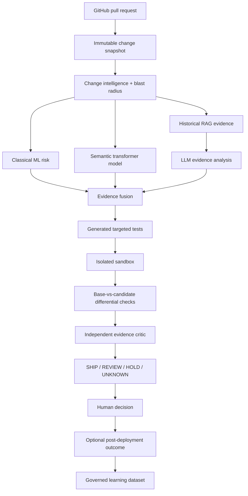
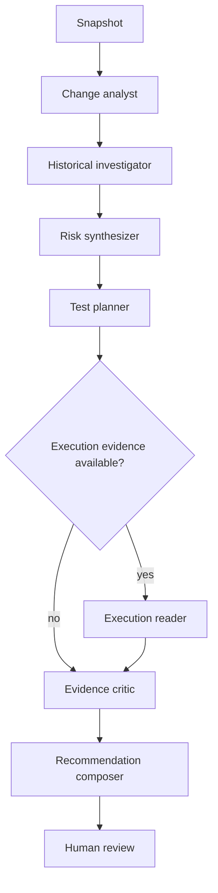

# ReleaseProof — Codex Master Implementation Specification

> **GENERATED FILE — DO NOT EDIT DIRECTLY.**
> Source-of-truth files are concatenated by `eng/sync_master_spec.py`.

This single file exists for agent workflows that can accept only one specification file.


---

# SOURCE FILE: `README.md`

# ReleaseProof — Execution-Grounded AI Change Verification

> **Working name only.** Perform trademark/domain clearance before commercial use.

ReleaseProof is a Python-first developer platform that estimates the risk of a software change and then tries to **prove or disprove that risk with evidence**. It combines repository history, dependency/blast-radius analysis, classical ML, transformer models, RAG, agentic investigation, generated tests, isolated execution, and base-vs-candidate differential verification before producing a human-readable **SHIP / REVIEW / HOLD / UNKNOWN** recommendation.

The product is intentionally not another “LLM reads a diff and writes comments” bot. Its core thesis is:

> **AI-assisted code needs execution-grounded verification, not only AI-generated opinions.**

## Goals

1. **Portfolio:** demonstrate real Python, ML, deep learning, LLM/RAG/agent engineering, MLOps, secure sandboxing, backend architecture, testing, observability, and production discipline.
2. **Business:** begin as a GitHub App for AI-heavy engineering teams, prove value with a narrow pilot, then consider hosted/self-hosted change assurance.
3. **Learning:** every ML/LLM milestone leaves reproducible evidence and an explanation the owner can defend in an interview.

## Target-state product flow

This diagram describes the gated end state through M17. The MVP stops after repository-scoped evidence and the dashboard; generated tests, sandbox execution, differential verification, the critic and governed outcome learning remain disabled until their owning milestones pass.



## Deliberate architecture

The first working system is a **Django modular monolith + Celery workers + PostgreSQL/pgvector + Redis**. ML logic lives in framework-light Python packages. FastAPI model serving is conditional on the predeclared RP-1402 measurement/decision gate in `docs/20_PERFORMANCE_CAPACITY_COST.md`; otherwise inference stays in workers. Docker Compose must work before Kubernetes is considered.

### Frontend
- HTML5 + CSS
- Django templates
- HTMX
- minimal vanilla JavaScript

### Backend/data
- Python
- Django + Django REST Framework
- Celery + Redis
- PostgreSQL + pgvector + PostgreSQL full-text search
- S3-compatible object storage; SeaweedFS locally

### AI/ML
- NumPy, Pandas, Jupyter
- scikit-learn
- XGBoost
- PyTorch
- Hugging Face Transformers / sentence-transformers
- only the LangChain modules required by an assigned provider/retrieval contract; no default meta-package
- LangGraph for stateful workflows
- OpenAI adapter + second/local provider path
- Ollama optional locally
- vLLM only after its M15 hardware/license/privacy benchmark gate
- MLflow for experiments/models/prompts/traces/evaluation

### Engineering
- pytest / pytest-django / property tests where useful
- Testcontainers
- Playwright
- Ruff + mypy/django-stubs
- OpenTelemetry + Prometheus/Grafana in later milestones
- GitHub Actions
- Docker Compose first; optional Kubernetes later

## Non-negotiable truthfulness

ReleaseProof must never claim measured accuracy, risk reduction, throughput, customer impact, incident prevention, or production readiness unless reproducible repository evidence supports the exact claim.

Synthetic demo data must be labeled **synthetic**. Public outcomes such as revert/hotfix/follow-up-fix labels are **proxies**, not proof that a PR caused a production incident. A model score is advisory evidence, never merge authorization.

## Implementation strategy

1. Repository assessment and version verification.
2. Foundation, deterministic fakes, local infrastructure.
3. Tenancy + secure GitHub App/webhook ingestion.
4. Immutable snapshots + change intelligence/blast radius.
5. Dataset/feature pipeline + deterministic heuristic baseline.
6. Logistic regression + XGBoost risk model.
7. Hybrid RAG over repository knowledge/history.
8. Strict-schema LLM evidence analysis.
9. Generated test proposals.
10. Hardened isolated execution.
11. Base-vs-candidate differential/mutation evidence.
12. PyTorch/Hugging Face semantic model.
13. LangGraph bounded investigation workflow.
14. MLflow/evaluation/feedback governance.
15. Security, observability, reliability, cost controls.
16. Production-shaped containers/CI/CD; optional model service/local inference.
17. Recruiter demo + narrow pilot.
18. Final architecture/evidence review.

## Start here

1. `CODEX_START_HERE.md`
2. `AGENTS.md`
3. `docs/00_DOCUMENT_MAP.md`
4. `CODEX_PROMPT_SEQUENCE.md`

Canonical issue contracts are in `docs/22_BACKLOG_AND_ACCEPTANCE.md`. Individual Codex prompts are in `codex-prompts/`. `CODEX_MASTER_IMPLEMENTATION_SPEC.md` is generated by `eng/sync_master_spec.py`; never edit it directly.

## M1 local development

The implemented foundation uses Python 3.13.15 and uv 0.12.6. Install uv from its official
distribution, then from the repository root run:

```text
uv python install 3.13.15
uv sync --frozen --group dev
uv run python -m eng.smoke_fakes
uv run python eng/validate.py
docker compose config --quiet
```

The fake smoke is deterministic and makes no network or paid-provider calls. The validation command
runs format checking, linting, strict typing, non-infrastructure tests, Django system checks,
migration-drift detection, and generated-document synchronization.

For the local data services, copy `.env.example` to the ignored `.env`, keep its credentials local,
and run:

```text
uv run --env-file .env python -m eng.configure_local
docker compose up -d --wait
uv run --env-file .env python -m eng.bootstrap_object_store
uv run --env-file .env python -m eng.smoke_object_store
```

If a default loopback port is already in use, override `POSTGRES_PORT`, `REDIS_PORT`, or `S3_PORT`
in `.env` and update the corresponding application URL. Do not stop an unrelated local service.

To run the SeaweedFS contract test, set `RUN_S3_INTEGRATION=1` for the command environment and run
`uv run --env-file .env pytest tests/integration/test_s3_contract.py`. `docker compose stop` or
`docker compose down` preserves named volumes. `docker compose down --volumes` is the explicit,
destructive local reset and permanently deletes local PostgreSQL, Redis, and SeaweedFS data.

The web process starts with `uv run python manage.py runserver`. Its liveness endpoint is
`GET /health/live`; `GET /health/ready` fails closed when authoritative PostgreSQL is unavailable.
Redis transport and optional providers do not replace PostgreSQL product state.

## M2 tenancy and GitHub ingestion

M2 implements `RP-0101..RP-0106`: organizations/memberships and role checks, same-origin session
authentication with CSRF and fail-closed login throttling, tenant-bound GitHub installation and
repository records, bounded HMAC-SHA256 webhook ingestion, immutable pull-request snapshots,
PostgreSQL-authoritative jobs/outbox recovery, and stale-safe advisory-report adapters.

Apply the forward migrations and run the deterministic path with:

```text
uv run python manage.py migrate
uv run pytest -m "not integration"
uv run python manage.py relay_outbox --organization <organization-public-uuid> --limit 100
```

Browser routes use Django sessions only. `POST /webhooks/github` is CSRF-exempt because it requires
the bounded raw request plus a valid `X-Hub-Signature-256`; browser mutations remain CSRF
protected. Direct repository access is resolved inside the active organization stored in the
authenticated session. Composite database constraints independently reject organization/parent
mismatches, and webhook receipts, pull-request snapshots and audit logs are database-append-only.

The deterministic fake GitHub snapshot/report adapters are the validated M2 local/demo path. A
live GitHub REST installation-token minter and live check publisher are intentionally unconfigured;
pull-request webhooks return a safe 503 until a live provider is explicitly implemented and
selected. No live repository is contacted and no check is posted by the M2 validation suite.


---

# SOURCE FILE: `AGENTS.md`

# AGENTS.md — Repository Instructions for Codex

## Mission

Build and maintain ReleaseProof according to this repository. ReleaseProof analyzes software changes, estimates risk, retrieves historical evidence, proposes targeted tests, executes untrusted candidate code only inside hardened sandboxes, compares base/candidate behavior, and returns advisory evidence to a human reviewer.

## Required reading

Before any change:
1. `README.md`
2. `docs/01_PRODUCT_REQUIREMENTS.md`
3. `docs/02_SYSTEM_ARCHITECTURE.md`
4. documents linked to the assigned issue
5. relevant ADRs in `docs/decisions/`
6. `docs/22_BACKLOG_AND_ACCEPTANCE.md`
7. `templates/definition-of-done.md`

For ML/LLM issues also read:
- `docs/07_DATASET_FEATURE_PIPELINE.md`
- `docs/08_CLASSICAL_ML_RISK_ENGINE.md`
- `docs/09_SEMANTIC_MODEL_PYTORCH_HF.md`
- `docs/10_RAG_RETRIEVAL_RERANKING.md`
- `docs/16_TESTING_QUALITY_EVALUATION.md`
- `docs/17_MLOPS_MODEL_GOVERNANCE.md`

`CODEX_MASTER_IMPLEMENTATION_SPEC.md` is generated. Never edit it directly. If requirements conflict, report the conflict instead of inventing a new direction.

## Architecture rules

- Start as a **Django modular monolith** with separate Celery workers.
- Keep domain/ML algorithms framework-light; core packages must not depend on Django requests/templates/Celery task objects.
- Add FastAPI model serving only when RP-1402 satisfies the predeclared measurement gate and decision vocabulary in `docs/20_PERFORMANCE_CAPACITY_COST.md`.
- PostgreSQL is authoritative.
- pgvector + PostgreSQL FTS are the first retrieval stores.
- Redis is broker/cache/coordination support, never authoritative product state.
- Use S3-compatible storage for large immutable artifacts; SeaweedFS locally per ADR-016.
- Complete Docker Compose before Kubernetes.
- Do not add Kafka, Airflow, Pinecone, Weaviate, Milvus, Spark, Ray, Kubernetes, or GPU serving merely for résumé keywords.
- Web UI: HTML/CSS + Django templates + HTMX + minimal JS.
- Browser mutations use session auth + CSRF; no long-lived secrets in localStorage.

## Python rules

- Use the verified baseline from `docs/26_TECHNOLOGY_BASELINE.md`.
- Thin views/controllers; business logic in application/domain services.
- Explicit types and strict boundary schemas.
- Validate and bound all external input.
- Explicit network/database/provider timeouts.
- Never swallow exceptions or retry permanent failures blindly.
- Never log GitHub tokens, OAuth tokens, cookies, Authorization headers, LLM keys, secrets, or arbitrary customer source content.
- No hard-coded tenant/repository IDs, credentials, pricing, or demo accounts in production code.
- Every dependency must solve a documented problem.

## GitHub rules

- GitHub App with least-privilege permissions.
- Verify webhook signatures before trusted parsing.
- Delivery/event handling is idempotent.
- Installation tokens are short-lived and never persisted in plaintext.
- Tenant/repository identity is server-derived.
- Persist only content allowed by retention policy.

## ML/data rules

- **No invented training data.** Synthetic data must be marked synthetic and separated from real evaluation claims.
- Preserve dataset provenance, extraction version, label rule, feature version, usage/license notes, observation window, and split assignment.
- Default headline evaluation is time-aware and repository-aware; random row splits are insufficient.
- Train/validation/test boundaries are immutable after experiment publication.
- Revert/hotfix/follow-up labels are proxies, not “incidents.”
- Start with a deterministic heuristic baseline before ML.
- Learned models must beat or complement baselines before promotion.
- If a displayed number is called a probability, calibration must be measured.
- Report prevalence, precision, recall, F1, PR-AUC, ROC-AUC as secondary context, threshold behavior, and calibration where applicable.
- Customer code is not used for shared/global training by default. Organization-local learning is explicit opt-in.
- Model artifacts are immutable/versioned and loaded by exact identifier/checksum.

## LLM/RAG rules

- LLM output is untrusted structured suggestion, never authority.
- Reject invalid provider output instead of silently coercing it.
- RAG evidence preserves source references.
- Hosted-provider transmission of customer code obeys organization policy.
- Deterministic fake provider is mandatory for tests/demo.
- Prompts, model identifiers, embedding versions, and graph schemas are versioned.
- Never let an LLM merge/deploy, access secrets, or widen sandbox permissions.
- Agent graphs have max steps, wall time, token/cost budgets, and tool allowlists.
- A critic using the same model does not count as independent validation by itself.

## Sandbox rules

- **Never execute untrusted repository code on the application host.**
- No host Docker socket, production/cloud credentials, repo write token, SSH agent, or unrestricted host mounts.
- Network denied by default.
- Non-root, resource/PID/time/output limits, ephemeral volumes, read-only filesystem where feasible.
- Treat sandbox output as untrusted.
- Any credible sandbox escape concern blocks the execution milestone.

## Testing rules

Every behavior change must add/update appropriate unit, integration, evaluation, and critical E2E tests and report exact commands/results.

Critical evidence includes:
- signed webhook -> immutable snapshot -> analysis;
- duplicate webhook harmless;
- cross-org IDOR denied;
- unavailable LLM does not erase deterministic evidence;
- invalid LLM schema rejected;
- every risk score names artifact/feature version;
- leakage checks fail closed;
- cross-tenant RAG query fails;
- generated tests remain proposals until M8 human acceptance; execution additionally requires the separate M9 execution approval bound to an immutable proposal and plan hash;
- candidate cannot read sentinel host/control secrets;
- base/candidate fixture comparison reproducible;
- failed sandbox/provider becomes REVIEW/UNKNOWN rather than false SHIP;
- model/prompt/retrieval regressions are detectable.

## Truthfulness rules

A target is not a measurement. A synthetic demo is not a customer outcome. A proxy label is not a production incident. If evidence is missing, write “not yet measured” or “not yet validated.”

## Learning protocol

For ML/AI milestones, completion reports include an **Owner Learning Note**:
1. concept implemented;
2. why it is used here;
3. algorithm/data assumptions;
4. key code paths;
5. exact experiment/test to rerun;
6. one likely interview question + concise answer.

Do not hide core ML implementation behind abstractions the owner cannot explain.

## Task execution protocol

For every assigned issue:
1. Restate IDs/components.
2. Read linked docs/ADRs.
3. State assumptions/conflicts.
4. Give a small plan.
5. Implement only assigned issues.
6. Add tests/evaluation evidence.
7. Run validation.
8. Update source docs, `PROJECT_STATUS.md`, `CHANGELOG.md` if behavior changes.
9. Run `python eng/sync_master_spec.py` after source-doc changes.
10. Report files changed, commands/results, evidence, remaining risks, and next recommended issue without implementing it.

An issue is done only when it satisfies `docs/22_BACKLOG_AND_ACCEPTANCE.md` and `templates/definition-of-done.md`.


---

# SOURCE FILE: `CODEX_START_HERE.md`

# Codex Start Here

You are implementing ReleaseProof. Treat repository documentation as source of truth.

> **Current package state:** M0 and M1 were completed on 2026-08-27. The assessment instructions below are retained for reproducibility and should be rerun only when `PROJECT_STATUS.md` marks M0 stale or the technology baseline needs reverification. The current next action is Prompt 2 (`RP-0101..RP-0106`).

## Reproducible M0 assessment — no code

### Read completely
- `AGENTS.md`
- `README.md`
- `docs/00_DOCUMENT_MAP.md`
- `docs/01_PRODUCT_REQUIREMENTS.md`
- `docs/02_SYSTEM_ARCHITECTURE.md`
- `docs/07_DATASET_FEATURE_PIPELINE.md`
- `docs/08_CLASSICAL_ML_RISK_ENGINE.md`
- `docs/13_SANDBOX_DIFFERENTIAL_EXECUTION.md`
- `docs/15_SECURITY_PRIVACY_TRUST.md`
- `docs/21_TIMELINE_MILESTONES.md`
- `docs/22_BACKLOG_AND_ACCEPTANCE.md`
- `docs/26_TECHNOLOGY_BASELINE.md`

Skim all ADRs and report contradictions.

### Verify versions

Using official project documentation/release pages, verify compatible stable versions for every technology selected in `docs/26_TECHNOLOGY_BASELINE.md`. Prefer a conservative Python version supported across Django/PyTorch/HF/scikit-learn deployment tooling rather than novelty.

### Return

1. Product understanding in <=15 bullets.
2. Proposed repository/module structure.
3. Exact versions to pin + official compatibility evidence.
4. Package-manager and validation commands.
5. Architecture dependency graph.
6. Data-model concerns.
7. Dataset provenance/leakage concerns.
8. ML baseline/evaluation plan.
9. RAG/LLM privacy/security concerns.
10. Sandbox threat-model concerns.
11. Requirement contradictions/ambiguities.
12. Milestone dependency graph.
13. Exact Prompt 1 scope.
14. Validation commands for lint/type/test/Django/migrations/containers.
15. What stays fake/deterministic until later milestones.

### Wait

Do **not** initialize frameworks, create migrations, download models, mine GitHub data, call paid LLM APIs, or write product code during this assessment.

## Standard issue prompt

> Implement issue(s) `[IDs]` from `docs/22_BACKLOG_AND_ACCEPTANCE.md`. Read `AGENTS.md`, definition of done, linked docs/ADRs first. Restate scope, implement only those issues, add tests/evaluation evidence, run validation, update docs/status/changelog if needed, regenerate the master spec, and report files changed, commands/results, evidence and remaining risks. Do not start the next issue.


---

# SOURCE FILE: `CODEX_PROMPT_SEQUENCE.md`

# ReleaseProof — Codex Prompt Sequence

Use **one prompt at a time**. Do not ask Codex to build the whole platform in one task. The canonical prompts live under `codex-prompts/`.

## Prompt order

0. `00_REPOSITORY_ASSESSMENT.md` — read, verify, report, wait; **no code**.
1. `01_FOUNDATION.md` — RP-0001..RP-0005.
2. `02_TENANCY_GITHUB_INGESTION.md` — RP-0101..RP-0106.
3. `03_CHANGE_INTELLIGENCE.md` — RP-0201..RP-0206.
4. `04_DATASET_BASELINE.md` — RP-0301..RP-0306.
5. `05_CLASSICAL_ML_RISK.md` — RP-0401..RP-0406.
6. `06_RAG_RETRIEVAL.md` — RP-0501..RP-0506.
7. `07_LLM_EVIDENCE.md` — RP-0601..RP-0606.
8. `08_GENERATED_TESTS.md` — RP-0701..RP-0704.
9. `09_SANDBOX_RUNNER.md` — RP-0801..RP-0805; threat review first.
10. `10_DIFFERENTIAL_VERIFICATION.md` — RP-0901..RP-0905.
11. `11_PYTORCH_SEMANTIC_MODEL.md` — RP-1001..RP-1006.
12. `12_LANGGRAPH_AGENTS.md` — RP-1101..RP-1106.
13. `13_MLFLOW_GOVERNANCE.md` — RP-1201..RP-1206.
14. `14_SECURITY_RELIABILITY_OBSERVABILITY.md` — RP-1301..RP-1306.
15. `15_CONTAINERS_CICD_MODEL_SERVING.md` — RP-1401..RP-1406; FastAPI/Ollama/vLLM conditional.
16. `16_DEMO_PILOT.md` — RP-1501..RP-1506.
17. `17_FINAL_ARCHITECTURE_REVIEW.md` — RP-1601..RP-1603; review only.

## Standard single-issue prompt

> Implement issue `[RP-XXXX]` from `docs/22_BACKLOG_AND_ACCEPTANCE.md`. Read `AGENTS.md`, `templates/definition-of-done.md`, the issue, directly relevant numbered docs and ADRs. Restate scope and trust boundaries; implement only that issue; add tests/evaluation; run exact validation; update docs/status/changelog when needed; regenerate and check `CODEX_MASTER_IMPLEMENTATION_SPEC.md`; report files changed, commands/results, evidence, remaining risk and the next suggested issue without starting it. For ML/AI work, include the Owner Learning Note.

## Defect-fix prompt

> Investigate defect `[description]`. Read the source-of-truth docs first. Reproduce with a failing automated test where practical, identify root cause, make the smallest safe correction, run targeted and relevant full regressions, update contracts/docs only when required, and report evidence plus remaining risk. Do not implement unrelated backlog work.

## ML-regression prompt

> Investigate ML regression `[description]`. Freeze the dataset/split/model/evaluation versions first. Check data/label leakage, schema drift, preprocessing parity, calibration, environment and random-seed variance before changing modeling. Compare against the prior baseline using the same held-out evaluation, publish raw before/after artifacts and limitations, and do not tune on the held-out test set.

## RAG / LLM / agent regression prompt

> Investigate `[retrieval/LLM/agent issue]` using the frozen evaluation fixtures and exact provider/model/prompt/embedding/reranker/graph versions. Separate retrieval failure, evidence-selection failure, schema failure, unsupported claim, tool failure and orchestration failure. Make the smallest justified change and rerun both quality and cost/latency evaluations. Do not rely only on model self-grading.

## Security-review prompt

> Review `[scope]` against `docs/15_SECURITY_PRIVACY_TRUST.md`, `docs/13_SANDBOX_DIFFERENTIAL_EXECUTION.md`, applicable ADRs and `AGENTS.md`. Do not patch automatically. Rank exploitable/unsafe conditions by severity with evidence, trust boundary, data exposure, minimal remediation and residual risk. Never print discovered secrets or private source.

## Architecture-review prompt

> Review implementation against `docs/02_SYSTEM_ARCHITECTURE.md`, the data/ML/RAG/runner contracts and all ADRs. Do not refactor automatically. Return violations ranked by severity with file/evidence references, dependency/complexity concerns and a staged correction plan.

## Hard gates

- No formal model work before immutable dataset/split evidence.
- No untrusted execution before runner threat review.
- No probability wording without held-out calibration evidence.
- No agentic complexity without comparison to the simpler pipeline.
- No FastAPI/Ollama/vLLM/Kubernetes solely for keywords.
- No public performance/accuracy/customer-impact claim without reproducible evidence.


---

# SOURCE FILE: `IMPLEMENTATION_CHECKLIST.md`

# ReleaseProof Implementation Checklist

## Foundation
- [x] Prompt 0/version verification done; no code during assessment.
- [x] Python/Django foundation builds/tests locally.
- [x] PostgreSQL/pgvector, Redis, SeaweedFS S3 endpoint reproducible.
- [x] CI blocks lint/type/test/migration/doc-sync errors.
- [x] Deterministic fake GitHub/LLM + fictional fixture exist.

## Product core
- [ ] Tenant/RBAC/CSRF/IDOR protection.
- [ ] Signed idempotent GitHub ingestion.
- [ ] Immutable PR snapshots.
- [ ] Reproducible change features/blast radius.
- [ ] Deterministic risk baseline precedes learned models.

## ML/RAG
- [ ] Dataset manifests/provenance/labels.
- [ ] Time/repository leakage controls.
- [ ] Logistic + XGBoost evaluated and versioned.
- [ ] Hybrid RAG with tenant isolation/citations.
- [ ] PyTorch/HF semantic model + model card.
- [ ] MLflow lineage/evaluation.

## LLM/agents
- [ ] Strict provider abstraction + fake.
- [ ] Grounded structured outputs.
- [ ] LangGraph bounded/advisory.
- [ ] Critic cannot widen privileges.
- [ ] Token/cost/time budgets.

## Execution
- [ ] Generated tests are proposals.
- [ ] No untrusted host execution.
- [ ] Sentinel/network/resource isolation tests.
- [ ] Base/candidate fixture comparison.
- [ ] Mutation/differential evidence integrated safely.

## Engineering/business
- [ ] OTEL/log redaction/failure drills.
- [ ] Compose before optional Kubernetes.
- [ ] Supply-chain release gates.
- [ ] One-command fictional demo + real screenshots/video.
- [ ] README/resume claims match evidence.
- [ ] Narrow pilot package before broad SaaS scope.


---

# SOURCE FILE: `PROJECT_STATUS.md`

# Project Status

**Current state: M2 tenancy and GitHub ingestion complete on 2026-08-28.**

The repository now has the M1 foundation plus tenant-scoped identity, signed durable webhook
ingestion, immutable PR snapshots and deterministic advisory/task adapters. No change-intelligence
features, risk engine, benchmark, model metric, customer result, live GitHub adapter validation,
sandbox security claim, or production-readiness claim exists yet.

## Next action

Run `codex-prompts/03_CHANGE_INTELLIGENCE.md` for `RP-0201..RP-0206`. Do not begin dataset/ML work
before M3 deterministic features and blast-radius evidence pass.

## M2 evidence

- Organizations, memberships/roles, GitHub installations/repositories, webhook receipts,
  immutable snapshots, authoritative jobs/outbox rows and append-only audit records have forward
  migrations.
- Composite organization/parent constraints and immutable-record triggers passed on SQLite and
  PostgreSQL 18.6. The full deterministic suite passed **44 tests** on each backend; the separate
  live S3 test was intentionally deselected in these M2 runs.
- Tests cover session/CSRF behavior, login throttling and cache failure, role/IDOR denial, HTTP,
  Celery, admin and management-command scope, signed/tampered/duplicate webhooks, bounded input,
  lifecycle events, immutable checksummed snapshots, broker recovery, bounded retries, duplicate
  task delivery and stale-safe fake advisory publication.
- Strict mypy passed for 107 source files; Ruff, Django checks and migration-drift checks passed.
- GitHub CLI authentication and remote `main` access were repaired, and the configured pre-commit
  and pre-push hooks are installed locally.
- No live GitHub API was called, no installation access token was persisted, and no real check was
  posted. The live snapshot/token/check adapters remain not yet implemented or validated.

## M1 evidence

- `uv sync --frozen --group dev` resolved the committed lock with CPython 3.13.15.
- Ruff format/lint passed; strict mypy passed for 64 source files.
- The deterministic suite passed 25 tests with the one infrastructure test deselected.
- The live SeaweedFS suite passed 1 contract test after authenticated, idempotent bucket bootstrap.
- Django system checks and migration-drift checks passed; only Django's built-in migrations were
  applied to the disposable local PostgreSQL database.
- Compose reported PostgreSQL/pgvector, Redis, and SeaweedFS healthy. Runtime probes reported
  PostgreSQL 18.6, pgvector 0.8.6, and SeaweedFS 4.44; Redis returned authenticated `PONG`.
- `/health/live` and `/health/ready` returned their deterministic healthy payloads with real
  PostgreSQL; the automated failure-path test returns 503 without database details.
- The exact HTMX 2.0.10 checksum test passed, and the network-free fake smoke was repeatable.

The generated inventory now normalizes UTF-8 line endings before hashing, allowing the same
committed manifest to be checked from Windows and Linux GitHub-hosted runners.
Local S3 credential files remain owner-only; CI relaxes permissions only on its ephemeral file
generated from public `.env.example` values so the pinned non-root SeaweedFS image can read it.

The local Docker host was Engine 24.0.6 / Compose 2.23.0 rather than the documented
29.7.2 / 5.4.0 baseline. The digest-pinned services passed on this older host, but that does not
substitute for a later run on the documented host baseline. The GitHub-hosted workflow is defined,
and its remote M2 result is tracked in GitHub Actions.

| Milestone | Status |
|---|---|
| M0 assessment | Complete — 2026-08-27 assessment plus contradiction/ambiguity correction |
| M1 foundation | Complete — RP-0001..RP-0005 |
| M2 tenancy/GitHub | Complete — RP-0101..RP-0106 |
| M3 change intelligence | Not started |
| M4 dataset/baseline | Not started |
| M5 classical ML | Not started |
| M6 RAG | Not started |
| M7 LLM evidence | Not started |
| M8 generated tests | Not started |
| M9 sandbox | Not started |
| M10 differential | Not started |
| M11 PyTorch/HF | Not started |
| M12 LangGraph | Not started |
| M13 MLflow/governance | Not started |
| M14 security/ops | Not started |
| M15 containers/CI/model serving | Not started |
| M16 demo/pilot | Not started |
| M17 final review | Not started |


---

# SOURCE FILE: `CHANGELOG.md`

# Changelog

## Unreleased
### Added
- Initial implementation-ready ReleaseProof specification package.
- Product, architecture, database, APIs, GitHub, change intelligence, dataset, ML, semantic-model, RAG, LLM, agent, sandbox, UX, security, testing, MLOps, observability, DevOps, performance, commercialization, runbook, interview, learning and pilot specifications.
- Codex repository instructions, prompts, backlog, ADRs and definition-of-done templates.
- ADR-016 selecting maintained SeaweedFS 4.44 for the bounded local S3 contract.
- ADR-017 defining tenant isolation through server-derived scope, application services and database constraints before optional RLS.
- M1 repository tooling with a Python 3.13.15/uv lock, Ruff, mypy, pytest, pre-commit, and pinned CI actions.
- Pinned PostgreSQL/pgvector, Redis, and SeaweedFS Compose services with persistent local volumes and health checks.
- The canonical ten-app Django modular-monolith skeleton with liveness/readiness endpoints and Celery configuration.
- Provider-neutral GitHub, advisory-LLM, and bounded object-storage seams with deterministic fakes.
- A boto3 S3 adapter, SeaweedFS contract test, idempotent bucket bootstrap, and licensed synthetic fixture repository.
- Vendored HTMX 2.0.10 with a verified SHA-256 checksum.
- Deterministic generation of the Git-ignored SeaweedFS credential config from an explicit local environment file.
- M2 organizations, memberships/roles, tenant-scoped services, session organization context and
  Owner/Admin repository lifecycle authorization.
- CSRF-protected session login/logout with hashed-key throttling and fail-closed cache outage
  behavior; no browser access-token storage.
- Tenant-bound GitHub installations/repositories with least-privilege permission validation,
  credential references and a redacted bounded in-memory installation-token cache contract.
- Signed, size/schema/action-bounded GitHub webhook ingestion with immutable delivery receipts,
  normalized checksummed PR snapshots and installation/repository lifecycle handling.
- PostgreSQL-authoritative ingestion jobs, identifier-only transactional outbox rows, bounded relay
  retries, recovery tooling and idempotent Celery worker behavior.
- Database composite tenant foreign keys and append-only triggers for PostgreSQL and the SQLite
  test backend, plus safe DRF error envelopes and scoped admin/management boundaries.
- Stale-safe advisory report contract and deterministic GitHub/task publisher fakes that make no
  remote or paid-provider calls.

### Changed
- Recorded the verified Python 3.13.15/uv/Django/data-service/tooling pins and milestone-gated later dependency snapshots.
- Canonicalized the ten RP-0003 Django module names and policy ownership.
- Made PostgreSQL jobs plus a transactional outbox authoritative across Redis/Celery transport loss.
- Separated generated-test acceptance/export from M9 execution authorization.
- Assigned raw deterministic risk factors to M3 and the first composite evaluated heuristic to M4.
- Added public-dataset source admission, frozen calibration-decision, FTS/embedding index, hosted-provider retention, runner-backend and conditional model-serving gates.
- Replaced vague M13/M14 dependencies with explicit milestone prerequisites.
- Added Boto3 1.43.81 to the Prompt 1 runtime baseline for the ADR-016 S3 adapter.
- Made SeaweedFS readiness wait for a registered writable volume before authenticated S3 bootstrap.
- Made the generated file inventory normalize UTF-8 line endings before hashing so Windows and
  Linux checkouts validate the same committed source bytes.
- Kept generated local S3 credentials owner-only while making only CI's ephemeral, public-example
  credential file readable by the pinned SeaweedFS container's non-root user.

### Evidence status
- M1 implementation evidence is recorded in `PROJECT_STATUS.md`; no product performance, ML quality,
  customer outcome, production-readiness, or sandbox-security claim exists yet.
- M2 evidence is recorded in `PROJECT_STATUS.md`: 44 deterministic tests passed on both SQLite and
  PostgreSQL. Live GitHub token minting/API/check posting and remote CI remain unvalidated and are
  not claimed.


---

# SOURCE FILE: `PACKAGE_MANIFEST.md`

# Package Manifest

ReleaseProof uses source-of-truth numbered docs, explicit ADRs, issue-level acceptance criteria,
a generated single-file master specification, and one Codex milestone at a time.

## Root

- `README.md`
- `AGENTS.md`
- `CODEX_START_HERE.md`
- `CODEX_PROMPT_SEQUENCE.md`
- `CODEX_MASTER_IMPLEMENTATION_SPEC.md`
- `IMPLEMENTATION_CHECKLIST.md`
- `PROJECT_STATUS.md`
- `CHANGELOG.md`
- `pyproject.toml`, `uv.lock`, `.python-version`
- `compose.yaml`, `.env.example`

## Implemented M1 folders

- `apps/web/` — Django project plus the canonical ten modular apps.
- `packages/` — framework-light domain and future algorithm boundaries.
- `adapters/` — deterministic provider fakes and the bounded S3 implementation.
- `workers/` — Celery worker package; domain task behavior remains milestone-owned.
- `tests/` — unit/web tests, the SeaweedFS contract test, and licensed synthetic fixture.
- `deploy/` — PostgreSQL extension bootstrap and local-only SeaweedFS S3 configuration.
- `eng/` — local config, validation, fake/object-store smoke, bootstrap, and spec synchronization.
- `docs/` — numbered source-of-truth specifications.
- `docs/decisions/` — ADRs.
- `codex-prompts/` — one prompt per milestone.
- `templates/` — DoD, dataset/model/experiment/security/pilot templates.
- `notebooks/`, `datasets/` — guarded placeholders for their owning milestones.

## Repository shape

```text
apps/
  web/                 # Django control plane with the ten RP-0003 apps
packages/
  domain/
  github_contracts/
  change_intel/
  dataset_core/
  ml_core/
  retrieval_core/
  ai_core/
  agent_core/
  execution_contracts/
  observability/
workers/
adapters/              # provider implementations and deterministic fakes
notebooks/
datasets/
tests/
deploy/
docs/
codex-prompts/
templates/
```

M1 creates declared package boundaries but leaves milestone-owned algorithms empty. FastAPI model
serving and the runner trust boundary remain absent until their explicit gates. The canonical
Django apps are `identity`, `organizations`, `repositories`, `changes`, `evidence`, `risk`,
`retrieval`, `analysis`, `verification`, and `audit`. Policy records remain owned by organizations
and repositories until a later assigned issue justifies a separate module.


---

# SOURCE FILE: `docs/00_DOCUMENT_MAP.md`

# 00 — Document Map

| Document | Purpose |
|---|---|
| `01_PRODUCT_REQUIREMENTS.md` | users, jobs, MVP, invariants, success evidence |
| `02_SYSTEM_ARCHITECTURE.md` | module/deployable/trust boundaries |
| `03_DOMAIN_AND_DATABASE.md` | tenancy, snapshots, evidence, model/data persistence |
| `04_API_AND_CONTRACTS.md` | browser/API/model/runner contracts |
| `05_GITHUB_INTEGRATION.md` | GitHub App, webhooks, source/status behavior |
| `06_CHANGE_INTELLIGENCE_BLAST_RADIUS.md` | deterministic diff/graph/features |
| `07_DATASET_FEATURE_PIPELINE.md` | labels, provenance, leakage and train/serve features |
| `08_CLASSICAL_ML_RISK_ENGINE.md` | heuristic, sklearn, XGBoost, calibration |
| `09_SEMANTIC_MODEL_PYTORCH_HF.md` | deep-learning semantic classifier |
| `10_RAG_RETRIEVAL_RERANKING.md` | pgvector/FTS hybrid retrieval and evaluation |
| `11_LLM_PROVIDER_AND_ANALYSIS.md` | providers, strict outputs, privacy, prompt injection |
| `12_LANGGRAPH_AGENT_ORCHESTRATION.md` | bounded agent state/tools/critic |
| `13_SANDBOX_DIFFERENTIAL_EXECUTION.md` | generated tests, isolation, differential/mutation |
| `14_FRONTEND_UX.md` | HTML/CSS/Django/HTMX product UI |
| `15_SECURITY_PRIVACY_TRUST.md` | auth, source privacy, tenant/AI/sandbox threats |
| `16_TESTING_QUALITY_EVALUATION.md` | test pyramid + ML/RAG/LLM/sandbox eval |
| `17_MLOPS_MODEL_GOVERNANCE.md` | MLflow, lineage, promotion, feedback/drift |
| `18_OBSERVABILITY_OPERATIONS.md` | logs, metrics, traces, controls |
| `19_DEVOPS_CICD_SUPPLY_CHAIN.md` | Docker/CI/releases/optional Kubernetes |
| `20_PERFORMANCE_CAPACITY_COST.md` | measurement and budget methodology |
| `21_TIMELINE_MILESTONES.md` | ordered dependencies |
| `22_BACKLOG_AND_ACCEPTANCE.md` | issue IDs and acceptance |
| `23_DEMO_PORTFOLIO.md` | recruiter demo and claim evidence |
| `24_COMMERCIALIZATION.md` | ICP, pilot, pricing hypotheses |
| `25_FAILURE_MODES_RUNBOOKS.md` | operational recovery |
| `26_TECHNOLOGY_BASELINE.md` | dated pinning/verification policy |
| `27_INTERVIEW_TALK_TRACK.md` | architecture/ML explanations |
| `28_NON_GOALS_FUTURE.md` | deliberate exclusions |
| `29_PILOT_PACKAGE.md` | pilot onboarding/measurement |
| `30_LEARNING_CHECKPOINTS.md` | owner learning plan |
| `31_FINAL_ARCHITECTURE_REVIEW.md` | final claim/security/architecture audit |

ADRs under `docs/decisions/` explain choices that must not be casually reversed.


---

# SOURCE FILE: `docs/01_PRODUCT_REQUIREMENTS.md`

# 01 — Product Requirements

## Product statement

ReleaseProof helps engineering teams judge whether a software change is safe enough to merge or release by combining deterministic change analysis, historical evidence, learned risk models, and controlled execution. It returns **SHIP / REVIEW / HOLD / UNKNOWN** with cited evidence; humans retain merge/deploy authority.

## Primary users
- Developer: fast, prioritized evidence.
- Reviewer/Tech Lead: risk areas, missing checks, reproducible findings.
- Engineering Manager: team-level change quality without individual surveillance scoring.
- Platform/SRE/Security: policy, audit, privacy, execution controls.

## Jobs to be done
- Identify what deserves review attention.
- Explain why a change is risky.
- Find similar historical changes/runbooks/incidents.
- Propose missing tests.
- Execute allowed checks safely.
- Compare base vs candidate behavior.
- Separate ML/LLM hypotheses from deterministic/execution facts.
- Provide concise GitHub output and deeper dashboard evidence.
- Learn from outcomes without silently pooling private customer code.

## Invariants
- Advisory only; no autonomous merge/deploy in MVP.
- UNKNOWN is valid when evidence is missing.
- Every score names producer/model/feature version.
- Every LLM claim cites allowed evidence or is labeled hypothesis.
- Organization/repository scope is server-derived.
- Untrusted code never executes on the app host.
- Hosted LLM source transmission is policy-controlled.
- Shared/global training on customer code is off by default.
- Execution failure is not interpreted as pass.
- Synthetic data and proxy labels are explicit.

## MVP
1. One configured GitHub App installation/repository path per MVP deployment and demo. The schema, authorization and query rules remain multi-organization from M2; "one path" limits integration breadth, not tenant-isolation requirements.
2. Signed PR webhook ingestion.
3. Immutable base/head change snapshot.
4. Deterministic features + Python import/blast-radius analysis.
5. Transparent rule-based risk baseline.
6. Repository-scoped historical retrieval.
7. Optional strict-schema hosted LLM analysis plus deterministic fake.
8. GitHub check/status + evidence dashboard.
9. **No arbitrary code execution yet.**

Before RP-0905, each release recommendation uses the latest approved deterministic recommendation-policy version and only the evidence components available at that milestone. Later ML, RAG and LLM outputs cannot silently change that policy. RP-0905 introduces the separately evaluated fusion policy that includes execution and mutation evidence.

## Post-MVP gates
- Classical ML only after provenance/split/leakage controls.
- Test generation only for an explicit fixture adapter first.
- Sandbox only after threat-model approval and isolation tests.
- Differential execution only for configured supported projects.
- PyTorch/HF model only after classical baseline.
- LangGraph only after single-pass LLM path has evaluation.
- FastAPI/vLLM/Kubernetes only after their owning issue's predeclared measurement, hardware, license, privacy and operational-cost gate; explicit deferral is a valid outcome.

## Non-goals
Autonomous merges/deploys; IDE autocomplete; generic code generation; full SAST/DAST replacement; secrets management; incident management; universal build systems; employee ranking; foundation-model pretraining; guaranteed bug prevention.

## Success evidence

Portfolio evidence: deterministic snapshot/features, tenant isolation, measured model metrics on documented proxy labels, retrieval benchmark, sandbox isolation proof, planted regression differential result, bounded agent evaluation, reproducible demo.

Commercial success requires external pilot evidence: useful findings, acceptable false-positive burden, installation retention, cost, and willingness to pay. Technical benchmarks do not prove business value.


---

# SOURCE FILE: `docs/02_SYSTEM_ARCHITECTURE.md`

# 02 — System Architecture

## Principle

Separate authoritative product state, analysis algorithms, untrusted execution, and optional model serving. Start modular because the difficult parts are data/ML/security—not service count.

## Planes

### Control plane — Django
Organizations/memberships, repositories/installations, snapshots, analysis/evidence lifecycle, organization/repository policy records, audit, web UI/DRF, GitHub adapters.

### Analysis plane — Python packages + Celery
Feature extraction, dependency graph, risk scoring, retrieval/reranking, LLM analysis, LangGraph workflows, evaluation jobs.

### Execution plane — isolated runner (M9+)
Consumes immutable execution plans, creates disposable sandboxes, runs allowlisted commands, returns bounded structured results. It cannot alter product state except through authenticated result submission.

### Model plane — deferred FastAPI
Only when RP-1402 returns `EXTRACT_FASTAPI` under the predeclared measurement gate in docs/20. Otherwise inference remains in workers. No tenancy/business policy belongs in a model service.

## Target modules

```text
apps/web/
  identity organizations repositories changes evidence risk retrieval analysis verification audit
packages/
  domain github_contracts change_intel dataset_core ml_core retrieval_core ai_core
  agent_core execution_contracts observability
workers/
adapters/              # provider implementations and deterministic fakes
apps/model_service/    # deferred
runner/                # M9 separate trust boundary
```

These ten Django app names are canonical for RP-0003. Policy records are owned by `organizations` and `repositories`; policy evaluation belongs in the relevant application service. A standalone `policies` app requires a later assigned issue and documented need.

## Dependency rule

Views/DRF -> application services -> framework-light domain/algorithm ports. Django ORM/GitHub/Redis/S3 are adapters. Core algorithms do not import Django request/template/Celery task objects.

## Storage
- PostgreSQL: authoritative state, evidence metadata, deterministic features, pgvector embeddings, FTS.
- Redis: Celery broker/cache/short coordination; disposable.
- S3-compatible object storage: large immutable diffs/logs/dataset/model artifacts; SeaweedFS is the pinned local Compose implementation under ADR-016.
- MLflow: experiment/model/prompt/evaluation lineage after M13.

## Consistency
- Durable webhook dedupe record before expensive async work.
- A PostgreSQL job record and transactional outbox entry are committed with the triggering state change. A relay publishes outbox entries to Celery/Redis; idempotent workers and a recovery scan handle duplicate delivery or broker loss. Redis never owns job truth.
- Snapshot immutable by repo/PR/base/head/schema.
- Head movement creates a new run; never mutates old evidence.
- Risk/evidence records are versioned/append oriented.
- Execution bound to exact SHAs, artifacts, image digests and plan hash.

## Failure philosophy
Verifier failure reduces confidence and is visible:
- LLM down -> deterministic/ML evidence remains.
- retrieval down -> no historical claims fabricated.
- model unavailable -> explicit baseline fallback or UNKNOWN.
- runner timeout -> timeout/UNKNOWN, never pass.

## Scaling path
1. Django + worker + Postgres/Redis/SeaweedFS Compose.
2. Independent web/worker replicas.
3. separate runner pool.
4. model-service process/GPU pool only if RP-1402 returns `EXTRACT_FASTAPI`.
5. optional Kubernetes when resource scheduling/replica evidence exists.

Kafka is deliberately absent. Introducing it requires a new issue and ADR with a reproducible benchmark showing that the PostgreSQL outbox plus Celery transport cannot meet a stated ordering, replay or throughput requirement.


---

# SOURCE FILE: `docs/03_DOMAIN_AND_DATABASE.md`

# 03 — Domain and Database

## Tenancy
All customer records belong to `Organization`. Repository identity is tied to GitHub numeric IDs/installations, not user-entered names. M2 tenant isolation is enforced by server-derived organization context, organization-scoped application services/querysets, object-level authorization and composite database constraints. Raw unscoped ORM access is prohibited outside audited repository/adaptor code.

PostgreSQL row-level security is not an assumed MVP control: pooled web/Celery connections require a proven transaction-scoped tenant-context design before RLS can be trusted. ADR-017 requires the application and constraint controls to stand alone; a later RLS defense-in-depth change needs its own ADR and cross-context tests.

## Key entities

### Organization / Membership
Organization stores lifecycle, hosted-LLM policy, org-learning policy, retention and budgets. Membership role: Owner/Admin/Reviewer/Member/ReadOnly.

### GitHubInstallation
Organization, GitHub installation/account IDs, permissions snapshot, lifecycle. **Never persist short-lived installation access tokens.**

### Repository
Organization, GitHub repository ID, display owner/name, default branch, language metadata, analysis/index/execution policy.

### PullRequestSnapshot
Immutable repository/PR/base SHA/head SHA/event identity/title/body metadata, changed files, diff artifact/hash, schema version.

### ChangeFeatureSet
Snapshot, feature-schema version, deterministic values, extractor version, graph artifact/hash. Must be recomputable.

### AnalysisRun
Snapshot, requested components/policy snapshot, lifecycle, timestamps, correlation ID, recommendation + recommendation-policy version.

### AsyncJob / OutboxEvent
Authoritative job/idempotency key, owning organization/run, requested task type/version, bounded attempt state, availability time and terminal outcome; transactional outbox topic/payload version/published state. The outbox contains identifiers, not raw source. Redis/Celery result state is never authoritative.

### EvidenceItem
Append-only: kind (`deterministic`, `ml`, `retrieval`, `llm`, `test`, `execution`, `security`, `unknown`), severity/confidence vocabulary, title, structured payload, source refs, producer/version.

### RiskScore
Analysis, model/baseline artifact, feature version, raw score, calibrated probability nullable, band, threshold policy, explanation.

### KnowledgeDocument / KnowledgeChunk / KnowledgeEmbedding
Document/chunk: org/repo, source type/id/version/hash, content metadata, versioned normalized text, `simple`-configuration FTS vector, ACL/scope. Embedding: chunk, exact embedding-version/model/revision/dimension, vector and lifecycle. Each dimension/model version uses a compatible physical vector index and is built beside, not over, the active version.

### DatasetManifest
Version/hash, provenance, extraction/label rules, feature version, split rule, counts/class balance/unknowns, usage/license notes, synthetic flag.

### ModelArtifact
MLflow/model identifier, algorithm, dataset manifest, feature version, metrics summary, lifecycle (`candidate/approved/retired`), checksum.

### PromptVersion / EvaluationSuite
Immutable/versioned prompts and frozen evaluation cases.

### GeneratedTestProposal
Analysis, immutable revision/hash, adapter, file/content artifact, rationale/evidence refs and lifecycle (`draft`, `accepted_for_export`, `rejected`, `execution_approved`, `executed`, `superseded`). Editing creates a new draft revision. M8 acceptance permits export only; M9 execution approval is a separate audited transition bound to the current snapshot, proposal hash, execution-plan hash and approving Reviewer/Admin.

### ExecutionPlan / ExecutionRun / Observation
Exact SHAs/artifacts, allowed commands, resource/network limits, plan hash; runner image digest, outcomes, timings, bounded stdout/stderr/artifacts, timeout/killed/isolation state.

### DeploymentOutcome
Optional feedback taxonomy (`no_issue`, `revert`, `hotfix`, `incident`, `manual_label`, `unknown`), source/confidence/observation window and org-training eligibility.

### AuditLog
Append-only actor/org/action/resource/correlation and safe metadata. Never raw source/secrets.

## Persistence rules
- Opaque public IDs.
- Unique webhook delivery IDs.
- Unique immutable snapshot identity.
- Optimistic versioning on mutable policy.
- Vector/FTS queries always include org/repo scope.
- Tenant-owned parent/child relationships use organization-consistent composite foreign keys such as `(organization_id, parent_id)` backed by a matching unique key. Any schema-level exception requires a documented migration rationale plus fail-closed service and cross-tenant tests; services always verify scope before lookup or mutation.
- Embedding model/dimension changes create new index version.
- Historical evidence never silently rewritten when model/prompt changes.

### M2 implemented enforcement

- Browser scope comes from an authenticated active membership stored in the server-side session;
  verified GitHub installation IDs derive webhook scope. Payload organization IDs are ignored.
- Scoped querysets/application services cover HTTP, Celery, admin and management-command entry
  points. Non-superuser admin querysets are membership scoped; the outbox command requires one
  explicit organization public UUID.
- Database composite foreign keys enforce organization consistency for repository/installation,
  receipt/installation, snapshot/repository, snapshot/receipt, job/snapshot and outbox/job pairs.
  PostgreSQL constraints and SQLite test triggers both reject mismatches immediately.
- Webhook receipts, pull-request snapshots and audit records reject update/delete in application
  paths and through database triggers. Mutable job/outbox lifecycle state remains bounded and
  separately versioned.
- Installation records persist an approved credential reference only. Installation access tokens
  have a redacted, bounded process-memory cache contract and no model/cache/task serialization.

## Retention
Separate policies for metadata, raw diff/source index, execution logs, LLM traces, datasets and training eligibility. Org deletion removes active access promptly and schedules documented tenant-scoped deletion. Private-data-derived artifacts follow the same policy.


---

# SOURCE FILE: `docs/04_API_AND_CONTRACTS.md`

# 04 — API and Contracts

## Browser/API model
Primary UI is same-origin Django + HTMX. DRF supplies structured APIs and integrations. Internal model/runner contracts are separately versioned.

## Safe error envelope
```json
{"error":{"code":"stable_code","message":"safe message","correlation_id":"opaque","details":{}}}
```
Never return stack traces, secrets, raw provider payloads, or arbitrary source.

## Representative routes
- `GET /health/live`, `/health/ready`
- `GET /app/repositories/`
- `GET /app/repositories/{id}/pulls/{number}/`
- `GET /api/v1/me`
- `GET /api/v1/analyses/{id}`
- `GET /api/v1/analyses/{id}/evidence`
- `POST /api/v1/repositories/{id}/reanalyze`
- `POST /api/v1/analyses/{id}/generated-tests/{proposal}/accept|reject`
- `POST /api/v1/execution-plans/{id}/approve` (M9+, separate execution authorization)
- `GET /api/v1/models/current`
- `GET /api/v1/evaluations/latest`
Mutations require session + CSRF + role checks.

Implemented M2 routes are `GET /api/v1/me`, `GET /api/v1/repositories/{public_id}`,
`POST /api/v1/repositories/{public_id}/lifecycle`,
`POST /app/organizations/{public_id}/select/`, session login/logout, and
`POST /webhooks/github`. Repository lifecycle enable/disable requires Owner/Admin membership and
is tenant scoped before the direct object lookup. DRF failures use the safe error envelope with a
server-generated correlation ID.

## GitHub webhook
`POST /webhooks/github`: bounded raw body -> signature verify -> event/action allowlist -> delivery dedupe -> server-resolved installation/org -> atomically commit durable receipt/job/outbox -> relay to Celery. A broker outage leaves committed work pending for recovery rather than returning a false accepted-without-work state.

M2 bounds webhook bodies to 1 MiB, JSON depth to 20, JSON nodes to 10,000, changed files to 1,000,
each patch to 64 KiB, combined patches to 1 MiB and check metadata to 250 entries. Accepted work
returns 202; an identical delivery retry returns 200 without duplicate durable rows; reuse of a
delivery ID with different signed content returns 409. Invalid signature/media/event/input and an
unavailable snapshot provider return stable safe errors without provider payloads or source.

## Analysis contracts
`AnalysisRequestV1`: snapshot, requested components, policy snapshot/version, reason.
`AnalysisResultV1`: run/snapshot/base/head, component outcomes, recommendation, evidence IDs, producer/schema versions.

## Risk model contract
`RiskModelRequestV1`: exact feature-schema version + normalized feature payload.
`RiskModelResponseV1`: exact model artifact/checksum, raw score, calibrated probability nullable, band, explanation, latency metadata.
Feature mismatch is rejected.

## Retrieval contract
Server-resolved org/repo scope, query, filters, max candidates. Results include document/chunk source/version, lexical/vector/fusion/rerank scores and safe excerpt.

## LLM schema
Strict versioned object: concise summary, risk hypotheses, allowed evidence IDs, suggested checks/tests, missing information, uncertainty. Unknown evidence ID => invalid output.

## Runner contract
Runner accepts only immutable/signed internal `ExecutionPlanV1`: artifact hashes, image/toolchain, allowlisted commands, resource/network policy, timeout/output limits. No free-form host paths or Docker options.

Runner returns plan hash, image digests, command outcomes, timings/resource observations, bounded artifact refs, explicit timeout/killed/isolation failure.

## Idempotency/staleness
GitHub delivery + snapshot identity dedupe. Manual reanalysis may use idempotency key. Old-head analysis cannot publish current-head conclusion.

Proposal acceptance and execution approval are distinct. Accepting/editing/exporting a generated test never enqueues execution. Editing or head movement invalidates prior execution approval; an approved execution request names the exact proposal revision, snapshot and execution-plan hash.


---

# SOURCE FILE: `docs/05_GITHUB_INTEGRATION.md`

# 05 — GitHub Integration

## Model
Use a GitHub App for repository permissions/webhooks. Human web identity is independent. No personal token is the core repository authorization mechanism.

## Permission intent
Prompt 0/M2 verifies current official permission names. Initial intent:
- metadata: read
- pull requests: read
- contents: read only if analysis requires it
- checks/status: write only for ReleaseProof output
- issues/actions/workflows: deferred unless a specific feature needs them
- never code/admin write for MVP

## Initial events
`pull_request` opened/synchronize/reopened plus installation lifecycle and repository added/removed events. CI/workflow evidence is later.

## Secure ingestion
1. Bound raw body.
2. Verify HMAC signature.
3. Validate event/action.
4. Dedupe GitHub delivery ID.
5. Resolve installation -> org server-side.
6. Obtain short-lived installation token.
7. Fetch exact base/head metadata/diff as inert data.
8. Atomically create immutable snapshot, authoritative analysis job and transactional outbox entry.
9. Relay the outbox entry to Celery/Redis; recovery republishes pending work with the same idempotency key.

## Source handling
Do not clone and execute repository code on web/worker hosts. Static analysis treats content as inert bytes/text. Execution content enters the runner only after M9 policy/security gates.

## GitHub output
One concise check/status, not comment spam. Include recommendation, component availability, model/baseline identifier and dashboard link. Stale run cannot overwrite the latest head conclusion.

## Demo
Provide signed fixture webhook payloads and a deterministic fake GitHub adapter. Recruiter demo requires no live GitHub installation.

## M2 implementation boundary

M2 accepts `pull_request` opened/synchronize/reopened, known-installation lifecycle, and repository
added/removed events. Every accepted event atomically creates an immutable receipt, authoritative
bounded job and identifier-only outbox row; pull-request events additionally create or reuse the
immutable normalized snapshot. The scoped `relay_outbox` management command and publisher port
provide relay/recovery, while workers treat repeat task delivery as harmless.

The provider-neutral snapshot call receives the verified installation ID but never a serialized
access token. `InstallationTokenCache` is bounded process memory, redacts representations, evicts
by LRU/expiry and accepts only an injected minter using the persisted credential reference. No live
token minter is selected in M2. The fake advisory publisher proves one neutral, versioned report and
stale-head rejection without posting to GitHub; live check/status posting remains a later explicit
adapter implementation, not an implied validation result.


---

# SOURCE FILE: `docs/06_CHANGE_INTELLIGENCE_BLAST_RADIUS.md`

# 06 — Change Intelligence and Blast Radius

## Goal
Create deterministic explainable facts before ML/LLM. These facts become features, retrieval filters and evidence.

## Inputs
Exact base/head SHAs, normalized file patches, selected inert source/tree data, repository language/framework policy, optional prior graph.

## Feature schema v1
Examples:
- lines added/deleted, files changed, language/file-type distribution
- tests changed
- migration/schema change
- dependency manifest/lockfile change
- auth/security-sensitive path flags
- deployment/CI/config changes
- API surface heuristic
- rename/delete/binary/generated/vendored handling
- recent file churn
- touched-area proxy-failure history
- change concentration/entropy
- commit count
- blast-radius counts/depth
Unknown != zero. Names/semantics are versioned.

## Python graph v1
Static `ast` import/module graph plus generic directory heuristics. A later assigned language-adapter issue may add Tree-sitter only with licensed fixtures and a measured coverage/correctness benefit over the existing parser. Never import/execute customer modules to discover dependencies.

Blast radius:
- changed nodes
- reverse dependents to bounded depth
- edge-type/distance weights
- configured critical-path tags
- impacted tests where mappings exist

Do not claim a dynamic call graph.

## Evidence
Every deterministic flag includes rule ID, value, reason, bounded source references and producer version.

## Reproducibility
Same snapshot + extractor + policy => same feature/graph hash. Golden fixture tests enforce it.


---

# SOURCE FILE: `docs/07_DATASET_FEATURE_PIPELINE.md`

# 07 — Dataset and Feature Pipeline

## Core credibility problem
Fitting XGBoost is easy; trustworthy labels are not. Reverts, hotfixes and follow-up fixes are noisy **proxies**, not proof that a PR caused a production incident.

## Data phases

### A — Synthetic fixture
Only for UI/demo/tests. `synthetic=true`. Never mixed invisibly into real performance claims.

### B — Curated public-repository proxy dataset
Explicit allowlist of public repositories; use approved APIs/rate limits and record source/license/usage notes. Potential positive proxies are separately labeled:
- explicit revert
- linked rapid follow-up fix under a documented rule
- repository-maintainer hotfix/revert labels where reliable
Unknown remains unknown when observation/history is incomplete.

### Public-source admission gate
No public repository is extracted until an approval record captures repository numeric identity and canonical URL, SPDX/license evidence and version, hosting/API terms URL and review date, permitted acquisition method, allowed fields/artifacts, redistribution/retention limits, attribution requirements, analysis `as_of` cutoff, required outcome-observation window, and reviewer. Missing or incompatible license/terms evidence excludes the source. Robots.txt, rate limits and provider deletion events are respected; public visibility alone is not permission to build or redistribute a dataset.

### C — Organization-local outcomes
Explicit opt-in only. May include rollback/hotfix/incident/manual reviewer labels. Isolated by organization unless future explicit agreement says otherwise.

## Manifest
Every dataset version records:
- manifest/hash
- extraction code commit
- source repos + observation windows
- per-source approval record + license/terms evidence hash
- label-rule version
- exclusions
- counts/class balance/unknowns
- feature schema
- split rule
- usage/license notes
- synthetic flag
- known label weaknesses

## Leakage controls
Headline evaluation uses temporal and/or repository holdout; both preferred when data permits.
Automated checks:
- no same head SHA across splits
- no duplicate diff hash across splits
- no outcome-derived predictor
- only information available at prediction time
- no default author identity/employee scoring feature
- fixed published train/val/test assignments
- observation window complete before split assignment; incomplete rows remain unknown rather than negative

## Train/serve consistency
Raw immutable snapshot -> deterministic feature extractor -> normalized feature table. Training and inference import the same feature definitions/version.

## Data quality report
Missingness, class balance, duplicates, split counts, feature distributions, label ambiguity, drift vs previous compatible dataset, leakage checks.

Large/raw/private data stays out of Git; manifests/small safe fixtures live in Git and large artifacts are content-addressed in object storage.


---

# SOURCE FILE: `docs/08_CLASSICAL_ML_RISK_ENGINE.md`

# 08 — Classical ML Risk Engine

## Progression
1. **Heuristic baseline:** transparent rule score; never call it probability.
2. **Logistic regression:** simple learnable baseline.
3. **XGBoost candidate:** only promoted when comparison justifies it.

## Target
Predict a documented proxy outcome for a configured observation window—not “an incident” unless ground truth truly is an incident label.

## Metrics
Always report class prevalence. Use precision/recall/F1 and PR-AUC as primary imbalance-aware evidence, ROC-AUC as context, confusion matrix, threshold table, and Brier/reliability if probability is displayed.

## Calibration
If UI says “78%,” calibration must be measured and tied to exact artifact. Otherwise show risk score/band.

Before inspecting the final test set, the experiment declaration names the target population, calibration method candidates, Brier baseline, reliability/ECE calculation and bin/minimum-sample rules, plus numeric acceptance tolerances selected from the validation set and operational cost assumptions. The untouched test set evaluates that frozen rule. Failure of any declared tolerance disables probability wording for that artifact; there is no universal post-hoc threshold chosen after seeing test results.

## Thresholds
Select on validation data according to explicit operational tradeoff (e.g. high positive recall without excessive HOLD/REVIEW). Never tune on final test.

## Explanations
Model-native importance may be shown carefully. SHAP is optional only if value/latency/dependency cost is justified. Explanations are association, not causation.

## Inference
Exact feature-schema compatibility. Missing/incompatible required input => explicit fallback/UNKNOWN, never arbitrary silent fill.

## Promotion gate
Dataset manifest valid; leakage checks pass; metrics artifact exists; baseline comparison documented; reproducibility rerun works; security/privacy acceptable; exact checksum/version registered.


---

# SOURCE FILE: `docs/09_SEMANTIC_MODEL_PYTORCH_HF.md`

# 09 — Semantic Model with PyTorch + Hugging Face

## Purpose
Demonstrate real deep learning by classifying semantic change categories that numeric features do not capture well.

## Primary task
Bounded multi-label classification of changed code/PR context into categories such as:
- auth/security
- database/schema
- concurrency/async
- API compatibility
- dependency/configuration
- performance-sensitive
- test/docs-only
- unknown/other

## Inputs
Bounded PR title/body, file paths, normalized/truncated diff chunks, deterministic tags. Secret scanning/redaction occurs before any hosted path. Context size is explicit.

## Training
Start from a small licensed pretrained code/text transformer. Do not train a foundation model. Owner must understand tokenizer, tensors/batches, loss, optimizer, backprop, checkpointing, overfitting and inference. PEFT/LoRA is optional only after a proper baseline.

Record seeds and nondeterminism limits; validation selects checkpoints/early stopping.

## Evaluation
Micro/macro F1, per-class precision/recall/F1/support, error examples, calibration if downstream score uses it, and leakage-resistant split when feasible.

## Model card
Intended/prohibited use, base model/license, dataset/provenance, training config, metrics, failure modes, privacy, hardware/latency, artifact checksum.

## Integration
Measure incremental value over deterministic/classical model before promotion.

## Serving
Load in a worker first. Add FastAPI only if RP-1402 returns `EXTRACT_FASTAPI` under the predeclared criteria and budgets in docs/20.


---

# SOURCE FILE: `docs/10_RAG_RETRIEVAL_RERANKING.md`

# 10 — RAG, Retrieval and Reranking

## Objective
Retrieve organization/repository-specific evidence: architecture docs, ADRs, runbooks, prior PR summaries, tests and selected issue/postmortem records.

## Ingestion
Fetch allowed inert content -> normalize -> source-aware chunk -> PostgreSQL FTS -> exact-version embedding -> pgvector. Every chunk has org/repo/source/version/hash/retention metadata.

Chunking:
- Markdown heading-aware
- Python code AST function/class where possible
- PR summary/changed evidence separately
- bounded fallbacks for unsupported source

## Hybrid retrieval
- lexical/FTS candidates; v1 uses PostgreSQL's `simple` text-search configuration plus versioned code-aware identifier/path normalization so stemming does not destroy source identifiers
- pgvector semantic candidates
- documented fusion such as RRF
- optional bounded cross-encoder reranker using sentence-transformers/HF

Every vector/FTS query is tenant/repository scoped.

## Evaluation
Frozen query/relevance corpus. Measure Recall@K, MRR, nDCG where graded relevance exists, latency and index size. Compare lexical-only, vector-only, hybrid and reranked variants. If reranker adds no measured value, keep it disabled.

## Grounding
LLM receives only allowed retrieved evidence and must cite source/evidence IDs. Unsupported claims become hypotheses/uncertainty.

## Versioning
FTS configuration/normalizer, embedding model/revision/dimension, chunk strategy, fusion and reranker are versioned. RP-0503 selects the first exact embedding artifact and dimension; no dimension is guessed during the foundation. Each incompatible dimension gets a separate physical vector index. New lexical/embedding versions build beside the active index and switch only after isolation, compatibility and retrieval evaluation pass.

## Why pgvector first
Transactions + relational scope filters + operational simplicity. Dedicated vector DB only after measured scale/latency need.


---

# SOURCE FILE: `docs/11_LLM_PROVIDER_AND_ANALYSIS.md`

# 11 — LLM Provider and Evidence Analysis

## Purpose
LLMs synthesize hypotheses and proposed checks from deterministic, ML and retrieved evidence. They never override deterministic policy or failing execution evidence.

## Provider contract
`AnalysisLLMProvider.analyze_change(request) -> AnalysisSuggestionV1`

Required adapters:
- deterministic fake from M1;
- OpenAI hosted adapter in M7;
- second hosted or local adapter only through an assigned issue that reuses the contract and passes the privacy/schema/evaluation suite;
- optional Ollama/local OpenAI-compatible path;
- vLLM only when M15 evidence warrants local generative serving.

## Strict schema
Result contains:
- concise summary;
- risk hypotheses with severity/confidence;
- allowed evidence references;
- suggested tests/checks;
- missing information;
- uncertainty.
Invalid JSON/schema/evidence references are rejected, not massaged into trusted output.

## Prompt/model versioning
Every evidence item records prompt semantic version + content hash + provider/model ID + adapter version.

## Privacy routing
Organization policies:
1. `local_only` — no source to hosted providers.
2. `hosted_redacted` — bounded/redacted content.
3. `hosted_allowed` — configured hosted provider may receive allowed content.
Default is conservative.

The versioned policy snapshot also records provider and model allowlists, allowed content classes, maximum transmitted bytes/tokens, redaction version, provider training/use statement review date, provider retention mode/duration, region/residency constraints where applicable, whether provider-side response storage is disabled, and the approving organization role. Unknown or incompatible provider retention/training terms force `local_only`; `store=false` or redaction alone is never represented as zero retention or permission.

## Reliability/cost
Explicit connect/read timeouts, bounded transient retry, request/run token and cost caps, cancellation, backoff/circuit behavior, fake default for test/demo.

## Prompt injection
Repository content is hostile data. It may contain instructions but cannot alter system policy, tenant scope, tool allowlists, runner permissions, secrets, or budgets. Server-side authorization remains authoritative.

## Evaluation
Frozen cases measure:
- schema validity;
- evidence citation correctness;
- unsupported-claim rate;
- suggested-check usefulness under a fixed rubric;
- prompt-injection resilience;
- missing/conflicting evidence handling;
- latency/tokens/cost.
LLM-as-judge can supplement but not replace deterministic assertions/human-reviewed gold cases.


---

# SOURCE FILE: `docs/12_LANGGRAPH_AGENT_ORCHESTRATION.md`

# 12 — LangGraph Agent Orchestration

## Why deferred
Single-pass structured LLM analysis is built/evaluated first. LangGraph is introduced only after evidence/tool contracts are stable.

## Graph


Nodes are bounded state transitions, not autonomous authorities.

## State
Snapshot/run IDs, deterministic evidence IDs, model score IDs, retrieved chunk IDs, proposed tests, execution result IDs, budget counters, errors/unknowns and final recommendation draft. No secrets/huge raw source blobs.

## Tools
Read-oriented by default:
- get change summary;
- scoped retrieval;
- get risk score/evidence;
- propose test;
- request execution only via policy gate.

No merge/deploy/repo write/arbitrary filesystem/cloud-secret tools.

## Bounds
Max steps, loop detection, wall time, per-node timeout, token/cost cap, candidate limits, cancellation. Persisted checkpoints obey retention/privacy.

## Critic
Checks that claims cite allowed evidence or are hypotheses; execution failures are not ignored; missing evidence lowers confidence; recommendation obeys deterministic policy. Optional second model/provider may critique semantics, but deterministic consistency checks always run.

## Human visibility
Expose structured node events/evidence summaries, not hidden chain-of-thought. Human retains merge/deploy authority.


---

# SOURCE FILE: `docs/13_SANDBOX_DIFFERENTIAL_EXECUTION.md`

# 13 — Generated Tests, Sandbox and Differential Execution

## Security premise
Repository code is hostile. Never execute it on Django/Celery/control hosts.

## Generated test lifecycle
Evidence -> LLM/adapter creates immutable draft revision -> static path/size/capability validation -> human accepts for export or rejects -> M9+ separately authorizes execution of an exact revision -> immutable execution plan -> disposable sandbox -> result evidence. Proposal acceptance never enqueues execution and a proposal is never automatically committed to a customer repository.

Editing creates a new draft/hash and supersedes the prior revision. Execution authorization requires repository execution to be enabled and a Reviewer/Admin to approve the exact snapshot, proposal hash, command allowlist, runner image digest, resource/network policy and plan hash. Head movement, proposal edit or plan change invalidates authorization. Every transition is append-only audited; unattended policy approval is outside the initial runner scope.

## First supported adapter
A fictional Python Django/FastAPI fixture repository with deliberately planted auth, transaction and latency regressions. This proves the pipeline without claiming universal build-system support.

External repo execution later requires explicit configuration: image/toolchain, install/build/test commands, service dependencies, network policy, resource/time/output budgets.

## Isolation requirements
- separate runner trust boundary for real untrusted execution;
- non-root;
- no privileged mode;
- no host Docker socket;
- no production/cloud/GitHub/LLM credentials;
- no SSH agent;
- network `none` by default;
- ephemeral work volumes;
- read-only root FS where feasible;
- CPU/memory/PID/wall-time/output limits;
- pinned image digest;
- no host network/mounts.

Containers reduce risk but are not described as VM-equivalent isolation. Consider gVisor/Firecracker/Kata later after threat/ops review.

RP-0801 must produce an accepted ADR selecting the actual local isolation backend and its host assumptions before runner code begins. If the threat review cannot justify that backend for hostile external repositories, M9 remains restricted to the fictional fixture or stops; ordinary shared-host Docker is not silently claimed as a universal security boundary.

## Sentinel tests
Control environment exposes fake sentinel secrets that candidate must be unable to read via env, mounts, metadata endpoints, socket, or network.

## Differential verification
Run same bounded workload against exact base and candidate with same toolchain/policy. Compare:
- test outcomes;
- selected HTTP status/schema/semantics;
- bounded DB state summaries;
- selected events;
- exceptions;
- repeated latency/resource observations only with measurement caveats.
A difference is evidence, not automatically a defect.

## Mutation testing
Controlled mutations only on fixture/explicitly configured paths initially. Mutation survival means test weakness may exist; it is not proof of a production bug.

## Failure semantics
Runner unavailable/timeout/install failure => UNKNOWN/REVIEW evidence, never pass. If base also fails, candidate cannot be blamed solely by that check.


---

# SOURCE FILE: `docs/14_FRONTEND_UX.md`

# 14 — Frontend and UX

## Stack
Semantic HTML5 + locally owned CSS + Django templates + HTMX + minimal vanilla JavaScript. Polished but intentionally not another SPA.

## Evidence-first questions
Every PR screen answers:
1. What changed?
2. What is the risk score/band and what artifact produced it?
3. Which evidence is deterministic, ML, retrieval, LLM or execution?
4. What is unavailable/unknown?
5. What should the human inspect next?

## Screens
### Repository dashboard
Installation/index status, recent PRs, current recommendation, analysis completeness, active model/evaluation versions.

### PR evidence
PR/base/head/stale state; recommendation; change/blast radius; model details; historical evidence; LLM hypotheses clearly labeled; generated tests; execution differentials; unknown/security states; analysis timeline.

### Model/evaluation
Active approved model, dataset manifest, split, metrics, threshold/calibration, comparison to prior artifact. Explicit “not measured” where missing.

### Policy/admin
GitHub installation, hosted LLM policy, retention, org-local learning opt-in, execution policy, quotas/budgets.

## HTMX
Use for partial status refresh, evidence filtering, proposal approval, policy forms and evaluation detail. Server remains authoritative.

## Accessibility
Keyboard/focus/semantic landmarks, status not color-only, contrast, reduced motion, readable code/tables, mobile layout, no focus-stealing live regions.

## Demo seed
Fictional low-risk docs PR, risky auth PR, planted regression caught by execution, and LLM-unavailable graceful-degradation scenario.


---

# SOURCE FILE: `docs/15_SECURITY_PRIVACY_TRUST.md`

# 15 — Security, Privacy and Trust

## Trust boundaries
Browser -> Django; GitHub -> webhook/worker; repo content -> static analysis/RAG; repo content -> hosted LLM only under policy; control plane -> runner; runner -> hostile candidate; worker -> models/providers; tenant A -> shared infra -> tenant B.

## Web security
Secure HttpOnly SameSite session cookies outside dev, CSRF on mutations, role authorization, server-scoped object lookup, strong secret storage, bounded inputs, rate limits.

Tenant isolation does not rely on user-supplied organization/repository IDs or Redis. M2 requires server-derived scope, scoped services/querysets, organization-consistent constraints and cross-context tests for web, Celery, admin and management commands. RLS is optional later defense-in-depth under ADR-017, not a substitute for these controls.

## GitHub
Signature verification, short-lived in-memory installation tokens, least privilege and delivery dedupe. No contents/admin/workflow write permission for the core product; checks/status write is separately requested only when the configured GitHub output adapter requires it.

## Source privacy
Separate metadata/diff/index/execution/LLM-trace/training retention classes. Hosted LLM off unless policy allows. Secret detection/redaction is defense-in-depth, not blanket permission to send source. No shared training on private customer code by default.

## Prompt injection
Repo text is hostile content. It cannot change tenant/tool/sandbox/secret/budget policy. Authorization is server-enforced.

## Sandbox threats
Container escape, fork/resource bombs, mining, network/DNS exfiltration, socket/mount access, package install scripts, archive traversal/decompression bombs, artifact poisoning, persistence. M9 blocks until isolation evidence passes.

Human acceptance of a generated test authorizes review/export only. Execution requires the separate M9 authorization bound to immutable snapshot/proposal/plan hashes and is invalidated by any change.

## Supply chain
Lock deps, vulnerability/secret scans, pinned CI actions in hardened workflows, image scanning, SBOM/provenance later, model artifact checksum verification.

## AI trust
Evidence types are explicit. Confidence is not certainty. Disagreement is shown. Recommendation policy is deterministic/versioned. Do not expose hidden chain-of-thought; store concise structured rationale/evidence references.

## Required tests
IDOR, CSRF/session, webhook tamper, duplicate delivery, prompt injection, cross-tenant retrieval, model mismatch, runner sentinel secret, blocked exfiltration, archive traversal, log redaction.

## M2 security evidence

M2 tests session-only login/logout and CSRF rejection, fail-closed throttle-store outages, role
denial, cross-organization direct-ID denial, non-superuser admin scope and explicit management/
Celery tenant context. Signed fixture webhooks prove tamper rejection, size/event allowlists,
delivery dedupe/conflict, inactive-installation denial and identifier-only task payloads. Both
SQLite and PostgreSQL runs prove cross-organization repository/installation rejection; immutable
record triggers reject raw SQL mutation. This is tenant-boundary evidence, not a claim that the
later live GitHub adapter, full production deployment or hostile-code sandbox is validated.


---

# SOURCE FILE: `docs/16_TESTING_QUALITY_EVALUATION.md`

# 16 — Testing, Quality and Evaluation

## Test pyramid
### Unit
Domain invariants, feature extraction, graph algorithms, schemas, thresholds, retrieval fusion, LLM validation, recommendation policy, execution-plan hashing.

### Integration
Real Postgres/pgvector, Redis, the pinned SeaweedFS S3 endpoint and controlled HTTP adapters/Testcontainers where useful. The object-store contract suite covers bucket readiness plus bounded put/head/get/delete, checksum, missing-object and unavailable-provider behavior; it must also pass against the deterministic fake.

### Contract
GitHub fixtures, provider schemas, model service, runner plan/results.

### Browser E2E
Playwright for demo/login/repository/PR evidence/policy/proposal/degradation flows.

## ML evaluation
Pinned manifest + split + feature version. CI uses smoke inference on pinned artifacts; expensive training/eval runs separately. Check train/serve consistency, leakage, prevalence, baseline comparison, threshold metrics, calibration and artifact checksum.

## RAG evaluation
Frozen relevance set; Recall@K/MRR/nDCG where applicable, latency, cross-tenant isolation; compare lexical/vector/hybrid/reranked.

## LLM/agent evaluation
Schema validity, evidence citations, unsupported claims, prompt injection, missing/conflicting components, budgets, max-step enforcement. Deterministic/human gold checks required even when an LLM judge is used.

## Sandbox E2E
Base-pass/candidate-fail planted regression, identical-change no invented regression, timeout, blocked network, unavailable sentinel secret, output limit, mismatched SHA/plan rejection.

## Performance
Correctness first. Raw artifacts + environment. Targets never become claims without executed evidence.

Coverage percentage is secondary to explicit tests of critical tenancy/security/model/sandbox branches.


---

# SOURCE FILE: `docs/17_MLOPS_MODEL_GOVERNANCE.md`

# 17 — MLOps and Model Governance

## MLflow
Use for experiment parameters/metrics/artifacts, model lifecycle, prompt/trace/evaluation capabilities supported by the pinned version, and comparison dashboards.

## Lineage
Every promoted model links:
`code commit -> dataset manifest -> feature version -> training config -> evaluation -> artifact checksum -> promotion decision`.

## Lifecycle
Candidate -> approved -> retired. No mutable “latest” in inference. Promotion/rollback is explicit/human-controlled.

## Versioned AI configuration
Prompts, embedding model, chunking, fusion, reranker, agent graph and recommendation policy all have versions and evaluation gates.

## Feedback
Deployment outcomes enter org-local learning only if opt-in, observation window complete, label provenance known, and training policy allows it. Unknown/ambiguous stays unknown.

## Drift/data quality
Monitor only when sample size supports interpretation. Organization-local learned models require minimum data; otherwise use global/public baseline + local deterministic/RAG history.

## Reproducibility
Seeds where possible, lock/environment/hardware metadata, immutable splits, raw evaluation outputs, package code shared by notebooks and production.


---

# SOURCE FILE: `docs/18_OBSERVABILITY_OPERATIONS.md`

# 18 — Observability and Operations

## Correlation
Propagate server-generated correlation/trace IDs from webhook -> snapshot -> Celery -> retrieval/model/LLM -> execution plan -> runner result.

## Logs
Safe structured fields: time/severity/service/correlation/trace/opaque org-analysis IDs/component/outcome/latency. Never log secrets, source/diffs, auth headers/cookies, prompt bodies/customer docs by default.

## Metrics
Webhook accept/reject/dedupe, analysis queue/completion/failure/stale, component latency/error, retrieval/rerank latency, model inference, LLM requests/tokens/cost estimate/failure, sandbox queue/run/timeout/kill, recommendation distribution, queue depth. Avoid high-cardinality file paths/source in labels.

## Tracing
OpenTelemetry internally. Hosted/provider/MLflow trace content follows privacy policy.

## Health
`/health/live`: process.
`/health/ready`: essential dependencies for that role. Optional LLM outage must not necessarily make web unready if graceful degradation is supported.

## Controls
Global/org analysis pause, hosted LLM kill switch, sandbox kill switch, model rollback, stale-run cancellation, retention jobs.

## Alerts
Actionable symptoms only: webhook rejection surge, queue age, error ratio, model load failure, runner isolation failure, persistent provider outage, DB saturation.


---

# SOURCE FILE: `docs/19_DEVOPS_CICD_SUPPLY_CHAIN.md`

# 19 — DevOps, CI/CD and Supply Chain

## Local-first
Fresh clone must reach deterministic demo via documented commands and Docker Compose before Kubernetes.

## CI
Formatting/lint, static typing, unit tests, Django checks/migration drift, Postgres/pgvector integration, secret/dependency scan, template/static checks, contract/evaluation smoke, image build when present, master-spec sync. Expensive training/GPU/sandbox load runs scheduled/manual.

## Planned images
web, worker, migration job, optional model-service, separate runner. Non-root/multi-stage/minimal where feasible; releases use immutable digests.

## Compose
Postgres+pgvector, Redis, SeaweedFS, web, worker; MLflow M13; OTEL/Prometheus/Grafana M14; runner M9 after security gate. SeaweedFS runs single-node for local development only, with an exact image tag and OCI manifest digest, static local-only credentials, a persistent data volume and an authenticated S3 readiness/contract probe.

## Migrations
Migration-first deploy; expand/contract for risky schema changes. Application rollback never blindly reverses destructive migrations.

## Release
Later: semver/tag, immutable image/model IDs, SBOM/provenance, vulnerability gate, staging smoke, protected promotion and compatibility record.

## Kubernetes
Optional and justified only by runner/model/GPU/resource/replica needs. Select one deployment packaging approach by ADR; do not build multiple orchestrator stacks for keywords.


---

# SOURCE FILE: `docs/20_PERFORMANCE_CAPACITY_COST.md`

# 20 — Performance, Capacity and Cost

## Principle
Targets are hypotheses until measured; every published number includes environment and raw artifact.

Track separately: webhook durable acceptance, deterministic extraction, retrieval, classical inference, semantic inference, hosted LLM, full agent, sandbox queue/run, dashboard latency.

## Initial design targets — not claims
Webhook acceptance should stay quick; deterministic fixture extraction seconds not minutes; classical inference comfortably sub-second; local retrieval interactive; sandbox asynchronous.

## Budgets
Per-org hosted LLM calls/tokens/cost, embeddings, sandbox CPU-minutes/concurrency, optional GPU quota, artifact retention.

## Method
Fixed fixtures, warm/cold distinction, repetitions, percentile only when sample supports it, controlled hardware for meaningful claims, raw JSON/CSV, regression threshold based on baseline variance.

## Conditional model-serving decision gate

Before profiling, RP-1402 records the representative workload/environment and numeric budget for worker resident memory, cold start, steady-state latency/throughput and queue delay. FastAPI extraction is permitted only when evidence shows at least one of: duplicated worker model memory violates the recorded budget; startup or inference violates its recorded budget and an independent process addresses it; GPU scheduling/batching requires a distinct runtime; incompatible model/application dependencies cannot coexist in the locked worker environment; or independently scaling inference has a measured capacity/cost benefit. The decision record compares the in-worker baseline, includes operational/security cost and selects one outcome: `KEEP_IN_WORKER`, `EXTRACT_FASTAPI`, or `DEFER_INSUFFICIENT_EVIDENCE`.

Ollama/vLLM use the same predeclared-budget method and additionally require compatible hardware and model-license/privacy review. Measurements are evidence for the recorded environment, not universal capacity claims.


---

# SOURCE FILE: `docs/21_TIMELINE_MILESTONES.md`

# 21 — Timeline and Milestones

No calendar promises; advance only when acceptance evidence exists.

| Milestone | Scope | Depends on |
|---|---|---|
| M0 | assessment/version verification | spec |
| M1 | Django/Python foundation + local infra/fakes | M0 |
| M2 | tenancy/auth/GitHub ingestion | M1 |
| M3 | snapshots/change intelligence/blast radius | M2 |
| M4 | datasets/features/heuristic | M3 |
| M5 | logistic + XGBoost | M4 |
| M6 | pgvector/FTS RAG + rerank eval | M3/M4 |
| M7 | strict provider/LLM evidence | M6 |
| M8 | generated tests on fixture | M7 |
| M9 | hardened runner | M8 + accepted RP-0801 isolation ADR |
| M10 | differential/mutation | M9 |
| M11 | PyTorch/HF semantic model | M4/M5 |
| M12 | LangGraph + critic | M7/M10/M11 |
| M13 | MLflow/eval/feedback governance | M12 |
| M14 | consolidated security/observability/reliability/cost hardening | M13 |
| M15 | containers/CI/CD/conditional model serving | M14 |
| M16 | demo/pilot | M15 |
| M17 | final review | M16 |

## Stop conditions
Missing prior evidence, unresolved security boundary, weak/unclear labels/splits, dependency added only for keywords, claims outrunning evidence, or unresolved specification contradiction.

Security, privacy, tenancy, provenance and failure tests are incremental gates in every milestone; M14 consolidates and drills them rather than postponing security work until M14.


---

# SOURCE FILE: `docs/22_BACKLOG_AND_ACCEPTANCE.md`

# 22 — Backlog and Acceptance

This is the canonical implementation backlog. **Codex must implement only assigned issue IDs.**
An issue is complete only when its acceptance statement below, linked numbered docs, ADRs, and
`templates/definition-of-done.md` are satisfied. Any measured metric must be backed by a reproducible
artifact; a placeholder target is not an achieved result.

## Global acceptance rules

- Tenant isolation, provenance, idempotency, bounded inputs, auditability, and safe failure behavior are cross-cutting requirements.
- `UNKNOWN` / insufficient evidence is valid and preferable to fabricated certainty.
- AI output is advisory. ReleaseProof never merges or deploys a customer's code in the planned release.
- Untrusted repository code may not execute on the web/API/Celery host.
- Dataset labels, training/test boundaries, model versions, prompts, embedding/reranker versions and evaluation fixtures are versioned.
- Source/docs/status/changelog and the generated master spec stay synchronized.
- Every ML/LLM/RAG/agent milestone produces the Owner Learning Note required by `AGENTS.md`.


## M1 — Foundation

### RP-0001 — Repository and Python tooling foundation

**Acceptance:** Pin a compatible Python baseline after Prompt 0 verification; configure package management, linting, typing, tests, pre-commit, editor settings, and deterministic local commands.

### RP-0002 — Local infrastructure baseline

**Acceptance:** Define Docker Compose services for PostgreSQL/pgvector, Redis, and SeaweedFS 4.44 exposing the bounded S3 contract from ADR-016, with exact image tags and OCI manifest digests, health/readiness checks, persistent volumes, safe local credentials, an idempotent bucket bootstrap, and documented non-destructive stop versus explicit destructive reset semantics.

### RP-0003 — Modular Django package boundaries

**Acceptance:** Create the Django project and explicit modules for identity, organizations, repositories, changes, evidence, risk, retrieval, analysis, verification, and audit without premature microservices.

### RP-0004 — Deterministic provider fakes and fixture repository

**Acceptance:** Provide fake GitHub/LLM/object-storage adapters and a small licensed fixture repository so core tests and the demo do not require paid providers or arbitrary remote code.

### RP-0005 — CI and documentation synchronization

**Acceptance:** Add baseline CI for format/lint/type/test/doc-sync and create the generated-master-spec check.


## M2 — Tenancy, Identity, and GitHub Ingestion

### RP-0101 — Organizations and memberships

**Acceptance:** Persist organizations, memberships, roles, repository bindings and lifecycle states; implement ADR-017 scoped services/querysets, object authorization, organization-consistent unique/composite foreign-key constraints and cross-context tenant-isolation tests.

### RP-0102 — Browser session authentication and CSRF

**Acceptance:** Implement secure Django session authentication, CSRF-protected mutations, role checks, login throttling, and no browser token storage.

### RP-0103 — GitHub App installation model

**Acceptance:** Represent GitHub installations/repositories with least-privilege permissions, revocation and tenant binding; store only the GitHub App private-key/secret-manager reference required to mint installation tokens. Keep short-lived installation tokens in bounded process memory and never persist them in database, cache, logs or task payloads.

### RP-0104 — Signed GitHub webhook ingestion

**Acceptance:** Verify webhook signatures, enforce size/content limits and deduplicate delivery IDs; atomically persist immutable event metadata, authoritative job and transactional outbox entry, then relay to Celery. Prove broker/relay recovery and harmless duplicate task delivery.

### RP-0105 — Immutable pull-request change snapshot

**Acceptance:** Fetch and persist normalized PR metadata, refs, changed files, commit SHAs, CI/check metadata, bounded patches, and a snapshot checksum.

### RP-0106 — GitHub check/status adapter and demo fake

**Acceptance:** Publish an advisory check/report through an adapter; local/demo mode must prove behavior without posting to a real repository.


## M3 — Deterministic Change Intelligence

### RP-0201 — Diff normalization and language detection

**Acceptance:** Normalize changed-file facts, additions/deletions/renames, language/type classification, and bounded diff text with stable schema versioning.

### RP-0202 — Feature schema v1

**Acceptance:** Define deterministic feature names/types/defaults, feature-schema version, provenance, and no label-derived or post-outcome inputs.

### RP-0203 — Python import/dependency graph v1

**Acceptance:** Parse supported Python fixture repositories into a bounded dependency graph with explicit unsupported/dynamic-import behavior.

### RP-0204 — Blast-radius engine v1

**Acceptance:** Compute direct/transitive affected modules, sensitive-area tags, graph depth, and evidence paths deterministically.

### RP-0205 — Historical repository statistics

**Acceptance:** Derive pre-change churn, ownership familiarity, prior failure proxies, file/module change frequency, and temporal windows without future leakage.

### RP-0206 — Human-readable evidence rendering

**Acceptance:** Expose versioned feature values, graph paths, source facts and missing-data indicators as deterministic risk factors. Do not create a composite risk score, threshold recommendation or evaluated heuristic baseline here; RP-0306 owns that artifact.


## M4 — Dataset and Deterministic Baseline

### RP-0301 — Dataset manifest and provenance schema

**Acceptance:** Define dataset source/license, repository/commit boundaries, extraction version, label rule, split assignment, exclusion reasons, checksums, lineage and the per-source approval record required by docs/07, including license/terms evidence, approved acquisition method, `as_of` cutoff and completed observation window.

### RP-0302 — Public/fixture extraction pipeline

**Acceptance:** Build reproducible extraction only from fixture sources or public repositories with an approved source-admission record; enforce the recorded API/rate/retention/redistribution limits and never fabricate customer-like outcomes or silently scrape unsupported data.

### RP-0303 — Proxy-label rules

**Acceptance:** Specify auditable proxy labels such as revert/hotfix/failed-check outcomes, known limitations, uncertainty, and exclusions; do not call proxies production incidents.

### RP-0304 — Leakage-resistant train/validation/test split

**Acceptance:** Use repository-grouped and/or temporal splits so related changes and future facts cannot leak across evaluation boundaries.

### RP-0305 — Feature materialization pipeline

**Acceptance:** Materialize versioned feature rows, target labels, missingness, hashes, and dataset statistics from immutable snapshots.

### RP-0306 — Heuristic baseline and evaluation harness

**Acceptance:** Establish the first composite deterministic rules baseline and versioned threshold policy before training ML; evaluate it on the frozen split and publish raw confusion/threshold artifacts and limitations. It is a score/band, not a probability, so calibration is explicitly not applicable at this milestone.


## M5 — Classical ML Risk Engine

### RP-0401 — Logistic-regression baseline

**Acceptance:** Train, tune only on train/validation, evaluate once on held-out test, persist preprocessing/model metadata, and establish interpretable coefficients.

### RP-0402 — XGBoost risk model

**Acceptance:** Train an XGBoost classifier using the same immutable split and feature schema; compare against logistic and heuristic baselines.

### RP-0403 — Calibration, uncertainty, and thresholds

**Acceptance:** Before final-test inspection, freeze the target population, calibration candidates, Brier baseline, reliability/ECE/binning rules, minimum sample rules and numeric acceptance tolerances selected from validation data and explicit cost assumptions. Evaluate once on held-out test; if the frozen calibration rule fails, prohibit probability wording and retain score/band plus abstention/UNKNOWN behavior.

### RP-0404 — Model-artifact contract

**Acceptance:** Version model artifact, feature schema, dataset manifest, metrics, hash, runtime compatibility, and rollback metadata.

### RP-0405 — Risk-scoring API and UI

**Acceptance:** Serve deterministic model selection and evidence-backed score components without presenting an uncalibrated score as a probability.

### RP-0406 — Reproducibility proof

**Acceptance:** Re-run training/evaluation from the frozen manifest and document expected deterministic/non-deterministic variance.


## M6 — RAG and Historical Evidence

### RP-0501 — Evidence-document ingestion

**Acceptance:** Ingest bounded approved PR summaries, ADRs, incidents/postmortems, runbooks, and docs with source identity, tenant scope, retention, and chunk provenance.

### RP-0502 — PostgreSQL full-text retrieval

**Acceptance:** Implement lexical retrieval using the versioned PostgreSQL `simple` configuration and code-aware normalizer from docs/10, with filters, stable scoring metadata, tenant isolation and a migration/rebuild path for later FTS versions.

### RP-0503 — pgvector semantic retrieval

**Acceptance:** Select and record an exact embedding artifact/revision/dimension, generate through a versioned adapter, store vectors in a dimension-compatible versioned physical index, perform filtered semantic retrieval and prove side-by-side rebuild/switch behavior without overwriting the active index.

### RP-0504 — Hybrid fusion

**Acceptance:** Combine lexical/vector ranks with a documented deterministic fusion method and expose component scores.

### RP-0505 — Cross-encoder reranking

**Acceptance:** Rerank a bounded candidate set with a pinned Hugging Face/sentence-transformer model and safe fallback if unavailable.

### RP-0506 — Retrieval evaluation

**Acceptance:** Create labeled query/evidence fixtures and report Recall@K, MRR/nDCG where meaningful, latency, failure modes, and ablations.


## M7 — Evidence-Grounded LLM Analysis

### RP-0601 — LLM provider abstraction and fake

**Acceptance:** Define typed provider request/response/error contracts, deterministic fake provider, budgets, timeouts, retry policy, and no hidden provider coupling.

### RP-0602 — OpenAI adapter

**Acceptance:** Reverify and pin the exact OpenAI SDK at implementation time; use the official recommended API pattern with explicit model/config selection, provider-side storage setting, structured output validation, redaction/routing rules, bounded context/time/cost and recorded adapter/SDK versions. Do not claim zero retention unless the tenant/provider contract actually supplies it.

### RP-0603 — Privacy-aware routing policy

**Acceptance:** Implement the versioned policy fields in docs/11 for disable/hosted/local routing, allowed content classes, size, provider/model, training/retention review, region and storage mode; prevent transmission on missing/incompatible policy and record the policy/provider/model decision without logging code.

### RP-0604 — Versioned prompts and schemas

**Acceptance:** Store prompt/template/schema versions in source control and persist only safe structured outputs and evidence references.

### RP-0605 — Grounded change analysis

**Acceptance:** Produce risks, hypotheses, requested tests, cited evidence IDs, confidence category, and explicit insufficient-evidence behavior.

### RP-0606 — LLM evaluation suite

**Acceptance:** Measure schema validity, citation support, unsupported-claim rate, stability/cost/latency on frozen fixtures; do not use model self-grading alone.


## M8 — AI-Generated Test Proposals

### RP-0701 — Fixture test-framework adapter

**Acceptance:** Support generation/validation for the controlled Python fixture repository first; do not claim arbitrary-language universal support.

### RP-0702 — Structured test-proposal schema

**Acceptance:** Require target behavior, rationale, evidence, file path, patch, commands, expected result, risk, and generation metadata.

### RP-0703 — Human approval/rejection workflow

**Acceptance:** Implement immutable proposal revisions and `draft`, `accepted_for_export`, `rejected` and `superseded` transitions. Editing creates a new draft/hash. Acceptance permits export only, never commit or execution; M9 separately owns `execution_approved` and `executed` transitions.

### RP-0704 — Static proposal validation

**Acceptance:** Parse/format/type/safety-check generated test changes before any execution and clearly surface invalid proposals.


## M9 — Isolated Sandbox Runner

### RP-0801 — Runner threat review and trust-boundary signoff

**Acceptance:** Before runner code, document attack paths, kernel/container escape assumptions, secrets/network/filesystem policy, quotas and cleanup, then add an accepted ADR selecting the actual isolation backend and host assumptions. Stop on unresolved Critical/High blockers; if external hostile-code isolation is not justified, restrict M9 to the fictional fixture or defer it explicitly.

### RP-0802 — Versioned execution-plan contract

**Acceptance:** Define allowed image, checkout SHA, commands, environment, resources, timeout, network policy, mounts, expected artifacts, and immutable plan hash.

### RP-0803 — Isolated fixture execution

**Acceptance:** Run only the controlled fixture repository in disposable containers with non-root user, read-only base where possible, no host Docker socket, no secrets, bounded resources/time.

### RP-0804 — Sandbox sentinel tests

**Acceptance:** Prove blocked host access, blocked credential leakage, bounded network policy, timeout/kill, disk/memory/CPU limits, and cleanup.

### RP-0805 — Execution result contract and idempotency

**Acceptance:** Persist safe stdout/stderr excerpts/artifacts, exit facts, timing, image/plan hashes, retries, and duplicate-request behavior.


## M10 — Differential and Mutation Verification

### RP-0901 — Base/candidate environment parity

**Acceptance:** Build base and candidate from controlled immutable SHAs under the same versioned environment/workload contract.

### RP-0902 — Deterministic workload comparison

**Acceptance:** Replay the same approved requests/tests against both versions and record comparable success/failure/latency evidence.

### RP-0903 — HTTP/state differential engine

**Acceptance:** Compare status/schema/selected state/events and explicitly mask known nondeterministic fields.

### RP-0904 — Mutation-testing slice

**Acceptance:** Introduce a bounded mutation set in fixture code and measure whether existing/generated tests kill mutations; report mutation score limitations.

### RP-0905 — Recommendation evidence integration

**Acceptance:** Introduce a new deterministic, versioned and evaluated recommendation-fusion policy combining model risk, retrieval, generated tests, execution, differential and mutation facts without auto-merging. Preserve earlier policy versions on historical runs; missing/failed mandatory components follow explicit REVIEW/UNKNOWN rules and no LLM/critic can override deterministic HOLD evidence.


## M11 — PyTorch / Hugging Face Semantic Model

### RP-1001 — Semantic training dataset

**Acceptance:** Create a separate versioned text/code-change dataset derived only from allowed pre-outcome data and the frozen split.

### RP-1002 — Model/tokenization selection experiment

**Acceptance:** Benchmark a small appropriate pretrained code/text encoder against simpler embedding baselines before selecting a fine-tuning path.

### RP-1003 — PyTorch training pipeline

**Acceptance:** Implement deterministic seeds where possible, checkpoints, mixed precision only when verified, early stopping, resource metadata, and reproducible config.

### RP-1004 — Held-out evaluation and error analysis

**Acceptance:** Report class/per-repository errors, confidence/calibration, robustness, latency and failure examples on untouched test data.

### RP-1005 — Model card and artifact lineage

**Acceptance:** Document intended use, non-use, data, metrics, bias/limitations, environment, hashes, license, and rollback.

### RP-1006 — Incremental-value ensemble experiment

**Acceptance:** Integrate semantic output only if it adds statistically/practically meaningful held-out value beyond deterministic/XGBoost signals; otherwise keep it optional.


## M12 — Bounded LangGraph Investigation

### RP-1101 — Versioned graph state and node contracts

**Acceptance:** Define typed graph state, immutable evidence refs, node inputs/outputs, termination reasons, and persisted safe summaries.

### RP-1102 — Read-only investigation tools

**Acceptance:** Expose bounded retrieval, feature, graph, test-result and execution-evidence tools; no merge/deploy/write-to-repo authority.

### RP-1103 — Budgets, loops, and cancellation

**Acceptance:** Enforce node/LLM/tool budgets, wall-clock limits, loop detection, cancellation and explicit partial-result behavior.

### RP-1104 — Independent evidence critic

**Acceptance:** Validate claims with deterministic schema, citation-existence, source-entailment and policy checks that do not depend on the generating model. A separate provider/model may add a bounded critic signal but does not count as independent validation by itself and cannot manufacture missing evidence.

### RP-1105 — Human-visible investigation trace

**Acceptance:** Render concise node/result/evidence summaries without storing or exposing hidden chain-of-thought.

### RP-1106 — Agent evaluation

**Acceptance:** Measure task success, groundedness, tool errors, budget usage, latency/cost and compare against the simpler non-agent pipeline.


## M13 — MLflow and Model Governance

### RP-1201 — MLflow tracking deployment

**Acceptance:** Run a pinned local MLflow service with Postgres/object artifact storage or a documented minimal compatible configuration.

### RP-1202 — Dataset/model lineage

**Acceptance:** Log manifest hash, feature schema, code SHA, config, artifacts, metrics and environment for every formal experiment.

### RP-1203 — Prompt/RAG/agent evaluation registry

**Acceptance:** Record versioned evaluation datasets and aggregate results for retrieval, LLM and agent changes without leaking customer code.

### RP-1204 — Model promotion and rollback

**Acceptance:** Define candidate/staging/active lifecycle, approval evidence, compatibility checks, immutable artifacts and rollback.

### RP-1205 — Deployment-outcome feedback

**Acceptance:** Ingest explicitly defined post-deployment outcome signals after a delay/window without overwriting the original prediction evidence.

### RP-1206 — Data quality and drift monitoring

**Acceptance:** Monitor schema/missingness/distribution/performance shifts and require human review before automated retraining/promotion.


## M14 — Security, Reliability, and Observability

### RP-1301 — Security hardening review

**Acceptance:** Threat-model GitHub, tenant isolation, prompt injection, RAG poisoning, model artifacts, SSRF, uploads, runner and admin boundaries; fix ranked critical/high findings.

### RP-1302 — Independent quotas and abuse controls

**Acceptance:** Rate/size/budget limit webhooks, analysis, retrieval, embeddings, LLM, runner and uploads by tenant/user with safe defaults.

### RP-1303 — OpenTelemetry and redacted structured logging

**Acceptance:** Propagate correlation/trace IDs across web/Celery/model/runner paths; prohibit raw source/prompts/secrets and unbounded metric labels.

### RP-1304 — Failure drills

**Acceptance:** Exercise Postgres/Redis/provider/ML model/retrieval/worker/runner failure and prove safe degradation/UNKNOWN rather than false confidence.

### RP-1305 — Retention and deletion

**Acceptance:** Implement tenant-controlled retention/deletion for source snapshots, embeddings, artifacts and analysis with audit and dry-run where destructive.

### RP-1306 — Performance and cost evidence

**Acceptance:** Measure representative latency, queue behavior, model/RAG/LLM/runner cost and publish raw methodology/limitations; no extrapolated capacity claims.


## M15 — Production Packaging and Conditional Model Serving

### RP-1401 — Production images and Docker Compose

**Acceptance:** Create multi-stage non-root images, migration job, health checks, dependency gates and one-command production-shaped local demo.

### RP-1402 — Conditional FastAPI model service

**Acceptance:** Apply the predeclared workload/budget and decision record in docs/20. Extract model inference behind a pinned, authenticated internal FastAPI contract only when at least one recorded memory, startup/latency, GPU scheduling, dependency-isolation or measured scaling criterion is met and the operational/security cost is accepted; otherwise record `KEEP_IN_WORKER` or `DEFER_INSUFFICIENT_EVIDENCE` without scaffolding a service.

### RP-1403 — Optional Ollama local-provider adapter

**Acceptance:** Add a disabled-by-default local LLM adapter only after hosted/fake contracts and privacy tests are stable.

### RP-1404 — Optional vLLM serving

**Acceptance:** Predeclare the docs/20 workload and numeric latency/throughput/memory/cost budgets plus hardware, model-license and privacy requirements. Enable pinned vLLM only when it passes those requirements and materially improves a failing simpler-serving baseline; otherwise record `KEEP_SIMPLE_SERVING` or `DEFER_INSUFFICIENT_EVIDENCE` without scaffolding it.

### RP-1405 — CI/CD and supply-chain gates

**Acceptance:** Add dependency/secret/image scanning, SBOM/provenance where supported, immutable image digests, model/dataset manifest checks and protected promotions.

### RP-1406 — Staging promotion and rollback

**Acceptance:** Promote the same application/model artifacts, run migrations/evals/smoke tests first, and provide compatibility-gated rollback without unsafe DB reversal.


## M16 — Demo and Narrow Pilot

### RP-1501 — One-command fictional demo

**Acceptance:** Seed a licensed fictional repository/history/evidence set and reproduce low/medium/high-risk PR analyses with no paid services required.

### RP-1502 — Recruiter walkthrough

**Acceptance:** Create a concise narrative from PR ingestion through deterministic risk, RAG, AI, sandbox/differential evidence and recommendation.

### RP-1503 — Screenshots and recorded demo

**Acceptance:** Capture reproducible UI evidence from the real stack and label simulated data clearly.

### RP-1504 — Verified portfolio/resume evidence

**Acceptance:** Publish only statements directly proven by code/tests/raw artifacts; explicitly list unproven capacity/customer/revenue claims.

### RP-1505 — Pilot onboarding package

**Acceptance:** Define target engineering team, GitHub permissions, data/privacy choices, exclusions, stop conditions, support and uninstall/data-deletion steps.

### RP-1506 — Pilot measurement plan

**Acceptance:** Measure review time, surfaced actionable risks, false positives, generated-test acceptance, analysis latency/cost and user feedback without claiming causal incident reduction.


## M17 — Final Reviews

### RP-1601 — Final architecture review

**Acceptance:** Review implementation against source docs/ADRs, rank drift, and decide READY_FOR_DEMO / READY_FOR_NARROW_PILOT / NOT_READY.

### RP-1602 — Final security/privacy review

**Acceptance:** Re-run threat model and privacy/data-flow evidence, runner sentinels, dependency scans and least-privilege checks.

### RP-1603 — Final ML/AI/claims audit

**Acceptance:** Audit data provenance/leakage, held-out metrics, calibration, model cards, RAG/LLM/agent evals and every public README/resume claim.


---

# SOURCE FILE: `docs/23_DEMO_PORTFOLIO.md`

# 23 — Demo and Portfolio Evidence

## Recruiter walkthrough
Use a fictional `AcmeAuth` repository:
1. show immutable base/head and blast radius;
2. show deterministic + approved ML score with versions;
3. retrieve prior fictional auth regression/runbook;
4. show generated concurrency test;
5. approve isolated execution;
6. show base passes/candidate fails;
7. show final REVIEW/HOLD;
8. intentionally disable LLM to prove graceful degradation;
9. optionally show fake/provider summary;
10. open model/evaluation evidence page.

## Evidence artifacts
Screenshots/video from running system, model metrics, retrieval benchmark, sandbox isolation result, differential result, commands/environment and implementation SHA.

## Resume gate
Only use “trained/measured/implemented/reduced” and numbers when artifacts support them.

Future truthful-template bullets:
- Built a Python/Django change-verification platform combining deterministic blast-radius analysis, XGBoost risk scoring, hybrid pgvector retrieval and isolated base-vs-candidate execution.
- Trained/evaluated `[model]` on documented proxy labels with `[holdout design]`, reporting `[metrics]` and limitations.
- Implemented isolated differential verification that reproduced `[fixture regression]` while sentinel-secret/network tests remained blocked.
- Built a PyTorch/HF semantic classifier and measured its incremental value over the classical baseline.

Do not publish placeholders.


---

# SOURCE FILE: `docs/24_COMMERCIALIZATION.md`

# 24 — Commercialization

## Initial ICP
GitHub-centric AI-heavy teams roughly 5–50 engineers, already using coding agents and feeling review/verification pressure. Start with non-critical repos; avoid regulated/critical-infrastructure claims before maturity.

## Wedge
**“Independently verify risky PRs with historical and execution evidence before merge.”**
Do not promise bug prevention.

## Pilot hypothesis
1–3 repositories, advisory-only, hosted LLM optional/off by default, no autonomous merge/deploy, execution only after explicit configuration/security gate, weekly feedback.

## Measure
Evidence usefulness, false-positive/HOLD burden, useful generated tests, descriptive caught-regression cases, latency/cost, installation retention, requested integrations and willingness to pay.

## Packaging hypotheses — not prices
Free/dev; Pro private repo ML/RAG; Team execution/org history/policies; Enterprise local/self-host/SSO/audit/retention. Validate demand before billing complexity.

## Differentiation
Immutable evidence lineage + deterministic/learned risk + repo-specific RAG + generated tests + isolated base/candidate execution + privacy/local path + explicit UNKNOWN/disagreement. The long-term moat hypothesis is organization-specific outcome/evidence history, not a generic prompt.


---

# SOURCE FILE: `docs/25_FAILURE_MODES_RUNBOOKS.md`

# 25 — Failure Modes and Runbooks

- **Webhook bad signature:** reject, no trusted parse.
- **Duplicate delivery:** idempotent success, no duplicate snapshot/run.
- **GitHub API/rate limit:** retain durable receipt, bounded backoff, visible pending/failure.
- **Postgres down:** readiness fails; never claim webhook accepted without durable commit.
- **Redis down:** authoritative evidence remains in Postgres; async work pauses/retries safely.
- **Outbox relay/Redis loss:** committed PostgreSQL job/outbox rows remain pending; the recovery scan republishes with the same idempotency key and duplicate task delivery is harmless.
- **Object store down/corrupt response:** retain authoritative metadata and expected checksum in PostgreSQL, reject mismatched content, mark the component unavailable and never fabricate artifact-backed evidence.
- **LLM down/invalid:** preserve deterministic/ML/RAG, record failure, REVIEW/UNKNOWN possible.
- **Model artifact missing/mismatch:** reject score; explicit baseline fallback/UNKNOWN.
- **RAG stale/unavailable:** no fabricated history; rebuild versioned index.
- **Runner down:** execution UNKNOWN, never pass.
- **Runner isolation failure:** disable runner globally and block external execution until security review.
- **Candidate timeout/kill:** explicit result; compare base under same limits where useful.
- **MLflow down:** pinned approved inference may continue if designed; promotion/training metadata pauses.
- **Budget exceeded:** stop further LLM/agent calls and preserve gathered evidence.
- **Retention delete:** dry-run first, tenant-scoped, idempotent, backup/recovery considerations documented.


---

# SOURCE FILE: `docs/26_TECHNOLOGY_BASELINE.md`

# 26 — Technology Baseline — verified 2026-08-27

This is the dated Prompt 0 decision. Prompt 1 uses the exact foundation pins below. Later ML/AI/serving packages are compatibility snapshots, not permission to install them early; their exact pins are reverified and locked only when the owning milestone begins.

## Runtime decision

Use CPython **3.13.15**. It is the conservative intersection of Django 6.1 (Python 3.12–3.14), Celery 5.6 (through Python 3.13), the selected ML stack and the optional vLLM path (Python 3.10–3.13). Python 3.14 is deliberately not selected for the foundation.

Evidence: [Python 3.13.15](https://www.python.org/downloads/release/python-31315/), [Django 6.1 compatibility](https://docs.djangoproject.com/en/6.1/faq/install/), [Celery 5.6 compatibility](https://docs.celeryq.dev/en/main/history/whatsnew-5.6.html), [vLLM requirements](https://docs.vllm.ai/en/latest/getting_started/quickstart/).

## Prompt 1 pins

| Technology | Exact pin | Rationale / official evidence |
|---|---:|---|
| CPython | `3.13.15` | Conservative full-stack intersection; see runtime decision. |
| uv | `0.12.6` | One lock/install workflow. [Changelog](https://github.com/astral-sh/uv/blob/main/CHANGELOG.md?plain=1) |
| Django | `6.1` | Current supported stable, compatible with Python 3.13 and PostgreSQL 18. [Release notes](https://docs.djangoproject.com/en/6.1/releases/6.1/) |
| Django REST Framework | `3.18.0` | Adds Django 6.1 support. [Release notes](https://www.django-rest-framework.org/community/release-notes/) |
| psycopg | `3.3.4` | PostgreSQL driver required by Django. [Release history](https://pypi.org/project/psycopg/) |
| Celery | `5.6.3` | Current stable 5.6 patch, compatible with Python 3.13. [Changelog](https://docs.celeryq.dev/en/stable/changelog.html) |
| Boto3 | `1.43.81` | AWS-maintained Python SDK used only in the S3 adapter for ADR-016's bounded object-store contract; supports Python 3.13. [PyPI release](https://pypi.org/project/boto3/1.43.81/) |
| HTMX | `2.0.10` | Vendor the exact minified asset and checksum; do not require Node or a CDN. [Changelog](https://github.com/bigskysoftware/htmx/blob/master/CHANGELOG.md) |
| PostgreSQL | `18.6` | Current patched PostgreSQL 18 line. [Documentation](https://www.postgresql.org/docs/18/) |
| pgvector | `0.8.6` | Compatible with PostgreSQL 18. Use `pgvector/pgvector:0.8.6-pg18-trixie` plus resolved manifest digest. [Changelog](https://github.com/pgvector/pgvector/blob/master/CHANGELOG.md?plain=1) |
| Redis | `8.10.1` | Current security-fixed 8.10 patch. Use an exact image tag plus digest. [Release notes](https://redis.io/docs/latest/operate/oss_and_stack/stack-with-enterprise/release-notes/redisce/redisos-8.10-release-notes/) |
| SeaweedFS | `4.44` | Maintained Apache-2.0 S3-compatible local store selected by ADR-016. Use `chrislusf/seaweedfs:4.44` plus resolved manifest digest. [Release](https://github.com/seaweedfs/seaweedfs/releases/tag/4.44) |
| Docker Engine | `29.7.2` | Verified host/container baseline. [Release notes](https://docs.docker.com/engine/release-notes/29/) |
| Docker Compose | `5.4.0` | Verified Compose plugin baseline. [Releases](https://github.com/docker/compose/releases/tag/v5.4.0) |

MinIO is explicitly excluded: its open-source repository was archived on 2026-04-25 and is not a supported security baseline. Do not silently reintroduce it. SeaweedFS compatibility is limited to the ReleaseProof contract tests in ADR-016; no complete-S3-equivalence claim is made.

## Prompt 1 development/test pins

| Technology | Exact pin | Activation |
|---|---:|---|
| pytest | `9.1.1` | M1 |
| pytest-django | `4.14.0` | M1 |
| Ruff | `0.16.4` | M1 |
| mypy | `2.3.0` | M1 |
| django-stubs | `6.1.0` | M1 |
| pre-commit | `4.6.2` | M1 |
| Testcontainers Python | `4.15.0` | M1 where it adds isolation beyond Compose tests |
| Playwright Python | `1.62.0` | Package may be locked in M1; browser download and E2E activation start in M2 |
| pytest-playwright | `0.9.0` | M2 |

Evidence: [pytest](https://docs.pytest.org/en/stable/changelog.html), [pytest-django](https://pytest-django.readthedocs.io/en/stable/), [Ruff](https://github.com/astral-sh/ruff/releases), [mypy](https://mypy-lang.org/news.html), [django-stubs](https://pypi.org/project/django-stubs/), [pre-commit](https://pypi.org/project/pre-commit/), [Playwright](https://playwright.dev/python/docs/release-notes), [Testcontainers](https://github.com/testcontainers/testcontainers-python/releases).

Python `unittest`, HTML5, CSS, minimal browser JavaScript, PostgreSQL JSONB and PostgreSQL FTS do not have independent package pins. The first FTS configuration is specified in docs/10. No Node package manager is introduced.

## Later milestone compatibility snapshot

Do not add these to the Prompt 1 lock solely because they appear here.

| Technology | Verified snapshot | Owning gate |
|---|---:|---|
| NumPy | `2.5.2` | M4/M5 reverify |
| pandas | `3.0.5` | M4/M5 reverify |
| scikit-learn | `1.9.0` | M5 reverify |
| XGBoost | `3.4.1` | M5 reverify |
| PyTorch | `2.13.0`, CPU build first | M11 reverify against hardware/runtime |
| Transformers | `5.15.1` | M11 reverify with PyTorch |
| sentence-transformers | `6.0.0` | M6/M11 reverify |
| LangChain core | `1.6.0` | M7 only if the adapter needs it |
| LangChain OpenAI | `1.6.0` | M7 only if it reduces contract code |
| LangGraph | `1.2.11` | M12 |
| MLflow | `3.15.1` | M13 |
| OpenTelemetry API/SDK | `1.44.0` | M14 |
| OpenTelemetry instrumentation | `0.65b0` | M14; beta versioning is explicit |
| FastAPI | `0.141.1` | M15 only if RP-1402 returns `EXTRACT_FASTAPI` |
| Ollama | `0.32.11` | Optional M15 adapter |
| vLLM | `0.26.0` | Optional M15 Linux/GPU path |

Official compatibility/release evidence: [NumPy](https://numpy.org/news/), [pandas](https://pandas.pydata.org/docs/whatsnew/), [scikit-learn](https://scikit-learn.org/stable/whats_new.html), [XGBoost](https://xgboost.readthedocs.io/en/stable/changes/index.html), [PyTorch](https://github.com/pytorch/pytorch/blob/main/RELEASE.md), [Transformers](https://huggingface.co/docs/transformers/installation), [sentence-transformers](https://sbert.net/docs/installation.html), [LangChain](https://docs.langchain.com/oss/python/versioning), [MLflow](https://mlflow.org/releases/), [OpenTelemetry](https://github.com/open-telemetry/opentelemetry-python/releases), [FastAPI](https://fastapi.tiangolo.com/deployment/versions/), [Ollama](https://github.com/ollama/ollama/releases), [vLLM](https://github.com/vllm-project/vllm/releases).

The OpenAI Python SDK is milestone-resolved rather than assigned an invented pin. Official OpenAI documentation establishes the `openai` package and Responses API pattern but does not publish the package's current exact version. RP-0602 must reverify, lock and record the exact SDK version with the adapter/model configuration. [Official SDK documentation](https://developers.openai.com/api/docs/libraries).

## Dependency and image management

- Use only uv for the Python environment; commit `pyproject.toml`, `.python-version` and `uv.lock`.
- Set `.python-version` to `3.13.15` and configure uv's required version as `0.12.6`.
- Direct runtime/development requirements use exact pins; `uv.lock` records the complete transitive resolution.
- Separate later `ml`, `semantic`, `ai`, `e2e` and `observability` groups and create them only in the owning milestone.
- Release and Compose images use exact tags plus OCI manifest digests. Resolve digests on the actual target architecture during M1; do not invent them in documentation.
- Model artifacts use exact registry identifiers/checksums; prompts, FTS, features and schemas use semantic version plus content hash.
- Upgrade intentionally with unit/integration/security tests and relevant frozen ML/RAG/LLM evaluation; never float production dependencies.

## License and deployment notes

- SeaweedFS is Apache-2.0; MinIO OSS is excluded because it is archived/unmaintained, not merely because of license preference.
- Redis distribution/deployment licensing must be reviewed for the chosen deployment form before commercial distribution.
- Public repository data and model artifacts retain their own license/usage metadata; a permissive library license does not grant rights to model data or customer code.
- Optional model/provider packages are not product requirements until their milestone accepts their license, privacy, hardware and operational cost.


---

# SOURCE FILE: `docs/27_INTERVIEW_TALK_TRACK.md`

# 27 — Interview Talk Track

## 30 seconds
“ReleaseProof is a Python-first change-verification platform. It creates an immutable PR snapshot, computes deterministic blast-radius features, scores a versioned ML risk model, retrieves repository-specific history, proposes targeted tests, and—when allowed—runs base/candidate versions in isolated sandboxes. The final recommendation separates deterministic, ML, retrieval, LLM and execution evidence.”

## Key answers
**Why Django, not only FastAPI?** Django owns product/auth/admin/session/ORM/template concerns; FastAPI is deferred to model-serving isolation, avoiding premature microservices.

**Why HTML/HTMX?** The project needs AI/ML depth more than another SPA; server rendering keeps focus on models/data/security.

**Why classical ML first?** It validates signal/labels and provides explainable/calibratable baseline before deep learning.

**Why PR-AUC?** Positive risk proxies are imbalanced; PR-AUC and threshold precision/recall better describe useful positive detection than ROC-AUC alone.

**Leakage defense?** Temporal/repository splits, diff/commit dedupe, prediction-time-only features, no outcome-derived fields.

**Why pgvector?** Tenant filtering + vectors + relational state in one DB; a dedicated vector service requires a new ADR and benchmark showing the PostgreSQL design misses a predeclared retrieval latency, scale or operational-cost budget and the candidate improves it.

**Why LangGraph?** Explicit bounded state/tool orchestration after single-pass analysis is stable; it does not grant autonomy.

**Biggest security risk?** Arbitrary code execution; runner is a separate trust boundary with no secrets/network by default and explicit limits.

**Hardest ML problem?** Labels. Reverts/hotfixes are proxies; preserve provenance/unknowns and avoid incident claims.

**Scale path?** Separate runner/model pools and perhaps Kubernetes/vector infra only when measured resource/latency requirements justify them.

## Know these topics
Precision/recall/F1/PR-AUC, calibration/Brier, logistic vs XGBoost, transformers/multi-label loss, embeddings/cosine similarity, hybrid retrieval/reranking, RAG eval, prompt injection, Celery idempotency, Postgres transactions, sandbox threat model, MLflow lineage/promotion, OTEL traces.


---

# SOURCE FILE: `docs/28_NON_GOALS_FUTURE.md`

# 28 — Non-Goals and Future

## Not now
Autonomous merge/deploy, IDE autocomplete, generic coding agent, universal language/build support, SAST replacement, employee ranking, shared training on private code, foundation-model pretraining, Kafka/Airflow/vector-DB sprawl, Kubernetes before need, formal-verification or zero-bug claims.

## Future after pilot evidence
GitLab/Bitbucket, CI evidence ingestion, Java/TypeScript/Go adapters, stronger microVM runner, self-hosted enterprise, org-local fine-tuning, deployment/incident integrations, policy-as-code, safe MCP tools, IDE evidence viewer, dedicated vector service, Kubernetes runner/GPU pools, billing.

Every addition needs user evidence + ADR.


---

# SOURCE FILE: `docs/29_PILOT_PACKAGE.md`

# 29 — Pilot Package

## Entry criteria
Reproducible M16 demo, least-privilege GitHub permissions documented, tenant tests pass, hosted-LLM policy configurable, execution off unless M9 evidence + explicit repo config, deletion/retention process, support/runbooks, truthful claims.

## Target
GitHub startup/team, 5–50 engineers, heavy AI coding use, one non-critical repo, willing to label evidence useful/not useful, no compliance needs ReleaseProof cannot meet.

## Onboarding
- [ ] explain GitHub permissions
- [ ] choose repos
- [ ] choose metadata/diff/index retention
- [ ] choose local/hosted-redacted/hosted-allowed LLM
- [ ] confirm shared training off
- [ ] decide org-local feedback opt-in
- [ ] execution disabled or explicitly configured
- [ ] budgets/quotas
- [ ] offboarding/deletion
- [ ] success metrics

## Weekly review
Usefulness, false positives/negatives, historical relevance, test usefulness, privacy/performance concerns, ignored outputs.

Continue only if teams repeatedly find differentiated evidence valuable at acceptable noise/cost.


---

# SOURCE FILE: `docs/30_LEARNING_CHECKPOINTS.md`

# 30 — Owner Learning Checkpoints

The project is not interview-ready unless the owner can explain it without Codex.

- **M3:** AST parsing, graphs, reverse reachability, deterministic feature schemas, static-analysis limits.
- **M4/M5:** data split, preprocessing, logistic regression, XGBoost, class imbalance, precision/recall/F1/PR-AUC, calibration, thresholds, leakage.
- **M6:** embeddings, pgvector, lexical search, fusion, cross-encoder reranking, Recall@K/MRR.
- **M7:** structured LLM outputs, context/token bounds, retry/cost, prompt injection, grounding.
- **M9/M10:** container trust, resource/network limits, differential and mutation testing; manually reproduce planted regression.
- **M11:** tensors/batches/tokenizer/attention high level, multi-label loss, optimizer/backprop, train/val/test, overfit/checkpoints/inference.
- **M12:** draw LangGraph state machine and explain each tool/bound.
- **M13:** trace one prediction from code -> dataset -> experiment -> artifact -> score; demonstrate model rollback.

Every AI/ML Codex completion report includes an Owner Learning Note.


---

# SOURCE FILE: `docs/31_FINAL_ARCHITECTURE_REVIEW.md`

# 31 — Final Architecture Review

Run after M16 only.

Return:
1. actual architecture diagram;
2. deviations from architecture/ADRs ranked Critical/High/Medium/Low;
3. dependency creep;
4. tenant/security/privacy findings;
5. sandbox findings/residual isolation assumptions;
6. data provenance/leakage/label-quality findings;
7. model/calibration/threshold findings;
8. RAG/LLM/agent evaluation findings;
9. ops/runbook gaps;
10. performance/cost evidence vs targets;
11. README/resume claim audit;
12. pilot-readiness decision;
13. staged correction queue, without auto-refactoring.

Allowed decision vocabulary: `READY_FOR_DEMO`, `READY_FOR_NARROW_PILOT`, `NOT_READY`.
Never say `PRODUCTION_READY` without a defined production environment, security/ops ownership, backups/recovery and deployment evidence.


---

# SOURCE FILE: `docs/decisions/ADR-001_MODULAR_MONOLITH_FIRST.md`

# ADR-001 — Modular Monolith First
**Status:** Accepted

ReleaseProof begins as one Django application with explicit module boundaries plus Celery workers. Do not split business modules into network services solely to resemble a distributed system. A service may be extracted only when a measured scaling, security, dependency-isolation, or deployment requirement makes the boundary useful. The sandbox runner is a separate trust boundary and is not evidence that every module should be a microservice.


---

# SOURCE FILE: `docs/decisions/ADR-002_POSTGRES_PGVECTOR_FIRST.md`

# ADR-002 — PostgreSQL + pgvector First
**Status:** Accepted

PostgreSQL is the system of record and first retrieval store. PostgreSQL full-text search provides lexical retrieval and pgvector provides semantic retrieval. Do not introduce Pinecone, Weaviate, Milvus, Elasticsearch, or another vector/search platform until the existing design has a measured limitation and a benchmark demonstrates a benefit.


---

# SOURCE FILE: `docs/decisions/ADR-003_DJANGO_TEMPLATES_HTMX.md`

# ADR-003 — Django Templates + HTMX
**Status:** Accepted

The primary UI uses server-rendered Django templates, semantic HTML, CSS, HTMX, and minimal vanilla JavaScript. This intentionally keeps the project Python/AI-focused and avoids duplicating the portfolio's existing Angular/React work. A SPA framework requires a concrete interaction/performance need.


---

# SOURCE FILE: `docs/decisions/ADR-004_CELERY_REDIS_ASYNC.md`

# ADR-004 — Celery + Redis Transport with PostgreSQL-Durable Jobs
**Status:** Accepted

Long-running ingestion, feature extraction, embedding, LLM, verification, and evaluation work is queued. HTTP requests do not synchronously wait on expensive AI or sandbox jobs.

PostgreSQL owns the job lifecycle and a transactional outbox entry committed with the state change that requests work. An outbox relay publishes to Celery through Redis. A recovery scan republishes pending/stale outbox rows after relay or broker failure. Workers use the PostgreSQL job/idempotency key, tolerate duplicate delivery, and record bounded attempts and terminal outcomes. Redis/Celery transport loss cannot erase an accepted webhook, requested analysis, or authoritative result; Celery result storage is not product state.


---

# SOURCE FILE: `docs/decisions/ADR-005_AI_IS_ADVISORY.md`

# ADR-005 — AI Is Advisory
**Status:** Accepted

ReleaseProof produces evidence and SHIP/REVIEW/HOLD/UNKNOWN recommendations but does not autonomously merge or deploy customer code. Generated tests are immutable drafts until a human accepts a revision for export. Acceptance does not authorize execution: M9 requires a separate audited Reviewer/Admin approval bound to the exact snapshot, proposal and execution-plan hashes. Human operators retain release authority. This is both a safety boundary and a product-trust decision.


---

# SOURCE FILE: `docs/decisions/ADR-006_EXECUTION_GROUNDED_DIFFERENTIATION.md`

# ADR-006 — Execution-Grounded Verification
**Status:** Accepted

The product differentiator is not an LLM diff review. The roadmap prioritizes deterministic change intelligence, historical evidence, generated tests, isolated execution, base-vs-candidate comparison, mutation testing, and post-deployment learning. LLM claims must be tied to evidence IDs whenever the contract calls for grounding.


---

# SOURCE FILE: `docs/decisions/ADR-007_PROVIDER_ABSTRACTION.md`

# ADR-007 — Provider Abstraction
**Status:** Accepted

LLMs, embeddings, rerankers, object storage, GitHub, and model serving sit behind explicit contracts with deterministic fakes. Provider-specific SDK types do not leak into core domain contracts. At least one complete path must run locally without a paid provider.


---

# SOURCE FILE: `docs/decisions/ADR-008_COMPOSE_BEFORE_KUBERNETES.md`

# ADR-008 — Docker Compose Before Kubernetes
**Status:** Accepted

ReleaseProof must build, migrate, test, and run production-shaped locally with Docker Compose before Kubernetes work is considered. Kubernetes is deferred until deployment/scaling requirements justify operational cost. Do not add it as a resume keyword.


---

# SOURCE FILE: `docs/decisions/ADR-009_NO_SHARED_TRAINING_PRIVATE_CODE.md`

# ADR-009 — No Shared Training on Private Customer Code by Default
**Status:** Accepted

Private customer source, prompts, retrieved text, generated patches, and outcomes are not pooled into a global training corpus by default. Any future cross-tenant learning requires an explicit product/privacy design, legal review, tenant opt-in, deletion semantics, and provenance. Tenant data is not silently reused for model improvement.


---

# SOURCE FILE: `docs/decisions/ADR-010_LEAKAGE_RESISTANT_SPLITS.md`

# ADR-010 — Leakage-Resistant Evaluation Splits
**Status:** Accepted

Formal ML evaluation uses repository-grouped and/or temporal boundaries appropriate to the research question. Feature computation uses only information available at prediction time. Duplicate/near-duplicate changes and future outcomes cannot cross train/test boundaries. Split manifests are immutable and reviewed before results are publicized.


---

# SOURCE FILE: `docs/decisions/ADR-011_NO_PROBABILITY_WITHOUT_CALIBRATION.md`

# ADR-011 — No Probability Claim Without Calibration
**Status:** Accepted

A model score is not labeled 'probability of failure' unless calibration quality is measured and acceptable on held-out data for the stated population. Otherwise the UI calls it a risk score or band. Confidence/uncertainty and UNKNOWN are explicit.


---

# SOURCE FILE: `docs/decisions/ADR-012_RUNNER_SEPARATE_TRUST_BOUNDARY.md`

# ADR-012 — Runner Is a Separate Trust Boundary
**Status:** Accepted

Untrusted repository code never runs inside the Django/Celery/control-plane host. The runner accepts a narrow versioned execution plan and returns a narrow result. No Docker socket, cloud credentials, customer secrets, unrestricted network, or host mounts are exposed. The runner milestone begins with a threat review and sentinel tests.


---

# SOURCE FILE: `docs/decisions/ADR-013_HYBRID_RETRIEVAL.md`

# ADR-013 — Hybrid Retrieval
**Status:** Accepted

Historical/context retrieval combines lexical and semantic candidates, followed by optional bounded cross-encoder reranking. Every result retains source/chunk/version provenance. RAG quality is evaluated on frozen fixtures; vector similarity alone is not treated as sufficient evidence.


---

# SOURCE FILE: `docs/decisions/ADR-014_UNKNOWN_IS_VALID.md`

# ADR-014 — UNKNOWN Is a Valid Recommendation
**Status:** Accepted

Missing CI, unsupported language graphs, insufficient history, provider failure, invalid model artifact, sandbox failure, or contradictory evidence may produce UNKNOWN. The platform must not convert operational uncertainty into a confident SHIP recommendation.


---

# SOURCE FILE: `docs/decisions/ADR-015_VERSION_AI_ML_CONTRACTS.md`

# ADR-015 — Version AI/ML Contracts
**Status:** Accepted

Feature schemas, datasets/splits, models, FTS configuration/normalizers, embeddings/dimensions, rerankers, prompt templates, structured schemas, graph definitions, evaluation sets, execution plans, policy thresholds, and recommendation rules are versioned and attributable. Changing semantics requires side-by-side evaluation and compatibility review rather than silent replacement.


---

# SOURCE FILE: `docs/decisions/ADR-016_SEAWEEDFS_LOCAL_OBJECT_STORAGE.md`

# ADR-016 — SeaweedFS for Local S3-Compatible Object Storage
**Status:** Accepted

## Context

The original specification named MinIO for local development. MinIO's open-source repository was archived on 2026-04-25 and its final community line is not a maintained security baseline. Keeping it would contradict the requirements for supported dependencies and a production-shaped local stack.

## Decision

Use SeaweedFS 4.44, Apache-2.0, as the local Docker Compose S3-compatible service. Run its documented single-node `weed server -s3` mode only for development, tests and the fictional demo. Pin both the exact tag and resolved OCI manifest digest. Production remains an S3-compatible provider selected by deployment policy; application code depends only on the object-storage port.

ReleaseProof intentionally supports a bounded S3 subset: create/verify configured bucket during bootstrap, put, head, get and delete immutable objects; explicit content length/type; SHA-256 metadata verification; path-style addressing; bounded timeouts; and explicit not-found/unavailable/checksum-mismatch errors. Provider-specific administration, filesystem mounts, public buckets, object-lock claims, replication claims and SeaweedFS APIs are outside the application contract unless a later issue adds and tests them.

Local credentials are non-production, non-empty and supplied through environment/config files excluded from Git. The S3 endpoint is not publicly exposed by default. PostgreSQL retains authoritative artifact metadata and expected checksums; SeaweedFS stores bytes, not product truth.

## Evidence and consequences

- SeaweedFS publishes an actively maintained S3 API and a single-node `weed server -s3` mode: https://github.com/seaweedfs/seaweedfs
- The pinned release is 4.44, published 2026-08-22: https://github.com/seaweedfs/seaweedfs/releases/tag/4.44
- The project is Apache-2.0; production operators still perform dependency, image and license review.
- S3 compatibility is proven by ReleaseProof's own provider contract tests. The project does not claim complete Amazon S3 equivalence.


---

# SOURCE FILE: `docs/decisions/ADR-017_TENANT_ISOLATION_ENFORCEMENT.md`

# ADR-017 — Tenant Isolation Is Enforced in Services and Constraints First
**Status:** Accepted

ReleaseProof derives organization and repository scope from the authenticated session or verified GitHub installation, never from an untrusted object identifier alone. M2 requires organization-scoped application services/querysets, object-level authorization, organization-consistent unique keys and composite foreign keys such as `(organization_id, parent_id)`, and cross-tenant tests across HTTP, Celery, admin and management-command entry points. A schema-level exception requires a documented migration rationale plus fail-closed service and security tests. Raw unscoped ORM access is restricted to audited adapters and maintenance code with explicit scope.

PostgreSQL row-level security is not required for the MVP and must not be claimed as an existing boundary. Django web requests, Celery tasks, connection pooling, migrations and privileged maintenance each need a proven transaction-scoped tenant-context strategy before RLS provides dependable defense-in-depth. A future RLS change requires an ADR, fail-closed connection-context tests and evidence that owner/superuser/bypass behavior cannot defeat the intended policy. Application authorization and database constraints remain required even if RLS is later added.


---

# SOURCE FILE: `templates/dataset-card-template.md`

# Dataset Card — <name/version>

## Purpose
## Allowed prediction-time inputs
## Sources and licenses
## Per-source approval records / terms review dates
## Acquisition method / rate / retention / redistribution limits
## Collection/extraction procedure
## Label / proxy-label definition
## Exclusions
## Unit of observation
## Time range and repositories
## Analysis as-of cutoff / completed outcome-observation window
## Split policy
## Leakage checks
## Class balance / missingness
## Preprocessing and feature schema
## Known bias and representativeness limits
## Privacy / customer-data status
## Checksums and lineage
## Reproduction command
## Intended use
## Prohibited interpretations


---

# SOURCE FILE: `templates/definition-of-done.md`

# Definition of Done

An issue is done only when all applicable items are true:

- Assigned acceptance criteria are satisfied without unrelated scope.
- External inputs are validated; tenant and authorization boundaries are tested.
- Unit tests cover deterministic domain behavior; integration/E2E tests cover changed boundaries.
- Failure, retry, timeout, idempotency and cancellation behavior are explicit where relevant.
- No secret, raw source, arbitrary prompt/context, token, credential or sensitive fixture is logged.
- Migrations are forward-safe and documented; destructive behavior has explicit safeguards.
- AI/ML outputs record exact version/provenance required by the source docs.
- Formal model/RAG/LLM/agent claims include frozen evaluation inputs and raw reproducible artifacts.
- No metric, customer, revenue, scale, accuracy, latency or security claim is invented.
- Format/lint/type/test/build/evaluation commands applicable to the issue pass.
- README/source docs/ADRs/API docs/status/changelog are updated when contracts or evidence change.
- `python eng/sync_master_spec.py` is run after source documentation changes.
- `python eng/sync_master_spec.py --check` passes.
- Codex reports changed files, exact commands/results, evidence, remaining risks and the next suggested issue without implementing it.
- For ML/AI milestones, the Owner Learning Note is produced.


---

# SOURCE FILE: `templates/experiment-report-template.md`

# Experiment Report — <ID>

## Question / hypothesis
## Pre-registered success criterion
## Frozen data/split/evaluation fixture
## Baselines
## Independent variable
## Controlled variables
## Environment and hardware
## Exact commands
## Raw artifacts
## Results
## Statistical/practical uncertainty
## Error analysis
## Cost / latency if relevant
## What this result does NOT prove
## Decision


---

# SOURCE FILE: `templates/model-card-template.md`

# Model Card — <model/version>

## Intended decision support
## Non-goals
## Architecture / base model / license
## Training dataset and manifest hash
## Feature/tokenizer/schema versions
## Training configuration and code SHA
## Validation selection procedure
## Held-out test results
## Calibration / uncertainty
## Error analysis
## Per-repository or relevant subgroup analysis
## Robustness / missing-data behavior
## Latency/resource evidence
## Security/privacy considerations
## Limitations and failure modes
## Promotion / rollback compatibility
## Artifact hashes
## Reproduction command


---

# SOURCE FILE: `templates/pilot-checklist.md`

# Narrow Pilot Checklist

- [ ] Pilot repository/team and owner are identified.
- [ ] GitHub permissions are least privilege and documented.
- [ ] Data routing choice (hosted AI disabled/enabled/local) is explicit.
- [ ] Retention/deletion policy is explicit.
- [ ] Supported languages/build/test commands are agreed.
- [ ] Runner exclusions and network/secret rules are explained.
- [ ] AI recommendations are advisory and cannot merge/deploy.
- [ ] Success metrics and baseline window are defined.
- [ ] False-positive feedback path exists.
- [ ] Stop conditions are agreed.
- [ ] Support/contact expectations are documented.
- [ ] Uninstall and data deletion are tested.
- [ ] No claim of incident reduction/revenue/customer impact is made without evidence.


---

# SOURCE FILE: `templates/security-review-template.md`

# Security Review — <scope>

## Trust boundaries
## Assets
## Threat actors / untrusted inputs
## Data flows
## Authentication / authorization
## Tenant isolation
## Application/constraint controls and optional-RLS assumptions
## Secret handling
## Prompt injection / RAG poisoning
## SSRF / egress
## Upload / archive handling
## Model/artifact supply chain
## Runner isolation
## Selected isolation backend ADR / host assumptions
## Proposal acceptance vs execution-approval boundary
## Abuse / quotas
## Logging / retention
## Findings ranked Critical/High/Medium/Low
## Evidence / reproduction
## Required remediation
## Residual risk and signoff


---

# SOURCE FILE: `codex-prompts/00_REPOSITORY_ASSESSMENT.md`

# Prompt 0 — Repository Assessment / No Code

Do not create application code, migrations, containers, dependencies, or generated framework files.

Read `AGENTS.md`, `README.md`, `docs/00_DOCUMENT_MAP.md`, `docs/01_PRODUCT_REQUIREMENTS.md`,
`docs/02_SYSTEM_ARCHITECTURE.md`, `docs/07_DATASET_FEATURE_PIPELINE.md`,
`docs/08_CLASSICAL_ML_RISK_ENGINE.md`,
`docs/13_SANDBOX_DIFFERENTIAL_EXECUTION.md`, `docs/15_SECURITY_PRIVACY_TRUST.md`,
`docs/21_TIMELINE_MILESTONES.md`, `docs/22_BACKLOG_AND_ACCEPTANCE.md`,
`docs/26_TECHNOLOGY_BASELINE.md`, and every ADR.

Return:
1. product understanding (max 15 bullets);
2. architecture/trust-boundary graph;
3. proposed initial repository/package structure;
4. exact compatible technology versions, verified against official release/compatibility sources;
5. package/dependency rationale and licenses that need attention;
6. local commands/toolchain;
7. database/extensions/container compatibility;
8. dataset/label/leakage risks;
9. GitHub permission/webhook risks;
10. LLM/RAG/prompt-injection/privacy risks;
11. sandbox threat-boundary risks;
12. contradictions/ambiguities;
13. milestone dependency graph;
14. exact M1 scope;
15. validation commands.

Explicitly call out which planned technologies remain **deferred** and why. Wait for approval after the report.


---

# SOURCE FILE: `codex-prompts/01_FOUNDATION.md`

# Prompt 1 — Foundation

**Assigned issues:** `RP-0001..RP-0005`

Build only the verified foundation: Python/Django tooling, production-shaped local data services, modular boundaries,
deterministic provider fakes/fixture repository, CI and documentation synchronization. Do not implement GitHub webhooks,
ML models, embeddings, LLM calls, agents, runner execution, FastAPI, Ollama, vLLM or Kubernetes.

Prove a clean checkout can install, format/lint/type/test, start required local infrastructure and run a deterministic
health/fake-provider smoke test.

Use the exact Prompt 1 pins in `docs/26_TECHNOLOGY_BASELINE.md`, the canonical ten Django app names in `docs/02_SYSTEM_ARCHITECTURE.md`, and SeaweedFS 4.44 under ADR-016. Pin container tags and resolved OCI manifest digests. Prove the bounded object-store contract against the fake and SeaweedFS; do not introduce MinIO or provider-specific types into core packages.

## Required execution protocol

1. Read `AGENTS.md`, `templates/definition-of-done.md`, `docs/22_BACKLOG_AND_ACCEPTANCE.md`,
   the directly relevant numbered docs and ADRs before changing code.
2. Restate the assigned issue IDs, affected modules/trust boundaries, assumptions and conflicts.
3. Give a small implementation/evaluation plan.
4. Implement **only** the assigned scope.
5. Add/update unit, integration, E2E, security, data, ML or evaluation tests appropriate to the scope.
6. Run exact applicable validation commands and report outcomes; do not report unexecuted targets as results.
7. Update source docs, `PROJECT_STATUS.md` and `CHANGELOG.md` when behavior/evidence changes.
8. Run `python eng/sync_master_spec.py` after source documentation changes and verify `--check`.
9. Report files changed, commands/results, raw evidence/artifacts, remaining risks and the next recommended issue **without implementing it**.
10. For ML/LLM/RAG/agent milestones, include the Owner Learning Note required by `AGENTS.md`.

Never fabricate measurements, customer results, labels, benchmark results, compatibility, security evidence or completion.


---

# SOURCE FILE: `codex-prompts/02_TENANCY_GITHUB_INGESTION.md`

# Prompt 2 — Tenancy, Identity, GitHub Ingestion

**Assigned issues:** `RP-0101..RP-0106`

Implement organizations/memberships, secure browser sessions/CSRF, GitHub App installation/repository bindings,
signed/deduplicated webhook ingestion, immutable PR snapshots, and advisory check/report adapter behavior.

Use deterministic fakes for tests/demo. Enforce tenant scope on every direct-ID access. Never persist GitHub installation
tokens in plaintext. Do not begin feature extraction or ML.

## Required execution protocol

1. Read `AGENTS.md`, `templates/definition-of-done.md`, `docs/22_BACKLOG_AND_ACCEPTANCE.md`,
   the directly relevant numbered docs and ADRs before changing code.
2. Restate the assigned issue IDs, affected modules/trust boundaries, assumptions and conflicts.
3. Give a small implementation/evaluation plan.
4. Implement **only** the assigned scope.
5. Add/update unit, integration, E2E, security, data, ML or evaluation tests appropriate to the scope.
6. Run exact applicable validation commands and report outcomes; do not report unexecuted targets as results.
7. Update source docs, `PROJECT_STATUS.md` and `CHANGELOG.md` when behavior/evidence changes.
8. Run `python eng/sync_master_spec.py` after source documentation changes and verify `--check`.
9. Report files changed, commands/results, raw evidence/artifacts, remaining risks and the next recommended issue **without implementing it**.
10. For ML/LLM/RAG/agent milestones, include the Owner Learning Note required by `AGENTS.md`.

Never fabricate measurements, customer results, labels, benchmark results, compatibility, security evidence or completion.


---

# SOURCE FILE: `codex-prompts/03_CHANGE_INTELLIGENCE.md`

# Prompt 3 — Deterministic Change Intelligence

**Assigned issues:** `RP-0201..RP-0206`

Implement versioned diff normalization, prediction-time feature schema, a bounded Python dependency graph,
deterministic blast radius, pre-change historical statistics, and human-readable evidence.

Keep this milestone deterministic and model-free. Unsupported dynamic imports/languages must be explicit rather than
silently guessed. Add golden fixtures for graph and feature behavior.

Render deterministic risk factors only. Do not create the composite heuristic score, thresholds or recommendation baseline owned by RP-0306.

## Required execution protocol

1. Read `AGENTS.md`, `templates/definition-of-done.md`, `docs/22_BACKLOG_AND_ACCEPTANCE.md`,
   the directly relevant numbered docs and ADRs before changing code.
2. Restate the assigned issue IDs, affected modules/trust boundaries, assumptions and conflicts.
3. Give a small implementation/evaluation plan.
4. Implement **only** the assigned scope.
5. Add/update unit, integration, E2E, security, data, ML or evaluation tests appropriate to the scope.
6. Run exact applicable validation commands and report outcomes; do not report unexecuted targets as results.
7. Update source docs, `PROJECT_STATUS.md` and `CHANGELOG.md` when behavior/evidence changes.
8. Run `python eng/sync_master_spec.py` after source documentation changes and verify `--check`.
9. Report files changed, commands/results, raw evidence/artifacts, remaining risks and the next recommended issue **without implementing it**.
10. For ML/LLM/RAG/agent milestones, include the Owner Learning Note required by `AGENTS.md`.

Never fabricate measurements, customer results, labels, benchmark results, compatibility, security evidence or completion.


---

# SOURCE FILE: `codex-prompts/04_DATASET_BASELINE.md`

# Prompt 4 — Dataset, Provenance, and Heuristic Baseline

**Assigned issues:** `RP-0301..RP-0306`

Build the formal dataset manifest, approved extraction pipeline, honest proxy labels, leakage-resistant split,
feature materialization and deterministic heuristic baseline/evaluation harness.

Freeze and hash splits before model training. Run duplicate/near-duplicate and future-information leakage checks.
Document why proxy labels are imperfect. Do not report a held-out ML accuracy before an ML model exists.

Do not mine a public repository without the source-admission record in `docs/07_DATASET_FEATURE_PIPELINE.md`. RP-0306 is the first composite heuristic baseline; publish score/band threshold evidence, not probability/calibration claims.

## Required execution protocol

1. Read `AGENTS.md`, `templates/definition-of-done.md`, `docs/22_BACKLOG_AND_ACCEPTANCE.md`,
   the directly relevant numbered docs and ADRs before changing code.
2. Restate the assigned issue IDs, affected modules/trust boundaries, assumptions and conflicts.
3. Give a small implementation/evaluation plan.
4. Implement **only** the assigned scope.
5. Add/update unit, integration, E2E, security, data, ML or evaluation tests appropriate to the scope.
6. Run exact applicable validation commands and report outcomes; do not report unexecuted targets as results.
7. Update source docs, `PROJECT_STATUS.md` and `CHANGELOG.md` when behavior/evidence changes.
8. Run `python eng/sync_master_spec.py` after source documentation changes and verify `--check`.
9. Report files changed, commands/results, raw evidence/artifacts, remaining risks and the next recommended issue **without implementing it**.
10. For ML/LLM/RAG/agent milestones, include the Owner Learning Note required by `AGENTS.md`.

Never fabricate measurements, customer results, labels, benchmark results, compatibility, security evidence or completion.


---

# SOURCE FILE: `codex-prompts/05_CLASSICAL_ML_RISK.md`

# Prompt 5 — Classical ML Risk Engine

**Assigned issues:** `RP-0401..RP-0406`

Train/evaluate logistic regression and XGBoost on the frozen manifest/split; implement calibration/abstention,
model artifact/version contracts, serving/evidence integration and reproduction.

Hyperparameters may use train/validation only. The held-out test set is not an iterative tuning loop. Compare to the
heuristic baseline and retain the simpler model if the complex model does not add defensible value. Produce a model card,
experiment report and Owner Learning Note.

## Required execution protocol

1. Read `AGENTS.md`, `templates/definition-of-done.md`, `docs/22_BACKLOG_AND_ACCEPTANCE.md`,
   the directly relevant numbered docs and ADRs before changing code.
2. Restate the assigned issue IDs, affected modules/trust boundaries, assumptions and conflicts.
3. Give a small implementation/evaluation plan.
4. Implement **only** the assigned scope.
5. Add/update unit, integration, E2E, security, data, ML or evaluation tests appropriate to the scope.
6. Run exact applicable validation commands and report outcomes; do not report unexecuted targets as results.
7. Update source docs, `PROJECT_STATUS.md` and `CHANGELOG.md` when behavior/evidence changes.
8. Run `python eng/sync_master_spec.py` after source documentation changes and verify `--check`.
9. Report files changed, commands/results, raw evidence/artifacts, remaining risks and the next recommended issue **without implementing it**.
10. For ML/LLM/RAG/agent milestones, include the Owner Learning Note required by `AGENTS.md`.

Never fabricate measurements, customer results, labels, benchmark results, compatibility, security evidence or completion.


---

# SOURCE FILE: `codex-prompts/06_RAG_RETRIEVAL.md`

# Prompt 6 — RAG, Hybrid Retrieval, Reranking

**Assigned issues:** `RP-0501..RP-0506`

Implement approved evidence ingestion, PostgreSQL full-text retrieval, pgvector semantic retrieval, documented hybrid
fusion, bounded cross-encoder reranking, and frozen retrieval evaluation.

Every returned chunk retains tenant/source/version provenance. Treat repository text as untrusted content, not instructions.
Measure retrieval quality/latency with ablations; do not declare semantic search superior without evidence.

## Required execution protocol

1. Read `AGENTS.md`, `templates/definition-of-done.md`, `docs/22_BACKLOG_AND_ACCEPTANCE.md`,
   the directly relevant numbered docs and ADRs before changing code.
2. Restate the assigned issue IDs, affected modules/trust boundaries, assumptions and conflicts.
3. Give a small implementation/evaluation plan.
4. Implement **only** the assigned scope.
5. Add/update unit, integration, E2E, security, data, ML or evaluation tests appropriate to the scope.
6. Run exact applicable validation commands and report outcomes; do not report unexecuted targets as results.
7. Update source docs, `PROJECT_STATUS.md` and `CHANGELOG.md` when behavior/evidence changes.
8. Run `python eng/sync_master_spec.py` after source documentation changes and verify `--check`.
9. Report files changed, commands/results, raw evidence/artifacts, remaining risks and the next recommended issue **without implementing it**.
10. For ML/LLM/RAG/agent milestones, include the Owner Learning Note required by `AGENTS.md`.

Never fabricate measurements, customer results, labels, benchmark results, compatibility, security evidence or completion.


---

# SOURCE FILE: `codex-prompts/07_LLM_EVIDENCE.md`

# Prompt 7 — Evidence-Grounded LLM Analysis

**Assigned issues:** `RP-0601..RP-0606`

Implement typed LLM provider contracts/fake, one hosted adapter, privacy-aware routing, versioned prompts/schemas,
grounded analysis and frozen evaluation.

Require strict structured validation and cited evidence IDs for evidence-bearing claims. Do not store hidden chain-of-thought.
Provider failure or unsupported evidence yields safe partial/UNKNOWN behavior. Hosted source transmission must obey tenant
policy. Produce an evaluation report and Owner Learning Note.

## Required execution protocol

1. Read `AGENTS.md`, `templates/definition-of-done.md`, `docs/22_BACKLOG_AND_ACCEPTANCE.md`,
   the directly relevant numbered docs and ADRs before changing code.
2. Restate the assigned issue IDs, affected modules/trust boundaries, assumptions and conflicts.
3. Give a small implementation/evaluation plan.
4. Implement **only** the assigned scope.
5. Add/update unit, integration, E2E, security, data, ML or evaluation tests appropriate to the scope.
6. Run exact applicable validation commands and report outcomes; do not report unexecuted targets as results.
7. Update source docs, `PROJECT_STATUS.md` and `CHANGELOG.md` when behavior/evidence changes.
8. Run `python eng/sync_master_spec.py` after source documentation changes and verify `--check`.
9. Report files changed, commands/results, raw evidence/artifacts, remaining risks and the next recommended issue **without implementing it**.
10. For ML/LLM/RAG/agent milestones, include the Owner Learning Note required by `AGENTS.md`.

Never fabricate measurements, customer results, labels, benchmark results, compatibility, security evidence or completion.


---

# SOURCE FILE: `codex-prompts/08_GENERATED_TESTS.md`

# Prompt 8 — Generated Test Proposals

**Assigned issues:** `RP-0701..RP-0704`

Implement generated-test proposals only for the controlled Python fixture/test adapter first. Store proposals as drafts,
validate them statically, render rationale/evidence and require human accept/reject/edit/export.

Implement immutable draft revisions and accept-for-export/reject/edit/export only. Editing supersedes the prior hash. Do not commit changes to external repositories, create execution approval, or execute untrusted proposals yet. Include adversarial fixtures for malicious/invalid output and an Owner Learning Note.

## Required execution protocol

1. Read `AGENTS.md`, `templates/definition-of-done.md`, `docs/22_BACKLOG_AND_ACCEPTANCE.md`,
   the directly relevant numbered docs and ADRs before changing code.
2. Restate the assigned issue IDs, affected modules/trust boundaries, assumptions and conflicts.
3. Give a small implementation/evaluation plan.
4. Implement **only** the assigned scope.
5. Add/update unit, integration, E2E, security, data, ML or evaluation tests appropriate to the scope.
6. Run exact applicable validation commands and report outcomes; do not report unexecuted targets as results.
7. Update source docs, `PROJECT_STATUS.md` and `CHANGELOG.md` when behavior/evidence changes.
8. Run `python eng/sync_master_spec.py` after source documentation changes and verify `--check`.
9. Report files changed, commands/results, raw evidence/artifacts, remaining risks and the next recommended issue **without implementing it**.
10. For ML/LLM/RAG/agent milestones, include the Owner Learning Note required by `AGENTS.md`.

Never fabricate measurements, customer results, labels, benchmark results, compatibility, security evidence or completion.


---

# SOURCE FILE: `codex-prompts/09_SANDBOX_RUNNER.md`

# Prompt 9 — Hardened Sandbox Runner

**Assigned issues:** `RP-0801..RP-0805`

FIRST complete `RP-0801` as a written threat review and add the required accepted isolation-backend ADR. If any Critical/High boundary cannot be acceptably mitigated in the planned local runner, STOP and report it before implementing execution. A generic shared-host Docker setup is not an implicit approval for hostile external code.

Only after the review passes, implement the narrow versioned execution-plan/result contracts and isolated execution for the
controlled fixture repository. Never mount the host Docker socket, inject cloud/customer secrets, grant unrestricted egress,
or run repository code on the Django/Celery host. Implement the separate audited execution-approval transition bound to exact snapshot/proposal/plan hashes, sentinel escape/resource/cleanup tests and Owner Learning Note.

## Required execution protocol

1. Read `AGENTS.md`, `templates/definition-of-done.md`, `docs/22_BACKLOG_AND_ACCEPTANCE.md`,
   the directly relevant numbered docs and ADRs before changing code.
2. Restate the assigned issue IDs, affected modules/trust boundaries, assumptions and conflicts.
3. Give a small implementation/evaluation plan.
4. Implement **only** the assigned scope.
5. Add/update unit, integration, E2E, security, data, ML or evaluation tests appropriate to the scope.
6. Run exact applicable validation commands and report outcomes; do not report unexecuted targets as results.
7. Update source docs, `PROJECT_STATUS.md` and `CHANGELOG.md` when behavior/evidence changes.
8. Run `python eng/sync_master_spec.py` after source documentation changes and verify `--check`.
9. Report files changed, commands/results, raw evidence/artifacts, remaining risks and the next recommended issue **without implementing it**.
10. For ML/LLM/RAG/agent milestones, include the Owner Learning Note required by `AGENTS.md`.

Never fabricate measurements, customer results, labels, benchmark results, compatibility, security evidence or completion.


---

# SOURCE FILE: `codex-prompts/10_DIFFERENTIAL_VERIFICATION.md`

# Prompt 10 — Differential and Mutation Verification

**Assigned issues:** `RP-0901..RP-0905`

Build base/candidate parity, deterministic workload replay, HTTP/selected-state differential comparison, a bounded mutation
testing slice, and evidence integration into advisory recommendation policy.

Mask documented nondeterminism rather than pretending byte equality. Never promote a failed/incomplete verification into
SHIP. Publish raw fixture evidence and limitations.

## Required execution protocol

1. Read `AGENTS.md`, `templates/definition-of-done.md`, `docs/22_BACKLOG_AND_ACCEPTANCE.md`,
   the directly relevant numbered docs and ADRs before changing code.
2. Restate the assigned issue IDs, affected modules/trust boundaries, assumptions and conflicts.
3. Give a small implementation/evaluation plan.
4. Implement **only** the assigned scope.
5. Add/update unit, integration, E2E, security, data, ML or evaluation tests appropriate to the scope.
6. Run exact applicable validation commands and report outcomes; do not report unexecuted targets as results.
7. Update source docs, `PROJECT_STATUS.md` and `CHANGELOG.md` when behavior/evidence changes.
8. Run `python eng/sync_master_spec.py` after source documentation changes and verify `--check`.
9. Report files changed, commands/results, raw evidence/artifacts, remaining risks and the next recommended issue **without implementing it**.
10. For ML/LLM/RAG/agent milestones, include the Owner Learning Note required by `AGENTS.md`.

Never fabricate measurements, customer results, labels, benchmark results, compatibility, security evidence or completion.


---

# SOURCE FILE: `codex-prompts/11_PYTORCH_SEMANTIC_MODEL.md`

# Prompt 11 — PyTorch / Hugging Face Semantic Model

**Assigned issues:** `RP-1001..RP-1006`

Create a separate provenance-controlled semantic dataset, benchmark a simple/pretrained baseline, train a bounded
PyTorch/Hugging Face model, perform held-out evaluation/error analysis, write a model card, and measure incremental value.

Do NOT add the semantic model to the active recommendation merely because it is deep learning. Integrate only if it adds
defensible held-out value beyond deterministic/classical signals at acceptable cost/latency. Otherwise keep the experiment
documented and optional. Produce full Owner Learning Note.

## Required execution protocol

1. Read `AGENTS.md`, `templates/definition-of-done.md`, `docs/22_BACKLOG_AND_ACCEPTANCE.md`,
   the directly relevant numbered docs and ADRs before changing code.
2. Restate the assigned issue IDs, affected modules/trust boundaries, assumptions and conflicts.
3. Give a small implementation/evaluation plan.
4. Implement **only** the assigned scope.
5. Add/update unit, integration, E2E, security, data, ML or evaluation tests appropriate to the scope.
6. Run exact applicable validation commands and report outcomes; do not report unexecuted targets as results.
7. Update source docs, `PROJECT_STATUS.md` and `CHANGELOG.md` when behavior/evidence changes.
8. Run `python eng/sync_master_spec.py` after source documentation changes and verify `--check`.
9. Report files changed, commands/results, raw evidence/artifacts, remaining risks and the next recommended issue **without implementing it**.
10. For ML/LLM/RAG/agent milestones, include the Owner Learning Note required by `AGENTS.md`.

Never fabricate measurements, customer results, labels, benchmark results, compatibility, security evidence or completion.


---

# SOURCE FILE: `codex-prompts/12_LANGGRAPH_AGENTS.md`

# Prompt 12 — Bounded LangGraph Investigation

**Assigned issues:** `RP-1101..RP-1106`

Implement typed graph state, read-only tools, hard budgets/cancellation/loop guards, an evidence critic, safe human-visible
trace summaries and comparative evaluation.

Agents cannot merge/deploy/write arbitrary repository content. Do not persist hidden chain-of-thought. Compare the agent graph
against the simpler non-agent LLM pipeline; if it does not add value, keep it optional rather than forcing it into production.
Produce Owner Learning Note.

## Required execution protocol

1. Read `AGENTS.md`, `templates/definition-of-done.md`, `docs/22_BACKLOG_AND_ACCEPTANCE.md`,
   the directly relevant numbered docs and ADRs before changing code.
2. Restate the assigned issue IDs, affected modules/trust boundaries, assumptions and conflicts.
3. Give a small implementation/evaluation plan.
4. Implement **only** the assigned scope.
5. Add/update unit, integration, E2E, security, data, ML or evaluation tests appropriate to the scope.
6. Run exact applicable validation commands and report outcomes; do not report unexecuted targets as results.
7. Update source docs, `PROJECT_STATUS.md` and `CHANGELOG.md` when behavior/evidence changes.
8. Run `python eng/sync_master_spec.py` after source documentation changes and verify `--check`.
9. Report files changed, commands/results, raw evidence/artifacts, remaining risks and the next recommended issue **without implementing it**.
10. For ML/LLM/RAG/agent milestones, include the Owner Learning Note required by `AGENTS.md`.

Never fabricate measurements, customer results, labels, benchmark results, compatibility, security evidence or completion.


---

# SOURCE FILE: `codex-prompts/13_MLFLOW_GOVERNANCE.md`

# Prompt 13 — MLflow, Lineage, Promotion, Feedback

**Assigned issues:** `RP-1201..RP-1206`

Add MLflow tracking/registry-compatible local infrastructure, dataset/model/prompt/eval lineage, explicit model promotion/
rollback, delayed deployment-outcome ingestion, and human-reviewed data quality/drift monitoring.

No automatic retraining or promotion. Original predictions/evidence are immutable. Private customer code is not pooled for
shared training. Demonstrate lineage from a formal experiment to the active/rollback artifact and produce Owner Learning Note.

## Required execution protocol

1. Read `AGENTS.md`, `templates/definition-of-done.md`, `docs/22_BACKLOG_AND_ACCEPTANCE.md`,
   the directly relevant numbered docs and ADRs before changing code.
2. Restate the assigned issue IDs, affected modules/trust boundaries, assumptions and conflicts.
3. Give a small implementation/evaluation plan.
4. Implement **only** the assigned scope.
5. Add/update unit, integration, E2E, security, data, ML or evaluation tests appropriate to the scope.
6. Run exact applicable validation commands and report outcomes; do not report unexecuted targets as results.
7. Update source docs, `PROJECT_STATUS.md` and `CHANGELOG.md` when behavior/evidence changes.
8. Run `python eng/sync_master_spec.py` after source documentation changes and verify `--check`.
9. Report files changed, commands/results, raw evidence/artifacts, remaining risks and the next recommended issue **without implementing it**.
10. For ML/LLM/RAG/agent milestones, include the Owner Learning Note required by `AGENTS.md`.

Never fabricate measurements, customer results, labels, benchmark results, compatibility, security evidence or completion.


---

# SOURCE FILE: `codex-prompts/14_SECURITY_RELIABILITY_OBSERVABILITY.md`

# Prompt 14 — Security, Reliability, Observability

**Assigned issues:** `RP-1301..RP-1306`

Perform and remediate a ranked security review; add independent quotas, OpenTelemetry/redacted logs, failure drills,
retention/deletion, and representative performance/cost evidence.

Prioritize GitHub trust, tenant isolation, prompt injection/RAG poisoning, uploads/SSRF, model artifacts and runner boundaries.
Failure drills must demonstrate safe degradation/UNKNOWN rather than confident stale results. Do not invent capacity claims.

## Required execution protocol

1. Read `AGENTS.md`, `templates/definition-of-done.md`, `docs/22_BACKLOG_AND_ACCEPTANCE.md`,
   the directly relevant numbered docs and ADRs before changing code.
2. Restate the assigned issue IDs, affected modules/trust boundaries, assumptions and conflicts.
3. Give a small implementation/evaluation plan.
4. Implement **only** the assigned scope.
5. Add/update unit, integration, E2E, security, data, ML or evaluation tests appropriate to the scope.
6. Run exact applicable validation commands and report outcomes; do not report unexecuted targets as results.
7. Update source docs, `PROJECT_STATUS.md` and `CHANGELOG.md` when behavior/evidence changes.
8. Run `python eng/sync_master_spec.py` after source documentation changes and verify `--check`.
9. Report files changed, commands/results, raw evidence/artifacts, remaining risks and the next recommended issue **without implementing it**.
10. For ML/LLM/RAG/agent milestones, include the Owner Learning Note required by `AGENTS.md`.

Never fabricate measurements, customer results, labels, benchmark results, compatibility, security evidence or completion.


---

# SOURCE FILE: `codex-prompts/15_CONTAINERS_CICD_MODEL_SERVING.md`

# Prompt 15 — Production Packaging, CI/CD, Conditional Model Serving

**Assigned issues:** `RP-1401..RP-1406`

Create production images/Compose, CI/CD and supply-chain gates, plus staging promotion/rollback contracts.

`RP-1402` FastAPI, `RP-1403` Ollama and `RP-1404` vLLM are **conditional**. For each, first profile/document the concrete
need. It is acceptable—and preferred—to mark an issue deliberately deferred when independent scaling, local privacy mode,
GPU serving/hardware or measurable benefit is absent. Never add them only to enlarge the resume stack. Kubernetes remains
outside this milestone unless a source-doc/ADR update with evidence explicitly approves it.

For RP-1402, predeclare the workload and numeric budgets and use the decision vocabulary/criteria in `docs/20_PERFORMANCE_CAPACITY_COST.md`. A deferral decision satisfies the conditional issue when supported by the required evidence; do not scaffold an unused service.

## Required execution protocol

1. Read `AGENTS.md`, `templates/definition-of-done.md`, `docs/22_BACKLOG_AND_ACCEPTANCE.md`,
   the directly relevant numbered docs and ADRs before changing code.
2. Restate the assigned issue IDs, affected modules/trust boundaries, assumptions and conflicts.
3. Give a small implementation/evaluation plan.
4. Implement **only** the assigned scope.
5. Add/update unit, integration, E2E, security, data, ML or evaluation tests appropriate to the scope.
6. Run exact applicable validation commands and report outcomes; do not report unexecuted targets as results.
7. Update source docs, `PROJECT_STATUS.md` and `CHANGELOG.md` when behavior/evidence changes.
8. Run `python eng/sync_master_spec.py` after source documentation changes and verify `--check`.
9. Report files changed, commands/results, raw evidence/artifacts, remaining risks and the next recommended issue **without implementing it**.
10. For ML/LLM/RAG/agent milestones, include the Owner Learning Note required by `AGENTS.md`.

Never fabricate measurements, customer results, labels, benchmark results, compatibility, security evidence or completion.


---

# SOURCE FILE: `codex-prompts/16_DEMO_PILOT.md`

# Prompt 16 — Demo and Narrow Pilot

**Assigned issues:** `RP-1501..RP-1506`

Create a one-command fictional/demo path, recruiter walkthrough, reproducible screenshots/video procedure, verified
portfolio claims, narrow-pilot onboarding and measurement package.

Clearly label synthetic/simulated data. A demo may not silently call paid providers, post comments to real repos, execute
arbitrary remote code or claim customers/revenue/incident prevention. Every resume bullet must map to concrete evidence.

## Required execution protocol

1. Read `AGENTS.md`, `templates/definition-of-done.md`, `docs/22_BACKLOG_AND_ACCEPTANCE.md`,
   the directly relevant numbered docs and ADRs before changing code.
2. Restate the assigned issue IDs, affected modules/trust boundaries, assumptions and conflicts.
3. Give a small implementation/evaluation plan.
4. Implement **only** the assigned scope.
5. Add/update unit, integration, E2E, security, data, ML or evaluation tests appropriate to the scope.
6. Run exact applicable validation commands and report outcomes; do not report unexecuted targets as results.
7. Update source docs, `PROJECT_STATUS.md` and `CHANGELOG.md` when behavior/evidence changes.
8. Run `python eng/sync_master_spec.py` after source documentation changes and verify `--check`.
9. Report files changed, commands/results, raw evidence/artifacts, remaining risks and the next recommended issue **without implementing it**.
10. For ML/LLM/RAG/agent milestones, include the Owner Learning Note required by `AGENTS.md`.

Never fabricate measurements, customer results, labels, benchmark results, compatibility, security evidence or completion.


---

# SOURCE FILE: `codex-prompts/17_FINAL_ARCHITECTURE_REVIEW.md`

# Prompt 17 — Final Architecture / Security / ML Claims Review

**Assigned issues:** `RP-1601..RP-1603`

REVIEW ONLY. Do not refactor or patch automatically.

Review source-of-truth compliance, architecture drift, security/privacy, runner isolation, data provenance/leakage,
held-out/calibration evidence, model cards, retrieval/LLM/agent evaluation, operational evidence, dependency justification,
public README/demo/resume claims and pilot readiness.

Rank findings with file/evidence references and return exactly one decision:
`READY_FOR_DEMO`, `READY_FOR_NARROW_PILOT`, or `NOT_READY`.
Provide a staged correction queue for unresolved findings.

## Required execution protocol

1. Read `AGENTS.md`, `templates/definition-of-done.md`, `docs/22_BACKLOG_AND_ACCEPTANCE.md`,
   the directly relevant numbered docs and ADRs before changing code.
2. Restate the assigned issue IDs, affected modules/trust boundaries, assumptions and conflicts.
3. Give a small implementation/evaluation plan.
4. Implement **only** the assigned scope.
5. Add/update unit, integration, E2E, security, data, ML or evaluation tests appropriate to the scope.
6. Run exact applicable validation commands and report outcomes; do not report unexecuted targets as results.
7. Update source docs, `PROJECT_STATUS.md` and `CHANGELOG.md` when behavior/evidence changes.
8. Run `python eng/sync_master_spec.py` after source documentation changes and verify `--check`.
9. Report files changed, commands/results, raw evidence/artifacts, remaining risks and the next recommended issue **without implementing it**.
10. For ML/LLM/RAG/agent milestones, include the Owner Learning Note required by `AGENTS.md`.

Never fabricate measurements, customer results, labels, benchmark results, compatibility, security evidence or completion.
