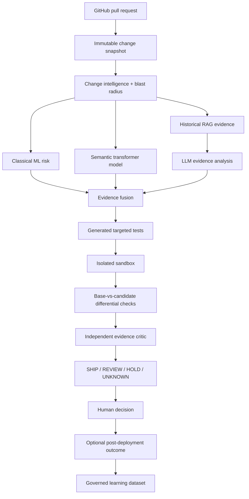

# ReleaseProof — Execution-Grounded AI Change Verification

> **Working name only.** Perform trademark/domain clearance before commercial use.

ReleaseProof is a Python-first developer platform that estimates the risk of a software change and then tries to **prove or disprove that risk with evidence**. It combines repository history, dependency/blast-radius analysis, classical ML, transformer models, RAG, agentic investigation, generated tests, isolated execution, and base-vs-candidate differential verification before producing a human-readable **SHIP / REVIEW / HOLD / UNKNOWN** recommendation.

The product is intentionally not another “LLM reads a diff and writes comments” bot. Its core thesis is:

> **AI-assisted code needs execution-grounded verification, not only AI-generated opinions.**

## Goals

1. **Portfolio:** demonstrate real Python, ML, deep learning, LLM/RAG/agent engineering, MLOps, secure sandboxing, backend architecture, testing, observability, and production discipline.
2. **Business:** begin as a GitHub App for AI-heavy engineering teams, prove value with a narrow pilot, then consider hosted/self-hosted change assurance.
3. **Learning:** every ML/LLM milestone leaves reproducible evidence and an explanation the owner can defend in an interview.

## Target-state product flow

This diagram describes the gated end state through M17. The MVP stops after repository-scoped evidence and the dashboard; generated tests, sandbox execution, differential verification, the critic and governed outcome learning remain disabled until their owning milestones pass.



## Deliberate architecture

The first working system is a **Django modular monolith + Celery workers + PostgreSQL/pgvector + Redis**. ML logic lives in framework-light Python packages. FastAPI model serving is conditional on the predeclared RP-1402 measurement/decision gate in `docs/20_PERFORMANCE_CAPACITY_COST.md`; otherwise inference stays in workers. Docker Compose must work before Kubernetes is considered.

### Frontend
- HTML5 + CSS
- Django templates
- HTMX
- minimal vanilla JavaScript

### Backend/data
- Python
- Django + Django REST Framework
- Celery + Redis
- PostgreSQL + pgvector + PostgreSQL full-text search
- S3-compatible object storage; SeaweedFS locally

### AI/ML
- NumPy, Pandas, Jupyter
- scikit-learn
- XGBoost
- PyTorch
- Hugging Face Transformers / sentence-transformers
- only the LangChain modules required by an assigned provider/retrieval contract; no default meta-package
- LangGraph for stateful workflows
- OpenAI adapter + second/local provider path
- Ollama optional locally
- vLLM only after its M15 hardware/license/privacy benchmark gate
- MLflow for experiments/models/prompts/traces/evaluation

### Engineering
- pytest / pytest-django / property tests where useful
- Testcontainers
- Playwright
- Ruff + mypy/django-stubs
- OpenTelemetry + Prometheus/Grafana in later milestones
- GitHub Actions
- Docker Compose first; optional Kubernetes later

## Non-negotiable truthfulness

ReleaseProof must never claim measured accuracy, risk reduction, throughput, customer impact, incident prevention, or production readiness unless reproducible repository evidence supports the exact claim.

Synthetic demo data must be labeled **synthetic**. Public outcomes such as revert/hotfix/follow-up-fix labels are **proxies**, not proof that a PR caused a production incident. A model score is advisory evidence, never merge authorization.

## Implementation strategy

1. Repository assessment and version verification.
2. Foundation, deterministic fakes, local infrastructure.
3. Tenancy + secure GitHub App/webhook ingestion.
4. Immutable snapshots + change intelligence/blast radius.
5. Dataset/feature pipeline + deterministic heuristic baseline.
6. Logistic regression + XGBoost risk model.
7. Hybrid RAG over repository knowledge/history.
8. Strict-schema LLM evidence analysis.
9. Generated test proposals.
10. Hardened isolated execution.
11. Base-vs-candidate differential/mutation evidence.
12. PyTorch/Hugging Face semantic model.
13. LangGraph bounded investigation workflow.
14. MLflow/evaluation/feedback governance.
15. Security, observability, reliability, cost controls.
16. Production-shaped containers/CI/CD; optional model service/local inference.
17. Recruiter demo + narrow pilot.
18. Final architecture/evidence review.

## Start here

1. `CODEX_START_HERE.md`
2. `AGENTS.md`
3. `docs/00_DOCUMENT_MAP.md`
4. `CODEX_PROMPT_SEQUENCE.md`

Canonical issue contracts are in `docs/22_BACKLOG_AND_ACCEPTANCE.md`. Individual Codex prompts are in `codex-prompts/`. `CODEX_MASTER_IMPLEMENTATION_SPEC.md` is generated by `eng/sync_master_spec.py`; never edit it directly.

## M1 local development

The implemented foundation uses Python 3.13.15 and uv 0.12.6. Install uv from its official
distribution, then from the repository root run:

```text
uv python install 3.13.15
uv sync --frozen --group dev
uv run python -m eng.smoke_fakes
uv run python eng/validate.py
docker compose config --quiet
```

The fake smoke is deterministic and makes no network or paid-provider calls. The validation command
runs format checking, linting, strict typing, non-infrastructure tests, Django system checks,
migration-drift detection, and generated-document synchronization.

For the local data services, copy `.env.example` to the ignored `.env`, keep its credentials local,
and run:

```text
uv run --env-file .env python -m eng.configure_local
docker compose up -d --wait
uv run --env-file .env python -m eng.bootstrap_object_store
uv run --env-file .env python -m eng.smoke_object_store
```

If a default loopback port is already in use, override `POSTGRES_PORT`, `REDIS_PORT`, or `S3_PORT`
in `.env` and update the corresponding application URL. Do not stop an unrelated local service.

To run the SeaweedFS contract test, set `RUN_S3_INTEGRATION=1` for the command environment and run
`uv run --env-file .env pytest tests/integration/test_s3_contract.py`. `docker compose stop` or
`docker compose down` preserves named volumes. `docker compose down --volumes` is the explicit,
destructive local reset and permanently deletes local PostgreSQL, Redis, and SeaweedFS data.

The web process starts with `uv run python manage.py runserver`. Its liveness endpoint is
`GET /health/live`; `GET /health/ready` fails closed when authoritative PostgreSQL is unavailable.
Redis transport and optional providers do not replace PostgreSQL product state.
