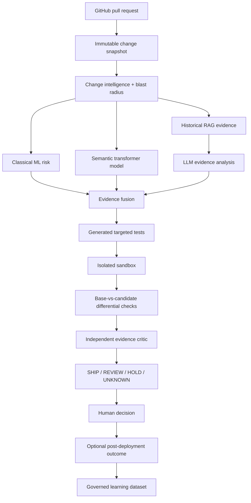

# ReleaseProof — Execution-Grounded AI Change Verification

> **Working name only.** Perform trademark/domain clearance before commercial use.

ReleaseProof is a Python-first developer platform that estimates the risk of a software change and then tries to **prove or disprove that risk with evidence**. It combines repository history, dependency/blast-radius analysis, classical ML, transformer models, RAG, agentic investigation, generated tests, isolated execution, and base-vs-candidate differential verification before producing a human-readable **SHIP / REVIEW / HOLD / UNKNOWN** recommendation.

The product is intentionally not another “LLM reads a diff and writes comments” bot. Its core thesis is:

> **AI-assisted code needs execution-grounded verification, not only AI-generated opinions.**

## Goals

1. **Portfolio:** demonstrate real Python, ML, deep learning, LLM/RAG/agent engineering, MLOps, secure sandboxing, backend architecture, testing, observability, and production discipline.
2. **Business:** begin as a GitHub App for AI-heavy engineering teams, prove value with a narrow pilot, then consider hosted/self-hosted change assurance.
3. **Learning:** every ML/LLM milestone leaves reproducible evidence and an explanation the owner can defend in an interview.

## Target-state product flow

This diagram describes the gated end state through M17. The MVP stops after repository-scoped evidence and the dashboard; generated tests, sandbox execution, differential verification, the critic and governed outcome learning remain disabled until their owning milestones pass.



## Deliberate architecture

The first working system is a **Django modular monolith + Celery workers + PostgreSQL/pgvector + Redis**. ML logic lives in framework-light Python packages. FastAPI model serving is conditional on the predeclared RP-1402 measurement/decision gate in `docs/20_PERFORMANCE_CAPACITY_COST.md`; otherwise inference stays in workers. Docker Compose must work before Kubernetes is considered.

### Frontend
- HTML5 + CSS
- Django templates
- HTMX
- minimal vanilla JavaScript

### Backend/data
- Python
- Django + Django REST Framework
- Celery + Redis
- PostgreSQL + pgvector + PostgreSQL full-text search
- S3-compatible object storage; SeaweedFS locally

### AI/ML
- NumPy, Pandas, Jupyter
- scikit-learn
- XGBoost
- PyTorch
- Hugging Face Transformers / sentence-transformers
- only the LangChain modules required by an assigned provider/retrieval contract; no default meta-package
- LangGraph for stateful workflows
- OpenAI adapter + second/local provider path
- Ollama optional locally
- vLLM only after its M15 hardware/license/privacy benchmark gate
- MLflow for experiments/models/prompts/traces/evaluation

### Engineering
- pytest / pytest-django / property tests where useful
- Testcontainers
- Playwright
- Ruff + mypy/django-stubs
- OpenTelemetry + Prometheus/Grafana in later milestones
- GitHub Actions
- Docker Compose first; optional Kubernetes later

## Non-negotiable truthfulness

ReleaseProof must never claim measured accuracy, risk reduction, throughput, customer impact, incident prevention, or production readiness unless reproducible repository evidence supports the exact claim.

Synthetic demo data must be labeled **synthetic**. Public outcomes such as revert/hotfix/follow-up-fix labels are **proxies**, not proof that a PR caused a production incident. A model score is advisory evidence, never merge authorization.

## Implementation strategy

1. Repository assessment and version verification.
2. Foundation, deterministic fakes, local infrastructure.
3. Tenancy + secure GitHub App/webhook ingestion.
4. Immutable snapshots + change intelligence/blast radius.
5. Dataset/feature pipeline + deterministic heuristic baseline.
6. Logistic regression + XGBoost risk model.
7. Hybrid RAG over repository knowledge/history.
8. Strict-schema LLM evidence analysis.
9. Generated test proposals.
10. Hardened isolated execution.
11. Base-vs-candidate differential/mutation evidence.
12. PyTorch/Hugging Face semantic model.
13. LangGraph bounded investigation workflow.
14. MLflow/evaluation/feedback governance.
15. Security, observability, reliability, cost controls.
16. Production-shaped containers/CI/CD; optional model service/local inference.
17. Recruiter demo + narrow pilot.
18. Final architecture/evidence review.

## Start here

1. `CODEX_START_HERE.md`
2. `AGENTS.md`
3. `docs/00_DOCUMENT_MAP.md`
4. `CODEX_PROMPT_SEQUENCE.md`

Canonical issue contracts are in `docs/22_BACKLOG_AND_ACCEPTANCE.md`. Individual Codex prompts are in `codex-prompts/`. `CODEX_MASTER_IMPLEMENTATION_SPEC.md` is generated by `eng/sync_master_spec.py`; never edit it directly.

## M1 local development

The implemented foundation uses Python 3.13.15 and uv 0.12.6. Install uv from its official
distribution, then from the repository root run:

```text
uv python install 3.13.15
uv sync --frozen --group dev
uv run python -m eng.smoke_fakes
uv run python eng/validate.py
docker compose config --quiet
```

The fake smoke is deterministic and makes no network or paid-provider calls. The validation command
runs format checking, linting, strict typing, non-infrastructure tests, Django system checks,
migration-drift detection, and generated-document synchronization.

For the local data services, copy `.env.example` to the ignored `.env`, keep its credentials local,
and run:

```text
uv run --env-file .env python -m eng.configure_local
docker compose up -d --wait
uv run --env-file .env python -m eng.bootstrap_object_store
uv run --env-file .env python -m eng.smoke_object_store
```

If a default loopback port is already in use, override `POSTGRES_PORT`, `REDIS_PORT`, or `S3_PORT`
in `.env` and update the corresponding application URL. Do not stop an unrelated local service.

To run the SeaweedFS contract test, set `RUN_S3_INTEGRATION=1` for the command environment and run
`uv run --env-file .env pytest tests/integration/test_s3_contract.py`. `docker compose stop` or
`docker compose down` preserves named volumes. `docker compose down --volumes` is the explicit,
destructive local reset and permanently deletes local PostgreSQL, Redis, and SeaweedFS data.

The web process starts with `uv run python manage.py runserver`. Its liveness endpoint is
`GET /health/live`; `GET /health/ready` fails closed when authoritative PostgreSQL is unavailable.
Redis transport and optional providers do not replace PostgreSQL product state.

## M2 tenancy and GitHub ingestion

M2 implements `RP-0101..RP-0106`: organizations/memberships and role checks, same-origin session
authentication with CSRF and fail-closed login throttling, tenant-bound GitHub installation and
repository records, bounded HMAC-SHA256 webhook ingestion, immutable pull-request snapshots,
PostgreSQL-authoritative jobs/outbox recovery, and stale-safe advisory-report adapters.

Apply the forward migrations and run the deterministic path with:

```text
uv run python manage.py migrate
uv run pytest -m "not integration"
uv run python manage.py relay_outbox --organization <organization-public-uuid> --limit 100
```

Browser routes use Django sessions only. `POST /webhooks/github` is CSRF-exempt because it requires
the bounded raw request plus a valid `X-Hub-Signature-256`; browser mutations remain CSRF
protected. Direct repository access is resolved inside the active organization stored in the
authenticated session. Composite database constraints independently reject organization/parent
mismatches, and webhook receipts, pull-request snapshots and audit logs are database-append-only.

The deterministic fake GitHub snapshot/report adapters are the validated M2 local/demo path. A
live GitHub REST installation-token minter and live check publisher are intentionally unconfigured;
pull-request webhooks return a safe 503 until a live provider is explicitly implemented and
selected. No live repository is contacted and no check is posted by the M2 validation suite.

## M3 deterministic change intelligence

M3 implements `RP-0201..RP-0206` in the framework-light `packages/change_intel` package and
tenant-scoped Django persistence. It normalizes bounded changed-file facts, materializes exact
prediction-time feature schema `change-features-v1`, parses inert Python source with `ast`, computes
bounded reverse-import reachability, derives only history strictly older than the snapshot
prediction time, and persists human-readable deterministic factors.

The fixture source-tree provider is deterministic and network-free. The default worker has no live
repository-tree provider: it persists partial evidence with null graph features and explicit
missingness instead of guessing. Unsupported languages, parse failures, dynamic imports, truncated
coverage, absent history and absent opaque author coverage are visible. No M3 artifact contains a
composite score, threshold, risk band or SHIP/REVIEW/HOLD recommendation; RP-0306 owns those.

Run the focused evidence with:

```text
uv run pytest tests/unit/test_change_intel_pipeline.py
uv run pytest tests/integration/test_change_intelligence_persistence.py
uv run pytest tests/security/test_change_intelligence_tenancy.py
```

## M4 dataset and deterministic baseline

M4 implements `RP-0301..RP-0306` without mining a public repository or adding an ML dependency.
The admitted MIT fixture has a complete `source-admission-v1` record, 16 explicitly synthetic
snapshot/outcome rows, auditable proxy labels, a frozen temporal split and materialized
`change-features-v1` rows. Two unknown rows are excluded rather than silently labeled negative.

The transparent `deterministic-heuristic-v1` artifact produces a 0-100 risk score and
LOW/MEDIUM/HIGH or UNKNOWN band. It is not a probability. Threshold 30 is selected only from the
four-row validation split using the frozen recall-floor rule, then applied unchanged to the
four-row held-out synthetic test split. The committed raw artifact is implementation evidence,
not a customer-performance or incident-prediction claim.

Reproduce the dataset, leakage checks, threshold table and raw confusion artifact with:

```text
uv run python -m eng.evaluate_m4_baseline --check
uv run pytest tests/unit/test_dataset_baseline.py
uv run pytest tests/integration/test_deterministic_risk_persistence.py
```

## M5 classical risk candidates

M5 implements `RP-0401..RP-0406` with a train-only shared preprocessor, logistic regression,
XGBoost CPU candidate, validation-only hyperparameter/threshold selection, frozen calibration
rules, checksum-bound artifacts and tenant-scoped risk/model evidence pages. The unchanged M4
manifest and temporal split are used; no public or customer data is added.

The learned results are deliberately **not promoted**. Four validation and four held-out synthetic
rows are below the frozen 200-row/50-per-class calibration gate, so probability wording remains
disabled. `deterministic-heuristic-v1` stays active, and a missing/invalid learned artifact falls
back to deterministic evidence. See `docs/32_M5_CLASSICAL_MODEL_CARD.md` for the raw tiny-fixture
metrics and limitations.

```text
uv sync --frozen --group dev --group ml
uv run python -m eng.evaluate_m5_classical --check
uv run pytest tests/unit/test_classical_ml.py tests/web/test_risk_evidence.py
```

## M6 repository-scoped historical retrieval

M6 implements `RP-0501..RP-0506`: bounded approved evidence ingestion, Markdown/Python-aware
chunking, versioned PostgreSQL `simple` FTS, a 384-dimensional pgvector physical table/index,
side-by-side embedding-profile build and activation, deterministic RRF, optional bounded
cross-encoder reranking and a frozen synthetic relevance evaluation. Documents, chunks, lexical
rows, embedding rows and every query are organization and repository scoped.

The exact selected public artifacts are
`sentence-transformers/all-MiniLM-L6-v2@1110a243...` and
`cross-encoder/ms-marco-MiniLM-L6-v2@4bebbd56...`, both Apache-2.0 with recorded safetensors
checksums. Real weights are never fetched implicitly: adapters require an explicitly provisioned,
checksum-verified local cache. Tests and the committed evaluation use clearly identified
deterministic fakes. The real reranker remains disabled by default because the synthetic fake
benchmark does not prove incremental value.

```text
uv sync --frozen --group dev --group ml
uv run python -m eng.evaluate_m6_retrieval --check
uv run pytest tests/unit/test_retrieval_core.py tests/integration/test_retrieval_persistence.py tests/security/test_retrieval_tenancy.py
```

## M7 evidence-grounded LLM analysis

M7 implements `RP-0601..RP-0606`: provider-neutral typed contracts, a deterministic fake, a pinned
OpenAI Responses adapter, immutable tenant privacy policy, source-controlled prompt/schema hashes,
strict citation validation, safe append-only LLM evidence and a frozen synthetic evaluation. LLM
output is advisory and cannot replace deterministic risk/retrieval evidence or authorize tools,
file writes, generated-test acceptance or execution.

The optional `ai` group pins `openai==3.6.0`; the hosted adapter fixes
`gpt-5.4-mini-2026-03-17`, `store=false`, strict JSON Schema, no tools and bounded timeout/retry/
token/cost behavior. It is disabled unless an organization and immutable effective policy permit
the exact provider/model/content/region and reviewed training/retention/storage configuration. The
validated default is the network-free fake; M7 made no hosted API call and makes no hosted quality,
latency, cost or zero-retention claim.

```text
uv sync --frozen --group dev --group ml --group ai
uv run python -m eng.evaluate_m7_llm --check
uv run pytest tests/unit/test_llm_core.py tests/unit/test_openai_adapter.py tests/integration/test_llm_evidence_persistence.py
```

See `docs/36_M7_LLM_EVALUATION.md` for exact synthetic measurements and limitations, and
`docs/37_M7_OWNER_LEARNING_NOTE.md` for the owner-defensible explanation.

## M8 generated-test proposals

M8 implements `RP-0701..RP-0704` for one deliberately narrow Python fixture adapter. A strict
`generated-test-proposal-v1` contract binds target behavior, rationale, cited M7 evidence, one new
test-file patch, one allowlisted command, expected result, risk and exact generation identity.
Every persisted revision is immutable and tenant-bound; editing creates a new hash/revision and
supersedes the old one.

Reviewer mutations use session authentication, CSRF and server-derived organization scope. A
human may accept a statically valid proposal for export, reject it, edit it into a new draft, or
download its inert patch. Acceptance does not commit, enqueue, authorize or execute anything. M9
separately owns its threat review, immutable execution plan, execution approval and sandbox.

```text
uv run python -m eng.evaluate_m8_proposals --check
uv run pytest tests/unit/test_test_proposals.py tests/integration/test_generated_test_proposals.py tests/web/test_generated_test_proposal_workflow.py
```

The frozen 11-case CC0 suite has two valid controls and nine adversarial invalid controls. It
records valid acceptance 1.0, invalid rejection 1.0, false acceptance 0.0 and five-run stability
1.0. These synthetic results validate the contract/static-filter harness only; no generated test
was run and usefulness on real repositories is not measured. See docs/38 and docs/39.

## M9 fixture-only sandbox runner

M9 implements `RP-0801..RP-0805` under the accepted ADR-018 boundary. It supports only the exact
source-controlled fictional fixture on a dedicated rootless disposable Linux Docker host; external
repositories remain disabled. Immutable signed plans bind the snapshot, proposal/input, fixture,
image, argv, environment, network/mount/resource policy and plan hash. Reviewer execution approval
is a separate CSRF/role-gated append-only event, and strict bounded results are idempotently
persisted with explicit stale/timeout/kill/isolation/cleanup facts.

The deterministic local suite does not need Docker. The explicit `sandbox` marker builds and runs
known live sentinel probes on a disposable Linux Docker host; CI is the authoritative live evidence
when a developer daemon is unavailable. Passing those probes is not a claim that containers safely
isolate arbitrary hostile customer repositories. See docs/40, ADR-018 and docs/41.

```text
uv sync --frozen --group dev --group ml --group ai
uv run python -m eng.evaluate_m9_runner --check
uv run pytest tests/unit/test_execution_contracts.py tests/integration/test_execution_workflow.py
docker build -f runner/fixture_image/Dockerfile -t releaseproof-fixture-runner:m9 .
RUN_SANDBOX_INTEGRATION=1 uv run pytest -m sandbox tests/sandbox
```

GitHub Actions run `33639835178` for commit `ab59029` passed the canonical source/Django checks,
authoritative PostgreSQL contracts, pinned image build, live sandbox sentinels, bounded SeaweedFS
contract and teardown. This validates the known fixture path only; external/customer repository
execution remains disabled.

## M10 differential and mutation verification

M10 implements `RP-0901..RP-0905` without widening ADR-018. A signed
`releaseproof.differential-plan.v1` chains to the exact M9 execution plan and approval, then binds
the controlled base/candidate revision checksums, digest-pinned image, identical generated test,
workload, environment, resource policy, explicit nondeterminism masks and two-item mutation set.
The sandbox replays the same test and in-process HTTP-handler probe against both revisions, records
selected status/schema/body/state/events plus descriptive timings, and reports candidate timeout as
UNKNOWN and base failure as non-attributable.

`recommendation-fusion-v1` combines risk, retrieval, generated-test, execution, differential and
mutation facts into advisory-only SHIP/REVIEW/HOLD/UNKNOWN evidence. Missing or failed mandatory
components produce UNKNOWN, low/surviving mutation evidence produces REVIEW, and deterministic
HOLD facts take precedence over an LLM SHIP suggestion. Decisions are immutable and preserve exact
policy/input/result hashes; they cannot merge or deploy.

```text
uv run python -m eng.evaluate_m10_differential --check
uv run pytest tests/unit/test_differential_contracts.py tests/unit/test_recommendation_policy.py tests/integration/test_differential_workflow.py
docker build -f runner/fixture_image/Dockerfile -t releaseproof-fixture-runner:m9 .
RUN_SANDBOX_INTEGRATION=1 uv run pytest -m sandbox tests/sandbox
```

The committed CC0 evaluation covers identical, planted-regression, candidate-timeout and
base-failure cases plus all four recommendation outcomes. The mutation slice kills one of two
controlled mutants (50%); that is harness evidence, not repository-wide mutation coverage or a
customer-quality claim. See docs/43 and docs/44.

GitHub Actions run `33680837554` for implementation commit `14b133e` passed canonical validation,
Compose/startup, authoritative PostgreSQL constraints, the pinned runner-image build, live
regression/identical/timeout sandbox evidence, SeaweedFS and teardown. This remains evidence for
the controlled synthetic fixture only.
