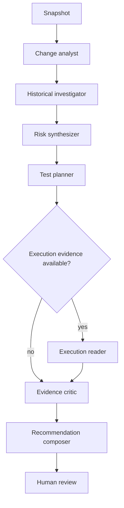

# 12 — LangGraph Agent Orchestration

## Why deferred
Single-pass structured LLM analysis is built/evaluated first. LangGraph is introduced only after evidence/tool contracts are stable.

## Graph

Nodes are bounded state transitions, not autonomous authorities.

## State
Snapshot/run IDs, deterministic evidence IDs, model score IDs, retrieved chunk IDs, proposed tests, execution result IDs, budget counters, errors/unknowns and final recommendation draft. No secrets/huge raw source blobs.

## Tools
Read-oriented by default:
- get change summary;
- scoped retrieval;
- get risk score/evidence;
- propose test;
- request execution only via policy gate.

No merge/deploy/repo write/arbitrary filesystem/cloud-secret tools.

## Bounds
Max steps, loop detection, wall time, per-node timeout, token/cost cap, candidate limits, cancellation. Persisted checkpoints obey retention/privacy.

## Critic
Checks that claims cite allowed evidence or are hypotheses; execution failures are not ignored; missing evidence lowers confidence; recommendation obeys deterministic policy. Optional second model/provider may critique semantics, but deterministic consistency checks always run.

## Human visibility
Expose structured node events/evidence summaries, not hidden chain-of-thought. Human retains merge/deploy authority.

## M12 implemented boundary

M12 implements `RP-1101..RP-1106` with `bounded-investigation-graph-v1` and
`agent-state-v1`. The graph state carries only an opaque run/snapshot identity, immutable bounded
evidence references, structured facts, missing categories, counters, safe errors, a draft, critic
result and safe trace. It never carries credentials, raw source/diff blobs, provider raw output or
hidden reasoning.

The fixed graph uses change analyst, historical investigator, risk synthesizer, test planner,
optional execution reader, deterministic evidence critic and recommendation composer nodes. Its
tool allowlist is exactly feature read, graph read, historical retrieval, risk read, test-result
read and execution-evidence read. M12 deliberately does not expose the broader target-state
`request execution` capability: RP-1102 is read-only, and M9 execution still requires its separate
human approval and immutable plan. There is no merge, deploy, repository write, arbitrary
filesystem, cloud-secret or runner-control tool.

Every node checks cancellation, graph wall time, per-node time, repeated node/state signatures and
step/tool/provider/token/cost limits. Stops return a typed partial result. A partial result preserves
a deterministic HOLD but otherwise degrades to UNKNOWN; provider or tool failure can never become
SHIP. Providers receive the remaining output/time limits through their node request and must apply
their own transport timeout inside that bound.

The independent critic does not call the generating provider. It checks the typed draft, verifies
that every factual citation was returned by a tool, proves structured source entailment by requiring
each claimed fact code to exist in its cited evidence, checks missing-evidence confidence and
re-runs the immutable `recommendation-fusion-v1` decision. This deliberately narrow fact-code
entailment is not claimed to solve free-text semantic entailment.

Only the local deterministic provider is enabled. LangGraph native checkpoint persistence is off;
the application persists one append-only, tenant/snapshot/feature-bound `EvidenceItem` of kind
`agent` containing the final safe result, hashes, counters, citations and concise trace. Authenticated
tenant-scoped API and HTML GET routes expose that record. No public route starts an investigation.

The frozen M12 evaluation finds no task-success or groundedness improvement over M7's simpler
single-pass fake-provider path. The graph therefore remains optional and disabled by default. Exact
measurements and limitations are in `47_M12_AGENT_EVALUATION.md`; the learning checkpoint is
`48_M12_OWNER_LEARNING_NOTE.md`.
