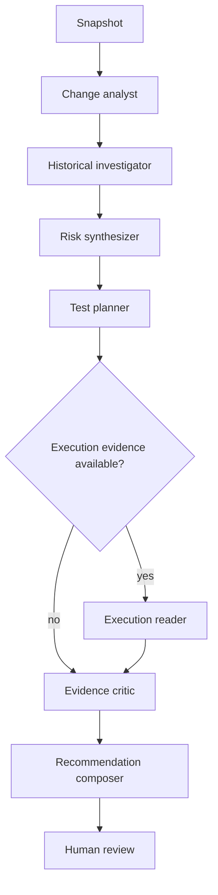

# 12 — LangGraph Agent Orchestration

## Why deferred
Single-pass structured LLM analysis is built/evaluated first. LangGraph is introduced only after evidence/tool contracts are stable.

## Graph

Nodes are bounded state transitions, not autonomous authorities.

## State
Snapshot/run IDs, deterministic evidence IDs, model score IDs, retrieved chunk IDs, proposed tests, execution result IDs, budget counters, errors/unknowns and final recommendation draft. No secrets/huge raw source blobs.

## Tools
Read-oriented by default:
- get change summary;
- scoped retrieval;
- get risk score/evidence;
- propose test;
- request execution only via policy gate.

No merge/deploy/repo write/arbitrary filesystem/cloud-secret tools.

## Bounds
Max steps, loop detection, wall time, per-node timeout, token/cost cap, candidate limits, cancellation. Persisted checkpoints obey retention/privacy.

## Critic
Checks that claims cite allowed evidence or are hypotheses; execution failures are not ignored; missing evidence lowers confidence; recommendation obeys deterministic policy. Optional second model/provider may critique semantics, but deterministic consistency checks always run.

## Human visibility
Expose structured node events/evidence summaries, not hidden chain-of-thought. Human retains merge/deploy authority.
